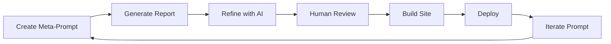

# ADLC Evals

AI-driven technical report generation with human validation.

## What This Is

A pipeline for creating **living technical documentation** comparing cloud platforms. Currently: **Vercel Agent Stack vs AWS Agent Stack**.

**Principles:** Hard facts only (no subjective ratings), blessed-path methodology, human-in-the-loop validation.

## Pipeline



| Step | What Happens |
|------|--------------|
| **Meta-Prompt** | Hand-crafted research prompt with MCP tools |
| **Generate** | AI model (Claude, GPT) produces markdown with citations |
| **Refine** | Claude Code polishes structure and fixes issues |
| **Review** | Human validates all claims against source docs |
| **Build** | v0.dev creates interactive Next.js visualization |
| **Deploy** | Ship to Vercel |
| **Iterate** | Update prompt based on learnings |

## Project Structure

```
meta-research-prompts/     → Master prompts for report generation
generated-reports/         → Raw markdown from AI models
generated-report-sites/    → Interactive Next.js sites
```

## Current Comparisons

| Comparison | Status | Links |
|------------|--------|-------|
| Vercel vs AWS | ✅ Live | [Report](generated-reports/vercel-aws/2026/01/2026-01-08-Agent-Comparison-Report-Claude-Opus-4.5.md) · [Live Site](https://adlc-evals-vercel-aws.vercel.app/) · [Source](generated-report-sites/agent-stack-comparison-vercel-aws/) |
| Vercel vs Cloudflare | 🔜 Planned | — |
| Vercel vs GCP | 🔜 Planned | — |

## Run Locally

```bash
cd generated-report-sites/agent-stack-comparison-vercel-aws
bun install && bun dev
```

## Tech Stack

Next.js 16 · React 19 · Tailwind · MapLibre GL · Vercel · Claude Code · v0.dev

## Disclaimers

- **Human-validated** — All content reviewed before publication
- **Point-in-time** — Cloud platforms change; verify against official docs
- **Blessed-path** — Focuses on vendor-recommended approaches

---

MIT License · Built with AI + human validation
