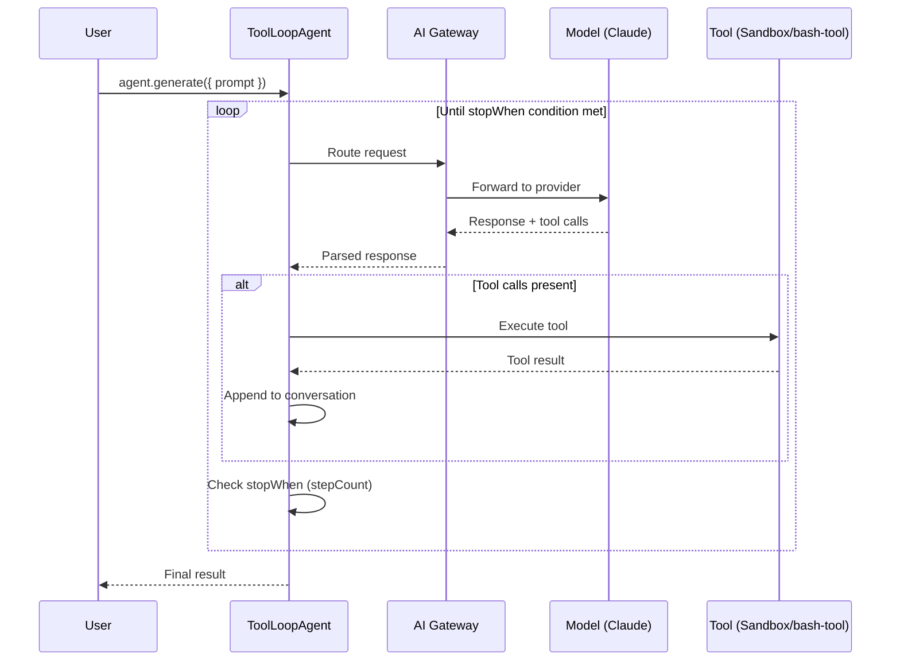
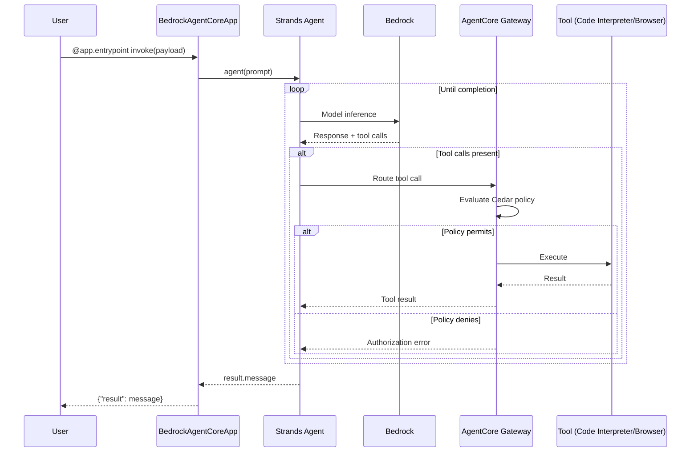
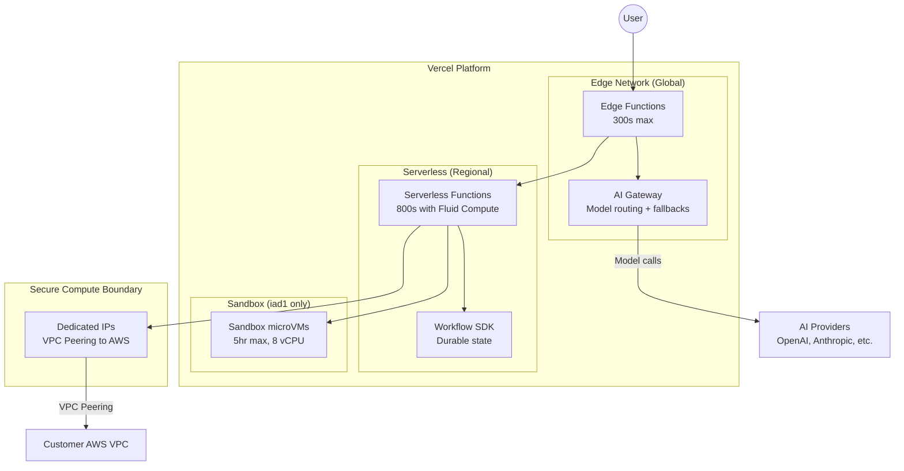
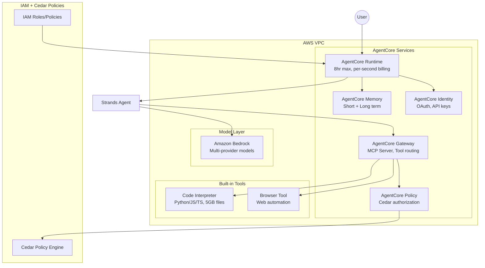
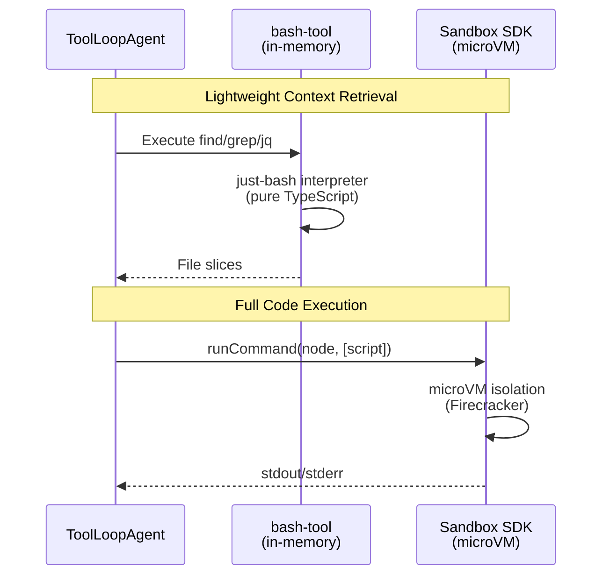
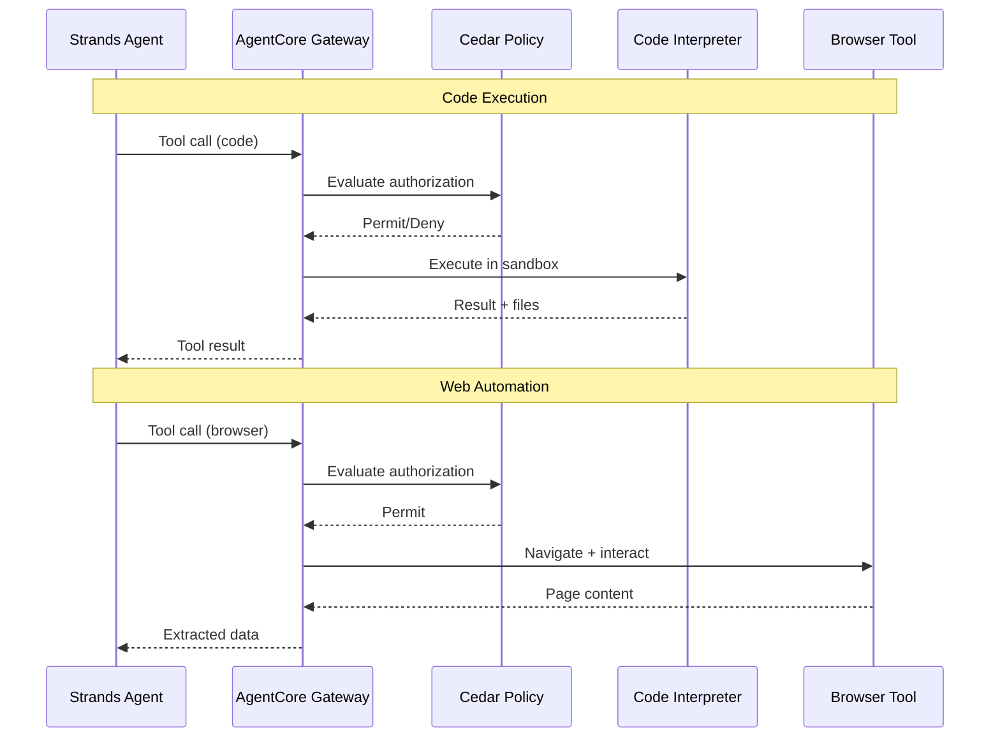

# Vercel Agent Stack vs AWS Agent Stack: Technical Evaluation Report

## 1. Metadata & 2026 Delta

| Field | Value |
|-------|-------|
| **Last Updated** | 2026-01-08T18:00:00Z |
| **Model** | Claude Opus 4.5 |
| **Report Path** | `generated-reports/vercel-aws/2026/01/2026-01-08-Agent-Comparison-Report-Claude-Opus-4.5.md` |
| **Methodology** | "Blessed Path" — Officially recommended, out-of-the-box developer experience |

### Technical Delta: 2025 → 2026

| Platform | Previous | Current | Key Changes |
|----------|----------|---------|-------------|
| **Vercel AI SDK** | SDK 5.x (`generateText`, `streamText` with `maxSteps`) | SDK 6.x (`ToolLoopAgent` class) | New agent-first abstraction; `stopWhen` conditions; built-in loop management; default 20-step limit |
| **AWS AgentCore** | Preview | GA (October 2025) | Production SLAs; Cedar-based Policy (preview); Evaluations (preview); Browser Tool + Code Interpreter GA |
| **Strands SDK** | Initial Release | v1.x stable | TypeScript preview announced (Dec 2025); multi-agent support; model-agnostic routing |

---

## 2. Infrastructure Footprint (Hard Facts)

### Two-Layer Architecture Comparison

| Layer | Vercel | AWS |
|-------|--------|-----|
| **Agent Framework** (SDK for building agents) | AI SDK 6.x (`ToolLoopAgent`, tools, streaming) | **Strands Agents SDK** (`Agent`, tools, model routing) |
| **Infrastructure** (Runtime, memory, deployment) | Vercel Platform (Fluid Compute, Sandbox SDK, Workflow SDK) | **BedrockAgentCoreApp** (Runtime, Memory, Gateway, Policy) |

> ⚠️ **Key Insight:** `bedrock-agentcore-sdk-python` is the infrastructure wrapper, NOT the agent framework. Agent logic uses **Strands SDK**. This mirrors how Vercel's AI SDK handles agent logic while the Vercel platform provides infrastructure.

### Full Capability Matrix

| Capability | Vercel Stack | AWS Stack |
|------------|--------------|-----------|
| **Agent Framework** | AI SDK 6.x (`ToolLoopAgent`, `stopWhen`, tools) | Strands SDK (`Agent`, tools, model routing) |
| **Model Gateway/Routing** | AI Gateway (unified API, fallbacks, BYOK, 20+ providers) | Amazon Bedrock (foundation models, 10+ providers) |
| **Infrastructure Wrapper** | Vercel Platform (Fluid Compute) | BedrockAgentCoreApp (`@app.entrypoint` decorator) |
| **Secure Code Execution** | Sandbox SDK (microVMs, Node.js + Python, 8 vCPUs max) | AgentCore Code Interpreter (containerized, Python/JS/TS, up to 5GB files) |
| **Durable Workflows** | Workflow SDK (`"use workflow"` directive) | AgentCore Runtime (8-hour max lifetime) |
| **Browser Automation** | Anthropic Computer Use tools (`computer_20250124`) | AgentCore Browser Tool (cloud-based, CAPTCHA reduction via Web Bot Auth) |
| **Persistent Memory** | External (Redis, databases, bring-your-own) | AgentCore Memory (built-in short-term + long-term with strategies) |
| **Tool Management/MCP** | MCP Client (experimental via `@mcpc-tech/mcp-sampling-ai-provider`) | AgentCore Gateway (MCP Server support, tool indexing) |
| **Authorization** | Environment variables, middleware, custom | AgentCore Policy (Cedar-based, natural language → Cedar) |
| **Identity/OAuth** | NextAuth, Auth.js, custom implementation | AgentCore Identity (OAuth, API keys, $0.010/1K requests) |
| **Observability** | AI SDK telemetry (OTEL-compatible spans, `experimental_telemetry`) | AgentCore Observability + CloudWatch (step visualization, metadata tagging) |

### Deep-Dive: Runtime Persistence

| Aspect | Vercel Stack | AWS Stack |
|--------|--------------|-----------|
| **Max Execution Window** | Edge: 300s (5 min); Serverless + Fluid Compute: 800s (13.3 min); Sandbox: 5 hours (Pro/Enterprise) | AgentCore Runtime: 28,800s (8 hours) |
| **Idle Timeout** | N/A (stateless by default) | Configurable: 60–28,800s (default: 900s / 15 min) |
| **Durability Mechanism** | Workflow SDK (`"use workflow"` directive) | Runtime session persistence with automatic state management |
| **Billing Model** | Per-invocation + execution time | Per-second (CPU-hour + GB-hour), no charge during I/O wait |

### Deep-Dive: Code Execution

| Aspect | Vercel Sandbox SDK | AWS AgentCore Code Interpreter |
|--------|-------------------|-------------------------------|
| **Isolation** | microVM (Firecracker-based) | Containerized sandbox |
| **Languages** | Node.js (22), Python (3.13) | Python, JavaScript, TypeScript |
| **Max vCPUs** | 8 vCPUs (2 GB per vCPU) | Configurable per instance |
| **Max Runtime** | 5 min (Hobby), 5 hours (Pro/Enterprise) | 8 hours |
| **Max File Size** | Via filesystem | 5 GB (S3 upload) |
| **Concurrency** | 10 (Hobby), 2,000 (Pro/Enterprise) | Regional limits apply |
| **Cold Start** | microVM initialization | Container startup |

### Deep-Dive: Security Primitives

| Aspect | Vercel | AWS |
|--------|--------|-----|
| **Network Isolation** | Secure Compute: Dedicated IPs, VPC peering (max 50 connections) | VPC with private subnets, PrivateLink |
| **Policy Language** | N/A (middleware + environment variables) | Cedar (open-source, AWS-developed) |
| **Policy Enforcement** | Application-level | Gateway-level intercept before tool execution |
| **IAM Integration** | N/A | Full IAM + Cedar hybrid |
| **Enforcement Modes** | N/A | `ENFORCE` (block) or `MONITOR` (log only) |

### Deep-Dive: Protocol Support

| Protocol | Vercel | AWS |
|----------|--------|-----|
| **MCP (Model Context Protocol)** | Client (experimental) | Server (Gateway-based, production) |
| **A2A (Agent-to-Agent)** | Not documented | Supported via AgentCore Runtime |
| **REST/HTTP** | Native | Native via Gateway |
| **Lambda Integration** | N/A | Native (Gateway transforms Lambda → tools) |

---

## 2b. Regional Availability Matrix

### AWS AgentCore Regional Availability

| Feature | Regions Available | Notes |
|---------|-------------------|-------|
| **AgentCore Evaluations** | 4 regions (us-east-1, us-west-2, eu-central-1, ap-southeast-2) | **Preview** — most limited availability |
| **AgentCore Runtime** | 9 regions | us-east-1, us-east-2, us-west-2, ap-south-1, ap-southeast-1, ap-southeast-2, ap-northeast-1, eu-central-1, eu-west-1 |
| **AgentCore Built-in Tools** | 9 regions | Same as Runtime |
| **AgentCore Observability** | 9 regions | Same as Runtime |
| **AgentCore Policy** | 9 regions | **Preview** — Same as Runtime |
| **AgentCore Memory** | Broader availability | Check documentation for full list |
| **AgentCore Gateway** | Broader availability | Check documentation for full list |
| **AgentCore Identity** | Broader availability | Check documentation for full list |

**Source:** [AgentCore Supported Regions](https://docs.aws.amazon.com/bedrock-agentcore/latest/devguide/agentcore-regions.html)

### Vercel Regional Availability

| Feature | Availability | Notes |
|---------|--------------|-------|
| **AI SDK 6.x** | Global (Edge + Serverless) | Runs anywhere Vercel deploys |
| **AI Gateway** | Global | Edge-optimized routing |
| **Sandbox SDK** | **iad1 only** (Washington, D.C.) | Single-region during Beta |
| **Workflow SDK** | Global (Serverless) | Durable functions in all Vercel regions |
| **Fluid Compute** | Global | Extended timeout regions |

**Source:** [Vercel Sandbox Pricing](https://vercel.com/docs/vercel-sandbox/pricing)

### Regional Comparison Analysis

| Question | Vercel | AWS |
|----------|--------|-----|
| **Full agent stack in single region?** | Only iad1 (due to Sandbox limitation) | 9 regions for full stack |
| **Evaluations availability?** | N/A (no built-in evaluation service) | 4 regions only (preview) |
| **Edge latency advantage?** | Yes — AI Gateway is edge-optimized globally | No — Bedrock is region-bound |
| **Multi-region failover?** | Secure Compute: Active/Passive network failover | Multi-AZ, cross-region replication |

---

## 3. 2026 Unit Economics

### Model Layer Costs

#### Vercel AI Gateway

| Aspect | Details |
|--------|---------|
| **Gateway Fees** | None — pass-through pricing |
| **BYOK Support** | Yes — use your own API keys |
| **Markup** | 0% — identical to provider pricing |
| **Fallback Billing** | Only charged for model that completes request |

**Source:** [Vercel AI Gateway](https://vercel.com/ai-gateway)

#### Amazon Bedrock

| Pricing Tier | Description | Discount |
|--------------|-------------|----------|
| **On-Demand** | Pay per token, no commitment | Baseline |
| **Provisioned Throughput** | Reserved capacity | Commitment discount |
| **Batch Mode** | Async processing | 50% discount |
| **Prompt Caching** | Cache repeated prompts | Up to 90% reduction |

**Source:** [Amazon Bedrock Pricing](https://aws.amazon.com/bedrock/pricing/)

### Claude 4.5 Pricing Comparison

| Model | Input (per 1M tokens) | Output (per 1M tokens) |
|-------|----------------------|------------------------|
| **Claude Opus 4.5** | $5.00 | $25.00 |
| **Claude Sonnet 4.5** | $3.00 | $15.00 |
| **Claude Haiku 4.5** | $0.80 | $4.00 |

**Note:** Pricing identical on both platforms when using BYOK on Vercel.

**Source:** [AWS Bedrock - Anthropic Claude](https://aws.amazon.com/bedrock/anthropic/)

### Agent Execution Cost: 1,000 Agent Turns

**Assumptions:**
- 1,000 agent turns
- Average 2,000 input tokens + 500 output tokens per turn
- 2 tool calls per turn (average)
- 5 seconds active CPU per turn
- Using Claude Sonnet 4.5

#### Vercel Stack Costs

| Component | Calculation | Cost |
|-----------|-------------|------|
| **Model (Claude Sonnet 4.5)** | 2M input tokens × $3 + 0.5M output tokens × $15 | $13.50 |
| **Sandbox SDK (if used)** | 1,000 turns × 5s × $0.128/hr CPU | $0.18 |
| **Sandbox Memory** | 4 GB × 1.39 hrs × $0.0106/GB-hr | $0.06 |
| **Sandbox Creations** | 1,000 × $0.60/1M | $0.0006 |
| **Network (est. 1 GB)** | 1 GB × $0.15 | $0.15 |
| **Total** | | **~$13.89** |

#### AWS Stack Costs

| Component | Calculation | Cost |
|-----------|-------------|------|
| **Model (Claude Sonnet 4.5 via Bedrock)** | 2M input tokens × $3 + 0.5M output tokens × $15 | $13.50 |
| **AgentCore Runtime CPU** | 5,000s × $0.0895/hr | $0.12 |
| **AgentCore Runtime Memory** | 4 GB × 1.39 hrs × $0.00945/GB-hr | $0.05 |
| **Gateway Invocations** | 2,000 tool calls × $0.005/1K | $0.01 |
| **Memory (short-term events)** | 1,000 × $0.25/1K | $0.25 |
| **Total** | | **~$13.93** |

#### Cost Comparison Summary

| Platform | Model Cost | Infrastructure Cost | Total |
|----------|------------|--------------------|----|
| **Vercel** | $13.50 | $0.39 | **$13.89** |
| **AWS** | $13.50 | $0.43 | **$13.93** |

**Key Insight:** Infrastructure costs are negligible compared to model costs (~3%). The primary cost driver is LLM inference.

### The "Effort" Tax: Anthropic Extended Thinking

| Effort Level | Token Multiplier | Impact on TCO |
|--------------|------------------|---------------|
| **Low** | ~1x baseline | Minimal |
| **Medium** | ~2-3x output tokens | Moderate increase |
| **High** | ~5-10x output tokens | Significant (2-3x total cost) |

**Note:** Extended thinking tokens are billed as output tokens on both platforms.

### Security/Network Cost Comparison

| Scenario | Vercel Secure Compute | AWS (NAT Gateway + PrivateLink, 3 AZ) |
|----------|----------------------|---------------------------------------|
| **Annual base cost** | $6,500 | ~$1,446 |
| **Data (100 GB/mo × 12)** | $180 ($0.15/GB) | $66 ($0.055/GB) |
| **Total annual (100 GB/mo)** | **$6,680** | **~$1,512** |
| **Total annual (1 TB/mo)** | **$8,300** | **~$2,106** |

> ⚠️ **Trade-off:** AWS is 3-4× cheaper for network isolation but requires VPC configuration, IAM policies, and operational overhead. Vercel Secure Compute is fully managed.

**Sources:** 
- [Vercel Secure Compute](https://vercel.com/docs/connectivity/secure-compute)
- [AWS VPC Pricing](https://aws.amazon.com/vpc/pricing/)
- [AWS PrivateLink Pricing](https://aws.amazon.com/privatelink/pricing/)

---

## 4. Agent Stack Deep-Dive

### Vercel Agent Stack

#### 4.1 AI SDK 6.x — ToolLoopAgent

The `ToolLoopAgent` class provides a production-ready implementation for managing the complete tool execution loop:

```typescript
import { ToolLoopAgent, stepCountIs } from 'ai';
import { weatherTool } from '@/tools/weather';

export const weatherAgent = new ToolLoopAgent({
  model: 'anthropic/claude-sonnet-4.5',
  instructions: 'You are a helpful weather assistant.',
  tools: {
    weather: weatherTool,
  },
  stopWhen: stepCountIs(20), // Max 20 steps before termination
});

const result = await weatherAgent.generate({
  prompt: 'What is the weather in San Francisco?',
});
```

**Key Abstractions:**

| Component | Description |
|-----------|-------------|
| `ToolLoopAgent` | Agent class managing multi-step tool execution |
| `stopWhen: stepCountIs(N)` | Loop-breaker condition (max steps) |
| `generate()` / `stream()` | Execution methods with type-safe call options |
| `onStepFinish` / `onFinish` | Callbacks for observability |
| Default loop limit | 20 steps |

**Source:** [AI SDK 6 Blog](https://vercel.com/blog/ai-sdk-6)

#### 4.2 Vercel Sandbox SDK — Secure Code Execution

```typescript
// TypeScript SDK
import { Sandbox } from '@vercel/sandbox';

const sandbox = await Sandbox.create({ runtime: 'node22' });
const result = await sandbox.runCommand('node', ['-e', 'console.log("hello")']);
await sandbox.close();
```

```python
# Python SDK
from vercel.sandbox import Sandbox

with Sandbox.create(runtime="python3.13") as sandbox:
    command = sandbox.run_command("python", ["-c", "print('hello world')"])
    print(command.stdout())
```

**Capabilities:**

| Feature | Specification |
|---------|---------------|
| Isolation | Firecracker microVMs |
| Runtimes | Node.js 22, Python 3.13 |
| Max vCPUs | 8 (2 GB memory per vCPU) |
| Max Duration | 5 min (Hobby), 5 hours (Pro/Enterprise) |
| Open Ports | Up to 4 per sandbox |
| Region | iad1 only (Beta) |

**Source:** [Vercel Sandbox Documentation](https://vercel.com/docs/vercel-sandbox)

#### 4.3 bash-tool — Filesystem Context Retrieval

```typescript
import { createBashTool } from "bash-tool";

// In-memory filesystem (no VM overhead)
const { tools } = await createBashTool({
  files: { "src/index.ts": "export const hello = 'world';" },
});

const agent = new ToolLoopAgent({ model, tools });
```

```typescript
// With Vercel Sandbox for full VM isolation
import { createBashTool } from "bash-tool";
import { Sandbox } from "@vercel/sandbox";

const sandbox = await Sandbox.create();
const { tools } = await createBashTool({ sandbox });

const agent = new ToolLoopAgent({ model, tools });
```

**Key Differentiator:**

| Aspect | `bash-tool` (Vercel) | `bash_20250124` (Anthropic) |
|--------|---------------------|----------------------------|
| Engine | `just-bash` (pure TypeScript interpreter) | Real shell process |
| Shell Access | Simulated (no binary execution) | Full terminal access |
| Use Case | Lightweight context retrieval | Full system automation |
| Overhead | Near-zero | Container/VM startup |
| Security | No arbitrary execution | Requires sandbox |

**Source:** [Vercel Changelog - bash-tool](https://vercel.com/changelog/introducing-bash-tool-for-filesystem-based-context-retrieval)

#### 4.4 Workflow SDK — Durable Workflows

```typescript
export async function processOrder(orderId: string) {
  "use workflow";  // Magic directive makes function durable

  const order = await validateOrder(orderId);
  const payment = await processPayment(order);
  const fulfillment = await shipOrder(order);
  
  return fulfillment;
}
```

**Capabilities:**

| Feature | Description |
|---------|-------------|
| Directive | `"use workflow"` transforms async function |
| Durability | Survives deployments and crashes |
| Retries | Automatic retry logic |
| Steps | `"use step"` for granular state persistence |
| Observability | Built-in traces, logs, metrics in Vercel dashboard |
| Portability | Can deploy to Vercel or other platforms |

**Source:** [Vercel Workflow Blog](https://vercel.com/blog/introducing-workflow)

#### 4.5 Anthropic Computer Use Tools (via AI SDK)

```typescript
import { anthropic } from '@ai-sdk/anthropic';

const bashTool = anthropic.tools.bash_20250124({
  execute: async ({ command }) => execSync(command).toString()
});

const computerTool = anthropic.tools.computer_20250124({
  displayWidthPx: 1920,
  displayHeightPx: 1080,
  execute: async ({ action, coordinate, text }) => { /* ... */ }
});

const textEditorTool = anthropic.tools.textEditor_20250124({
  execute: async ({ command, path, content }) => { /* ... */ }
});
```

**Source:** [AI SDK Computer Use Guide](https://github.com/vercel/ai/blob/main/content/cookbook/00-guides/05-computer-use.mdx)

---

### AWS Agent Stack (Strands + AgentCore)

#### 4.6 Strands SDK — Agent Framework

```python
from strands import Agent
from strands_tools import calculator

# Create an agent with tools
agent = Agent(tools=[calculator])

# Invoke the agent
result = agent("What is the square root of 1764?")
print(result.message)
```

**Key Features:**

| Feature | Description |
|---------|-------------|
| `Agent` class | Core abstraction (similar to `ToolLoopAgent`) |
| Tool registration | Define and register custom tools |
| Model routing | Connect to multiple providers |
| Languages | Python (primary), TypeScript (preview, Dec 2025) |
| Model providers | Bedrock, Anthropic, OpenAI, Gemini, Ollama, LiteLLM, and more |

**Source:** [Strands Agents SDK](https://strandsagents.com/latest/documentation/docs/)

#### 4.7 BedrockAgentCoreApp — Infrastructure Wrapper

```python
from bedrock_agentcore import BedrockAgentCoreApp
from strands import Agent

app = BedrockAgentCoreApp()  # Infrastructure layer
agent = Agent()               # Agent framework layer

@app.entrypoint
def invoke(payload):
    result = agent(payload.get("prompt"))
    return {"result": result.message}

if __name__ == "__main__":
    app.run()
```

**Pattern:** Strands SDK handles agent logic; `BedrockAgentCoreApp` wraps it for deployment to AgentCore infrastructure.

**Source:** [AgentCore Developer Guide](https://docs.aws.amazon.com/bedrock-agentcore/latest/devguide/develop-agents.html)

#### 4.8 AgentCore Memory — Strategies

| Strategy | Description | Pricing |
|----------|-------------|---------|
| **Built-in** | Automatic memory processing | $0.75/1K records/month |
| **Built-in Override** | Custom prompts, managed extraction | $0.25/1K records/month |
| **Self-Managed** | Full control, external integration | $0.25/1K records/month + inference |

**Memory Types:**

| Type | Purpose | Operations |
|------|---------|------------|
| **Short-Term** | Within-session context | CreateEvent, GetEvent, ListEvents, DeleteEvent |
| **Long-Term** | Cross-session learning | Strategies define extraction; organized by actor/session |

**Source:** [AgentCore Memory Documentation](https://docs.aws.amazon.com/bedrock-agentcore/latest/devguide/memory-strategies.html)

#### 4.9 AgentCore Policy — Cedar Authorization

```cedar
permit(
  principal is AgentCore::OAuthUser,
  action == AgentCore::Action::"RefundTool__process_refund",
  resource == AgentCore::Gateway::"arn:aws:bedrock-agentcore:us-east-1:123456789:gateway/refund-gateway"
)
when {
  principal.hasTag("username") &&
  principal.getTag("username") == "John" &&
  context.input.amount < 500
};
```

**Features:**

| Feature | Description |
|---------|-------------|
| Policy Language | Cedar (open-source, AWS-developed) |
| Authoring | Natural language → Cedar conversion (NL2Cedar) |
| Enforcement | Gateway-level intercept before tool execution |
| Modes | `ENFORCE` (block violations) or `MONITOR` (log only) |
| Semantics | Default-deny, forbid-wins precedence |

**Source:** [AgentCore Policy Documentation](https://docs.aws.amazon.com/bedrock-agentcore/latest/devguide/policy.html)

#### 4.10 AgentCore Code Interpreter

| Feature | Specification |
|---------|---------------|
| Languages | Python, JavaScript, TypeScript |
| Isolation | Containerized sandbox |
| Max Duration | 8 hours |
| Max File Size | 5 GB (via S3) |
| Pricing | $0.0895/vCPU-hour + $0.00945/GB-hour |

**Source:** [AgentCore Code Interpreter](https://docs.aws.amazon.com/bedrock-agentcore/latest/devguide/code-interpreter-tool.html)

#### 4.11 AgentCore Browser Tool

| Feature | Description |
|---------|-------------|
| Environment | Cloud-based browser |
| Capabilities | Web navigation, form filling, data extraction |
| CAPTCHA | Reduction via Web Bot Auth (IETF draft) |
| Scalability | Multi-region deployment |
| Pricing | $0.0895/vCPU-hour + $0.00945/GB-hour |

**Source:** [AgentCore Browser Tool](https://aws.amazon.com/blogs/machine-learning/introducing-amazon-bedrock-agentcore-browser-tool/)

### Git Tags Analyzed

| Platform | Repository | Tag |
|----------|------------|-----|
| Vercel AI SDK | `vercel/ai` | `ai@6.0.22` |
| AWS AgentCore SDK | `aws/bedrock-agentcore-sdk-python` | `v1.1.3` |
| Strands Agents SDK | `strands-agents/sdk-python` | Latest (Dec 2025) |

---

## 5. Observability & Day 2 (Evidence-Based)

### Telemetry Comparison

| Aspect | Vercel AI SDK 6.x | AWS AgentCore |
|--------|-------------------|---------------|
| **Protocol** | OpenTelemetry (OTEL) | CloudWatch + AgentCore Observability |
| **Automatic Spans** | `ai.streamText`, `ai.toolCall`, `ai.generate` | Step-by-step visualization |
| **Custom Spans** | Supported | Metadata tagging |
| **Context Propagation** | Cross-service tracing | CloudWatch X-Ray integration |
| **Third-party Integration** | Lunary, LangWatch, Arize AX | CloudWatch-compatible tools |
| **Configuration** | `experimental_telemetry: { isEnabled: true }` | Automatic with AgentCore |

**Vercel Example:**

```typescript
const result = await generateText({
  model: openai('gpt-5'),
  prompt: 'Write a haiku.',
  experimental_telemetry: {
    isEnabled: true,
  },
});
```

### Loop-Breaker Comparison

| Aspect | Vercel (`maxSteps` / `stopWhen`) | AWS AgentCore (Policy-based) |
|--------|----------------------------------|------------------------------|
| **Mechanism** | Static step count (`stepCountIs(20)`) | Dynamic Cedar policy evaluation |
| **Customization** | Per-agent configuration | Per-gateway policy attachment |
| **Default Limit** | 20 steps | No hard default (policy-driven) |
| **Override** | `stopWhen` condition | Cedar policy modification |
| **Observability** | `onStepFinish` callback | CloudWatch metrics + logs |

---

## 6. Adoption Metrics (GitHub API Data)

### Repository Statistics

| Metric | Vercel AI SDK (`vercel/ai`) | AWS AgentCore SDK (`bedrock-agentcore-sdk-python`) |
|--------|----------------------------|----------------------------------------------------|
| **Latest Tag** | `ai@6.0.22` | `v1.1.3` |
| **Primary Language** | TypeScript | Python |
| **Forks** | ~3,600 | ~609 |
| **Open Issues** | ~884 | ~43 |
| **Ecosystem** | Fullstack (React, Next.js, Svelte, Vue) | Backend/ML (Python, boto3) |

**Source:** GitHub repository metadata (as of 2026-01-08)

### Issue Activity (Observed Indicators)

| Platform | Active Development Signals |
|----------|---------------------------|
| **Vercel AI SDK** | V6 milestone active; issues for `generateImage()`, provider fixes (OpenAI, Anthropic) |
| **AWS AgentCore** | GA announced Oct 2025; Policy + Evaluations in preview (Dec 2025) |

---

## 7. Architectural Visuals

### 7.1 Agent Lifecycle Sequence Diagrams

#### Vercel Agent Lifecycle



#### AWS Agent Lifecycle



### 7.2 Infrastructure Architecture Diagrams

#### Vercel Infrastructure



#### AWS Infrastructure



### 7.3 Tool Execution Flow (Side-by-Side)

#### Vercel Tool Execution



#### AWS Tool Execution



### 7.4 Combined Stack Comparison

```
┌─────────────────────────────────────────────────────────────────────────┐
│                    VERCEL STACK    ↔    AWS STACK                       │
├─────────────────────────────────────────────────────────────────────────┤
│  AGENT FRAMEWORK LAYER                                                   │
│  ───────────────────                                                     │
│  AI SDK 6.x              ↔    Strands SDK                               │
│  (ToolLoopAgent)              (Agent class)                             │
│  TypeScript                   Python + TS preview                        │
├─────────────────────────────────────────────────────────────────────────┤
│  MODEL GATEWAY LAYER                                                     │
│  ──────────────────                                                      │
│  AI Gateway              ↔    Amazon Bedrock                            │
│  (Unified API, BYOK)          (Foundation models)                       │
│  20+ providers                 10+ providers                             │
├─────────────────────────────────────────────────────────────────────────┤
│  COMPUTE LAYER                                                           │
│  ─────────────                                                           │
│  Fluid Compute           ↔    AgentCore Runtime                         │
│  (800s max)                   (8hr max)                                 │
│  Edge + Serverless            Serverless containers                      │
├─────────────────────────────────────────────────────────────────────────┤
│  CODE EXECUTION LAYER                                                    │
│  ───────────────────                                                     │
│  Sandbox SDK             ↔    Code Interpreter                          │
│  (microVM, 5hr max)           (container, 8hr max)                      │
│  bash-tool (in-memory)        N/A equivalent                            │
├─────────────────────────────────────────────────────────────────────────┤
│  DURABILITY LAYER                                                        │
│  ───────────────                                                         │
│  Workflow SDK            ↔    Runtime Sessions                          │
│  ("use workflow")             (maxLifetime: 8hr)                        │
├─────────────────────────────────────────────────────────────────────────┤
│  MEMORY LAYER                                                            │
│  ────────────                                                            │
│  External (BYOM)         ↔    AgentCore Memory                          │
│  Redis, Postgres, etc.        Built-in strategies                       │
├─────────────────────────────────────────────────────────────────────────┤
│  AUTHORIZATION LAYER                                                     │
│  ──────────────────                                                      │
│  Middleware + Env Vars   ↔    AgentCore Policy                          │
│  Application-level            Cedar (Gateway-level)                     │
├─────────────────────────────────────────────────────────────────────────┤
│  OBSERVABILITY LAYER                                                     │
│  ──────────────────                                                      │
│  OTEL spans              ↔    CloudWatch + AgentCore Observability      │
│  Third-party integrations     Native AWS integrations                   │
└─────────────────────────────────────────────────────────────────────────┘
```

---

## Tool Execution Capabilities Comparison

<details>
<summary><strong>📊 Detailed Tool Execution Comparison</strong></summary>

### Available Tool Types

| Tool Type | Vercel | AWS | Notes |
|-----------|--------|-----|-------|
| **Code Execution** | Sandbox SDK | Code Interpreter | Both provide isolated execution |
| **Lightweight Shell** | `bash-tool` (just-bash) | N/A | Vercel-only; pure TS interpreter |
| **Browser Automation** | Anthropic Computer Use | Browser Tool | Both cloud-based |
| **File Operations** | `textEditor` tool | Code Interpreter file ops | Via respective sandboxes |

### Runtime & Language Support

| Aspect | Vercel Sandbox SDK | AWS Code Interpreter |
|--------|-------------------|---------------------|
| **Languages** | Node.js 22, Python 3.13 | Python, JavaScript, TypeScript |
| **Isolation** | Firecracker microVM | Containerized sandbox |
| **Pre-installed Libraries** | Base runtime only | Configurable |
| **Runtime Install** | Via package managers | Via pip/npm in session |
| **Max File Size** | Filesystem-based | 5 GB (S3 upload) |
| **Network Access** | Configurable (open ports) | Configurable |

### Execution Limits

| Limit | Vercel Sandbox | AWS Code Interpreter |
|-------|---------------|---------------------|
| **Default Timeout** | 5 minutes | Configurable |
| **Max Timeout** | 5 hours (Pro/Enterprise) | 8 hours |
| **Memory per vCPU** | 2 GB | Configurable |
| **Max vCPUs** | 8 | Configurable |
| **Concurrent Instances (Hobby)** | 10 | Regional limits |
| **Concurrent Instances (Pro)** | 2,000 | Regional limits |

### Pricing Model

| Component | Vercel Sandbox | AWS Code Interpreter |
|-----------|---------------|---------------------|
| **CPU (hourly)** | $0.128/hr | $0.0895/hr |
| **Memory (GB-hour)** | $0.0106/GB-hr | $0.00945/GB-hr |
| **Per-invocation** | $0.60/1M creations | N/A |
| **Network Egress** | $0.15/GB | Standard AWS rates |

### bash-tool vs Code Interpreter Analysis

| Aspect | Vercel `bash-tool` | AWS Code Interpreter |
|--------|-------------------|---------------------|
| **Execution Model** | Pure TypeScript interpreter (`just-bash`) | Real Python/JS runtime |
| **Shell Access** | Simulated (no binaries) | Full shell access |
| **Use Case** | Token-efficient context retrieval | Full data analysis, file processing |
| **Overhead** | Near-zero (in-memory) | Container cold start |
| **Security** | No arbitrary code execution | Sandboxed but full capabilities |
| **Best For** | `find`, `grep`, `jq` over preloaded files | Complex computations, visualizations |

</details>

---

## Documentation Gaps

| Feature | Status | Notes |
|---------|--------|-------|
| Vercel "AI Units" v2026 | **DOCUMENTATION GAP** | Not publicly documented; check [Vercel Pricing](https://vercel.com/pricing) |
| Vercel Workflow SDK pricing | **DOCUMENTATION GAP** | WDK pricing not publicly documented |
| AgentCore GA SLA percentage | **DOCUMENTATION GAP** | No specific uptime % published |

---

## Cross-Reference Links

### AWS Documentation

**Agent Framework (Strands SDK):**
- [Strands Agents SDK GitHub](https://github.com/strands-agents/sdk-python)
- [Strands SDK Documentation](https://strandsagents.com/latest/documentation/docs/)

**Infrastructure (AgentCore):**
- [AgentCore Pricing](https://aws.amazon.com/bedrock/agentcore/pricing/)
- [AgentCore Overview](https://docs.aws.amazon.com/bedrock-agentcore/latest/devguide/what-is-bedrock-agentcore.html)
- [AgentCore Supported Regions](https://docs.aws.amazon.com/bedrock-agentcore/latest/devguide/agentcore-regions.html)
- [AgentCore Runtime](https://docs.aws.amazon.com/bedrock-agentcore/latest/devguide/agents-tools-runtime.html)
- [AgentCore Policy](https://docs.aws.amazon.com/bedrock-agentcore/latest/devguide/policy.html)
- [AgentCore Memory](https://docs.aws.amazon.com/bedrock-agentcore/latest/devguide/memory-strategies.html)

**Model Platform (Bedrock):**
- [Bedrock Pricing](https://aws.amazon.com/bedrock/pricing/)
- [Claude in Bedrock](https://aws.amazon.com/bedrock/anthropic/)

### Vercel Agent Stack Documentation

- [Vercel AI Gateway](https://vercel.com/ai-gateway)
- [AI SDK 6 Blog](https://vercel.com/blog/ai-sdk-6)
- [Vercel AI SDK GitHub](https://github.com/vercel/ai)
- [Vercel Sandbox SDK Docs](https://vercel.com/docs/vercel-sandbox)
- [Vercel Sandbox Pricing](https://vercel.com/docs/vercel-sandbox/pricing)
- [Vercel Workflow Blog](https://vercel.com/blog/introducing-workflow)
- [bash-tool Changelog](https://vercel.com/changelog/introducing-bash-tool-for-filesystem-based-context-retrieval)
- [Vercel Secure Compute](https://vercel.com/docs/connectivity/secure-compute)

---

## Report Changelog

| Version | Date | Changes |
|---------|------|---------|
| 1.0.0 | 2026-01-08 | Initial report generation with full Vercel vs AWS agent stack comparison |
