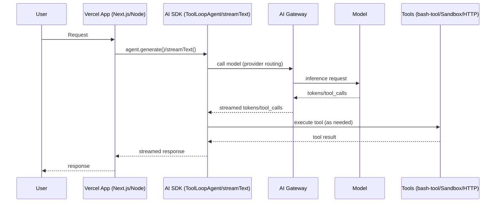
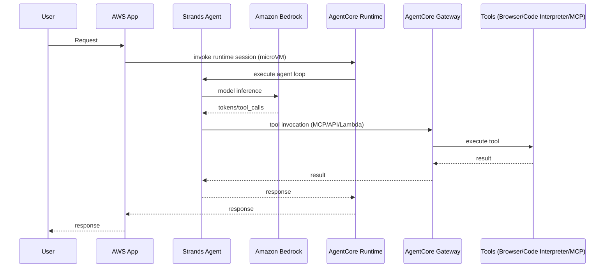
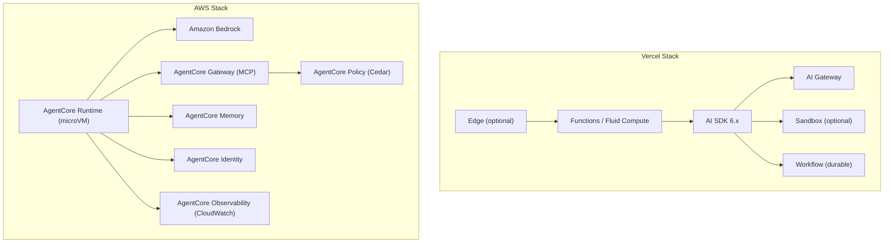
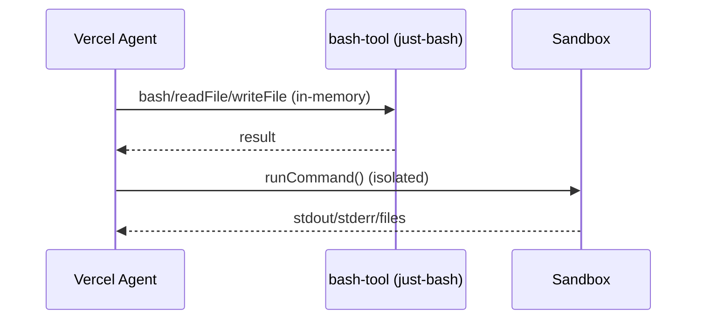
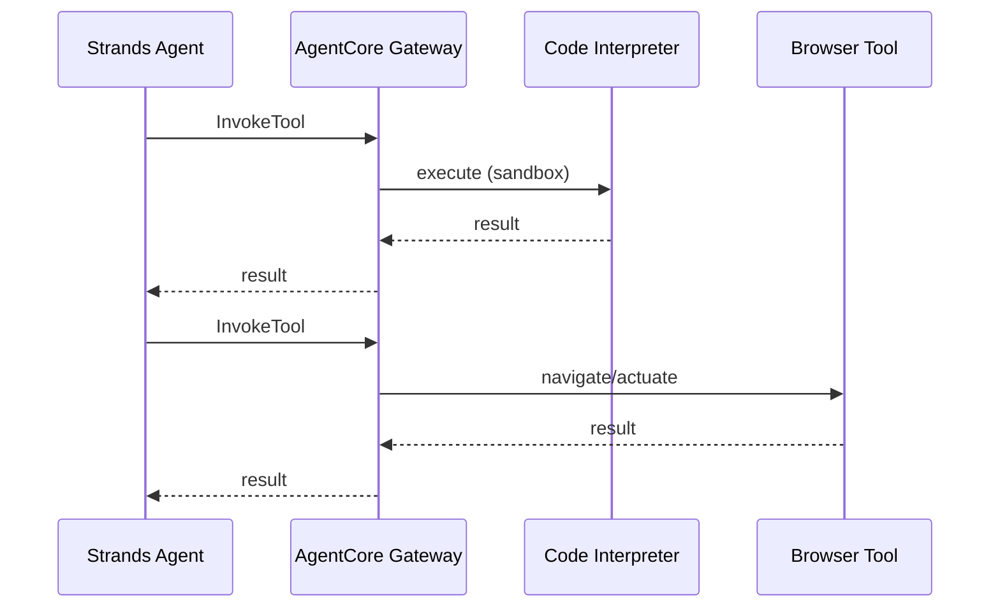

## Vercel Agent Stack vs AWS Agent Stack (2026)

### 1) Metadata & 2026 Delta

- **Last Updated (UTC)**: 2026-01-08T19:34:20Z
- **Model**: GPT-5.2
- **Path**: `generated-reports/vercel-aws/2026/01/2026-01-08-Agent-Comparison-Report-GPT-5.2.md`
- **Scope**: “Blessed path” (officially recommended, out-of-the-box DX).  
  - Vercel AI SDK: `https://sdk.vercel.ai` (source-of-truth repo: `https://github.com/vercel/ai`)  
  - AWS AgentCore dev guide: `https://docs.aws.amazon.com/bedrock-agentcore/latest/devguide/`

#### 2026 Technical Delta (What changed)

**Vercel AI SDK v5 → v6 (agent framework layer)**

- **Agent abstraction consolidated around `ToolLoopAgent`**. `stopWhen` defaults to `stepCountIs(20)`; `system` renamed to `instructions`.  
  - Source: `https://github.com/vercel/ai/blob/main/content/docs/08-migration-guides/24-migration-guide-6-0.mdx` (also referenced via Context7: `/vercel/ai`)
- **Loop control moved server-side**: `maxSteps` removed from `useChat` (client) and replaced with server-side `stopWhen: stepCountIs(N)` patterns.  
  - Source: `https://github.com/vercel/ai/blob/main/content/docs/08-migration-guides/26-migration-guide-5-0.mdx` (also referenced via Context7: `/vercel/ai`)
- **AI SDK `ai@6.0.23`**: release notes call out “per-step timeouts for `generateText` and `streamText`”.  
  - Source: `https://github.com/vercel/ai/releases/tag/ai%406.0.23`

**AWS AgentCore Preview → GA (infrastructure layer)**

- Preview announcement: `https://aws.amazon.com/about-aws/whats-new/2025/07/amazon-bedrock-agentcore-preview/`
- GA pricing is public and consumption-based: `https://aws.amazon.com/bedrock/agentcore/pricing/`

**Strands Agents (AWS agent framework layer)**

- Strands Agents Python SDK release tag used for this report: `v1.21.0`  
  - Source: `https://github.com/strands-agents/sdk-python/releases/tag/v1.21.0`

---

### 2) Infrastructure Footprint (Hard Facts)

#### 2a) Full Lifecycle Comparison Table

| Capability | Vercel Stack (Blessed Path) | AWS Stack (Blessed Path) |
|------------|------------------------------|---------------------------|
| **Agent Framework** | AI SDK 6.x (`ToolLoopAgent`, `streamText`, tools, `stopWhen`) — `https://sdk.vercel.ai` | Strands Agents SDK (`Agent`, tools, model providers) — `https://github.com/strands-agents/sdk-python` |
| **Model Gateway/Routing** | AI Gateway (unified API, provider routing/fallbacks, BYOK) — `https://vercel.com/ai-gateway` | Amazon Bedrock (model catalog + tiers) — `https://aws.amazon.com/bedrock/` |
| **Infrastructure Wrapper** | Vercel platform runtimes (Edge/Serverless/Fluid Compute) — `https://vercel.com/docs` | AgentCore Runtime (microVM-per-session; up to 8h `maxLifetime`) — `https://docs.aws.amazon.com/bedrock-agentcore/latest/devguide/runtime-lifecycle-settings.html` |
| **Secure Code Execution** | Vercel Sandbox (isolated execution) — `https://vercel.com/docs/vercel-sandbox` | AgentCore Code Interpreter — `https://docs.aws.amazon.com/bedrock-agentcore/latest/devguide/code-interpreter-tool.html` |
| **Durable Workflows** | Workflow / “use workflow” (durable functions) — `https://vercel.com/blog/introducing-workflow` | AgentCore Runtime sessions (up to 8 hours), plus external orchestration if needed — `https://docs.aws.amazon.com/bedrock-agentcore/latest/devguide/runtime-lifecycle-settings.html` |
| **Browser Automation** | AI SDK integrations (e.g., Anthropic computer-use tools) — `https://github.com/vercel/ai/blob/main/content/cookbook/00-guides/05-computer-use.mdx` | AgentCore Browser Tool — `https://aws.amazon.com/bedrock/agentcore/pricing/` |
| **Persistent Memory** | BYO (Redis/DB/vector DB) | AgentCore Memory (short-term + long-term) — `https://aws.amazon.com/bedrock/agentcore/pricing/` |
| **Tool Management / MCP** | Native tool calling; MCP “client” story varies by provider integration | AgentCore Gateway connects to MCP servers; MCP operations are priced — `https://aws.amazon.com/bedrock/agentcore/pricing/` |
| **Authorization** | App-layer (middleware + env vars) | AgentCore Policy (Cedar) + IAM — `https://docs.aws.amazon.com/bedrock-agentcore/latest/devguide/policy.html` |
| **Identity / OAuth** | App-layer (NextAuth/Auth.js/custom) | AgentCore Identity — `https://aws.amazon.com/bedrock/agentcore/pricing/` |
| **Observability** | AI SDK callbacks + OTEL patterns (framework-level) | AgentCore Observability (CloudWatch-backed) — `https://aws.amazon.com/bedrock/agentcore/pricing/` |

#### Deep-dive notes (row-by-row)

##### Runtime persistence (agent execution window)

- **AWS AgentCore Runtime is session-based and lifecycle-configurable**:
  - `idleRuntimeSessionTimeout`: 60–28,800 seconds; default **900s (15m)**
  - `maxLifetime`: 60–28,800 seconds; default **28,800s (8h)**
  - Source: `https://docs.aws.amazon.com/bedrock-agentcore/latest/devguide/runtime-lifecycle-settings.html`

- **Vercel** exposes multiple primitives with different durability semantics:
  - **Functions** have plan-dependent max duration (see tool-execution limits below) — `https://vercel.com/docs/functions/limitations`
  - **Sandbox** supports longer-running isolated execution (hours) — `https://vercel.com/docs/vercel-sandbox/pricing`
  - **Workflow** provides explicit durability via `"use workflow"` — `https://vercel.com/blog/introducing-workflow`

##### Code execution (Sandbox vs Code Interpreter)

**AWS AgentCore Code Interpreter (hard facts)**

- Runs in a “**containerized environment** within Amazon Bedrock AgentCore”
- Supports multiple languages: “**Python, JavaScript, and TypeScript**”
- File sizes: inline upload up to **100 MB**; via S3 through terminal commands up to **5 GB**
- Execution duration: default **15 minutes**, extendable up to **8 hours**
- Source: `https://docs.aws.amazon.com/bedrock-agentcore/latest/devguide/code-interpreter-tool.html`

**Vercel Sandbox pricing + metering (hard facts)**

- **Metering dimensions + definitions** (selected quotes):
  - **Active CPU**: “measured in milliseconds. Waiting for I/O … does not count towards Active CPU.”
  - **Provisioned memory**: “(in GB) × time … (measured in hours).”
  - **Network bandwidth**: incoming/outgoing traffic.
  - **Sandbox creations**: number of times you started a sandbox.
  - Source: `https://vercel.com/docs/vercel-sandbox/pricing`
- **Pro/Enterprise regional rates**:
  - Active CPU time (per hour): **$0.128**
  - Provisioned Memory (per GB-hr): **$0.0106**
  - Network (per GB): **$0.15**
  - Sandbox creations (per 1M): **$0.60**
  - Source: `https://vercel.com/docs/vercel-sandbox/pricing`
- **Published limits (selected)**:
  - Max per-sandbox resources: “maximum of **8 vCPUs** with **2 GB** of memory allocated per vCPU”
  - Max runtime duration: “**5 hours** for Pro/Enterprise and **45 minutes** for Hobby, with a default of **5 minutes**”
  - Concurrency limit (Beta): Hobby **10**; Pro/Enterprise **2000**; Beta caveat noted
  - vCPU allocation rate limit: Hobby **40 vCPUs/10 minute**, Pro **200 vCPUs/minute**, Enterprise **400 vCPUs/minute**
  - Source: `https://vercel.com/docs/vercel-sandbox/pricing`

##### Context retrieval (bash-tool vs AWS approach)

- **Vercel `bash-tool`**: “runs on top of **just-bash**, which interprets bash scripts directly in TypeScript without a shell process or arbitrary binary execution.”  
  - Source: `https://vercel.com/changelog/introducing-bash-tool-for-filesystem-based-context-retrieval`
- **AWS** typically uses:
  - **Browser Tool** for web context and **Code Interpreter** for programmatic extraction/analysis  
  - Sources: `https://aws.amazon.com/bedrock/agentcore/pricing/`, `https://docs.aws.amazon.com/bedrock-agentcore/latest/devguide/code-interpreter-tool.html`

##### Security primitives (exact IAM actions vs env vars)

**AWS (AgentCore + Bedrock)**

- Runtime execution role example includes:
  - Trust principal: `bedrock-agentcore.amazonaws.com`
  - Bedrock model invoke actions: `bedrock:InvokeModel`, `bedrock:InvokeModelWithResponseStream`
  - Identity token actions: `bedrock-agentcore:GetWorkloadAccessToken`, `bedrock-agentcore:GetWorkloadAccessTokenForJWT`, `bedrock-agentcore:GetWorkloadAccessTokenForUserId`
  - Source: `https://docs.aws.amazon.com/bedrock-agentcore/latest/devguide/runtime-permissions.html`
- Authoritative action list: `https://docs.aws.amazon.com/service-authorization/latest/reference/list_amazonbedrockagentcore.html`

**Vercel**

- Primary blessed-path controls are app-layer (middleware + environment variables + chosen auth library). Vercel docs do not define a first-party IAM-style action matrix for “agent tool execution”.  
  - Source: `https://vercel.com/docs`

##### Protocol support (MCP)

- **AgentCore Gateway**: “connecting to existing MCP servers” and prices MCP operations (ListTools/InvokeTool/Ping).  
  - Source: `https://aws.amazon.com/bedrock/agentcore/pricing/`
- **Vercel**: MCP client patterns exist, but the “first-party MCP client” story is not positioned as a single platform component in surfaced docs for this run.  
  - Status: not found as a single, first-party “platform component” in the surfaced docs for this run.

---

### 2b) Regional Availability Matrix

#### AWS AgentCore supported regions (feature matrix)

Source: `https://docs.aws.amazon.com/bedrock-agentcore/latest/devguide/agentcore-regions.html`

| Feature | us-east-1 | us-east-2 | us-west-2 | eu-central-1 | eu-west-1 | eu-west-2 | eu-west-3 | eu-north-1 | ap-south-1 | ap-southeast-1 | ap-southeast-2 | ap-northeast-1 | ap-northeast-2 | ca-central-1 | sa-east-1 |
|---------|-----------|-----------|-----------|--------------|-----------|-----------|-----------|------------|------------|----------------|----------------|----------------|----------------|-------------|----------|
| AgentCore Runtime | ✓ | ✓ | ✓ | ✓ | ✓ |  |  |  | ✓ | ✓ | ✓ | ✓ |  |  |  |
| AgentCore Memory | ✓ | ✓ | ✓ | ✓ | ✓ | ✓ | ✓ | ✓ | ✓ | ✓ | ✓ | ✓ | ✓ | ✓ | ✓ |
| AgentCore Gateway | ✓ | ✓ | ✓ | ✓ | ✓ | ✓ | ✓ | ✓ | ✓ | ✓ | ✓ | ✓ | ✓ | ✓ |  |
| AgentCore Identity | ✓ | ✓ | ✓ | ✓ | ✓ | ✓ | ✓ | ✓ | ✓ | ✓ | ✓ | ✓ | ✓ | ✓ |  |
| AgentCore Built-in Tools | ✓ | ✓ | ✓ | ✓ | ✓ |  |  |  | ✓ | ✓ | ✓ | ✓ |  |  |  |
| AgentCore Observability | ✓ | ✓ | ✓ | ✓ | ✓ |  |  |  | ✓ | ✓ | ✓ | ✓ |  |  |  |
| AgentCore Policy | ✓ | ✓ | ✓ | ✓ | ✓ |  |  |  | ✓ | ✓ | ✓ | ✓ |  |  |  |
| AgentCore Evaluations | ✓ |  | ✓ | ✓ |  |  |  |  |  |  | ✓ |  |  |  |  |

#### Vercel availability constraints (documented)

| Feature | Availability | Evidence |
|---------|-------------|----------|
| **Vercel Sandbox** | “Currently … only available in the **Washington, D.C., USA** region” (iad1 is the regional pricing selector on the same page) | `https://vercel.com/docs/vercel-sandbox/pricing` |
| **Vercel Functions max duration** | Hobby: configurable up to **300s**; Pro/Enterprise: configurable up to **800s** | `https://vercel.com/docs/functions/limitations` |
| **Edge streaming constraint** | Must begin sending a response within **25 seconds** to maintain streaming; can continue streaming up to **300 seconds** | `https://vercel.com/docs/functions/limitations` |

---

### 3) 2026 Unit Economics

> Any “per-1,000 turns” number is only meaningful with explicit workload assumptions. This section provides formulas and a concrete baseline scenario. No subjective scoring is used.

#### 3a) Model layer costs (Bedrock vs AI Gateway)

**AWS (Bedrock)**

- Claude Opus 4.5 pricing (explicit): **$5 / 1M input tokens**, **$25 / 1M output tokens**  
  - Source: `https://aws.amazon.com/blogs/machine-learning/claude-opus-4-5-now-in-amazon-bedrock/`
- Claude Opus 4.5 `effort` parameter is documented in the Bedrock Anthropic request/response reference.  
  - Source: `https://docs.aws.amazon.com/bedrock/latest/userguide/model-parameters-anthropic-claude-messages-request-response.html`
- Claude Sonnet 4.5 / Haiku 4.5 on-demand token pricing is published on the Bedrock pricing page (example: **Global cross-region inference**, US East (Ohio)):  
  - **Claude Sonnet 4.5**: **$0.003 / 1,000 input tokens** (**$3 / 1M**) and **$0.015 / 1,000 output tokens** (**$15 / 1M**)  
  - **Claude Haiku 4.5**: **$0.001 / 1,000 input tokens** (**$1 / 1M**) and **$0.005 / 1,000 output tokens** (**$5 / 1M**)  
  - Source: `https://aws.amazon.com/bedrock/pricing/`

**Vercel (AI Gateway)**

- AI Gateway pricing is described as **AI Gateway Credits** (you buy credits; usage is deducted from the balance), with **no markup** versus provider list price and a **$5/month free tier** (until you purchase credits).  
  - Source: `https://vercel.com/docs/ai-gateway/pricing`

#### 3b) Agent execution costs (Sandbox vs AgentCore)

**AWS AgentCore pricing primitives (public list prices)**

- Runtime/Browser/Code Interpreter:
  - CPU: **$0.0895 per vCPU-hour**
  - Memory: **$0.00945 per GB-hour**
- Gateway:
  - API invocations (ListTools, InvokeTool, Ping): **$0.005 / 1,000**
  - Search API: **$0.025 / 1,000**
  - Tool indexing: **$0.02 / 100 tools indexed / month**
- Memory:
  - Short-term: **$0.25 / 1,000 new events**
  - Long-term storage (built-in): **$0.75 / 1,000 records / month**
  - Long-term retrieval: **$0.50 / 1,000 retrievals**
- Policy: pricing table includes **$0.000025 / authorization request** and also notes “no charge in preview” (as displayed on the same page).
- Source: `https://aws.amazon.com/bedrock/agentcore/pricing/`

**Vercel Sandbox pricing primitives (public list prices)**

- Active CPU time: **$0.128/hr**
- Provisioned memory: **$0.0106/GB-hr**
- Network: **$0.15/GB**
- Sandbox creations: **$0.60/1M**
- Source: `https://vercel.com/docs/vercel-sandbox/pricing`

**Vercel Workflow pricing primitives (public list prices; beta)**

- Workflow is **available in Beta on all plans** and is billed as two usage-based resources:
  - **Workflow Storage**: first **720 GB-hours** included (Hobby), then **$0.00069 per GB-hour**
  - **Workflow Steps**: first **50,000 steps** included (Hobby), then **$2.50 per 100,000 steps**
- Source: `https://vercel.com/docs/workflow`

#### 3c) 1,000-turn baseline scenario (AWS)

**Assumptions (explicit)**

- Model: **Claude Sonnet 4.5** (Bedrock)
  - Token rates (Global cross-region inference, US East (Ohio)): **$3 / 1M input tokens**, **$15 / 1M output tokens**  
    - Source: `https://aws.amazon.com/bedrock/pricing/`
- Per turn:
  - Input tokens: 1,000
  - Output tokens: 500
  - AgentCore Runtime session length: 4 seconds
  - Active CPU time: 1 second @ 1 vCPU
  - Peak memory: 1 GB over the 4 seconds
  - Gateway: 1 tool call per turn, assume 2 MCP operations per tool call = 2,000 ops total
  - Memory short-term events: 4 events per turn = 4,000 events total

**Compute (AgentCore)**

- Runtime CPU cost:
  - Per turn: \(1s / 3600 \times 1 \times 0.0895\) = **$0.00002486**
  - 1,000 turns: **$0.02486**
- Runtime memory cost:
  - Per turn: \(4s / 3600 \times 1GB \times 0.00945\) = **$0.00001050**
  - 1,000 turns: **$0.01050**
- Gateway MCP ops:
  - 2,000 ops × ($0.005 / 1,000) = **$0.01**
- Memory short-term:
  - 4,000 events × ($0.25 / 1,000) = **$1.00**

**Model cost (Bedrock)**

- Total input tokens: 1,000,000 ⇒ **$3.00**
- Total output tokens: 500,000 ⇒ **$7.50**
- **Model subtotal**: **$10.50**

**AWS total (excluding long-term memory storage, observability/CloudWatch, and any Search API/tool indexing)**

- **Total ≈** **$10.50 + $1.04536 = $11.54536**

#### 3d) 1,000-turn baseline scenario (Vercel) — Sandbox execution component only

This isolates **Sandbox** costs; model usage via AI Gateway is separately billed (via **AI Gateway Credits** at provider list prices, with no markup) and is not included in the sandbox subtotal.  
Source: `https://vercel.com/docs/ai-gateway/pricing`

**Assumptions (explicit)**

- Sandbox pricing: Active CPU **$0.128/hr**, Provisioned memory **$0.0106/GB-hr**, Network **$0.15/GB**, Creations **$0.60/1M**  
  - Source: `https://vercel.com/docs/vercel-sandbox/pricing`
- Per turn (one sandbox-backed tool step):
  - Active CPU time: **1 second** (1,000 ms)
  - Provisioned memory: **2 GB for 4 seconds** (Vercel documents “2 GB … per vCPU”; this assumes a 1 vCPU sandbox)
  - Sandbox creations: **1 per turn** (worst-case; sandbox reuse reduces this)
  - Network: **\(G_{net}\)** GB total across 1,000 turns

**Compute (Sandbox)**

- Active CPU:
  - Per turn: \(1s/3600 \times 0.128\) = **$0.00003556**
  - 1,000 turns: **$0.03556**
- Provisioned memory:
  - Per turn: \(2GB \times (4s/3600) \times 0.0106\) = **$0.00002356**
  - 1,000 turns: **$0.02356**
- Sandbox creations:
  - 1,000 × ($0.60 / 1,000,000) = **$0.00060**
- Network:
  - **$0.15 × \(G_{net}\)** (GB)

**Vercel Sandbox subtotal (excluding network)**: **~$0.05972 / 1,000 turns**, plus **$0.15 × \(G_{net}\)**.

#### 3e) “Effort” tax (Anthropic on Bedrock)

The `effort` parameter is an alternative to thinking token budgets for **Claude Opus 4.5**. It “adjust[s] token usage across thinking, tool calls, and user communication”, with values `high` (default), `medium`, `low`, and requires the beta header `effort-2025-11-24`.  
Source: `https://docs.aws.amazon.com/bedrock/latest/userguide/model-parameters-anthropic-claude-messages-request-response.html`

**Implication for TCO (both platforms)**:

- Higher `effort` tends to increase tokens consumed (and potentially tool activity), which increases cost on:
  - Bedrock (token pricing)
  - Vercel AI Gateway (pass-through token pricing if you route to Opus 4.5)

---

### 4) Agent Stack Deep-Dive

#### 4a) Vercel stack (AI SDK + AI Gateway + Sandbox + Workflow)

- **AI SDK 6.x**: multi-step tool calling with `stopWhen: stepCountIs(N)` is canonical in current docs/examples.  
  - Source: `https://github.com/vercel/ai/blob/main/content/docs/02-getting-started/06-nodejs.mdx`
- **ToolLoopAgent** defaults and `instructions` rename are covered in the 6.0 migration guide.  
  - Source: `https://github.com/vercel/ai/blob/main/content/docs/08-migration-guides/24-migration-guide-6-0.mdx`
- **AI Gateway**: pricing is via **AI Gateway Credits** (no markup vs provider list prices; $5/month free tier until you purchase credits).  
  - Source: `https://vercel.com/docs/ai-gateway/pricing`
- **Sandbox**: pricing, limits, and “Washington, D.C., USA only” region constraint are published.  
  - Source: `https://vercel.com/docs/vercel-sandbox/pricing`
- **Workflow**: durable “use workflow” primitive; beta on all plans with published step/storage pricing.  
  - Sources: `https://vercel.com/blog/introducing-workflow`, `https://vercel.com/docs/workflow`
- **bash-tool**: filesystem-based context retrieval using `just-bash`.  
  - Source: `https://vercel.com/changelog/introducing-bash-tool-for-filesystem-based-context-retrieval`

#### 4b) AWS stack (Strands + AgentCore)

- **Strands Agents SDK**: agent framework (tools + model providers).  
  - Source: `https://github.com/strands-agents/sdk-python`
- **AgentCore Runtime**: session lifecycle and 8h max lifetime.  
  - Source: `https://docs.aws.amazon.com/bedrock-agentcore/latest/devguide/runtime-lifecycle-settings.html`
- **AgentCore Gateway**: MCP connectivity and pricing primitives.  
  - Source: `https://aws.amazon.com/bedrock/agentcore/pricing/`
- **AgentCore Code Interpreter**: containerized sandbox supporting Python/JS/TS; 100MB inline upload and 5GB via S3; default 15m execution extendable to 8h.  
  - Source: `https://docs.aws.amazon.com/bedrock-agentcore/latest/devguide/code-interpreter-tool.html`
- **AgentCore Policy**: Cedar-based authorization.  
  - Source: `https://docs.aws.amazon.com/bedrock-agentcore/latest/devguide/policy.html`

#### 4c) Git tags analyzed (explicit)

- Vercel AI SDK: `ai@6.0.23` — `https://github.com/vercel/ai/releases/tag/ai%406.0.23`
- Strands Agents SDK (Python): `v1.21.0` — `https://github.com/strands-agents/sdk-python/releases/tag/v1.21.0`
- Bedrock AgentCore SDK (Python): `v1.1.4` — `https://github.com/aws/bedrock-agentcore-sdk-python/releases/tag/v1.1.4`

---

### 5) Observability & Day 2 (Evidence-based)

#### Telemetry

- **AWS**: AgentCore Observability is CloudWatch-priced and integrated (pricing page points to CloudWatch pricing).  
  - Source: `https://aws.amazon.com/bedrock/agentcore/pricing/`
- **Vercel AI SDK**: step callbacks like `onStepFinish` exist in canonical `streamText` patterns.  
  - Source: `https://github.com/vercel/ai/blob/main/content/docs/02-getting-started/06-nodejs.mdx`

#### Loop-breakers / termination semantics

- **Vercel**: deterministic loop control via `stopWhen` (e.g., `stepCountIs(N)`).  
  - Source: `https://github.com/vercel/ai/blob/main/content/docs/02-getting-started/06-nodejs.mdx`
- **AWS**: hard runtime maximum via `maxLifetime` plus idle timeout.  
  - Source: `https://docs.aws.amazon.com/bedrock-agentcore/latest/devguide/runtime-lifecycle-settings.html`

---

### 6) Adoption Metrics (GitHub API Data)

> Counts below are based on GitHub issue listing filtered by `created_at >= 2025-11-09` and grouped by current `state` (OPEN vs CLOSED). This is a “created in last ~60 days by current state” proxy (not “closed in last 60 days”).

| Repo | Open issues created since 2025-11-09 | Closed issues created since 2025-11-09 | Ratio (Open/Closed) | Latest commit (UTC) |
|------|--------------------------------------|----------------------------------------|---------------------|---------------------|
| `vercel/ai` | 356 | 366 | 0.9727 | 2026-01-08T17:15:16Z (`https://github.com/vercel/ai/commit/00dc198191c2c5a6b6a48cd02ea43f0ad6132ba2`) |
| `strands-agents/sdk-python` | 137 | 73 | 1.8767 | 2026-01-08T15:50:24Z (`https://github.com/strands-agents/sdk-python/commit/2f04bc0f9c786e6afa0837819d55accaa68b6896`) |
| `aws/bedrock-agentcore-sdk-python` | 13 | 3 | 4.3333 | 2026-01-08T18:28:12Z (`https://github.com/aws/bedrock-agentcore-sdk-python/commit/b3e4b4bbea8e41e1b73c7844e45b079d28b110ef`) |

---

### Architectural Visuals (Mermaid)

#### 1) Agent lifecycle — sequence diagrams

#### 2) Infrastructure architecture — aligned graph

#### 2b) Security boundary comparison — Vercel Secure Compute vs AWS VPC primitives

| Aspect | Vercel Secure Compute (blessed path add-on) | AWS VPC primitives (example) |
|--------|--------------------------------------------|------------------------------|
| **Private connectivity model** | “Dedicated private networks with VPC peering for Enterprise teams.” | Compose VPC networking primitives (for example NAT Gateway and PrivateLink interface endpoints) |
| **Dedicated IPs / network identity** | Network “includes: **a pair of dedicated IP addresses**, AWS account ID, AWS region … AWS VPC ID … CIDR block …” | Depends on design (NAT gateways, VPC endpoints, load balancers, etc.) |
| **Regional failover semantics** | “Supports automatic region failover using the active and passive network concept.” | Multi-region failover is implemented using standard AWS multi-region patterns (varies by workload) |
| **Pricing signal (published)** | “Starts at **$6.5K/year** … plus … **$0.15/GB**” | NAT Gateway example shows **$0.045/hour** and **$0.045 per GB** processed; PrivateLink interface endpoints include **$0.01/GB** (first 1 PB) and example shows **$0.01/hour per endpoint ENI** |

**Sources**

- Vercel Secure Compute: `https://vercel.com/docs/connectivity/secure-compute`
- AWS NAT Gateway example pricing: `https://aws.amazon.com/vpc/pricing/`
- AWS PrivateLink pricing: `https://aws.amazon.com/privatelink/pricing/`

#### 3) Tool execution flow — side-by-side

<strong>🧰 Tool Execution Capabilities Comparison (Vercel vs AWS)</strong>

#### 1) Available tool types (equivalence map)

| Tool capability | Vercel blessed path | AWS blessed path |
|----------------|---------------------|------------------|
| **Secure code execution** | **Vercel Sandbox** — `https://vercel.com/docs/vercel-sandbox/pricing` | **AgentCore Code Interpreter** — `https://docs.aws.amazon.com/bedrock-agentcore/latest/devguide/code-interpreter-tool.html` |
| **Filesystem context retrieval** | **bash-tool** (in-memory or sandbox-backed) — `https://vercel.com/changelog/introducing-bash-tool-for-filesystem-based-context-retrieval` | Code Interpreter supports files + large-file workflows via S3 — `https://docs.aws.amazon.com/bedrock-agentcore/latest/devguide/code-interpreter-tool.html` |
| **Browser automation** | AI SDK integrations (Anthropic computer use tools) — `https://github.com/vercel/ai/blob/main/content/cookbook/00-guides/05-computer-use.mdx` | AgentCore Browser Tool — `https://aws.amazon.com/bedrock/agentcore/pricing/` |
| **MCP tool mediation** | Native tool calling; MCP client story varies by provider integration | AgentCore Gateway connects to MCP servers; MCP operations priced — `https://aws.amazon.com/bedrock/agentcore/pricing/` |

#### 2) Runtime & language support (hard facts only)

| Dimension | Vercel Sandbox | AgentCore Code Interpreter |
|----------|----------------|----------------------------|
| **Isolation mechanism** | Sandbox environment with published CPU/memory ceilings | “Runs in a **containerized environment** …” — `https://docs.aws.amazon.com/bedrock-agentcore/latest/devguide/code-interpreter-tool.html` |
| **Languages** | “Node.js or Python runtimes” — `https://vercel.com/docs/vercel-sandbox/pricing` | “Python, JavaScript, and TypeScript” — `https://docs.aws.amazon.com/bedrock-agentcore/latest/devguide/code-interpreter-tool.html` |
| **Large file handling** | Network metered; limits vary by workload | Inline upload up to **100 MB**; via S3 up to **5 GB** — `https://docs.aws.amazon.com/bedrock-agentcore/latest/devguide/code-interpreter-tool.html` |
| **Internet access** | Network bandwidth is priced and metered — `https://vercel.com/docs/vercel-sandbox/pricing` | “includes … **internet access**” — `https://docs.aws.amazon.com/bedrock-agentcore/latest/devguide/code-interpreter-tool.html` |

#### 3) Execution limits (documented)

| Limit | Vercel Sandbox | AgentCore Code Interpreter |
|------|----------------|----------------------------|
| **Max runtime** | Hobby **45 minutes**; Pro/Enterprise **5 hours** — `https://vercel.com/docs/vercel-sandbox/pricing` | Default **15 minutes**; extendable up to **8 hours** — `https://docs.aws.amazon.com/bedrock-agentcore/latest/devguide/code-interpreter-tool.html` |
| **CPU / memory ceiling** | Max **8 vCPUs**; “2 GB … per vCPU” — `https://vercel.com/docs/vercel-sandbox/pricing` | DOCUMENTATION GAP (no max vCPU/GB published in surfaced doc page) |
| **Concurrency** | Hobby **10**; Pro/Enterprise **2000** (Beta caveat) — `https://vercel.com/docs/vercel-sandbox/pricing` | DOCUMENTATION GAP (not found in surfaced doc page) |

#### 4) Pricing model (published primitives)

| Cost component | Vercel Sandbox | AgentCore Code Interpreter |
|---------------|----------------|----------------------------|
| **Compute** | Active CPU time: **$0.128/hr** — `https://vercel.com/docs/vercel-sandbox/pricing` | CPU: **$0.0895 per vCPU-hour** — `https://aws.amazon.com/bedrock/agentcore/pricing/` |
| **Memory** | Provisioned memory: **$0.0106/GB-hr** — `https://vercel.com/docs/vercel-sandbox/pricing` | Memory: **$0.00945 per GB-hour** — `https://aws.amazon.com/bedrock/agentcore/pricing/` |
| **Network** | **$0.15/GB** — `https://vercel.com/docs/vercel-sandbox/pricing` | Standard AWS data transfer charges apply (varies) |
| **Creation fee** | **$0.60 / 1M** sandbox creations — `https://vercel.com/docs/vercel-sandbox/pricing` | N/A (billed by consumption; tooling mediation via Gateway priced separately) |

#### 5) `bash-tool` vs Code Interpreter (key differentiator)

- **Vercel `bash-tool`**: `just-bash` interpreter (TypeScript), “without a shell process or arbitrary binary execution.”  
  - Source: `https://vercel.com/changelog/introducing-bash-tool-for-filesystem-based-context-retrieval`
- **AgentCore Code Interpreter**: multi-language code execution with internet access and large-file workflows (S3).  
  - Source: `https://docs.aws.amazon.com/bedrock-agentcore/latest/devguide/code-interpreter-tool.html`

