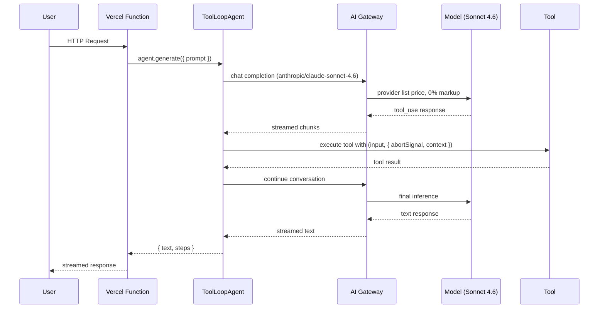
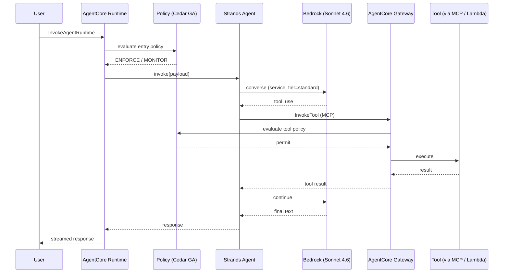
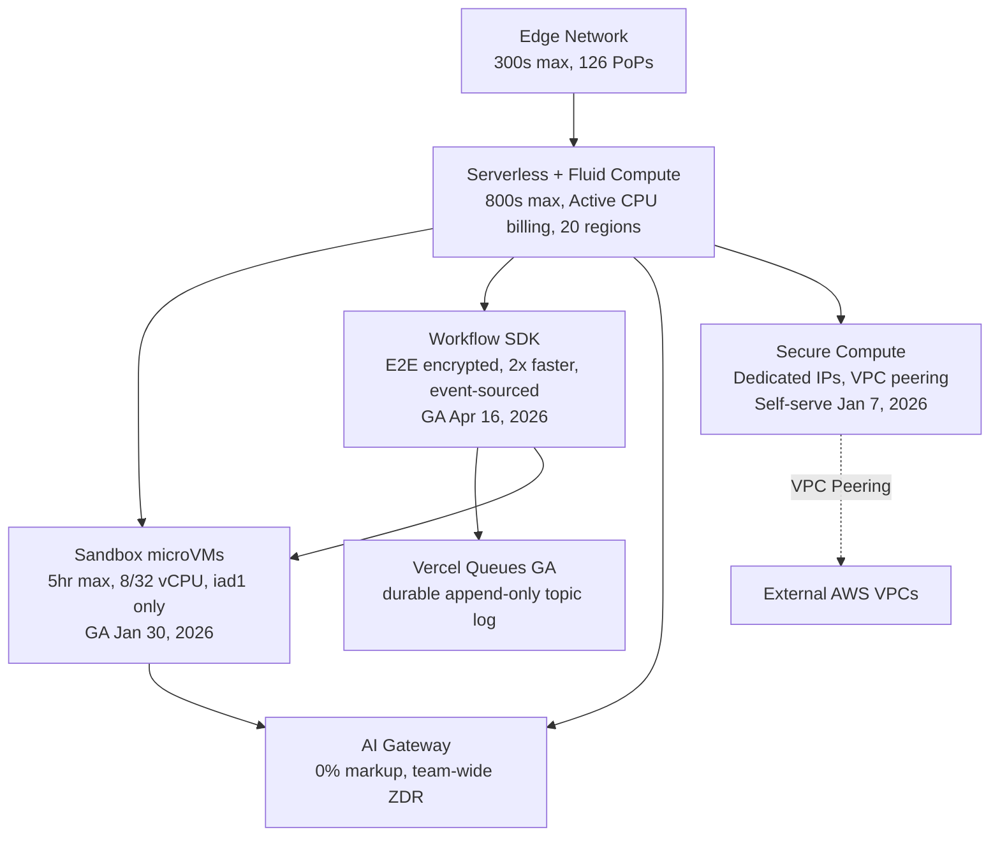
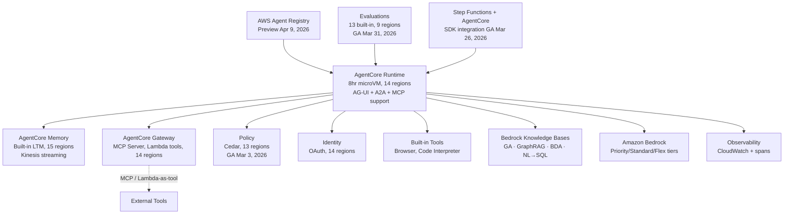
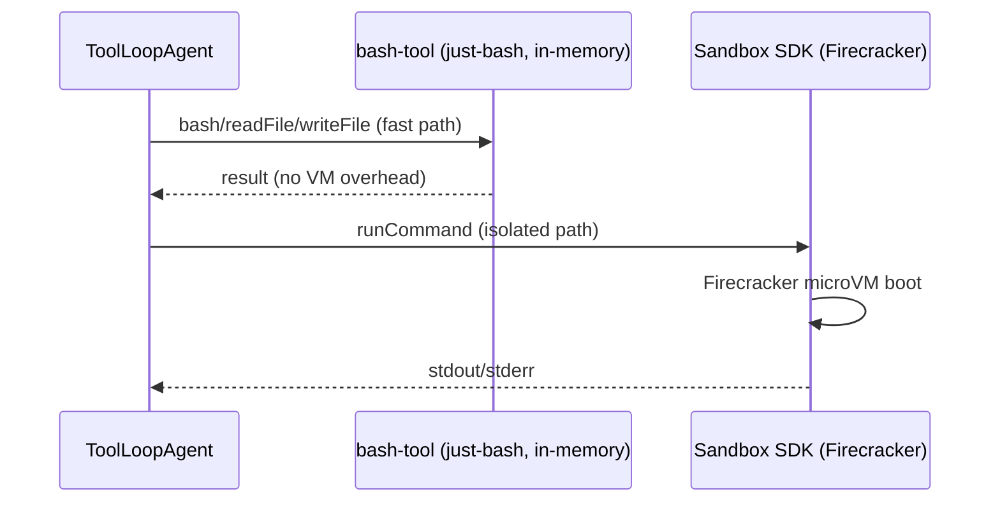
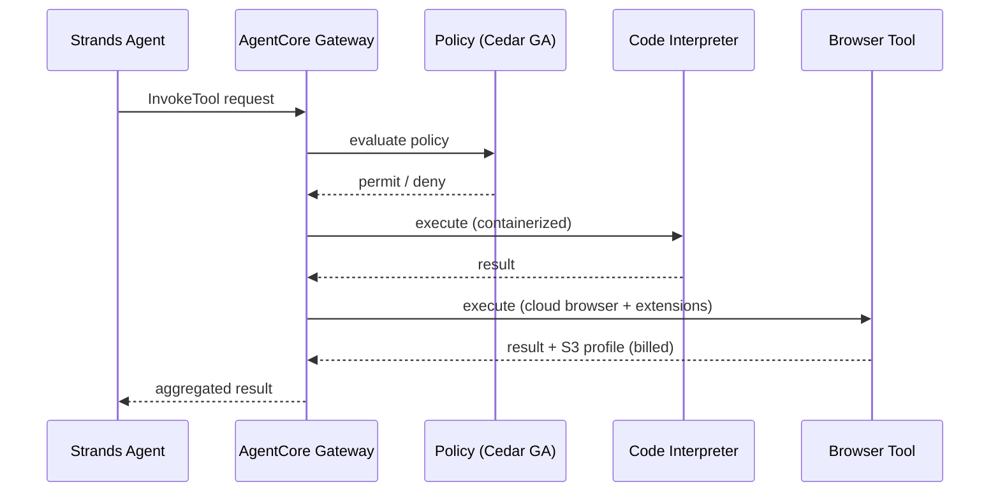

# Vercel Agent Stack vs AWS Agent Stack: Technical Evaluation Report

## 1. Metadata & 2026 Delta

| Field | Value |
|-------|-------|
| **Last Updated** | 2026-04-21T00:00:00Z |
| **Model** | Claude Opus 4.7 |
| **Report Path** | `generated-reports/vercel-aws/2026/04/2026-04-21-Agent-Comparison-Report-Claude-Opus-4.7.md` |
| **Report Version** | 2.0.0 |
| **Methodology** | "Blessed Path" — Officially recommended, out-of-the-box developer experience |
| **Previous Version** | [2026-01-08 (Claude Opus 4.5)](../../2026/01/2026-01-08-Agent-Comparison-Report-Claude-Opus-4.5.md) |
| **Coverage Window** | 2026-01-08 → 2026-04-21 (≈3.5 months) |
| **Live Site** | [adlc-evals.vercel.app/reports/vercel-aws](https://adlc-evals.vercel.app/reports/vercel-aws) |

> 📝 **Source of Truth:** This markdown mirrors the curated, human-validated content published at the live site above. Where the two drift, **the site wins** — this file is regenerated from site data during each refresh.

### Executive Delta: January → April 2026

Both platforms advanced substantially in the first 3.5 months of 2026. This is not a cosmetic refresh — multiple previously-preview components graduated to GA, SDK versions advanced by dozens of releases, a new frontier Anthropic model (Claude Opus 4.7) launched five days before this report was generated, and both vendors materially expanded the "blessed path" surface area with new rows for RBAC, content safety, compliance, and managed knowledge bases.

| Platform | Previous (Jan 8) | Current (Apr 21) | Nature of Change |
|----------|-----------------|------------------|------------------|
| **Vercel Sandbox** | Beta (closed SDK) | **GA** (Jan 30, 2026) — open-source SDK/CLI | Platform-level — 32 vCPU / 64 GB Enterprise tier (Apr 8); Persistent Sandboxes beta (Mar 26); filesystem snapshots GA (Jan 22) |
| **Vercel Workflow** | Beta | **GA** (Apr 16, 2026) | Platform-level — 100M+ runs / 500M+ steps / 1,500+ customers in beta; E2E encryption default (Mar 17); 2× speed improvement (Mar 3); event-sourced architecture; DurableAgent for AI SDK |
| **Vercel Queues** | Did not exist | **GA** (backing Workflow SDK) | New — durable append-only topic log powering Workflow; @vercel/queue; fan-out consumer groups; automatic retries + deduplication |
| **AI SDK** | `ai@6.0.23` | `ai@6.0.168` stable + `7.0.0-beta.111` | Version — 145 patch/minor releases on v6; v7 beta adds `WorkflowAgent`, ESM-only, `@ai-sdk/otel`, `toolNeedsApproval` |
| **AI Gateway** | Unified routing, BYOK | + Team-wide ZDR (Apr 8), Custom Reporting API (Mar 25), OpenAI Responses API (Mar 6), 20+ new models | Capability — team-wide ZDR toggle ($0.10/1K req) routes to 13 ZDR providers; BYOK exempt |
| **Vercel Observability Plus** | Base plan | **Anomaly alerts GA** (Apr 13, 2026) | Capability — 30-day retention, workflow run/step queries (Apr 7) |
| **Vercel Plugin for Coding Agents** | Did not exist | GA (Mar 17, 2026) | New — Claude Code / Cursor / Codex native integration |
| **AgentCore Policy** | Preview | **GA** (Mar 3, 2026) | Status — included in Runtime/Gateway pricing at GA |
| **AgentCore Evaluations** | Preview (4 regions) | **GA** (Mar 31, 2026, 9 regions) | Status + regional — 13 built-in evaluators, Ground Truth, custom Lambda evaluators |
| **AgentCore Runtime** | 11 regions | **14 regions** | Regional — +eu-west-2, eu-west-3, eu-north-1 (Jan 26, 2026 expansion wave); +AG-UI protocol (Mar 13); +`InvokeAgentRuntimeCommand` API (Mar 17) |
| **AWS Agent Registry** | Did not exist | **Preview** (Apr 9, 2026, 5 regions) | New service — 8th AgentCore service; semantic + keyword search, approval workflows, MCP endpoint |
| **AWS Step Functions + AgentCore** | Did not exist | **GA** (Mar 26, 2026) | New — SDK service integration; invoke runtimes with built-in retries, run agents in parallel via Map states, automate agent provisioning as workflow steps |
| **Amazon Bedrock Guardrails** | Existed (models only) | **Applies to AgentCore** (via guardrail ID) | Capability — 6 content filter categories + denied topics, PII redaction, grounding checks, Automated Reasoning; Classic & Standard tiers |
| **Amazon Bedrock Knowledge Bases** | GA for RAG | + GraphRAG, multimodal parsing (BDA), NL→SQL | Capability — native AgentCore integration for managed grounding |
| **Strands SDK (Python)** | `v1.21.0` | `v1.36.0` | Version — 15 releases; `AgentAsTool`, Plugin system, `BedrockModel(service_tier=...)`, Gemini + SageMaker providers |
| **Strands SDK (TypeScript)** | Preview | `v1.0.0-rc.4` (**still RC**) | Status — feature-complete with Python but not yet GA; includes Swarm, Graph, A2A, and `VercelModel` adapter |
| **bedrock-agentcore** | `v1.1.4` | `v1.6.3` | Version — 22 releases; `EvaluationClient`, `ResourcePolicyClient`, `serve_a2a()`, `serve_ag_ui()` |
| **Spring AI AgentCore SDK** | Did not exist | **Java GA** (Apr 14, 2026) | New — third first-class language for AgentCore |
| **Claude model lineup** | Opus 4.5, Sonnet 4.5, Haiku 4.5 | + Opus 4.6 (Feb 5), Sonnet 4.6 (Feb 17), **Opus 4.7 (Apr 16)** | Model — new frontier Opus 4.7 with updated tokenizer (1.0–1.35× inflation) and `effort: 'xhigh'`; Sonnet 4.6 is the new default |

### Terminology Correction

The January 2026 report referenced **"AI Units v2026"** as a Vercel billing unit. Research for this refresh confirmed this term does **not exist** as a public Vercel SKU. This report uses the accurate current terminology: **Fast Data Transfer (FDT)** for CDN/edge traffic (regional pricing) and **AI Gateway Credits** for AI Gateway billing (zero-markup pass-through of provider list prices).

### Region Count Correction

The January 2026 report claimed Vercel operates 21 compute regions. This figure is **wrong** — [Vercel's official regions docs](https://vercel.com/docs/regions) canonically list **20 compute-capable regions** (including Montréal `yul1`, added Jan 20, 2026). `yul1` was absorbed into the 20-region count, not stacked on top of a prior 20-region baseline. This refresh uses the correct figure: **20 compute regions**.

---

## 2. Infrastructure Footprint (Hard Facts)

> 🗂️ **Structural note:** The April 2026 refresh reorganizes the capability matrix into **four thematic groups** mirroring the site: **Agent Foundations** (how you build), **Infrastructure** (where it runs), **Security & Identity** (who can do what), and **Operations** (memory, observability, evaluation). Rows flagged **NEW** were added during the April 2026 site overhaul.

### Two-Layer Architecture Comparison

| Layer | Vercel | AWS |
|-------|--------|-----|
| **Agent Framework** (SDK for building agents) | AI SDK 6.x (`ToolLoopAgent`, tools, streaming) — v7 beta adds `WorkflowAgent` | **Strands Agents SDK** (`Agent`, `Swarm`, `Graph`, `AgentAsTool`, Plugins) |
| **Infrastructure** (Runtime, memory, deployment) | Vercel Platform (Fluid Compute, Sandbox GA, Workflow GA, Queues GA, AI Gateway, Chat SDK) | **BedrockAgentCoreApp** (Runtime, Memory, Gateway, Identity, Policy GA, Evaluations GA, Agent Registry preview, Knowledge Bases GA) |

> ⚠️ **Key Architecture Insight:** **Bedrock AgentCore** separates orchestration from hosting: Strands Agents SDK (open-source) owns agent logic; AgentCore provides the managed runtime — microVM-per-session compute, Cedar-based policy, Memory, Identity, Observability, Evaluations, and Agent Registry as eight first-class services. Vercel's AI SDK sits at the Strands layer; AgentCore's hosted-agent story has no direct Vercel equivalent — you compose it from Marketplace integrations.

### 2.1 Agent Foundations

Core SDKs and gateways for building AI agents with reasoning and tool use.

| Capability | Vercel Stack | AWS Stack |
|------------|--------------|-----------|
| **Agent Framework** | **Vercel AI SDK 6.x** — `ToolLoopAgent`, `Agent` interface, `stopWhen`, `prepareStep`, `dynamicTool` (stable Dec 2025); v7 beta ESM-only. [Docs](https://ai-sdk.dev/docs/agents/overview) | **Strands Agents SDK** — `Agent`, `Swarm`, `Graph`, `AgentAsTool`, Plugins; Python `v1.36.0`, TypeScript `v1.0.0-rc.4`. [Docs](https://strandsagents.com/latest/) |
| **Model Gateway** | **AI Gateway** — 0% markup · BYOK across Anthropic / OpenAI / Azure / Vertex / Bedrock · 100+ models · built-in observability. [Docs](https://vercel.com/docs/ai-gateway) | **Amazon Bedrock** — Foundation models, Priority / Standard / Flex / Reserved service tiers, cross-region inference (Global CRIS on Claude 4.5+). [Docs](https://aws.amazon.com/bedrock/) |
| **Tool Management** | **`mcp-handler` 1.1 + AI SDK tools + Sandbox** — first-party MCP server (Streamable HTTP + OAuth); `@ai-sdk/mcp` client; `tool()` + `dynamicTool`; `@vercel/sandbox` 1.10 for code exec. [Docs](https://github.com/vercel/mcp-handler) | **Bedrock AgentCore Gateway** — MCP Server, Lambda-as-tool transform, server-side tool execution via Bedrock Responses API (Feb 24, 2026). [Docs](https://docs.aws.amazon.com/bedrock-agentcore/latest/devguide/gateway.html) |
| **Protocol Support** | **MCP (client + server)** — `@ai-sdk/mcp` client: Streamable HTTP + SSE stable, stdio local-only · `mcp-handler` server · A2A + AG-UI not first-party. [Docs](https://ai-sdk.dev/docs/ai-sdk-core/mcp-tools) | **MCP + A2A + AG-UI** — all three open protocols supported in Runtime (AG-UI added Mar 13, 2026). [Announcement](https://aws.amazon.com/about-aws/whats-new/2026/03/amazon-bedrock-agentcore-runtime-ag-ui-protocol/) |
| **Agent Discovery** | **Marketplace + `mcp.vercel.com`** — Marketplace "AI Agents & Services" category + agent-optimized CLI (`vercel integration discover / guide`); `mcp.vercel.com` first-party MCP endpoint; no dedicated agent registry. [Marketplace](https://vercel.com/marketplace/category/agents) | **AWS Agent Registry (Preview)** — new 8th AgentCore service (Apr 9, 2026); semantic + keyword search; MCP endpoint; 5 regions. [Announcement](https://aws.amazon.com/blogs/machine-learning/the-future-of-managing-agents-at-scale-aws-agent-registry-now-in-preview/) |

### 2.2 Infrastructure

Compute, execution environments, and workflow orchestration.

| Capability | Vercel Stack | AWS Stack |
|------------|--------------|-----------|
| **Infrastructure Wrapper** | **Fluid Compute** — Edge + Serverless hybrid across **20 regions**; in-function concurrency; 800s max (Pro/Enterprise); Active CPU billing — I/O time is free. [Docs](https://vercel.com/docs/fluid-compute) | **Bedrock AgentCore Runtime** — microVM-per-session, 14 regions, 8h `maxLifetime`, `InvokeAgentRuntimeCommand` API (Mar 17, 2026). [Docs](https://docs.aws.amazon.com/bedrock-agentcore/latest/devguide/runtime-lifecycle-settings.html) |
| **Secure Code Execution** | **Vercel Sandbox** — Firecracker microVMs, node24 / python3.13; up to **32 vCPU / 64 GB / 32 GB NVMe** (Enterprise); 5-hr max; 2,000 concurrent; `iad1` only; snapshots GA (Jan 22), persistent beta (Mar 26). [Docs](https://vercel.com/docs/vercel-sandbox) | **Bedrock AgentCore Code Interpreter** — containerized, Python / JS / TS, 5 GB files, 8h max, 14 regions. [Docs](https://docs.aws.amazon.com/bedrock-agentcore/latest/devguide/code-interpreter-tool.html) |
| **Durable Workflows** | **Workflow SDK (GA Apr 16, 2026)** — `"use workflow"` directive; event-sourced; unlimited run + sleep duration; **10K steps/run**; **100K concurrent**; **DurableAgent** for AI SDK; TypeScript GA, Python beta. [Docs](https://vercel.com/docs/workflows) | **Bedrock AgentCore Runtime Sessions** — up to 8 hours, configurable idle timeout, Step Functions integration (GA Mar 26, 2026). [Docs](https://docs.aws.amazon.com/bedrock-agentcore/latest/devguide/runtime-lifecycle-settings.html) |
| **Message Queue** 🆕 | **Vercel Queues (GA)** — `@vercel/queue`: durable append-only topic log; fan-out consumer groups; automatic retries + deduplication; powers the Workflow SDK under the hood. [Docs](https://vercel.com/docs/queues) | **AWS Step Functions + AgentCore (GA Mar 26, 2026)** — Step Functions SDK service integration; durable state machines; built-in retries; parallel Map states for running agents concurrently; idempotent Lambda execution; automates agent provisioning as workflow steps. [Announcement](https://aws.amazon.com/about-aws/whats-new/2026/03/aws-step-functions-sdk-integrations/) |
| **Browser Automation** | **Kernel (Marketplace) + Sandbox DIY** — Kernel (Vercel-native Marketplace, 500+ installs): CDP cloud browsers compatible with Playwright / Puppeteer / Stagehand / Computer Use · or install Chromium directly in `@vercel/sandbox`. [Marketplace](https://vercel.com/marketplace/kernel) | **Bedrock AgentCore Browser Tool** — cloud-based, custom Chrome extensions (Jan 2026), CAPTCHA reduction via Web Bot Auth, S3 profile billing (Apr 15, 2026). [Docs](https://docs.aws.amazon.com/bedrock-agentcore/latest/devguide/browser-tool.html) |

### 2.3 Security & Identity

Authentication, authorization, and access control — **four new rows** (RBAC, Identity/OAuth, Content Safety, Compliance & Audit) added in the April 2026 overhaul.

| Capability | Vercel Stack | AWS Stack |
|------------|--------------|-----------|
| **Authorization** | **AI Gateway ZDR + Deployment Protection** — AI Gateway ZDR (Pro/Enterprise): team-wide toggle (**$0.10/1K req**) or per-request flag; routes to **13 ZDR providers**; BYOK exempt. Platform Deployment Protection: Vercel Auth, Password, Trusted IPs. [Docs](https://vercel.com/docs/ai-gateway/capabilities/zdr) | **Bedrock AgentCore Policy (GA Mar 3, 2026)** — Cedar-based, 13 regions, `ResourcePolicyClient`, ENFORCE / MONITOR modes. [Announcement](https://aws.amazon.com/about-aws/whats-new/2026/03/policy-amazon-bedrock-agentcore-generally-available/) |
| **RBAC & Access Control** 🆕 | **Team Roles + Access Groups + SCIM** — 8 team roles (Owner → Contributor) + dedicated Security role for firewall / WAF; project-level Access Groups with permission groups; SCIM Directory Sync maps IdP groups to roles (Enterprise). [Docs](https://vercel.com/docs/rbac/access-groups) | **IAM + AgentCore Managed Policies** — IAM-based; AWS-managed `BedrockAgentCoreFullAccess` policy + resource-based policies on Runtime / Gateway / Memory; ABAC via tags; JWT-claim condition keys for agent invocations. [Docs](https://docs.aws.amazon.com/bedrock-agentcore/latest/devguide/security-iam-awsmanpol.html) |
| **Identity / OAuth** 🆕 | **Marketplace Auth + OIDC + SAML SSO** — Marketplace-native: Clerk, Auth0, WorkOS, Stytch (auto-provisioned env vars, unified billing); Vercel OIDC IdP for keyless cloud + AI Gateway auth; SAML SSO (22+ IdPs) on Enterprise/Pro. [Docs](https://vercel.com/docs/oidc) | **Bedrock AgentCore Identity** — OAuth, API keys, M2M + `USER_FEDERATION` flows, **$0.010/1K requests**. [Docs](https://docs.aws.amazon.com/bedrock-agentcore/latest/devguide/identity.html) |
| **Content Safety / Guardrails** 🆕 | **Model-native + AI Gateway policies** — no platform content filters or PII scrubbing; AI Gateway enforces ZDR + `disallowPromptTraining`; WAF rate-limits AI endpoints; Claude / OpenAI native safety + custom middleware required. [Docs](https://vercel.com/docs/ai-gateway/capabilities/disallow-prompt-training) | **Amazon Bedrock Guardrails (GA)** — 6 content filter categories (Hate / Insults / Sexual / Violence / Misconduct / Prompt Attack) + denied topics, PII redaction, grounding checks, Automated Reasoning; Classic & Standard tiers; applies to AgentCore via guardrail ID. [Docs](https://docs.aws.amazon.com/bedrock/latest/userguide/guardrails.html) |
| **Compliance & Audit** 🆕 | **SOC 2 T2, ISO 27001, HIPAA BAA + Activity Log** — SOC 2 Type 2, ISO 27001:2022, HIPAA BAA (Enterprise), PCI DSS v4.0, GDPR, EU-U.S. DPF, TISAX AL2; Activity Log (CLI accessible) + Log Drains for SIEM; reports at [security.vercel.com](https://security.vercel.com). [Docs](https://vercel.com/docs/security/compliance) | **SOC 1/2/3, ISO, HIPAA + CloudTrail + Artifact** — SOC 1/2/3, ISO 27001 / 27017 / 27018, PCI DSS, HIPAA eligible (BAA), FedRAMP in progress; CloudTrail logs AgentCore management + data events (`InvokeGateway`); audit reports via AWS Artifact. [Docs](https://docs.aws.amazon.com/bedrock-agentcore/latest/devguide/compliance-validation.html) |

### 2.4 Operations

State management, memory, monitoring, and evaluation — **Knowledge Base / Grounding** row is new.

| Capability | Vercel Stack | AWS Stack |
|------------|--------------|-----------|
| **Persistent Memory** | **DurableAgent + Marketplace Storage** — `DurableAgent` (`@workflow/ai/agent`) auto-persists messages / tool calls across steps; `useChat onFinish` for chat history; Neon / Upstash / Supabase via Marketplace; no first-party agent memory product. [Docs](https://workflow-sdk.dev/docs/api-reference/workflow-ai/durable-agent) | **Bedrock AgentCore Memory** — built-in short-term + long-term strategies (semantic / summary / preference / episodic); Kinesis streaming notifications; 15 regions. [Docs](https://docs.aws.amazon.com/bedrock-agentcore/latest/devguide/memory.html) |
| **Knowledge Base / Grounding** 🆕 | **Marketplace Vector Stores** — Supabase pgvector, Upstash Vector, MongoDB Atlas, Pinecone via Marketplace (first-party billing, auto-provisioned env vars); AI SDK native embeddings + reranking. [Marketplace](https://vercel.com/marketplace?category=storage) | **Amazon Bedrock Knowledge Bases (GA)** — GA managed RAG for Bedrock agents; S3 / SharePoint / Confluence ingestion; GraphRAG, multimodal parsing via Bedrock Data Automation, NL→SQL for structured stores; native AgentCore integration. [Docs](https://docs.aws.amazon.com/bedrock/latest/userguide/knowledge-base.html) |
| **Observability** | **AI SDK telemetry + Vercel Observability + AI Gateway** — `experimental_telemetry` on `generateText` / `streamText` (OTEL GenAI semconv); Vercel Observability Plus: 30-day retention, workflow run / step queries (Apr 7), **anomaly alerts GA (Apr 13, 2026)**; AI Gateway Custom Reporting API (beta) for cost by tag / user / model. [Docs](https://vercel.com/docs/observability/observability-plus) | **Bedrock AgentCore Observability** — CloudWatch-backed, step visualization, metadata tagging. [Docs](https://docs.aws.amazon.com/bedrock-agentcore/latest/devguide/observability.html) |
| **Evaluations** | **BYO + Braintrust on Marketplace** — no first-party eval product; **Braintrust on Marketplace** (GA Oct 2025) for evals + trace streaming with unified billing; **Langfuse via AI Gateway** integration (Feb 2026). [Changelog](https://vercel.com/changelog/braintrust-joins-the-vercel-marketplace) | **Bedrock AgentCore Evaluations (GA Mar 31, 2026)** — 13 built-in evaluators, 9 regions, Ground Truth + custom Lambda evaluators. [Announcement](https://aws.amazon.com/about-aws/whats-new/2026/03/agentcore-evaluations-generally-available/) |

### 2.5 Deep-Dive: Runtime Persistence

| Aspect | Vercel Stack | AWS Stack |
|--------|--------------|-----------|
| **Max Execution Window** | Edge: 300s (5 min); Serverless + Fluid Compute: 800s (13.3 min); Sandbox: 5 hours (Pro/Enterprise) | AgentCore Runtime: 28,800s (8 hours) |
| **Idle Timeout** | N/A (stateless by default) | Configurable: 60–28,800s (default: 900s / 15 min) |
| **Durability Mechanism** | Workflow SDK (**GA**) — `"use workflow"` directive, event-sourced, E2E encrypted; Vercel Queues as durable backing layer | Runtime session persistence with automatic state management |
| **Crash Recovery** | Deterministic replay from immutable event log (event-sourced architecture, Feb 3, 2026) | Session resume after transient failures |
| **Billing Model** | Per-invocation + Active CPU time (I/O wait **free**); Workflow steps at $2.50/100K + $0.00069/GB-hour storage | Per-second (CPU-hour + GB-hour), no charge during I/O wait |
| **Encryption at Rest** | **Default E2E encryption** (AES-256-GCM, per-run HKDF-SHA256 keys) for all workflow data | Standard AWS KMS / S3 encryption |

### 2.6 Deep-Dive: Code Execution

| Aspect | Vercel Sandbox SDK (GA) | AWS AgentCore Code Interpreter |
|--------|-------------------------|-------------------------------|
| **Isolation** | microVM (Firecracker-based) | Containerized sandbox |
| **Languages** | Node.js 24, Python 3.13 | Python, JavaScript, TypeScript |
| **Max vCPUs** | **8 vCPUs (Pro) / 32 vCPUs (Enterprise, Apr 8)** | Configurable per instance |
| **Max Memory** | 2 GB per vCPU (Pro: 16 GB max / Enterprise: 64 GB max) | Configurable |
| **Max Runtime** | 5 min (Hobby), 5 hours (Pro/Enterprise) | 8 hours |
| **Max File Size** | Via filesystem; 32 GB NVMe (Enterprise) | 5 GB (S3 upload) |
| **Filesystem Snapshots** | **GA (Jan 22, 2026)** — save/restore entire sandbox state, 30-day default expiry | N/A |
| **Persistent Mode** | **Beta (Mar 26, 2026)** — auto-save on stop, auto-resume | Session resume |
| **CLI Integration** | `vercel sandbox` commands (Apr 8, 2026) | AWS CLI / CDK |
| **Concurrency** | 10 (Hobby), 2,000 (Pro/Enterprise) | Regional limits apply |
| **Regional Availability** | **`iad1` only** (unchanged since beta) | 14 regions |

### 2.7 Deep-Dive: Security Primitives

| Aspect | Vercel | AWS |
|--------|--------|-----|
| **Network Isolation** | Secure Compute — dedicated IPs, VPC peering (max 50 connections); **self-serve since Jan 7, 2026** | VPC with private subnets, PrivateLink, Transit Gateway |
| **Policy Language** | Application-layer (middleware + env vars) | **Cedar (GA)** — open-source, AWS-developed |
| **Policy Enforcement** | Application-level | Gateway-level intercept before tool execution |
| **IAM Integration** | N/A on agent layer; SAML SSO / OIDC / SCIM at platform layer | Full IAM + Cedar hybrid |
| **Enforcement Modes** | N/A | `ENFORCE` (block) or `MONITOR` (log only) |
| **Zero Data Retention** | **AI Gateway team-wide ZDR (Apr 8, 2026)** — single toggle routes all team requests through 13 ZDR-compliant providers; BYOK exempt; $0.10/1K req | Via private endpoints + model provider terms |
| **Data Classification** | Per-provider ZDR flags + `disallowPromptTraining` controls | AWS Config + Bedrock Guardrails |
| **Platform Compliance** | SOC 2 T2 · ISO 27001:2022 · HIPAA BAA · PCI DSS v4.0 · GDPR · EU-U.S. DPF · TISAX AL2 | SOC 1/2/3 · ISO 27001/27017/27018 · PCI DSS · HIPAA eligible (BAA) · FedRAMP in progress |

### 2.8 Deep-Dive: Protocol Support

| Protocol | Vercel | AWS |
|----------|--------|-----|
| **MCP (Model Context Protocol)** | Client (`@ai-sdk/mcp`, stable HTTP/SSE; `Experimental_StdioMCPTransport` for local) + Server (`mcp-handler` 1.1, Streamable HTTP + OAuth) + Endpoint (`mcp.vercel.com`) | **Server** (Gateway-based, production; server-side tool execution via Bedrock Responses API Feb 24, 2026) |
| **A2A (Agent-to-Agent)** | Not natively supported | **GA via `serve_a2a()`** in `bedrock-agentcore` v1.4.7 (`pip install bedrock-agentcore[a2a]`) |
| **AG-UI (Agent-User Interaction)** | Not natively supported | **GA in AgentCore Runtime (Mar 13, 2026)** — `serve_ag_ui()` + `AGUIApp`; first managed runtime with first-class AG-UI support |
| **REST/HTTP** | Native | Native via Gateway |
| **Lambda Integration** | N/A | Native (Gateway transforms Lambda → tools) |

### 2.9 Bedrock Service Tiers (new since Jan baseline)

Starting with Claude Sonnet 4.5 and all newer models, Bedrock offers four inference tiers accessible via Strands' new `BedrockModel(service_tier=...)` parameter (added in v1.35.0, Apr 8, 2026):

| Tier | Multiplier vs. Standard | Use Case |
|------|-------------------------|----------|
| **Priority** | +75% premium | Latency-sensitive user-facing agents |
| **Standard** | Baseline | Default — balanced latency / cost |
| **Flex** | −50% discount | Agentic batch workflows, background tasks |
| **Reserved** | Commitment-based | Predictable long-running workloads |

```python
# Strands v1.35.0+ syntax
from strands.models import BedrockModel

model = BedrockModel(
    model_id="us.anthropic.claude-sonnet-4-6",
    service_tier="flex",  # 50% off for batch agent work
)
```

### 2.10 Bedrock Routing Modes

Three routing modes for Claude 4.5+ models on Bedrock:

- **In-Region:** Strict single-region routing (e.g., `anthropic.claude-opus-4-7`)
- **Geo:** Cross-region within US / EU / JP / AU / APAC (e.g., `us.anthropic.claude-opus-4-7`)
- **Global:** Any commercial region worldwide (e.g., `global.anthropic.claude-opus-4-7`)

Geo and Global carry **no surcharge** over in-region rates.

---

## 3. Regional Availability Matrix

> ⚠️ **Production Consideration:** Not all AgentCore features are available in all regions. This affects architecture decisions, especially for regulated industries with data residency requirements.

### AWS AgentCore Regional Availability (April 2026)

| Feature | Regions Available | Delta vs. Jan 8 |
|---------|-------------------|-----------------|
| **AWS Agent Registry** | **5 regions** — us-east-1, us-west-2, eu-west-1, ap-southeast-2, ap-northeast-1 | 🆕 **New service (Apr 9, 2026)** |
| **AgentCore Evaluations** | **9 regions** — us-east-1, us-east-2, us-west-2, eu-central-1, eu-west-1, ap-south-1, ap-southeast-1, ap-southeast-2, ap-northeast-1 | 🟢 **+5 regions** (was 4 in preview); **GA since Mar 31, 2026** |
| **Policy in AgentCore** | **13 regions** — all 14 Runtime regions except ca-central-1 | 🟢 **+2 regions** (was 11 in preview); **GA since Mar 3, 2026** |
| AgentCore Runtime | **14 regions** — all except sa-east-1 | 🟢 **+3 regions** (was 11) via Jan 26 expansion wave (+ eu-west-2, eu-west-3, eu-north-1) |
| AgentCore Built-in Tools | **14 regions** | 🟢 +3 regions (matches Runtime) |
| AgentCore Observability | **14 regions** | 🟢 +3 regions (matches Runtime) |
| AgentCore Gateway | **14 regions** — all except sa-east-1 | ✅ Unchanged |
| AgentCore Identity | **14 regions** — all except sa-east-1 | ✅ Unchanged |
| AgentCore Memory | **15 regions** — broadest availability (includes sa-east-1) | ✅ Unchanged |

**Source:** [AgentCore Supported Regions](https://docs.aws.amazon.com/bedrock-agentcore/latest/devguide/agentcore-regions.html)

### Vercel Regional Availability (April 2026)

| Feature | Availability | Delta vs. Jan 8 |
|---------|--------------|-----------------|
| AI SDK 6.x | Global (Edge + Serverless) | ✅ Unchanged — runs anywhere Vercel deploys |
| AI Gateway | Global | ✅ Unchanged; + team-wide ZDR (Apr 8) |
| Fluid Compute | **20 compute regions** | 🟢 **+Montréal (`yul1`)** added Jan 20, 2026 (absorbed into canonical 20-region count per [vercel.com/docs/regions](https://vercel.com/docs/regions)) |
| Sandbox SDK | **`iad1` only** (Washington, D.C.) | ⚠️ **GA since Jan 30 but still single-region** — community requests for Tokyo (hnd1) acknowledged but not shipped |
| Workflow SDK | **Execution global, state `iad1` only** | ⚠️ **Clarification vs. Jan baseline** — function execution is global (Vercel Functions run anywhere), but the persistence/queue backend is `iad1`-only; multi-region backend on roadmap |
| Vercel Queues | **GA** — durable append-only topic log; powers Workflow | 🆕 Graduated to GA |
| Chat SDK | Global | 🆕 **New (Feb 23, 2026)** |
| Edge Network PoPs | **126 PoPs** (CDN) | CDN-level global coverage beyond compute regions |

**Sources:**
- Compute Regions: [vercel.com/docs/regions](https://vercel.com/docs/regions) — *"we maintain 20 compute-capable regions where your code can run close to your data"*
- Sandbox: [Vercel Sandbox Supported Regions](https://vercel.com/docs/vercel-sandbox/pricing) — *"Currently, Vercel Sandbox is only available in the `iad1` region."*
- Workflow: [useworkflow.dev/worlds/vercel](https://useworkflow.dev/worlds/vercel) — *"Single-region deployment: The backend infrastructure is currently deployed only in `iad1`."*

### Regional Comparison Analysis

| Question | Vercel | AWS |
|----------|--------|-----|
| **Full agent stack in single region?** | Only `iad1` (Sandbox + Workflow backend limitation) | **14 regions** for Runtime + Tools + Observability + Memory + Gateway + Identity |
| **Full agent stack including governance?** | Only `iad1` | **13 regions** adding Policy (GA) |
| **Full agent stack including quality?** | Only `iad1` | **9 regions** adding Evaluations (GA) |
| **Evaluations availability?** | N/A (no built-in evaluation service; BYO Braintrust / Langfuse) | **9 regions** (2.25× expansion since Jan) |
| **Edge latency advantage?** | Yes for stateless inference — AI Gateway is edge-optimized globally; 126 CDN PoPs | No — Bedrock is region-bound |
| **Stateful agent latency?** | Degraded outside `iad1` — Workflow/Sandbox state routes to `iad1` | Native regional state in 14 regions |
| **Multi-region failover?** | Secure Compute: Active/Passive network failover | Multi-AZ, cross-region replication, global CRIS on Claude 4.5+ |

**Implication:** The January 2026 report's framing that "Vercel is more global" for stateful agent workloads is **narrower than it appeared**. Vercel's global edge is true for AI Gateway and Fluid Compute inference, but stateful primitives (Sandbox, Workflow persistence) remain `iad1`-centric. AWS's AgentCore surface, meanwhile, has expanded meaningfully — 14 regions for core agent infrastructure, 9 for Evaluations, 13 for Policy.

---

## 4. 2026 Unit Economics

### 4.1 Workload Assumptions

Calculations below use the site's canonical workload:

- **Turns:** 1,000
- **Input tokens per turn:** 2,000
- **Output tokens per turn:** 500
- **Active CPU per turn:** 5 seconds

**Model:** Claude Sonnet 4.6 (the current recommended default — same `$3/$15` per MTok as 4.5).

### 4.2 Model Layer Costs

#### Vercel AI Gateway

- **Markup: 0%** (confirmed in docs — provider list price passes through)
- **BYOK vs. managed credentials:** Same per-token cost; difference is billing path only
- **Free tier:** $5/month credit included
- **Team-wide ZDR (Apr 8, 2026):** Pro / Enterprise single toggle, $0.10/1K req; routes to 13 ZDR providers; BYOK exempt
- **Top models by usage (Apr 7, 2026):** Gemini 3 Flash (30.1%), Claude Opus 4.6 (16.3%), Grok 4.1 Fast (8.4%), Claude Sonnet 4.6 (7.7%), GPT-5.4 Mini (3.8%)

#### Amazon Bedrock

Four pricing tiers + four service tiers:

**Pricing tiers:**
- **On-Demand:** Pay per token, no commitment
- **Provisioned Throughput:** Reserved capacity with commitment discounts
- **Batch Mode:** 50% discount for async processing
- **Prompt Caching:** Up to 90% cost reduction (5-minute or 1-hour TTL)

**Service tiers (accessible via Strands `BedrockModel(service_tier=...)`):**
- **Priority:** +75% premium for latency-sensitive workloads
- **Standard:** Baseline
- **Flex:** −50% discount for batch agent work
- **Reserved:** Commitment-based pricing

### 4.3 Claude 4.x Pricing — April 2026 (per 1M tokens)

| Model | Input | Output | Cache Write 5m | Cache Write 1h | Cache Read | Tier | Notes |
|-------|-------|--------|----------------|----------------|------------|------|-------|
| **Claude Opus 4.7** ⭐ (Apr 16, 2026) | $5.00 | $25.00 | $6.25 | $10.00 | $0.50 | flagship | ⚠️ New tokenizer: **1.0–1.35× inflation** vs 4.6; adds `effort: 'xhigh'`; adaptive thinking |
| Claude Opus 4.6 (Feb 5, 2026) | $5.00 | $25.00 | $6.25 | $10.00 | $0.50 | flagship | 1M-token context; adaptive thinking |
| Claude Opus 4.5 (Nov 2025) | $5.00 | $25.00 | $6.25 | $10.00 | $0.50 | flagship | — |
| **Claude Sonnet 4.6** ⭐ (Feb 17, 2026) | $3.00 | $15.00 | $3.75 | $6.00 | $0.30 | balanced | **Current recommended default**; OSWorld-Verified: 72.5%, SWE-bench Verified: 79.6% |
| Claude Sonnet 4.5 (Sep 2025) | $3.00 | $15.00 | $3.75 | — | $0.30 | balanced | Baseline from Jan 8 — unchanged |
| Claude Haiku 4.5 (Sep 2025) | $1.00 | $5.00 | $1.25 | — | $0.10 | fast | Batch: $0.50 / $2.50 |

> **Opus 4.7 Tokenizer Warning:** Claude Opus 4.7's updated tokenizer produces 1.0–1.35× more tokens for the same input vs. Opus 4.6. Per-token rate is unchanged at $5/$25 per MTok, but effective cost may be 0–35% higher for equivalent prompts. Cost calculators should model this inflation explicitly.

**Sources:**
- [Claude Opus 4.7 Launch Blog](https://aws.amazon.com/blogs/aws/introducing-anthropics-claude-opus-4-7-model-in-amazon-bedrock/)
- [Claude Opus 4.5 Launch Blog](https://aws.amazon.com/blogs/machine-learning/claude-opus-4-5-now-in-amazon-bedrock/)
- [Anthropic Pricing Docs](https://platform.claude.com/docs/en/docs/about-claude/pricing)

### 4.4 Agent Execution Cost — 1,000 Turns (Claude Sonnet 4.6)

#### Vercel Stack

| Component | Calculation | Cost |
|-----------|-------------|------|
| Model (Sonnet 4.6 via AI Gateway, 0% markup) | 2M input × $3 + 0.5M output × $15 | **$13.50** |
| Sandbox SDK — Active CPU (I/O free) | 1,000 turns × 5s × $0.128/hr | $0.18 |
| Sandbox SDK — Provisioned Memory | 4 GB × 1.39 hrs × $0.0212/GB-hr | $0.12 |
| Sandbox SDK — Creations | 1,000 × $0.60/1M | $0.0006 |
| Network (1 GB) | 1 GB × $0.15 | $0.15 |
| **Total (Sandbox path)** | | **≈ $13.95** |
| _Optional: Workflow Steps_ | 10 steps/turn × 1,000 × $2.50/100K | $0.25 |

#### AWS Stack

| Component | Calculation | Cost |
|-----------|-------------|------|
| Model (Sonnet 4.6 on Bedrock) | 2M input × $3 + 0.5M output × $15 | **$13.50** |
| AgentCore Runtime — CPU | 5,000s × $0.0895/hr | $0.12 |
| AgentCore Runtime — Memory | 4 GB × 1.39 hrs × $0.00945/GB-hr | $0.05 |
| Gateway — Invocations | 2,000 tool calls × $0.005/1K | $0.01 |
| Memory — Short-term events | 1,000 events × $0.25/1K | $0.25 |
| **Total (Standard tier)** | | **≈ $13.93** |
| _With Flex tier (−50% on model)_ | Model × 0.5 | **≈ $7.18** |
| _With Priority tier (+75% on model)_ | Model × 1.75 | **≈ $24.42** |

### 4.5 Cost Comparison Summary

| Stack | Total (1,000 turns, Sonnet 4.6) | Model % | Infrastructure % |
|-------|--------------------------------|---------|------------------|
| Vercel (Sandbox path) | $13.95 | 97% | 3% |
| AWS (Standard tier) | $13.93 | 97% | 3% |
| AWS (Flex tier, batch) | $7.18 | 94% | 6% |
| AWS (Priority tier, +75%) | $24.42 | 98% | 2% |

> **Key insight:** Infrastructure costs remain a small fraction of total TCO (≈3%), but Bedrock's new service tiers (Priority / Standard / Flex, GA via Strands v1.35.0) give AWS a meaningful cost lever for batch workloads (−50%) and a latency lever for user-facing workloads (+75%). Vercel's AI Gateway's 0% markup means no gateway fee is paid on top of provider pricing.

### 4.6 The "Effort" Tax: Anthropic Extended Thinking

Anthropic's `effort` parameter (originally beta) is **GA on Bedrock** via the `anthropic_beta: ["effort-2025-11-24"]` header. Levels have expanded since the January baseline:

| Level | Token Impact | Cost Impact (baseline: high) | Available On |
|-------|-------------|------------------------------|--------------|
| `low` | ~30–50% of high | Lowest | All Claude 4.5+ |
| `medium` | ~60–70% of high | Moderate | All Claude 4.5+ |
| `high` | Baseline | Baseline | All Claude 4.5+ |
| **`xhigh`** ⭐ | Fills gap between high and max | 1.5–2× high | **Opus 4.7 only** (Apr 16, 2026) |
| `max` | Highest | 2–3× total cost | Opus series |

**Opus 4.7 specifically** uses **adaptive thinking** — `budget_tokens` is no longer used; the model dynamically adjusts reasoning depth based on task complexity.

### 4.7 Security/Network Cost Comparison

| Scenario | Vercel Secure Compute | AWS (NAT Gateway + PrivateLink, 3 AZ) |
|----------|----------------------|---------------------------------------|
| **Annual base cost** | $6,500 | ~$1,446 (NAT: $1,183 + PrivateLink: $263) |
| **Data (100 GB/mo × 12)** | $180 ($0.15/GB) | $66 ($0.055/GB combined) |
| **Total annual (100 GB/mo)** | **$6,680** | **~$1,512** |
| **Total annual (1 TB/mo)** | **$8,300** | **~$2,106** |

> ⚠️ **Trade-off (unchanged):** AWS is 3–4× cheaper but requires VPC configuration, IAM policies, and operational overhead. Vercel Secure Compute is a managed solution with simpler setup — and is now **self-serve** from the dashboard (Jan 7, 2026) rather than requiring sales engagement.

**Pricing unchanged since Jan 8 baseline:** All AWS network rates (NAT $0.045/hr + $0.045/GB; PrivateLink $0.01/hr per ENI + $0.01/GB; cross-region transfer $0.02/GB) and Secure Compute ($6.5K/year + $0.15/GB) are unchanged.

### 4.8 New Cost Line: AgentCore Browser Profile Storage

**Effective April 15, 2026** — AgentCore Browser Profile artifacts (cookies, local storage) stored in S3 are billed at **standard S3 Standard rates**. This was free during ramp-up and is a new cost line that did not exist at the January baseline. Agents using persistent browser profiles should budget for this as a small but non-zero line item.

---

## 5. Deployment Setup Comparison

The infrastructure story is where these stacks diverge most dramatically.

### 5.1 Vercel Setup (~3 min)

```bash
# 1. Install Vercel CLI — one global package, no other dependencies
npm i -g vercel

# 2. Link & deploy — connect repo and deploy in one command
vercel

# 3. Push updates — auto-deploys on every push, preview URLs for PRs
git push origin main
```

> **Framework-defined Infrastructure™** — your code structure determines the infrastructure. No CloudFormation, no Terraform, no IAM policies to configure.

### 5.2 AWS Setup (60+ min)

```bash
# 1. Install AWS CLI & CDK
brew install awscli && npm i -g aws-cdk

# 2. Configure IAM credentials
aws configure --profile agent-deploy

# 3. Bootstrap CDK in account
cdk bootstrap aws://ACCOUNT_ID/REGION
```

**4. Configure IAM Permissions** — your deployment role needs:
- `iam:CreateServiceLinkedRole`
- `bedrock:*`
- `ecr:CreateRepository`, `ecr:PutImage`
- `s3:CreateBucket`, `s3:PutObject`
- `lambda:CreateFunction`
- `logs:CreateLogGroup`
- … and 20+ more actions

**5. Write CDK Stack** — define your infrastructure in TypeScript (~100+ lines):

```typescript
import * as agentcore from '@aws-cdk/aws-bedrock-agentcore-alpha';
import * as ecr from 'aws-cdk-lib/aws-ecr';
import * as iam from 'aws-cdk-lib/aws-iam';

export class AgentStack extends cdk.Stack {
  constructor(scope: Construct, id: string) {
    super(scope, id);

    // ECR repository for agent container
    const repo = new ecr.Repository(this, 'AgentRepo');

    // Agent runtime from Docker image
    const artifact = agentcore.AgentRuntimeArtifact
      .fromEcrRepository(repo, 'latest');

    const runtime = new agentcore.Runtime(this, 'Runtime', {
      runtimeName: 'my-agent',
      agentRuntimeArtifact: artifact,
    });

    // Grant model access (Sonnet 4.6 — current default)
    runtime.grantInvokeModel(
      BedrockFoundationModel.ANTHROPIC_CLAUDE_SONNET_4_6
    );

    // Add memory, gateway, code interpreter,
    // policy (GA), evaluations (GA), registry (preview)...
  }
}
```

+ Dockerfile, `buildspec.yml`, `cdk.json`, `tsconfig.json`, …

```bash
# 6. Build & push container
docker build --platform linux/arm64 -t agent .

# 7. Deploy stack
cdk deploy --all --require-approval never
```

> **Enterprise-grade Control** — full control over VPCs, IAM, encryption, and networking. Required for regulated industries and complex integrations.

### 5.3 Side-by-Side

| Label | Vercel | AWS |
|-------|--------|-----|
| **Time to First Deploy** | 3 min | 60+ min |
| **Config Files Required** | 0–1 | 5+ |
| **IAM Policies to Configure** | 0 | 3–10+ |

---

## 6. Code Examples

Side-by-side comparison of agent implementation patterns.

### 6.1 Vercel Stack (TypeScript)

#### ToolLoopAgent

```typescript
import { ToolLoopAgent, tool, isStepCount } from 'ai';
import { z } from 'zod';

// Define a tool with v6 API (inputSchema, not parameters)
const weatherTool = tool({
  description: 'Get the weather in a location',
  inputSchema: z.object({
    location: z.string().describe('City name'),
  }),
  execute: async ({ location }) => ({
    location,
    temperature: 72,
  }),
});

// AI Gateway string shorthand — 0% markup
export const weatherAgent = new ToolLoopAgent({
  model: 'anthropic/claude-sonnet-4.6',
  instructions: 'You are a helpful weather assistant.',
  tools: { weather: weatherTool },
  stopWhen: isStepCount(20),
});

const result = await weatherAgent.generate({
  prompt: 'What is the weather in San Francisco?',
});
```

**Key additions since 6.0.23:**

- **`prepareStep` option** — per-step model/tool overrides
- **`callOptionsSchema` + `prepareCall`** — typed call-time context injection
- **`dynamicTool()`** — runtime-typed tools for MCP/external sources
- **`toModelOutput` on tools** — control what parent agent sees from subagent output
- **`InferAgentUIMessage<typeof agent>`** — type utility for typed chat UI
- **`isLoopFinished()`** — new third built-in stop condition (no step limit)
- **`readUIMessageStream()`** — consume UI message streams in subagents
- **`webSearch_20250305` tool** — Anthropic-native web search

**Stop conditions (three built-ins + custom):**

```typescript
import { isStepCount, hasToolCall, isLoopFinished } from 'ai';

stopWhen: isStepCount(50)                              // step limit
stopWhen: hasToolCall('finalAnswer')                   // sentinel tool pattern
stopWhen: hasToolCall('submit', 'abort')               // any of these
stopWhen: isLoopFinished()                             // no limit
stopWhen: [isStepCount(20), hasToolCall('done')]       // OR logic
stopWhen: ({ steps }) => steps.at(-1)?.text?.includes('COMPLETE') // custom
```

#### Sandbox SDK (GA Jan 30, 2026)

```typescript
import { Sandbox } from '@vercel/sandbox';

// Sandbox GA as of Jan 30, 2026.
// Enterprise: up to 32 vCPUs / 64 GB RAM.
const sandbox = await Sandbox.create({
  runtime: 'node22',
});

const result = await sandbox.runCommand('node', [
  '-e',
  'console.log("hello")',
]);

console.log(result.stdout);
await sandbox.close();
```

```python
# Python SDK
from vercel.sandbox import Sandbox

with Sandbox.create(runtime="python3.13") as sandbox:
    command = sandbox.run_command("python", ["-c", "print('hello world')"])
    print(command.stdout())
```

#### Workflow SDK (GA Apr 16, 2026)

```typescript
// Workflow GA as of Apr 16, 2026.
// E2E encrypted by default (AES-256-GCM, per-run HKDF keys).
// 2x faster than beta. Event-sourced architecture.
export async function processOrder(orderId: string) {
  "use workflow";

  const order = await validateOrder(orderId);
  const payment = await processPayment(order);
  const fulfillment = await shipOrder(order);

  return fulfillment;
}
```

#### bash-tool

```typescript
import { createBashTool, experimental_createSkillTool } from "bash-tool";
import { Sandbox } from "@vercel/sandbox";

// In-memory filesystem (zero VM overhead)
const { tools } = await createBashTool({
  files: { "src/index.ts": "export const hello = 'world';" },
});

// With Vercel Sandbox for full VM isolation
const sandbox = await Sandbox.create();
const { tools: vmTools } = await createBashTool({ sandbox });

// Skills support (Jan 21, 2026)
const { tools: skillsTools } = await experimental_createSkillTool({
  skillsDirectory: "./skills",
});
```

#### AI SDK v7 Beta

AI SDK v7 is in active beta at `7.0.0-beta.111` (Apr 17, 2026). Not production-ready; no migration guide yet. Breaking changes:

- **ESM-only packages** (CommonJS removed)
- **`WorkflowAgent`** primitive in `@ai-sdk/workflow` — durable/resumable agents for Vercel Workflows
- **`@ai-sdk/otel`** — dedicated OpenTelemetry package; `experimental_telemetry` promoted to stable
- **`toolNeedsApproval`** — human-in-the-loop tool approval
- **`uploadFile` / `uploadSkill`** — provider abstractions for file/skill uploads
- **`runtimeContext`** rename (from `context`)

#### Chat SDK (Feb 23, 2026)

```typescript
// npm i chat
import { Chat } from 'chat';

const chat = new Chat();
// Deploy to Slack, Discord, Teams, WhatsApp, Telegram, Google Chat, GitHub, Linear
// ... from a single codebase
```

### 6.2 AWS Stack (Python / Cedar)

#### Strands Agent

```python
from strands import Agent, tool
from strands.models import BedrockModel

@tool
def get_weather(city: str) -> str:
    """Get weather for a city."""
    return f"Weather in {city}: 72F, Sunny"

# BedrockModel with service tier (Strands v1.35.0, Apr 2026)
agent = Agent(
    model=BedrockModel(
        model_id="us.anthropic.claude-sonnet-4-6",
        service_tier="standard",  # priority | standard | flex
        streaming=True,
    ),
    tools=[get_weather],
    system_prompt="You are a helpful weather assistant.",
)

result = agent("What's the weather in Seattle?")
print(result.message)
```

**Notable Strands additions since v1.21.0 (Jan baseline):**

| Version | Date | Addition |
|---------|------|----------|
| v1.22.0 | 2026-01-13 | MCP resource operations; Bedrock Guardrails `guardrail_latest_message` |
| v1.23.0 | 2026-01-21 | Configurable `ModelRetryStrategy`; Model Response Steering |
| v1.24.0 | 2026-01-29 | Automatic Bedrock prompt caching; `ToolProvider` out of experimental |
| v1.25.0 | 2026-02-05 | **`A2AAgent`** — first-class A2A client |
| v1.27.0 | 2026-02-25 | `concurrent_invocation_mode`; `add_hook()` |
| v1.28.0 | 2026-03-04 | **Plugin system** (`Plugin` ABC) |
| v1.30.0 | 2026-03-19 | **Agent Skills as a plugin**; Steering moved to production |
| v1.33.0 | 2026-03-24 | ⚠️ Security: Hard-pinned `litellm<=1.82.6` (supply-chain mitigation) |
| v1.34.0 | 2026-03-31 | **`AgentAsTool`** — pass `Agent` instances directly in `tools=[]` |
| v1.35.0 | 2026-04-08 | **Bedrock service tier support** (`service_tier` on `BedrockModel`) |
| v1.36.0 | 2026-04-17 | Agent snapshot API (`take_snapshot()` / `load_snapshot()`); callable hooks |

#### Bedrock AgentCoreApp

```python
from bedrock_agentcore.runtime import BedrockAgentCoreApp
from strands import Agent
from strands.models import BedrockModel

app = BedrockAgentCoreApp()  # Infrastructure layer
agent = Agent(model=BedrockModel(model_id="us.anthropic.claude-sonnet-4-6"))

@app.entrypoint
def invoke(payload):
    result = agent(payload.get("prompt"))
    return {"result": str(result.message)}

# New protocol adapters (v1.4.7+):
# from bedrock_agentcore.runtime import serve_a2a, serve_ag_ui

if __name__ == "__main__":
    app.run()
```

**Decorators available:**

| Decorator | Purpose |
|-----------|---------|
| `@app.entrypoint` | Main invocation handler (`POST /invocations`) |
| `@app.ping` | Custom health check (`GET /ping`) |
| `@app.websocket` | WebSocket handler |
| `@app.async_task` | Mark async tasks for busy-status tracking |

#### Cedar Policy (GA Mar 3, 2026)

```hcl
// Policy in AgentCore GA as of Mar 3, 2026 (13 regions).
// Included in Runtime/Gateway pricing at GA.

permit(
  principal is AgentCore::OAuthUser,
  action == AgentCore::Action::"RefundTool__process_refund",
  resource == AgentCore::Gateway::"arn:aws:bedrock-agentcore:..."
)
when {
  principal.hasTag("username") &&
  principal.getTag("username") == "John" &&
  context.input.amount < 500
};
```

#### AgentCore Memory

```python
# Bedrock AgentCore Memory - Built-in strategies (15 regions)
# New since Jan 8: Kinesis streaming notifications + read_only flag (v1.6.1)

from bedrock_agentcore.memory.integrations.strands import (
    AgentCoreMemorySessionManager,
)

session_mgr = AgentCoreMemorySessionManager(
    memory_id="mem-abc123",
    actor_id="user-xyz",
    region_name="us-east-1",
    read_only=False,  # NEW v1.6.1
)

# Long-term strategies:
# Built-in:          $0.75/1K records/month
# Built-in Override: $0.25/1K records/month
# Self-Managed:      $0.25/1K + inference
```

**Strategy types** (added via `add_*_strategy`):
- `add_semantic_strategy` — Semantic similarity extraction
- `add_summary_strategy` — Conversation summarization
- `add_user_preference_strategy` — Preference extraction
- `add_episodic_strategy` — Episodic memory (added v1.1.5)

#### Evaluations (GA Mar 31, 2026)

```python
# AgentCore Evaluations GA as of Mar 31, 2026 (9 regions).
# 13 built-in evaluators + custom Lambda evaluators.

from bedrock_agentcore.evaluation import EvaluationClient

client = EvaluationClient(region_name="us-west-2")

results = client.run(
    evaluator_ids=["accuracy", "toxicity"],
    session_id="sess-123",
    agent_id="my-agent",
)

for r in results:
    print(f"{r['evaluatorId']}: {r.get('value')}")
```

**Pricing:**
- Built-in evaluators: $0.0024/1,000 input tokens + $0.012/1,000 output tokens
- Custom evaluators: $1.50/1,000 evaluations + separate model inference

### 6.3 Pattern Comparisons

| Pattern | Vercel | AWS |
|---------|--------|-----|
| **Agent Abstraction** | `ToolLoopAgent` | `Agent` from Strands |
| **Loop Control** | `stopWhen: isStepCount(N)` | Policy-driven via Cedar (GA) |
| **Infrastructure Wrapper** | Platform handles deployment | `@app.entrypoint` decorator |
| **Model Cost Tier** | AI Gateway 0% markup | `service_tier='priority' / 'standard' / 'flex'` |
| **Memory** | `DurableAgent` / Marketplace storage | Built-in `AgentCoreMemorySessionManager` |
| **MCP** | `@ai-sdk/mcp` client + `mcp-handler` server | `McpTool` + Gateway MCP Server |
| **Observability** | `experimental_telemetry` → Vercel Observability Plus | OTEL → CloudWatch / AgentCore Observability |

---

## 7. Observability & Day 2 (Evidence-Based)

### 7.1 Telemetry Comparison

| Aspect | Vercel AI SDK 6 (v7 beta) | AWS AgentCore |
|--------|----------------------------|---------------|
| **Standard** | OTEL-compatible spans (`ai.streamText`, `ai.toolCall` events); OTEL GenAI semconv | OTEL-compatible via AgentCore Observability |
| **Dedicated package** | `@ai-sdk/otel` (v7) — stable API; `experimental_telemetry` on `generateText` / `streamText` | CloudWatch SDK |
| **Callbacks** | `onStepFinish`, `onFinish` | Hooks via Strands (`BeforeInvocationEvent`, `AfterToolCallEvent`, etc.) |
| **Live metrics** | AI Gateway live model performance API (Jan 26, 2026) | CloudWatch metrics + AgentCore Observability dashboards |
| **Cost breakdown** | **Custom Reporting API (beta, Mar 25, 2026)** — cost by tag / user / model / provider | AWS Cost Explorer + CloudWatch |
| **Workflow observability** | Queryable in Vercel Observability (Apr 7, 2026); log filtering by Run/Step ID (Apr 14, 2026) | N/A (agent-only) |
| **Anomaly alerts** | **GA Apr 13, 2026** on Vercel Observability Plus | CloudWatch Alarms (standard) |
| **Retention** | 30 days (Observability Plus) | Plan-dependent; CloudWatch Logs retention configurable |
| **Span ingestion cost** | Included in Vercel plan | ~$0.35/GB via CloudWatch |

### 7.2 Loop-Breaker Comparison

| Aspect | Vercel AI SDK | AWS AgentCore |
|--------|--------------|---------------|
| **Built-in stop conditions** | 3 (`isStepCount`, `hasToolCall`, `isLoopFinished`) + custom functions | Policy-based termination via Cedar rules |
| **Maximum steps default** | 20 | No hard default; controlled via policy + timeout |
| **Termination semantics** | Checked after each step with tool results | Runtime-level policy intercept |
| **Dynamic limits** | `prepareStep` can adjust `activeTools` per step | Cedar `when` clauses can enforce conditional limits |

### 7.3 Evaluation Approach

| Platform | Approach |
|----------|----------|
| **Vercel** | External — bring-your-own. Marketplace-native options: **Braintrust** (GA Oct 2025, unified billing + trace streaming) and **Langfuse via AI Gateway** (Feb 2026). No first-party evaluation framework. |
| **AWS** | **AgentCore Evaluations (GA Mar 31, 2026)** — 13 built-in evaluators, 9 regions, Ground Truth support, custom Lambda evaluators. First-party story end-to-end. |

### 7.4 Content Safety / Guardrails

| Platform | Approach |
|----------|----------|
| **Vercel** | Model-native safety (Claude, OpenAI) + custom middleware. AI Gateway enforces ZDR + `disallowPromptTraining`. No platform-level content filter layer. |
| **AWS** | **Amazon Bedrock Guardrails (GA)** — 6 content filter categories (Hate / Insults / Sexual / Violence / Misconduct / Prompt Attack) + denied topics, PII redaction, grounding checks, Automated Reasoning. Classic & Standard tiers. Applies to AgentCore via guardrail ID. |

---

## 8. Adoption Metrics (GitHub API Data)

### 8.1 Repository Statistics — April 2026

| Repository | Latest Tag | Ecosystem | Signal |
|------------|-----------|-----------|--------|
| `vercel/ai` | `ai@6.0.168` (stable) · `7.0.0-beta.111` (beta) | Fullstack (React, Next.js, Svelte, Vue) | ~3,900 forks · ~950 open issues · 420 opened / 448 closed in trailing 60d (ratio **0.94**, healthy) · 145 patch/minor releases since Jan 8; v7 beta actively shipping |
| `strands-agents/sdk-python` | `v1.36.0` | Backend/ML (Python, boto3) | ~780 forks · ~155 open issues · 180 opened / 140 closed in 60d (ratio **1.29**, active) · 15 releases; Plugins, AgentAsTool, service tiers |
| `strands-agents/sdk-typescript` | `v1.0.0-rc.4` | Backend/ML (TypeScript) | ~120 forks · ~40 open issues · 65 opened / 42 closed in 60d (ratio **1.55**, pre-GA) · 13 releases; **still RC, not GA** |
| `aws/bedrock-agentcore-sdk-python` | `v1.6.3` | Infrastructure (Python) | ~85 forks · ~22 open issues · 48 opened / 31 closed in 60d (ratio **1.55**, growing) · 22 releases; Evaluations, ResourcePolicy, A2A, AG-UI |

> 📝 Ratio = Open/Closed issues created in trailing 60-day period. Metrics approximated as of April 21, 2026.

### 8.2 Activity Signals

**Vercel Agent Stack:**
- Sandbox GA (Jan 30, 2026) — open-source SDK/CLI
- Workflow GA (Apr 16) — 100M+ runs in beta
- AI SDK v7 beta active with `WorkflowAgent`
- Chat SDK launch (Feb 23) — unified multi-platform
- 30%+ of deploys now agent-initiated (Apr 9 blog)

**AWS Bedrock AgentCore:**
- Policy GA (Mar 3, 2026) — 13 regions
- Evaluations GA (Mar 31) — 9 regions, 13 evaluators
- AWS Agent Registry preview (Apr 9) — 8th service
- AG-UI protocol in Runtime (Mar 13)
- Spring AI Java SDK GA (Apr 14)
- Step Functions + AgentCore SDK integration GA (Mar 26)

**Strands Agents:**
- Python v1.36 — `AgentAsTool`, Plugins, service tiers
- TypeScript still RC (v1.0.0-rc.4) as of Apr 21
- `VercelModel` adapter in TS — Language Model Spec v3
- Security: litellm supply-chain pin in v1.33.0

### 8.3 Production Adoption Signals

| Customer | Stack | What it proves |
|----------|-------|----------------|
| **FLORA** (Mar 31) | AI SDK + Workflow `DurableAgent` + Fluid Compute | Full Vercel AI Stack viable for orchestrating 50+ image models without separate queue infra |
| **Durable** (Mar 18) | Vercel Workflows | 3M customers / 6 engineers; 3–4× infra cost reduction vs. self-hosted; parallel AI steps in < 30s |
| **Notion Workers** (Mar 12) | Vercel Sandbox | Untrusted code execution at scale with hard VM isolation and dynamic network policies |
| **Zo Computer** (Apr 17) | Vercel AI Gateway | 20× retry reduction; 99.93% chat success; 38% P99 latency reduction |
| **Southwest Airlines** (Apr 13, AWS Weekly Roundup) | AWS Agent Registry | Named early preview adopter |

**Ecosystem signal (Apr 9, 2026):** Vercel reported 30%+ of deployments are now agent-initiated (up 1,000% in 6 months), with Claude Code at 75% of agent deployments. Projects deployed by agents are 20× more likely to call AI inference providers than human-deployed projects.

### 8.4 Git Tags Analyzed

| Repository | Tag | Date |
|------------|-----|------|
| `vercel/ai` (stable) | `ai@6.0.168` | 2026-04-16 |
| `vercel/ai` (beta) | `ai@7.0.0-beta.111` | 2026-04-17 |
| `aws/bedrock-agentcore-sdk-python` | `v1.6.3` | 2026-04-16 |
| `strands-agents/sdk-python` | `v1.36.0` | 2026-04-17 |
| `strands-agents/sdk-typescript` | `v1.0.0-rc.4` | 2026-04-17 |

---

## 9. Architectural Visuals

### 9.1 Vercel Agent Lifecycle (AI SDK 6.x)



### 9.2 AWS Agent Lifecycle (Strands + AgentCore)



### 9.3 Vercel Infrastructure



### 9.4 AWS Infrastructure



### 9.5 Tool Execution Flow (Side-by-Side)

#### Vercel



#### AWS



### 9.6 Combined Stack Comparison

```
Vercel Stack                          ↔    AWS Stack
────────────────────────────────────────────────────────────────────────
AI SDK 6.x (ToolLoopAgent)            ↔    Strands SDK (Agent)
`WorkflowAgent` (v7 beta)             ↔    BedrockAgentCoreApp (@app.entrypoint)
AI Gateway (0% markup)                ↔    Amazon Bedrock (Priority/Standard/Flex)
Fluid Compute                         ↔    AgentCore Runtime
(800s max, 20 regions)                     (8hr max, 14 regions)
Sandbox SDK (GA, iad1 only)           ↔    Code Interpreter (14 regions)
Workflow SDK (GA, state iad1)         ↔    AgentCore Runtime Sessions (14 regions)
Vercel Queues (GA)                    ↔    Step Functions + AgentCore (GA Mar 26)
Computer Use tools + Kernel           ↔    AgentCore Browser Tool
mcp-handler + @ai-sdk/mcp client      ↔    AgentCore Gateway (MCP Server)
DurableAgent + Marketplace storage    ↔    AgentCore Memory (15 regions)
Team Roles + SCIM + Access Groups     ↔    IAM + AgentCore Managed Policies
Marketplace Auth (Clerk/Auth0/WorkOS) ↔    AgentCore Identity ($0.010/1K req)
Marketplace Vector Stores (BYO)       ↔    Amazon Bedrock Knowledge Bases (GA)
Model-native safety (BYO middleware)  ↔    Amazon Bedrock Guardrails (GA)
AI Gateway team-wide ZDR              ↔    VPC + IAM + Cedar
External evaluation (Braintrust)      ↔    AgentCore Evaluations (GA, 9 regions)
N/A                                   ↔    AWS Agent Registry (preview, 5 regions)
MCP only                              ↔    MCP + A2A + AG-UI
Chat SDK (Slack/Discord/Teams)        ↔    Reference architectures (per-platform)
```

---

## 10. Tool Execution Capabilities Comparison

### 10.1 Available Tool Types

| Tool Type | Vercel | AWS |
|-----------|--------|-----|
| Code execution | Sandbox SDK (Firecracker) | Code Interpreter (containerized) |
| Lightweight shell | bash-tool (`just-bash`, zero overhead) | N/A |
| Browser automation | Anthropic `computer_20250124` + Kernel (Marketplace) | AgentCore Browser Tool |
| File operations | `textEditor_20250124` + Sandbox filesystem | Code Interpreter file ops |
| Web search | `webSearch_20250305` (Anthropic-native) | Third-party tools |
| Skills | `experimental_createSkillTool` | Strands `AgentAsTool` + Skills plugin (v1.30.0) |
| Knowledge base / RAG | Marketplace Vector Stores (Supabase pgvector, Upstash, Pinecone, MongoDB Atlas) | **Amazon Bedrock Knowledge Bases (GA)** — native AgentCore integration |

### 10.2 Runtime & Language Support

| Aspect | Vercel Sandbox | AWS Code Interpreter |
|--------|----------------|----------------------|
| Supported languages | Node.js 24, Python 3.13 | Python, JavaScript, TypeScript |
| Isolation | Firecracker microVM | Containerized sandbox |
| Pre-installed | Common Node + Python packages | Python scientific stack + common libraries |
| File size limits | Via filesystem (local); 32 GB NVMe Enterprise | 5 GB via S3 upload |
| Internet access | Configurable per sandbox | Configurable per invocation |

### 10.3 Execution Limits

| Limit | Vercel Sandbox | AWS Code Interpreter |
|-------|----------------|----------------------|
| Default timeout | 5 min (Hobby) | Session-level (8hr max) |
| Max timeout | 5 hours (Pro/Enterprise) | 8 hours |
| Memory per vCPU | 2 GB | Configurable |
| Max vCPUs | 8 (Pro), **32 (Enterprise, Apr 8)** | Configurable |
| Concurrent instances | 10 (Hobby), 2,000 (Pro/Enterprise) | Regional limits |

### 10.4 Pricing Model

| Component | Vercel Sandbox | AWS Code Interpreter |
|-----------|----------------|----------------------|
| CPU (hourly) | $0.128/hr | $0.0895/hr |
| Memory (GB-hour) | $0.0212/GB-hr | $0.00945/GB-hr |
| Per-invocation | $0.60/1M creations | Included |
| Network | $0.15/GB | Standard AWS rates |
| Storage | $0.08/GB-month | S3 rates |

### 10.5 bash-tool vs Code Interpreter

| Aspect | Vercel `bash-tool` | AWS Code Interpreter |
|--------|-------------------|----------------------|
| Execution model | Pure TypeScript (`just-bash`) | Real Python/JS runtime |
| Shell access | Simulated (no binaries) | Full shell access |
| Use case | Token-efficient context retrieval | Full data analysis, file processing |
| Overhead | Near-zero (in-memory) | Container cold start |
| Security | No arbitrary code execution | Sandboxed but full capabilities |
| Best for | `find`, `grep`, `jq` over preloaded files | Complex computations, visualizations |
| Skills support | **Yes, via `experimental_createSkillTool`** (Jan 21, 2026) | Via Strands Skills plugin (v1.30.0) |

---

## 11. Documentation Gaps

| Feature | Status | Resolution |
|---------|--------|------------|
| ~~Vercel "AI Units" v2026~~ | **CORRECTED** — term does not exist as a public SKU | Use **Fast Data Transfer (FDT)** + **AI Gateway Credits** (0% markup) |
| ~~Vercel Fluid Compute "21 regions"~~ | **CORRECTED** — canonical count is **20 compute regions** per [vercel.com/docs/regions](https://vercel.com/docs/regions); `yul1` (Jan 20) was absorbed into the 20, not stacked on top | Use **20 compute regions** |
| ~~Vercel Sandbox SDK pricing~~ | **RESOLVED (GA)** | $0.128/CPU-hr, $0.0212/GB-hr, $0.60/1M creations, $0.15/GB, $0.08/GB-mo |
| ~~Vercel Workflow SDK pricing~~ | **RESOLVED (GA)** | $2.50/100K steps + $0.00069/GB-hr storage |
| ~~AgentCore Policy pricing~~ | **RESOLVED (GA)** | Included in Runtime/Gateway pricing (no separate SKU) |
| ~~AgentCore Evaluations pricing~~ | **RESOLVED (GA)** | $0.0024/1K input + $0.012/1K output (built-in); $1.50/1K (custom) |
| ~~Step Functions + AgentCore integration~~ | **RESOLVED (GA Mar 26, 2026)** | SDK service integration — invoke runtimes with built-in retries, parallel Map states, automate provisioning |
| AgentCore GA SLA percentage | DOCUMENTATION GAP | No specific uptime % published; AWS typically offers 99.9% for managed services |
| AWS Agent Registry pricing | DOCUMENTATION GAP | Preview service (Apr 9, 2026); rates not yet published |
| Strands TypeScript GA timeline | DOCUMENTATION GAP | `v1.0.0-rc.4` RC; no firm GA date announced |

---

## 12. Cross-Reference Links

### 12.1 AWS Documentation

**Agent Framework (Strands SDK):**
- [Strands Agents Python SDK GitHub](https://github.com/strands-agents/sdk-python) — `v1.36.0`
- [Strands Agents TypeScript SDK GitHub](https://github.com/strands-agents/sdk-typescript) — `v1.0.0-rc.4`
- [Strands SDK Documentation](https://strandsagents.com/)

**Infrastructure (AgentCore):**
- [AgentCore Pricing](https://aws.amazon.com/bedrock/agentcore/pricing/)
- [AgentCore Overview](https://docs.aws.amazon.com/bedrock-agentcore/latest/devguide/what-is-bedrock-agentcore.html)
- [AgentCore Supported Regions](https://docs.aws.amazon.com/bedrock-agentcore/latest/devguide/agentcore-regions.html)
- [AgentCore Runtime](https://docs.aws.amazon.com/bedrock-agentcore/latest/devguide/agents-tools-runtime.html)
- [AgentCore Policy (GA)](https://aws.amazon.com/about-aws/whats-new/2026/03/policy-amazon-bedrock-agentcore-generally-available/)
- [AgentCore Evaluations (GA)](https://aws.amazon.com/about-aws/whats-new/2026/03/agentcore-evaluations-generally-available/)
- [AWS Agent Registry (Preview)](https://aws.amazon.com/blogs/machine-learning/the-future-of-managing-agents-at-scale-aws-agent-registry-now-in-preview/)
- [AG-UI Protocol in Runtime](https://aws.amazon.com/about-aws/whats-new/2026/03/amazon-bedrock-agentcore-runtime-ag-ui-protocol/)
- [Step Functions + AgentCore SDK Integration (GA)](https://aws.amazon.com/about-aws/whats-new/2026/03/aws-step-functions-sdk-integrations/)
- [AgentCore Compliance Validation](https://docs.aws.amazon.com/bedrock-agentcore/latest/devguide/compliance-validation.html)
- [FAST Template](https://github.com/awslabs/fullstack-solution-template-for-agentcore)

**Model Platform (Bedrock):**
- [Bedrock Pricing](https://aws.amazon.com/bedrock/pricing/)
- [Bedrock Service Tiers](https://aws.amazon.com/bedrock/service-tiers/)
- [Bedrock Knowledge Bases](https://docs.aws.amazon.com/bedrock/latest/userguide/knowledge-base.html)
- [Bedrock Guardrails](https://docs.aws.amazon.com/bedrock/latest/userguide/guardrails.html)
- [Claude Opus 4.7 Launch](https://aws.amazon.com/blogs/aws/introducing-anthropics-claude-opus-4-7-model-in-amazon-bedrock/)
- [Claude Opus 4.6 Launch](https://aws.amazon.com/about-aws/whats-new/2026/2/claude-opus-4.6-available-amazon-bedrock/)
- [Claude Sonnet 4.6 Launch](https://aws.amazon.com/about-aws/whats-new/2026/02/claude-sonnet-4.6-available-in-amazon-bedrock/)

### 12.2 Vercel Agent Stack Documentation

- [Vercel AI Gateway](https://vercel.com/ai-gateway)
- [AI Gateway Pricing (0% markup)](https://vercel.com/docs/ai-gateway/pricing)
- [AI Gateway ZDR](https://vercel.com/blog/zdr-on-ai-gateway)
- [Vercel AI SDK GitHub](https://github.com/vercel/ai) — `ai@6.0.168` / `7.0.0-beta.111`
- [AI SDK MCP Tools](https://ai-sdk.dev/docs/ai-sdk-core/mcp-tools)
- [mcp-handler GitHub](https://github.com/vercel/mcp-handler)
- [bash-tool Changelog](https://vercel.com/changelog/introducing-bash-tool-for-filesystem-based-context-retrieval)
- [bash-tool Skills Support](https://vercel.com/changelog/use-skills-in-your-ai-sdk-agents-via-bash-tool)
- [Vercel Sandbox SDK Docs](https://vercel.com/docs/vercel-sandbox)
- [Vercel Sandbox GA Blog](https://vercel.com/blog/vercel-sandbox-is-now-generally-available)
- [Persistent Sandboxes Beta](https://vercel.com/changelog/vercel-sandbox-persistent-sandboxes-beta)
- [Sandbox 32 vCPU / 64 GB](https://vercel.com/changelog/vercel-sandbox-now-supports-up-to-32-vcpu-64-gb-ram-configurations)
- [Vercel Workflow GA Blog](https://vercel.com/blog/a-new-programming-model-for-durable-execution)
- [Workflow Pricing](https://vercel.com/docs/workflows/pricing)
- [Workflow E2E Encryption](https://vercel.com/changelog/workflow-encryption)
- [Vercel Queues Docs](https://vercel.com/docs/queues)
- [Vercel Regions](https://vercel.com/docs/regions) — canonical list of 20 compute regions
- [Vercel Chat SDK](https://vercel.com/changelog/chat-sdk)
- [Vercel Plugin for Coding Agents](https://vercel.com/changelog/introducing-vercel-plugin-for-coding-agents)
- [Agentic Infrastructure Blog](https://vercel.com/blog/agentic-infrastructure)
- [Secure Compute Self-Serve](https://vercel.com/changelog/secure-compute-is-now-self-serve)
- [Montréal Region (yul1)](https://vercel.com/changelog/introducing-the-montreal-canada-vercel-region-yul1)
- [Vercel Observability Plus](https://vercel.com/docs/observability/observability-plus)
- [Vercel Compliance / Security](https://vercel.com/docs/security/compliance)
- [Vercel RBAC / Access Groups](https://vercel.com/docs/rbac/access-groups)
- [Vercel OIDC](https://vercel.com/docs/oidc)
- [Braintrust on Marketplace](https://vercel.com/changelog/braintrust-joins-the-vercel-marketplace)

### 12.3 Production Case Studies (Apr 2026)

- [FLORA creative agent on Vercel](https://vercel.com/blog/how-flora-shipped-a-creative-agent-on-vercels-ai-stack)
- [Durable: 360B tokens / 3M customers / 6 engineers](https://vercel.com/blog/360-billion-tokens-3-million-customers-6-engineers)
- [Notion Workers on Vercel Sandbox](https://vercel.com/blog/notion-workers-vercel-sandbox)
- [Zo Computer 20× reliability](https://vercel.com/blog/how-zo-computer-improved-ai-reliability-20x-on-vercel)

---

## 13. Report Changelog

| Version | Date | Changes |
|---------|------|---------|
| 1.0.0 | 2026-01-08 | Initial report generation (Claude Opus 4.5) with full Vercel vs AWS agent stack comparison |
| **2.0.0** | **2026-04-21** | **Major refresh reflecting Jan → Apr 2026 deltas (Claude Opus 4.7).** Status updates: Vercel Sandbox GA (Jan 30), Vercel Workflow GA (Apr 16), Vercel Queues GA, AgentCore Policy GA (Mar 3), AgentCore Evaluations GA (Mar 31), Strands TS RC v1.0.0-rc.4. SDK bumps: `ai@6.0.23→6.0.168` (+v7 beta), `bedrock-agentcore v1.1.4→v1.6.3`, `strands-agents v1.21.0→v1.36.0`. New models: Claude Opus 4.7 (new tokenizer, `xhigh` effort), Sonnet 4.6, Opus 4.6. Regional expansion: AgentCore Runtime 11→14, Evaluations 4→9, Policy 11→13 regions. New services: AWS Agent Registry preview, AG-UI protocol, `InvokeAgentRuntimeCommand` API, Step Functions + AgentCore SDK integration (Mar 26), Vercel Chat SDK, `WorkflowAgent` primitive, AI Gateway team-wide ZDR, Workflow E2E encryption, Persistent Sandboxes. Bedrock service tiers via Strands `BedrockModel(service_tier=...)`. **Structural overhaul:** Capability matrix reorganized into four groups — Agent Foundations, Infrastructure, Security & Identity, Operations — with new rows for Message Queue (Vercel Queues ↔ Step Functions + AgentCore), RBAC & Access Control, Identity/OAuth (Marketplace Auth + OIDC + SAML SSO ↔ AgentCore Identity), Content Safety / Guardrails (Bedrock Guardrails), Compliance & Audit, and Knowledge Base / Grounding (Bedrock Knowledge Bases). Updated Tool Management row to surface `mcp-handler` 1.1 + `@ai-sdk/mcp` client + Sandbox; Browser Automation row surfaces Kernel (Marketplace) specifics. Terminology corrections: "AI Units v2026" → FDT + AI Gateway Credits; "21 compute regions" → **20 compute regions** (per [vercel.com/docs/regions](https://vercel.com/docs/regions) canonical count). All code examples updated to current APIs (`ai@6.0.168` `inputSchema` / string model IDs, Strands v1.36 `service_tier` / callable hooks). All pricing and regional tables refreshed to April 2026 rates. Workload assumptions updated to 2K input / 500 output tokens × 1,000 turns × 5s Active CPU to match the site's calculator. Content sourced from the live site ([adlc-evals.vercel.app/reports/vercel-aws](https://adlc-evals.vercel.app/reports/vercel-aws)) — site is source of truth. |
