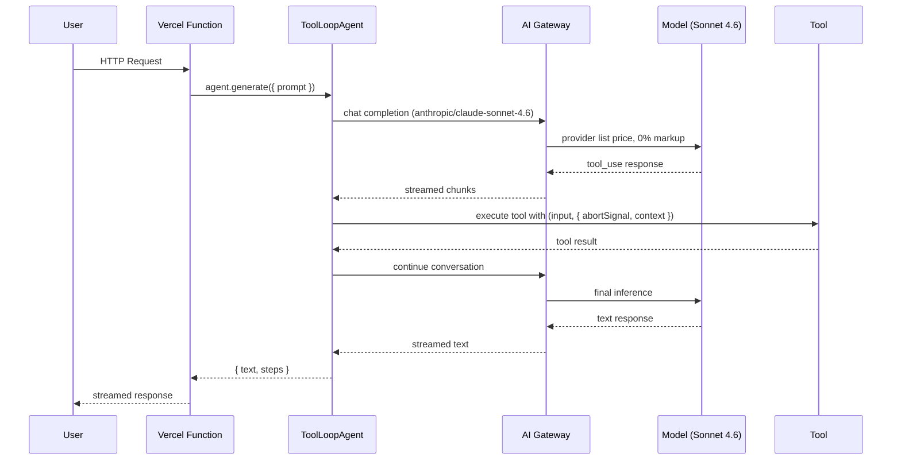
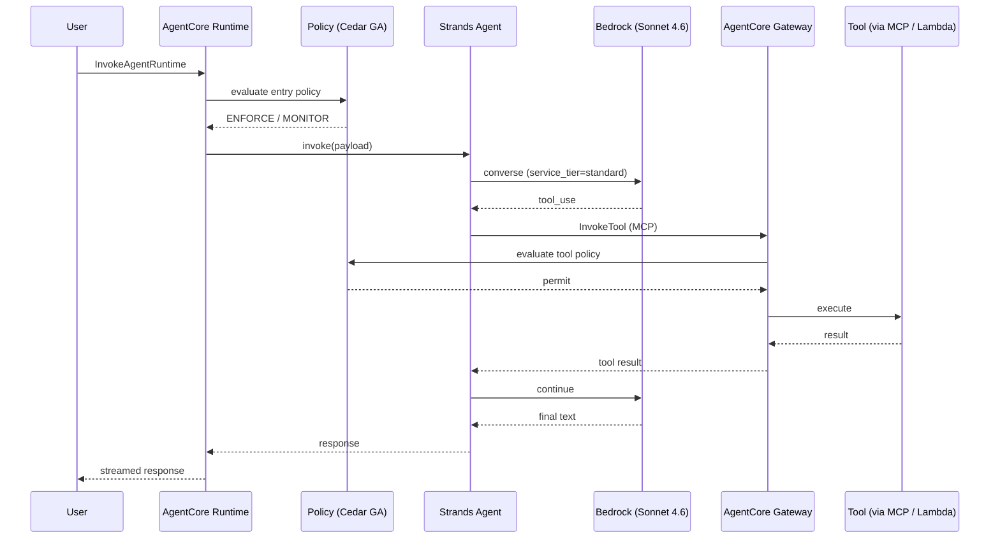
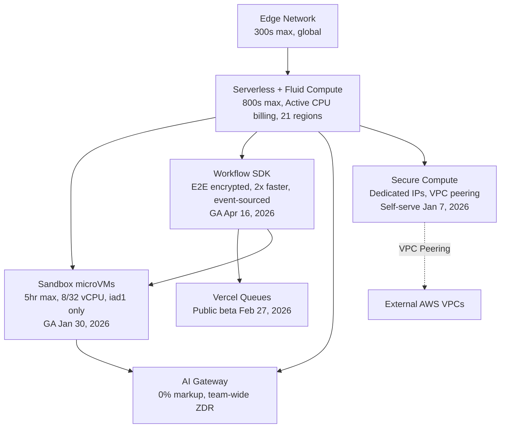
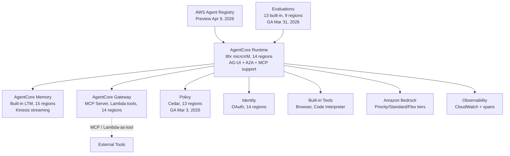
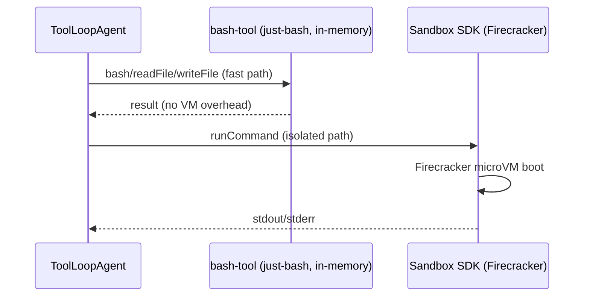
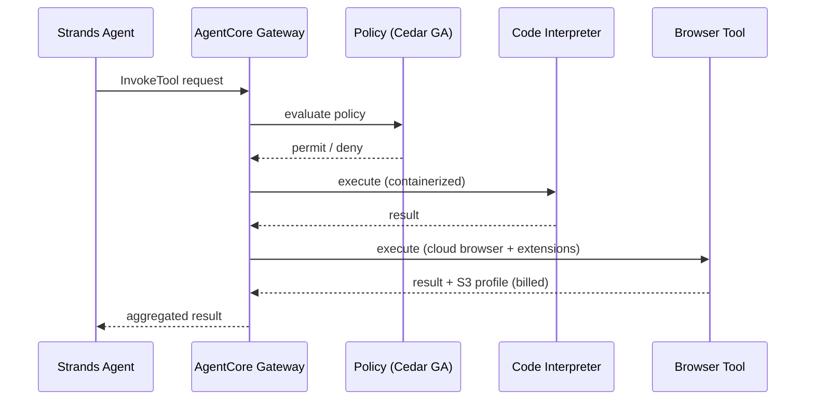

# Vercel Agent Stack vs AWS Agent Stack: Technical Evaluation Report

## 1. Metadata & 2026 Delta

| Field | Value |
|-------|-------|
| **Last Updated** | 2026-04-21T00:00:00Z |
| **Model** | Claude Opus 4.7 |
| **Report Path** | `generated-reports/vercel-aws/2026/04/2026-04-21-Agent-Comparison-Report-Claude-Opus-4.7.md` |
| **Methodology** | "Blessed Path" — Officially recommended, out-of-the-box developer experience |
| **Previous Version** | [2026-01-08 (Claude Opus 4.5)](../../2026/01/2026-01-08-Agent-Comparison-Report-Claude-Opus-4.5.md) |
| **Coverage Window** | 2026-01-08 → 2026-04-21 (≈3.5 months) |

### Executive Delta: January → April 2026

Both platforms advanced substantially in the first 3.5 months of 2026. This is not a cosmetic refresh — multiple previously-preview components graduated to GA, SDK versions advanced by dozens of releases, and a new frontier Anthropic model (Claude Opus 4.7) launched five days before this report was generated.

| Platform | Previous (Jan 8) | Current (Apr 21) | Nature of Change |
|----------|-----------------|------------------|------------------|
| **Vercel Sandbox** | Beta | **GA** (Jan 30, 2026) | Platform-level — open-source SDK/CLI released; Enterprise 32 vCPU / 64 GB tier added (Apr 8); Persistent Sandboxes beta (Mar 26) |
| **Vercel Workflow** | Beta | **GA** (Apr 16, 2026) | Platform-level — 100M+ runs processed in beta; E2E encryption by default (Mar 17); 2× speed improvement (Mar 3); event-sourced architecture |
| **AI SDK** | `ai@6.0.23` | `ai@6.0.168` stable + `7.0.0-beta.111` | Version — 145 patch/minor releases on v6; v7 beta active with `WorkflowAgent`, ESM-only, `@ai-sdk/otel` |
| **AI Gateway** | Unified routing, BYOK | + Team-wide ZDR (Apr 8), Custom Reporting API (Mar 25), OpenAI Responses API (Mar 6), 20+ new models | Capability — expanded catalog, new compliance and cost-breakdown features |
| **AgentCore Policy** | Preview | **GA** (Mar 3, 2026) | Status — included in Runtime/Gateway pricing at GA |
| **AgentCore Evaluations** | Preview (4 regions) | **GA** (Mar 31, 2026, 9 regions) | Status + regional — 13 built-in evaluators, Ground Truth, custom Lambda evaluators |
| **AgentCore Runtime** | 11 regions | **14 regions** | Regional — +eu-west-2, eu-west-3, eu-north-1 (Jan 26, 2026 expansion wave); +AG-UI protocol support (Mar 13); +`InvokeAgentRuntimeCommand` API (Mar 17) |
| **AWS Agent Registry** | Did not exist | **Preview** (Apr 9, 2026, 5 regions) | New service — 8th AgentCore service; semantic + keyword search, approval workflows, MCP endpoint |
| **Strands SDK (Python)** | `v1.21.0` | `v1.36.0` | Version — 15 releases; `AgentAsTool`, Plugin system, `BedrockModel(service_tier=...)`, Gemini + SageMaker providers |
| **Strands SDK (TypeScript)** | Preview | `v1.0.0-rc.4` (**still RC**) | Status — feature-complete with Python but not yet GA; includes Swarm, Graph, A2A, and `VercelModel` adapter |
| **bedrock-agentcore** | `v1.1.4` | `v1.6.3` | Version — 22 releases; `EvaluationClient`, `ResourcePolicyClient`, `serve_a2a()`, `serve_ag_ui()` |
| **Claude model lineup** | Opus 4.5, Sonnet 4.5, Haiku 4.5 | + Opus 4.6 (Feb 5), Sonnet 4.6 (Feb 17), **Opus 4.7 (Apr 16)** | Model — new frontier Opus 4.7 with updated tokenizer (1.0–1.35× inflation) and `effort: 'xhigh'`; Sonnet 4.6 is the new default |

### Terminology Correction

The January 2026 report referenced **"AI Units v2026"** as a Vercel billing unit. Research for this refresh confirmed this term does **not exist** as a public Vercel SKU. This report uses the accurate current terminology: **Fast Data Transfer (FDT)** for CDN/edge traffic (regional pricing) and **AI Gateway Credits** for AI Gateway billing (zero-markup pass-through of provider list prices).

---

## 2. Infrastructure Footprint (Hard Facts)

### Two-Layer Architecture Comparison

| Layer | Vercel | AWS |
|-------|--------|-----|
| **Agent Framework** (SDK for building agents) | AI SDK 6.x (`ToolLoopAgent`, tools, streaming) — v7 beta adds `WorkflowAgent` | **Strands Agents SDK** (`Agent`, `Swarm`, `Graph`, `AgentAsTool`, Plugins) |
| **Infrastructure** (Runtime, memory, deployment) | Vercel Platform (Fluid Compute, Sandbox GA, Workflow GA, AI Gateway, Chat SDK) | **BedrockAgentCoreApp** (Runtime, Memory, Gateway, Identity, Policy GA, Evaluations GA, Agent Registry preview) |

> ⚠️ **Key Insight (unchanged):** `bedrock-agentcore-sdk-python` is the infrastructure wrapper, NOT the agent framework. Agent logic uses **Strands SDK**. This mirrors how Vercel's AI SDK handles agent logic while the Vercel platform provides infrastructure.

### Full Capability Matrix — April 2026

| Capability | Vercel Stack | AWS Stack |
|------------|--------------|-----------|
| **Agent Framework** | AI SDK 6.x (`ToolLoopAgent`, `stopWhen`, `dynamicTool`, `prepareStep`) | Strands SDK (`Agent`, `Swarm`, `Graph`, `AgentAsTool`, Plugins) |
| **Model Gateway/Routing** | AI Gateway (unified API, fallbacks, BYOK, **0% markup**, **team-wide ZDR**, 20+ providers, 100+ models) | Amazon Bedrock (foundation models, **Priority / Standard / Flex / Reserved tiers**) |
| **Infrastructure Wrapper** | Vercel Platform (Fluid Compute, Active CPU billing, I/O wait free) | BedrockAgentCoreApp (`@app.entrypoint`, `@app.websocket`, `serve_a2a`, `serve_ag_ui`) |
| **Secure Code Execution** | Sandbox SDK **(GA)** — Firecracker microVMs, Node.js + Python, **8 vCPU Pro / 32 vCPU Enterprise**, Persistent Sandboxes beta | AgentCore Code Interpreter — containerized, Python/JS/TS, up to 5GB files, 8hr max |
| **Durable Workflows** | Workflow SDK **(GA)** — `"use workflow"` directive, **E2E encrypted by default**, 2× faster than beta, Python beta, event-sourced | AgentCore Runtime — 8hr max, session persistence, `InvokeAgentRuntimeCommand` for in-container shell |
| **Browser Automation** | Anthropic Computer Use tools (`computer_20250124`, `webSearch_20250305`) + Kernel (Marketplace) | AgentCore Browser Tool — cloud-based, custom Chrome extensions (Jan 2026), CAPTCHA reduction via Web Bot Auth |
| **Persistent Memory** | External (Redis, databases, BYO) or `WorkflowAgent` state | AgentCore Memory — built-in short-term + long-term, strategies (semantic/summary/preference/episodic), Kinesis streaming notifications, `read_only` flag (v1.6.1) |
| **Tool Management / MCP** | `@ai-sdk/mcp` client — stable HTTP/SSE transports, `Experimental_StdioMCPTransport` | AgentCore Gateway — MCP Server, Lambda-as-tool transform, **server-side tool execution** via Bedrock Responses API (Feb 24, 2026) |
| **Protocol Support** | MCP | MCP + A2A + **AG-UI** (all three open protocols supported in Runtime) |
| **Authorization** | Environment variables, middleware, custom | AgentCore Policy **(GA)** — Cedar-based, IAM integration, ENFORCE/MONITOR modes, 13 regions; `ResourcePolicyClient` for resource-based policies |
| **Identity / OAuth** | NextAuth / Auth.js, custom | AgentCore Identity — OAuth, API keys, M2M + USER_FEDERATION flows, `custom_parameters` support |
| **Evaluations** | External (bring your own) | AgentCore Evaluations **(GA)** — 13 built-in evaluators, on-demand + online modes, Ground Truth support, custom Lambda evaluators, 9 regions |
| **Agent Discovery** | N/A | **AWS Agent Registry** (preview, Apr 9, 2026) — 8th AgentCore service |
| **Observability** | AI SDK telemetry (OTEL-compatible, stable `@ai-sdk/otel` package in v7), Workflow data in Vercel Observability (Apr 7) | AgentCore Observability + CloudWatch (step visualization, metadata tagging) |
| **Multi-Agent Orchestration** | `ToolLoopAgent` + subagents via `toModelOutput`; `WorkflowAgent` for durable composition | Strands `Swarm` (autonomous handoffs), `Graph` (deterministic DAG w/ conditional edges), `AgentAsTool` (nested composition) |
| **Chat Integration** | **Chat SDK** (Feb 23, 2026) — unified library for Slack, Discord, Teams, WhatsApp, Telegram | Reference architecture (Strands + Gateway + Memory) for Slack (Mar 23, 2026) |
| **Coding-Agent Integration** | Vercel Plugin for coding agents (Mar 17, 2026) — Claude Code / Cursor / Codex native | N/A (third-party) |

### Deep-Dive: Runtime Persistence

| Aspect | Vercel Stack | AWS Stack |
|--------|--------------|-----------|
| **Max Execution Window** | Edge: 300s (5 min); Serverless + Fluid Compute: 800s (13.3 min); Sandbox: 5 hours (Pro/Enterprise) | AgentCore Runtime: 28,800s (8 hours) |
| **Idle Timeout** | N/A (stateless by default) | Configurable: 60–28,800s (default: 900s / 15 min) |
| **Durability Mechanism** | Workflow SDK (**GA**) — `"use workflow"` directive, event-sourced, E2E encrypted | Runtime session persistence with automatic state management |
| **Crash Recovery** | Deterministic replay from immutable event log (event-sourced architecture, Feb 3, 2026) | Session resume after transient failures |
| **Billing Model** | Per-invocation + Active CPU time (I/O wait **free**); Workflow steps at $2.50/100K | Per-second (CPU-hour + GB-hour), no charge during I/O wait |
| **Encryption at Rest** | **Default E2E encryption** (AES-256-GCM, per-run HKDF-SHA256 keys) for all workflow data | Standard AWS KMS / S3 encryption |

### Deep-Dive: Code Execution

| Aspect | Vercel Sandbox SDK (GA) | AWS AgentCore Code Interpreter |
|--------|-------------------------|-------------------------------|
| **Isolation** | microVM (Firecracker-based) | Containerized sandbox |
| **Languages** | Node.js 22, Python 3.13 | Python, JavaScript, TypeScript |
| **Max vCPUs** | **8 vCPUs (Pro) / 32 vCPUs (Enterprise, Apr 8)** | Configurable per instance |
| **Max Memory** | 2 GB per vCPU (Pro: 16 GB max / Enterprise: 64 GB max) | Configurable |
| **Max Runtime** | 5 min (Hobby), 5 hours (Pro/Enterprise) | 8 hours |
| **Max File Size** | Via filesystem | 5 GB (S3 upload) |
| **Filesystem Snapshots** | **GA (Jan 22, 2026)** — save/restore entire sandbox state, 30-day default expiry | N/A |
| **Persistent Mode** | **Beta (Mar 26, 2026)** — auto-save on stop, auto-resume | Session resume |
| **CLI Integration** | `vercel sandbox` commands (Apr 8, 2026) | AWS CLI / CDK |
| **Concurrency** | 10 (Hobby), 2,000 (Pro/Enterprise) | Regional limits apply |
| **Regional Availability** | **`iad1` only** (unchanged since beta) | 14 regions |

### Deep-Dive: Security Primitives

| Aspect | Vercel | AWS |
|--------|--------|-----|
| **Network Isolation** | Secure Compute — dedicated IPs, VPC peering (max 50 connections); **self-serve since Jan 7, 2026** | VPC with private subnets, PrivateLink, Transit Gateway |
| **Policy Language** | Application-layer (middleware + env vars) | **Cedar (GA)** — open-source, AWS-developed |
| **Policy Enforcement** | Application-level | Gateway-level intercept before tool execution |
| **IAM Integration** | N/A | Full IAM + Cedar hybrid |
| **Enforcement Modes** | N/A | `ENFORCE` (block) or `MONITOR` (log only) |
| **Zero Data Retention** | **AI Gateway team-wide ZDR (Apr 8, 2026)** — single toggle routes all team requests through ZDR-compliant providers | Via private endpoints + model provider terms |
| **Data Classification** | Per-provider ZDR flags + `disallowPromptTraining` controls | AWS Config + Bedrock Guardrails |

### Deep-Dive: Protocol Support

| Protocol | Vercel | AWS |
|----------|--------|-----|
| **MCP (Model Context Protocol)** | Client (`@ai-sdk/mcp`, stable HTTP/SSE transports; `Experimental_StdioMCPTransport` for local) | **Server** (Gateway-based, production; server-side tool execution via Bedrock Responses API Feb 24, 2026) |
| **A2A (Agent-to-Agent)** | Not natively supported | **GA via `serve_a2a()`** in bedrock-agentcore v1.4.7 (pip install `bedrock-agentcore[a2a]`) |
| **AG-UI (Agent-User Interaction)** | Not natively supported | **GA in AgentCore Runtime (Mar 13, 2026)** — `serve_ag_ui()` + `AGUIApp`; first managed runtime with first-class AG-UI support |
| **REST/HTTP** | Native | Native via Gateway |
| **Lambda Integration** | N/A | Native (Gateway transforms Lambda → tools) |

### Bedrock Service Tiers (new since Jan baseline)

Starting with Claude Sonnet 4.5 and all newer models, Bedrock offers four inference tiers accessible via Strands' new `BedrockModel(service_tier=...)` parameter (added in v1.35.0, Apr 8, 2026):

| Tier | Multiplier vs. Standard | Use Case |
|------|-------------------------|----------|
| **Priority** | +75% premium | Latency-sensitive user-facing agents |
| **Standard** | Baseline | Default — balanced latency / cost |
| **Flex** | −50% discount | Agentic batch workflows, background tasks |
| **Reserved** | Commitment-based | Predictable long-running workloads |

```python
# Strands v1.35.0+ syntax
from strands.models import BedrockModel

model = BedrockModel(
    model_id="us.anthropic.claude-sonnet-4-6",
    service_tier="flex",  # 50% off for batch agent work
)
```

### Bedrock Routing Modes

Three routing modes for Claude 4.5+ models on Bedrock:

- **In-Region:** Strict single-region routing (e.g., `anthropic.claude-opus-4-7`)
- **Geo:** Cross-region within US / EU / JP / AU / APAC (e.g., `us.anthropic.claude-opus-4-7`)
- **Global:** Any commercial region worldwide (e.g., `global.anthropic.claude-opus-4-7`)

Geo and Global carry **no surcharge** over in-region rates.

---

## 2b. Regional Availability Matrix

> ⚠️ **Production Consideration:** Not all AgentCore features are available in all regions. This affects architecture decisions, especially for regulated industries with data residency requirements.

### AWS AgentCore Regional Availability (April 2026)

| Feature | Regions Available | Delta vs. Jan 8 |
|---------|-------------------|-----------------|
| **AWS Agent Registry** | **5 regions** — us-east-1, us-west-2, eu-west-1, ap-southeast-2, ap-northeast-1 | 🆕 **New service (Apr 9, 2026)** |
| **AgentCore Evaluations** | **9 regions** — us-east-1, us-east-2, us-west-2, eu-central-1, eu-west-1, ap-south-1, ap-southeast-1, ap-southeast-2, ap-northeast-1 | 🟢 **+5 regions** (was 4 in preview); **GA since Mar 31, 2026** |
| **Policy in AgentCore** | **13 regions** — all 14 Runtime regions except ca-central-1 | 🟢 **+2 regions** (was 11 in preview); **GA since Mar 3, 2026** |
| AgentCore Runtime | **14 regions** — all except sa-east-1 | 🟢 **+3 regions** (was 11) via Jan 26 expansion wave (+ eu-west-2, eu-west-3, eu-north-1) |
| AgentCore Built-in Tools | **14 regions** | 🟢 +3 regions (matches Runtime) |
| AgentCore Observability | **14 regions** | 🟢 +3 regions (matches Runtime) |
| AgentCore Gateway | **14 regions** — all except sa-east-1 | ✅ Unchanged |
| AgentCore Identity | **14 regions** — all except sa-east-1 | ✅ Unchanged |
| AgentCore Memory | **15 regions** — broadest availability (includes sa-east-1) | ✅ Unchanged |

**Source:** [AgentCore Supported Regions](https://docs.aws.amazon.com/bedrock-agentcore/latest/devguide/agentcore-regions.html)

### Vercel Regional Availability (April 2026)

| Feature | Availability | Delta vs. Jan 8 |
|---------|--------------|-----------------|
| AI SDK 6.x | Global (Edge + Serverless) | ✅ Unchanged — runs anywhere Vercel deploys |
| AI Gateway | Global | ✅ Unchanged; + team-wide ZDR (Apr 8) |
| Fluid Compute | **21 compute regions** | 🟢 **+Montréal (`yul1`)** as 21st region (Jan 20, 2026) |
| Sandbox SDK | **`iad1` only** (Washington, D.C.) | ⚠️ **GA since Jan 30 but still single-region** — community requests for Tokyo (hnd1) acknowledged but not shipped |
| Workflow SDK | **Execution global, state `iad1` only** | ⚠️ **Clarification vs. Jan baseline** — function execution is global (Vercel Functions run anywhere), but the persistence/queue backend is `iad1`-only; multi-region backend on roadmap |
| Chat SDK | Global | 🆕 **New (Feb 23, 2026)** |

**Sources:**
- Sandbox: [Vercel Sandbox Supported Regions](https://vercel.com/docs/vercel-sandbox/pricing) — *"Currently, Vercel Sandbox is only available in the `iad1` region."*
- Workflow: [useworkflow.dev/worlds/vercel](https://useworkflow.dev/worlds/vercel) — *"Single-region deployment: The backend infrastructure is currently deployed only in `iad1`."*

### Regional Comparison Analysis

| Question | Vercel | AWS |
|----------|--------|-----|
| **Full agent stack in single region?** | Only `iad1` (Sandbox + Workflow backend limitation) | **14 regions** for Runtime + Tools + Observability + Memory + Gateway + Identity |
| **Full agent stack including governance?** | Only `iad1` | **13 regions** adding Policy (GA) |
| **Full agent stack including quality?** | Only `iad1` | **9 regions** adding Evaluations (GA) |
| **Evaluations availability?** | N/A (no built-in evaluation service) | **9 regions** (2.25× expansion since Jan) |
| **Edge latency advantage?** | Yes for stateless inference — AI Gateway is edge-optimized globally | No — Bedrock is region-bound |
| **Stateful agent latency?** | Degraded outside `iad1` — Workflow/Sandbox state routes to `iad1` | Native regional state in 14 regions |
| **Multi-region failover?** | Secure Compute: Active/Passive network failover | Multi-AZ, cross-region replication, global CRIS on Claude 4.5+ |

**Implication:** The January 2026 report's framing that "Vercel is more global" for stateful agent workloads is **narrower than it appeared**. Vercel's global edge is true for AI Gateway and Fluid Compute inference, but stateful primitives (Sandbox, Workflow persistence) remain `iad1`-centric. AWS's AgentCore surface, meanwhile, has expanded meaningfully — 14 regions for core agent infrastructure, 9 for Evaluations, 13 for Policy.

---

## 3. 2026 Unit Economics

### Model Layer Costs

#### Vercel AI Gateway

- **Markup: 0%** (confirmed in docs — provider list price passes through)
- **BYOK vs. managed credentials:** Same per-token cost; difference is billing path only
- **Free tier:** $5/month credit included
- **Team-wide ZDR (Apr 8, 2026):** No additional charge
- **Top models by usage (Apr 7, 2026):** Gemini 3 Flash (30.1%), Claude Opus 4.6 (16.3%), Grok 4.1 Fast (8.4%), Claude Sonnet 4.6 (7.7%), GPT-5.4 Mini (3.8%)

#### Amazon Bedrock

Four pricing tiers + four service tiers:

**Pricing tiers:**
- **On-Demand:** Pay per token, no commitment
- **Provisioned Throughput:** Reserved capacity with commitment discounts
- **Batch Mode:** 50% discount for async processing
- **Prompt Caching:** Up to 90% cost reduction (5-minute or 1-hour TTL)

**Service tiers (accessible via Strands `BedrockModel(service_tier=...)`):**
- **Priority:** +75% premium for latency-sensitive workloads
- **Standard:** Baseline
- **Flex:** −50% discount for batch agent work
- **Reserved:** Commitment-based pricing

### Claude Model Pricing — April 2026

| Model | Input ($/MTok) | Output ($/MTok) | Cache Write 5m | Cache Write 1h | Cache Read | Notes |
|-------|---------------|-----------------|----------------|----------------|------------|-------|
| **Claude Opus 4.7** ⭐ (Apr 16, 2026) | $5.00 | $25.00 | $6.25 | $10.00 | $0.50 | ⚠️ New tokenizer: **1.0–1.35× inflation** vs 4.6; adds `effort: 'xhigh'`; adaptive thinking |
| Claude Opus 4.6 (Feb 5, 2026) | $5.00 | $25.00 | $6.25 | $10.00 | $0.50 | 1M-token context; adaptive thinking |
| Claude Opus 4.5 (Nov 2025) | $5.00 | $25.00 | $6.25 | $10.00 | $0.50 | — |
| **Claude Sonnet 4.6** ⭐ (Feb 17, 2026) | $3.00 | $15.00 | $3.75 | $6.00 | $0.30 | **Current recommended default**; OSWorld-Verified: 72.5%, SWE-bench Verified: 79.6% |
| Claude Sonnet 4.5 (Sep 2025) | $3.00 | $15.00 | $3.75 | — | $0.30 | Baseline from Jan 8 — unchanged |
| Claude Haiku 4.5 (Sep 2025) | $1.00 | $5.00 | $1.25 | — | $0.10 | Batch: $0.50 / $2.50 |

> **Opus 4.7 Tokenizer Warning:** Claude Opus 4.7's updated tokenizer produces 1.0–1.35× more tokens for the same input vs. Opus 4.6. Per-token rate is unchanged at $5/$25 per MTok, but effective cost may be 0–35% higher for equivalent prompts. Cost calculators should model this inflation explicitly.

**Sources:**
- [Claude Opus 4.7 Launch Blog](https://aws.amazon.com/blogs/aws/introducing-anthropics-claude-opus-4-7-model-in-amazon-bedrock/)
- [Claude Opus 4.5 Launch Blog](https://aws.amazon.com/blogs/machine-learning/claude-opus-4-5-now-in-amazon-bedrock/)
- [Anthropic Pricing Docs](https://platform.claude.com/docs/en/docs/about-claude/pricing)

### Agent Execution Cost: 1,000 Agent Turns

**Workload assumptions (per turn):**
- Input tokens: 1,000
- Output tokens: 500
- Active CPU: 1 second
- Memory: 1–2 GB
- Network: ~1 GB total (for 1,000 turns)

#### Vercel Stack Costs (Claude Sonnet 4.6)

| Component | Calculation | Cost |
|-----------|-------------|------|
| Model (Sonnet 4.6 via AI Gateway, 0% markup) | 1M input × $3 + 0.5M output × $15 | **$10.50** |
| Sandbox SDK — Active CPU (if used) | 1,000 turns × 1s × $0.128/hr | $0.036 |
| Sandbox SDK — Memory | 2 GB × (1,000s / 3,600) × $0.0212/GB-hr | $0.012 |
| Sandbox SDK — Creations | 1,000 × $0.60/1M | $0.0006 |
| Network (1 GB) | 1 GB × $0.15 | $0.15 |
| **Workflow Steps (if orchestrated)** | 10 steps/turn × 1,000 turns × $2.50/100K | $0.25 |
| Fluid Compute (Active CPU, alt to Sandbox) | 1,000 turns × 1s × $0.128/hr | $0.036 |
| **Total (Sandbox path)** | | **≈ $10.70** |
| **Total (Fluid Compute path)** | | **≈ $10.69** |

#### AWS Stack Costs (Claude Sonnet 4.6)

| Component | Calculation | Cost |
|-----------|-------------|------|
| Model (Sonnet 4.6 on Bedrock) | 1M input × $3 + 0.5M output × $15 | **$10.50** |
| AgentCore Runtime — CPU | 1,000 turns × 1s × $0.0895/hr | $0.025 |
| AgentCore Runtime — Memory | 2 GB × (1,000s / 3,600) × $0.00945/GB-hr | $0.0053 |
| Gateway — Invocations | 2,000 tool calls × $0.005/1K | $0.01 |
| Memory — Short-term events | 1,000 new events × $0.25/1K | $0.25 |
| Memory — Long-term (if used) | 100 records/day × 30 days × $0.75/1K | $2.25/month |
| **Total (per 1,000 turns, no LTM)** | | **≈ $10.79** |
| **Total (with Bedrock Regional Endpoint +10%)** | Model cost × 1.1 | **≈ $11.84** |
| **Total (with Flex tier −50%)** | Model cost × 0.5 | **≈ $5.54** |

### Cost Comparison Summary

| Stack | Total (1,000 turns, Sonnet 4.6) | Model % | Infrastructure % |
|-------|--------------------------------|---------|------------------|
| Vercel (Sandbox path) | $10.70 | 98.1% | 1.9% |
| Vercel (Fluid Compute) | $10.69 | 98.2% | 1.8% |
| AWS (Standard tier) | $10.79 | 97.3% | 2.7% |
| AWS (Flex tier, batch) | $5.54 | 94.8% | 5.2% |
| AWS (Priority tier, +75%) | $19.17 | 98.5% | 1.5% |

> **Key insight:** Infrastructure costs remain a small fraction of total TCO (< 5%), but Bedrock's new service tiers give AWS a meaningful cost lever for batch workloads (−50%) and a latency lever for user-facing workloads (+75%). Vercel's AI Gateway's 0% markup means no gateway fee is paid on top of provider pricing.

### The "Effort" Tax: Anthropic Extended Thinking

Anthropic's `effort` parameter (originally beta) is **GA on Bedrock** via the `anthropic_beta: ["effort-2025-11-24"]` header. Levels have expanded since the January baseline:

| Level | Token Impact | Cost Impact (baseline: high) | Available On |
|-------|-------------|------------------------------|--------------|
| `low` | ~30–50% of high | Lowest | All Claude 4.5+ |
| `medium` | ~60–70% of high | Moderate | All Claude 4.5+ |
| `high` | Baseline | Baseline | All Claude 4.5+ |
| **`xhigh`** ⭐ | Fills gap between high and max | 1.5–2× high | **Opus 4.7 only** (Apr 16, 2026) |
| `max` | Highest | 2–3× total cost | Opus series |

**Opus 4.7 specifically** uses **adaptive thinking** — `budget_tokens` is no longer used; the model dynamically adjusts reasoning depth based on task complexity.

### Security/Network Cost Comparison

| Scenario | Vercel Secure Compute | AWS (NAT Gateway + PrivateLink, 3 AZ) |
|----------|----------------------|---------------------------------------|
| **Annual base cost** | $6,500 | ~$1,446 (NAT: $1,183 + PrivateLink: $263) |
| **Data (100 GB/mo × 12)** | $180 ($0.15/GB) | $66 ($0.055/GB combined) |
| **Total annual (100 GB/mo)** | **$6,680** | **~$1,512** |
| **Total annual (1 TB/mo)** | **$8,300** | **~$2,106** |

> ⚠️ **Trade-off (unchanged):** AWS is 3–4× cheaper but requires VPC configuration, IAM policies, and operational overhead. Vercel Secure Compute is a managed solution with simpler setup — and is now **self-serve** from the dashboard (Jan 7, 2026) rather than requiring sales engagement.

**Pricing unchanged since Jan 8 baseline:** All AWS network rates (NAT $0.045/hr + $0.045/GB; PrivateLink $0.01/hr per ENI + $0.01/GB; cross-region transfer $0.02/GB) and Secure Compute ($6.5K/year + $0.15/GB) are unchanged.

### New Cost Line: AgentCore Browser Profile Storage

**Effective April 15, 2026** — AgentCore Browser Profile artifacts (cookies, local storage) stored in S3 are billed at **standard S3 Standard rates**. This was free during ramp-up and is a new cost line that did not exist at the January baseline. Agents using persistent browser profiles should budget for this as a small but non-zero line item.

---

## 4. Agent Stack Deep-Dive

### Vercel Agent Stack

#### 4.1 AI SDK 6.x — ToolLoopAgent (current: `ai@6.0.168`)

The canonical Vercel agent abstraction for April 2026:

```typescript
import { ToolLoopAgent, tool, isStepCount } from 'ai';
import { z } from 'zod';

// Define a tool with v6 API (inputSchema, not parameters)
const weatherTool = tool({
  description: 'Get the weather in a location',
  inputSchema: z.object({
    location: z.string().describe('City name'),
  }),
  execute: async ({ location }, { abortSignal, messages, context }) => ({
    location,
    temperature: 72,
    unit: 'fahrenheit',
  }),
});

// Create agent — uses AI Gateway via string shorthand, no provider import needed
const agent = new ToolLoopAgent({
  model: 'anthropic/claude-sonnet-4.6',
  instructions: 'You are a helpful weather assistant.',
  tools: { weather: weatherTool },
  stopWhen: isStepCount(20),
  // New in v6 since 6.0.23:
  prepareStep: async ({ stepNumber, messages }) => ({
    activeTools: stepNumber > 5 ? [] : undefined,
  }),
});

// Non-streaming
const result = await agent.generate({ prompt: 'Weather in SF?' });

// Streaming
for await (const chunk of agent.stream({ prompt: 'Weather in SF?' }).textStream) {
  process.stdout.write(chunk);
}
```

**Key additions since 6.0.23:**

- **`prepareStep` option** — Per-step model/tool overrides
- **`callOptionsSchema` + `prepareCall`** — Typed call-time context injection
- **`dynamicTool()`** — Runtime-typed tools for MCP/external sources
- **`toModelOutput` on tools** — Control what parent agent sees from subagent output
- **`InferAgentUIMessage<typeof agent>`** — Type utility for typed chat UI
- **`isLoopFinished()`** — New third built-in stop condition (no step limit)
- **`readUIMessageStream()`** — Consume UI message streams in subagents
- **`webSearch_20250305` tool** — Anthropic-native web search

**Stop conditions (three built-ins + custom):**

```typescript
import { isStepCount, hasToolCall, isLoopFinished } from 'ai';

stopWhen: isStepCount(50)                              // step limit
stopWhen: hasToolCall('finalAnswer')                   // sentinel tool pattern
stopWhen: hasToolCall('submit', 'abort')               // any of these
stopWhen: isLoopFinished()                             // no limit
stopWhen: [isStepCount(20), hasToolCall('done')]       // OR logic
stopWhen: ({ steps }) => steps.at(-1)?.text?.includes('COMPLETE') // custom
```

**Source:** [AI SDK Agents Docs](https://github.com/vercel/ai/blob/main/content/docs/03-agents/02-building-agents.mdx)

#### 4.2 AI SDK v7 — Active Beta

AI SDK v7 is in active beta at `7.0.0-beta.111` (Apr 17, 2026). Not production-ready; no migration guide yet. Breaking changes:

- **ESM-only packages** (CommonJS removed)
- **`WorkflowAgent`** primitive in `@ai-sdk/workflow` — durable/resumable agents for Vercel Workflows
- **`@ai-sdk/otel`** — Dedicated OpenTelemetry package; `experimental_telemetry` promoted to stable
- **`toolNeedsApproval`** — Human-in-the-loop tool approval
- **`uploadFile` / `uploadSkill`** — Provider abstractions for file/skill uploads
- **`runtimeContext`** rename (from `context`)

```typescript
// v7 WorkflowAgent pattern (beta)
import { WorkflowAgent } from '@ai-sdk/workflow';

// Durable, resumable — survives workflow step boundaries
// Handles tool schema serialization + built-in approval flows
```

#### 4.3 Vercel Sandbox SDK — Secure Code Execution (**GA Jan 30, 2026**)

```typescript
import { Sandbox } from '@vercel/sandbox';

const sandbox = await Sandbox.create({ runtime: 'node22' });
const result = await sandbox.runCommand('node', ['-e', 'console.log("hello")']);
console.log(result.stdout);
await sandbox.close();
```

```python
# Python SDK
from vercel.sandbox import Sandbox

with Sandbox.create(runtime="python3.13") as sandbox:
    command = sandbox.run_command("python", ["-c", "print('hello world')"])
    print(command.stdout())
```

**Key Facts (April 2026):**

| Attribute | Value |
|-----------|-------|
| Isolation | Firecracker microVM |
| Languages | Node.js 22, Python 3.13 |
| Max vCPUs | **8 (Pro) / 32 (Enterprise, Apr 8, 2026)** |
| Memory per vCPU | 2 GB (Pro: 16 GB / Enterprise: 64 GB max) |
| Max Duration | 5 min (Hobby), 5 hours (Pro/Enterprise) |
| Regional Availability | **`iad1` only** (persistent limitation) |
| Filesystem Snapshots | **GA (Jan 22, 2026)** — 30-day default expiry |
| Persistent Sandboxes | **Beta (Mar 26, 2026)** — auto-save on stop, auto-resume |
| CLI | `vercel sandbox` commands (Apr 8, 2026) |
| SDK | Open-source (released at GA) |

**Pricing:**

| Component | Hobby (included) | Pro/Enterprise Rate |
|-----------|-----------------|---------------------|
| Active CPU | 5 hours/month | $0.128/hour |
| Provisioned Memory | 420 GB-hours/month | $0.0212/GB-hour |
| Creations | 5,000/month | $0.60/1,000,000 |
| Data Transfer | 20 GB/month | $0.15/GB |
| Storage | 15 GB lifetime | $0.08/GB-month |

**Source:** [Vercel Sandbox GA Blog](https://vercel.com/blog/vercel-sandbox-is-now-generally-available)

#### 4.4 bash-tool — Filesystem Context Retrieval (open-sourced Jan 7, 2026)

```typescript
import { createBashTool } from "bash-tool";

// In-memory filesystem (zero VM overhead)
const { tools } = await createBashTool({
  files: { "src/index.ts": "export const hello = 'world';" },
});

// Or with Vercel Sandbox for full VM isolation
import { Sandbox } from "@vercel/sandbox";
const sandbox = await Sandbox.create();
const { tools: vmTools } = await createBashTool({ sandbox });

// Skills support (Jan 21, 2026)
import { experimental_createSkillTool } from "bash-tool";
const { tools: skillsTools } = await experimental_createSkillTool({
  skillsDirectory: "./skills",
});
```

**Key Features:**
- `just-bash` TypeScript interpreter — pure TS, no shell process
- Provides `bash`, `readFile`, `writeFile` tools
- Works in-memory (zero overhead) or with Sandbox VM (full isolation)
- Token-efficient context retrieval via `find`, `grep`, `jq`, pipes
- **Skills support (Jan 21, 2026)** — `experimental_createSkillTool` lets agents load skills from a directory

#### 4.5 Workflow SDK — Durable Workflows (**GA Apr 16, 2026**)

```typescript
export async function processOrder(orderId: string) {
  "use workflow";  // Magic directive

  const order = await validateOrder(orderId);
  const payment = await processPayment(order);
  const fulfillment = await shipOrder(order);
  return fulfillment;
}
```

**Key Facts (April 2026):**

| Attribute | Value |
|-----------|-------|
| Status | **GA (Apr 16, 2026)** |
| Beta stats | 100M+ runs, 500M+ steps, 1,500+ customers, 200K+ weekly npm downloads |
| Encryption | **AES-256-GCM + HKDF-SHA256 per-run keys, default since Mar 17, 2026** |
| Architecture | Event-sourced (immutable event log) since Feb 3, 2026 (Beta 4.1) |
| Performance | **2× faster** than pre-Mar 3 (step execution speed) |
| Languages | TypeScript (GA), Python (beta) |
| Custom serialization | Yes (Apr 2, 2026) — typed domain objects across step boundaries |
| Logs filtering | Integrated into Vercel Logs by Run ID / Step ID (Apr 14, 2026) |
| Observability | Queryable in Vercel Observability (Apr 7, 2026) |
| Pricing | **$2.50 per 100,000 steps + $0.00069/GB-hour storage** |
| Queue layer | Vercel Queues (public beta Feb 27, 2026) — 7-day TTL, 1M req/min Pro |
| Regional | Execution global; state/queue `iad1`-only (roadmap item) |

**Source:** [Vercel Workflow GA Blog](https://vercel.com/blog/a-new-programming-model-for-durable-execution)

#### 4.6 Anthropic Computer Use Tools (via AI SDK)

```typescript
import { anthropic } from '@ai-sdk/anthropic';

const bashTool = anthropic.tools.bash_20250124({
  execute: async ({ command }) => execSync(command).toString(),
});

const computerTool = anthropic.tools.computer_20250124({ ... });
const textEditorTool = anthropic.tools.textEditor_20250124({ ... });

// New since Jan baseline:
const webSearchTool = anthropic.tools.webSearch_20250305({
  maxUses: 3,
  allowedDomains: ['techcrunch.com'],
  userLocation: { type: 'approximate', country: 'US', city: 'San Francisco' },
});
```

**Available Tools:**
- `bash_20250124` — Shell command execution (requires Sandbox or local shell)
- `computer_20250124` — Screen interaction (screenshots, clicks, typing)
- `textEditor_20250124` — File read/write operations
- **`webSearch_20250305`** — Anthropic-native web search (requires Claude 3.7+)

#### 4.7 Chat SDK — Unified Multi-Platform Chat Bots (Feb 23, 2026)

```typescript
// npm i chat
import { Chat } from 'chat';

const chat = new Chat();
// Deploy to Slack, Discord, Teams, WhatsApp, Telegram, Google Chat, GitHub, Linear
// ... from a single codebase
```

### AWS Agent Stack (Strands + AgentCore)

#### 4.8 Strands SDK — Agent Framework (Python `v1.36.0`; TypeScript `v1.0.0-rc.4`)

**Canonical Python example (April 2026):**

```python
from strands import Agent, tool
from strands.models import BedrockModel

@tool
def get_weather(city: str) -> str:
    """Get weather for a city.

    Args:
        city: The city name.
    """
    return f"Weather in {city}: 72°F, Sunny"

# Agent with Bedrock service tier (v1.35.0+)
agent = Agent(
    model=BedrockModel(
        model_id="us.anthropic.claude-sonnet-4-6",
        service_tier="standard",  # "priority" | "standard" | "flex"
        streaming=True,
    ),
    tools=[get_weather],
    system_prompt="You are a helpful weather assistant.",
)

# Sync
result = agent("What's the weather in Seattle?")
print(result.message)

# Async + streaming
async for event in agent.stream_async("Tell me about Paris weather"):
    if "data" in event:
        print(event["data"], end="", flush=True)
```

**Notable additions since v1.21.0 (Jan baseline):**

| Version | Date | Addition |
|---------|------|----------|
| v1.22.0 | 2026-01-13 | MCP resource operations; Bedrock Guardrails `guardrail_latest_message` |
| v1.23.0 | 2026-01-21 | Configurable `ModelRetryStrategy`; Model Response Steering |
| v1.24.0 | 2026-01-29 | Automatic Bedrock prompt caching; `ToolProvider` out of experimental |
| v1.25.0 | 2026-02-05 | **`A2AAgent`** — first-class A2A client |
| v1.27.0 | 2026-02-25 | `concurrent_invocation_mode`; `add_hook()` |
| v1.28.0 | 2026-03-04 | **Plugin system** (`Plugin` ABC) |
| v1.30.0 | 2026-03-19 | **Agent Skills as a plugin**; Steering moved to production |
| v1.33.0 | 2026-03-24 | ⚠️ Security: Hard-pinned `litellm<=1.82.6` (supply-chain mitigation) |
| v1.34.0 | 2026-03-31 | **`AgentAsTool`** — pass `Agent` instances directly in `tools=[]` |
| v1.35.0 | 2026-04-08 | **Bedrock service tier support** (`service_tier` on `BedrockModel`) |
| v1.36.0 | 2026-04-17 | Agent snapshot API (`take_snapshot()` / `load_snapshot()`); callable hooks |

**Multi-agent orchestration (both Python GA):**

```python
# Swarm — autonomous handoffs
from strands.multiagent import Swarm

swarm = Swarm(
    nodes=[researcher, writer, reviewer],
    entry_point=researcher,
    max_handoffs=10,
    max_iterations=20,
    execution_timeout=300.0,
)
result = swarm("Write a blog post about AI agents")

# Graph — deterministic DAG with conditional edges
from strands.multiagent import GraphBuilder, GraphState

builder = GraphBuilder()
builder.add_node(processor, "processor")
builder.add_node(analyzer, "analyzer")
builder.add_edge("processor", "analyzer")

def should_analyze(state: GraphState) -> bool:
    return "numeric" in str(state.results.get("processor", {}))

builder.add_edge("processor", "analyzer", condition=should_analyze)
graph = builder.build()
result = graph("Analyze Q4 sales data")

# AgentAsTool — nested composition (v1.34.0)
orchestrator = Agent(
    tools=[researcher, writer],  # Agent instances auto-wrapped
    system_prompt="Coordinate specialists.",
)
```

**Strands TypeScript SDK status:** `v1.0.0-rc.4` — **still Release Candidate, not GA** as of April 21, 2026. The December 2025 preview announcement implied imminent GA; this has not materialized. Feature-complete with Python (Swarm, Graph, MCP, A2A, Plugins, session management), plus a notable new `VercelModel` adapter (rc.2) implementing Vercel's Language Model Spec v3 — allowing Strands agents to use any Vercel AI SDK provider.

#### 4.9 BedrockAgentCoreApp — Infrastructure Wrapper (`v1.6.3`)

```python
from bedrock_agentcore.runtime import BedrockAgentCoreApp
from bedrock_agentcore.memory import MemoryClient
from bedrock_agentcore.memory.integrations.strands import AgentCoreMemorySessionManager
from strands import Agent
from strands.models import BedrockModel

# Optional managed memory (v1.6.1 adds read_only flag)
session_mgr = AgentCoreMemorySessionManager(
    memory_id="mem-abc123",
    actor_id="user-xyz",
    region_name="us-east-1",
    read_only=False,
)

agent = Agent(
    model=BedrockModel(model_id="us.anthropic.claude-sonnet-4-6", streaming=True),
    tools=[],
    session_manager=session_mgr,
)

app = BedrockAgentCoreApp()  # Infrastructure

@app.entrypoint
def invoke(payload):
    result = agent(payload.get("prompt"))
    return {"result": str(result.message)}

if __name__ == "__main__":
    app.run()
```

**Decorators available:**

| Decorator | Purpose |
|-----------|---------|
| `@app.entrypoint` | Main invocation handler (`POST /invocations`) |
| `@app.ping` | Custom health check (`GET /ping`) |
| `@app.websocket` | WebSocket handler |
| `@app.async_task` | Mark async tasks for busy-status tracking |

**New protocol adapters (v1.4.7+):**

```python
# A2A server (pip install bedrock-agentcore[a2a])
from bedrock_agentcore.runtime import serve_a2a
serve_a2a(agent, port=8080)

# AG-UI server (new Mar 13, 2026)
from bedrock_agentcore.runtime import serve_ag_ui, AGUIApp
```

#### 4.10 AgentCore Memory — Strategies

| Strategy | Description | Pricing |
|----------|-------------|---------|
| **Built-in** | Automatic memory processing | $0.75/1,000 records/month |
| **Built-in Override** | Custom prompts, managed extraction | $0.25/1,000 records/month |
| **Self-Managed** | Full control, external integration | $0.25/1,000 records/month + inference |

**Strategy types (added via `add_*_strategy`):**
- `add_semantic_strategy` — Semantic similarity extraction
- `add_summary_strategy` — Conversation summarization
- `add_user_preference_strategy` — Preference extraction
- `add_episodic_strategy` — Episodic memory (added v1.1.5)

**New since Jan:** Memory now pushes **real-time Kinesis notifications** when long-term records are created/modified (Mar 12, 2026), eliminating polling.

#### 4.11 AgentCore Policy — Cedar Authorization (**GA Mar 3, 2026**)

```python
from bedrock_agentcore.services import ResourcePolicyClient

policy_client = ResourcePolicyClient(region="us-east-1")

policy_client.put_resource_policy(
    resource_arn="arn:aws:bedrock-agentcore:us-east-1:123456789:runtime/my-runtime",
    policy={
        "Version": "2012-10-17",
        "Statement": [{
            "Effect": "Allow",
            "Principal": {"AWS": "arn:aws:iam::123456789:role/InvokerRole"},
            "Action": "bedrock-agentcore:InvokeAgentRuntime",
            "Resource": "*"
        }]
    }
)
```

**Cedar policy example (unchanged syntax):**

```
permit(
  principal is AgentCore::OAuthUser,
  action == AgentCore::Action::"RefundTool__process_refund",
  resource == AgentCore::Gateway::"arn:aws:bedrock-agentcore:..."
)
when {
  principal.hasTag("username") &&
  principal.getTag("username") == "John" &&
  context.input.amount < 500
};
```

- **GA since March 3, 2026** in 13 regions
- Natural-language rule authoring auto-converts to Cedar
- Integrated with `ResourcePolicyClient` for resource-based policies
- No separate pricing SKU at GA (included in Runtime/Gateway pricing)

#### 4.12 AgentCore Evaluations (**GA Mar 31, 2026**)

```python
from bedrock_agentcore.evaluation import EvaluationClient

client = EvaluationClient(region_name="us-west-2")

# On-demand session evaluation
results = client.run(
    evaluator_ids=["accuracy", "toxicity"],
    session_id="sess-123",
    agent_id="my-agent",
)
for r in results:
    print(f"{r['evaluatorId']}: {r.get('value')} — {r.get('explanation')}")

# Custom code-based evaluator (v1.6.0)
from bedrock_agentcore.evaluation.custom_code_based_evaluators import custom_code_based_evaluator
from bedrock_agentcore.evaluation.custom_code_based_evaluators.models import EvaluatorInput, EvaluatorOutput

@custom_code_based_evaluator()
def handler(input: EvaluatorInput, context) -> EvaluatorOutput:
    score = 1.0 if "correct" in str(input.session_spans) else 0.0
    return EvaluatorOutput(value=score, label="Pass" if score == 1.0 else "Fail")
```

- **GA since March 31, 2026** in 9 regions (was 4 in preview)
- **13 built-in evaluators** covering response quality, safety, task completion, tool usage
- **Online** (continuous production sampling) + **on-demand** (CI/CD regression) modes
- **Ground Truth** support for session-level goal measurement
- **Custom Lambda evaluators** via `@custom_code_based_evaluator()` (v1.6.0)

**Pricing:**
- Built-in evaluators: $0.0024/1,000 input tokens + $0.012/1,000 output tokens
- Custom evaluators: $1.50/1,000 evaluations + separate model inference

#### 4.13 AgentCore Code Interpreter

| Attribute | Value |
|-----------|-------|
| Isolation | Containerized sandbox |
| Languages | Python, JavaScript, TypeScript |
| Max Duration | 8 hours |
| File Size | 5 GB (S3 upload) |
| Pricing | $0.0895/vCPU-hour + $0.00945/GB-hour (same as Runtime) |
| Regional | 14 regions |

#### 4.14 AgentCore Browser Tool

- Cloud-based headless browser
- **CAPTCHA reduction** via Web Bot Auth
- **Custom Chrome extensions** (Jan 2026) — load from S3
- **S3 profile storage billing** started April 15, 2026 — standard S3 rates
- Pricing: $0.0895/vCPU-hour + $0.00945/GB-hour
- Session duration: 1 hour default, 8 hour maximum

#### 4.15 AWS Agent Registry — New 8th AgentCore Service (**Preview Apr 9, 2026**)

- Centralized catalog for discovering, sharing, and governing agents, tools, MCP servers, and agent skills
- Semantic + keyword search
- Approval workflows
- CloudTrail audit trails
- MCP server endpoint for IDE-based discovery
- 5 regions (preview): us-east-1, us-west-2, eu-west-1, ap-southeast-2, ap-northeast-1

#### 4.16 `InvokeAgentRuntimeCommand` API (Mar 17, 2026)

Lets agents run deterministic shell operations (tests, `git`, package installs) concurrently with LLM reasoning inside the same container and filesystem:

```python
# Conceptual usage — run shell commands inside a running Runtime session
# without custom child-process logic
response = runtime_client.invoke_agent_runtime_command(
    session_id="sess-123",
    command="pytest tests/ -v",
)
```

Meaningful DX improvement for coding agents.

#### 4.17 Spring AI AgentCore SDK — Java GA (Apr 14, 2026)

AgentCore now has GA-quality SDKs for three languages:
- **Python** — `bedrock-agentcore@v1.6.3`
- **TypeScript** — via Strands TS RC (`v1.0.0-rc.4`)
- **Java** — Spring AI AgentCore SDK (**GA Apr 14, 2026**)

### Git Tags Analyzed

| Repository | Tag | Date |
|------------|-----|------|
| `vercel/ai` (stable) | `ai@6.0.168` | 2026-04-16 |
| `vercel/ai` (beta) | `ai@7.0.0-beta.111` | 2026-04-17 |
| `aws/bedrock-agentcore-sdk-python` | `v1.6.3` | 2026-04-16 |
| `strands-agents/sdk-python` | `v1.36.0` | 2026-04-17 |
| `strands-agents/sdk-typescript` | `v1.0.0-rc.4` | 2026-04-17 |

---

## 5. Observability & Day 2 (Evidence-Based)

### Telemetry Comparison

| Aspect | Vercel AI SDK 6 (v7 beta) | AWS AgentCore |
|--------|----------------------------|---------------|
| **Standard** | OTEL-compatible spans (`ai.streamText`, `ai.toolCall` events) | OTEL-compatible via AgentCore Observability |
| **Dedicated package** | `@ai-sdk/otel` (v7) — stable API | CloudWatch SDK |
| **Callbacks** | `onStepFinish`, `onFinish` | Hooks via Strands (`BeforeInvocationEvent`, `AfterToolCallEvent`, etc.) |
| **Live metrics** | AI Gateway live model performance API (Jan 26, 2026) | CloudWatch metrics + AgentCore Observability dashboards |
| **Cost breakdown** | **Custom Reporting API** (Mar 25, 2026) — by model/provider/user | AWS Cost Explorer + CloudWatch |
| **Workflow observability** | Queryable in Vercel Observability (Apr 7, 2026); log filtering by Run/Step ID (Apr 14) | N/A (agent-only) |
| **Span ingestion cost** | Included in Vercel plan | ~$0.35/GB via CloudWatch |

### Loop-Breaker Comparison

| Aspect | Vercel AI SDK | AWS AgentCore |
|--------|--------------|---------------|
| **Built-in stop conditions** | 3 (`isStepCount`, `hasToolCall`, `isLoopFinished`) + custom functions | Policy-based termination via Cedar rules |
| **Maximum steps default** | 20 | No hard default; controlled via policy + timeout |
| **Termination semantics** | Checked after each step with tool results | Runtime-level policy intercept |
| **Dynamic limits** | `prepareStep` can adjust `activeTools` per step | Cedar `when` clauses can enforce conditional limits |

---

## 6. Adoption Metrics (GitHub API Data)

### Repository Statistics — April 2026

| Repository | Latest Tag | Ecosystem | Signal |
|------------|-----------|-----------|--------|
| `vercel/ai` | `ai@6.0.168` | Fullstack (React, Next.js, Svelte, Vue) | 145 patch/minor releases since Jan 8; v7 beta actively shipping |
| `strands-agents/sdk-python` | `v1.36.0` | Backend/ML (Python, boto3) | 15 releases since Jan 8; major feature expansion (Plugins, AgentAsTool, service tiers) |
| `aws/bedrock-agentcore-sdk-python` | `v1.6.3` | Infrastructure (Python) | 22 releases since Jan 8; Evaluations, ResourcePolicy, A2A, AG-UI added |
| `strands-agents/sdk-typescript` | `v1.0.0-rc.4` | Backend/ML (TS/JS) | 13 releases since Jan 8; **still RC, not GA** |

### Issue Activity (Observed Indicators)

| Platform | Signals |
|----------|---------|
| **Vercel AI SDK** | V6 stable line continues; v7 beta actively shipping (beta.111 as of Apr 17); active issues around ESM migration, WorkflowAgent composition, and OTEL semantic conventions |
| **Bedrock AgentCore** | Policy + Evaluations graduated to GA; Registry in preview; AG-UI integration being adopted by partners (CopilotKit Mar 24) |
| **Strands Python** | High-velocity release cadence; Plugin system replacing HookProvider; ecosystem activity around service tiers and multi-agent |
| **Strands TypeScript** | Feature-complete with Python but RC timeline slipping; community watching for GA signal |

### Production Adoption Signals

| Customer | Stack | What it proves |
|----------|-------|----------------|
| **FLORA** (Mar 31) | AI SDK + Workflow `DurableAgent` + Fluid Compute | Full Vercel AI Stack viable for orchestrating 50+ image models without separate queue infra |
| **Durable** (Mar 18) | Vercel Workflows | 3M customers / 6 engineers; 3–4× infra cost reduction vs. self-hosted; parallel AI steps in < 30s |
| **Notion Workers** (Mar 12) | Vercel Sandbox | Untrusted code execution at scale with hard VM isolation and dynamic network policies |
| **Zo Computer** (Apr 17) | Vercel AI Gateway | 20× retry reduction; 99.93% chat success; 38% P99 latency reduction |
| **Southwest Airlines** (Apr 13, AWS Weekly Roundup) | AWS Agent Registry | Named early preview adopter |

**Ecosystem signal (Apr 9, 2026):** Vercel reported 30%+ of deployments are now agent-initiated (up 1,000% in 6 months), with Claude Code at 75% of agent deployments. Projects deployed by agents are 20× more likely to call AI inference providers than human-deployed projects.

---

## 7. Architectural Visuals

### 7.1 Agent Lifecycle Sequence Diagrams

#### Vercel Agent Lifecycle (AI SDK 6.x)



#### AWS Agent Lifecycle (Strands + AgentCore)



### 7.2 Infrastructure Architecture Diagrams

#### Vercel Infrastructure



#### AWS Infrastructure



### 7.3 Tool Execution Flow (Side-by-Side)

#### Vercel Tool Execution



#### AWS Tool Execution



### 7.4 Combined Stack Comparison

```
Vercel Stack                    ↔    AWS Stack
──────────────────────────────────────────────────────────────────
AI SDK 6.x (ToolLoopAgent)      ↔    Strands SDK (Agent)
`WorkflowAgent` (v7 beta)       ↔    BedrockAgentCoreApp (@app.entrypoint)
AI Gateway (0% markup)          ↔    Amazon Bedrock (Priority/Standard/Flex)
Fluid Compute                   ↔    AgentCore Runtime
(800s max, 21 regions)               (8hr max, 14 regions)
Sandbox SDK (GA, iad1 only)     ↔    Code Interpreter (14 regions)
Workflow SDK (GA, state iad1)   ↔    AgentCore Runtime Sessions (14 regions)
Computer Use tools              ↔    AgentCore Browser Tool
`@ai-sdk/mcp` client            ↔    AgentCore Gateway (MCP Server)
External memory (BYO)           ↔    AgentCore Memory (15 regions)
App-layer auth                  ↔    AgentCore Policy (Cedar GA, 13 regions)
AI Gateway team-wide ZDR        ↔    VPC + IAM + Cedar
External evaluation             ↔    AgentCore Evaluations (GA, 9 regions)
N/A                             ↔    AWS Agent Registry (preview, 5 regions)
MCP only                        ↔    MCP + A2A + AG-UI
Chat SDK (Slack/Discord/Teams)  ↔    Reference architectures (per-platform)
```

---

## 8. Tool Execution Capabilities Comparison

### Available Tool Types

| Tool Type | Vercel | AWS |
|-----------|--------|-----|
| Code execution | Sandbox SDK (Firecracker) | Code Interpreter (containerized) |
| Lightweight shell | bash-tool (just-bash, zero overhead) | N/A |
| Browser automation | Anthropic `computer_20250124` + Kernel | AgentCore Browser Tool |
| File operations | `textEditor_20250124` + Sandbox filesystem | Code Interpreter file ops |
| Web search | `webSearch_20250305` (Anthropic-native) | Third-party tools |
| Skills | `experimental_createSkillTool` | Strands `AgentAsTool` + Skills plugin (v1.30.0) |

### Runtime & Language Support

| Aspect | Vercel Sandbox | AWS Code Interpreter |
|--------|----------------|----------------------|
| Supported languages | Node.js 22, Python 3.13 | Python, JavaScript, TypeScript |
| Isolation | Firecracker microVM | Containerized sandbox |
| Pre-installed | Common Node + Python packages | Python scientific stack + common libraries |
| File size limits | Via filesystem (local) | 5 GB via S3 upload |
| Internet access | Configurable per sandbox | Configurable per invocation |

### Execution Limits

| Limit | Vercel Sandbox | AWS Code Interpreter |
|-------|----------------|----------------------|
| Default timeout | 5 min (Hobby) | Session-level (8hr max) |
| Max timeout | 5 hours (Pro/Enterprise) | 8 hours |
| Memory per vCPU | 2 GB | Configurable |
| Max vCPUs | 8 (Pro), **32 (Enterprise, Apr 8)** | Configurable |
| Concurrent instances | 10 (Hobby), 2,000 (Pro/Enterprise) | Regional limits |

### Pricing Model

| Component | Vercel Sandbox | AWS Code Interpreter |
|-----------|----------------|----------------------|
| CPU (hourly) | $0.128/hr | $0.0895/hr |
| Memory (GB-hour) | $0.0212/GB-hr | $0.00945/GB-hr |
| Per-invocation | $0.60/1M creations | Included |
| Network | $0.15/GB | Standard AWS rates |
| Storage | $0.08/GB-month | S3 rates |

### bash-tool vs Code Interpreter Analysis

| Aspect | Vercel `bash-tool` | AWS Code Interpreter |
|--------|-------------------|----------------------|
| Execution model | Pure TypeScript (`just-bash`) | Real Python/JS runtime |
| Shell access | Simulated (no binaries) | Full shell access |
| Use case | Token-efficient context retrieval | Full data analysis, file processing |
| Overhead | Near-zero (in-memory) | Container cold start |
| Security | No arbitrary code execution | Sandboxed but full capabilities |
| Best for | `find`, `grep`, `jq` over preloaded files | Complex computations, visualizations |
| Skills support | **Yes, via `experimental_createSkillTool`** (Jan 21, 2026) | Via Strands Skills plugin (v1.30.0) |

---

## 9. Documentation Gaps

| Feature | Status | Resolution |
|---------|--------|------------|
| ~~Vercel "AI Units" v2026~~ | **CORRECTED** — Term does not exist as a public SKU | Use **Fast Data Transfer (FDT)** + **AI Gateway Credits** (0% markup) |
| ~~Vercel Sandbox SDK pricing~~ | **RESOLVED (GA)** | $0.128/CPU-hr, $0.0212/GB-hr, $0.60/1M creations, $0.15/GB, $0.08/GB-mo |
| ~~Vercel Workflow SDK pricing~~ | **RESOLVED (GA)** | $2.50/100K steps + $0.00069/GB-hr storage |
| ~~AgentCore Policy pricing~~ | **RESOLVED (GA)** | Included in Runtime/Gateway pricing (no separate SKU) |
| ~~AgentCore Evaluations pricing~~ | **RESOLVED (GA)** | $0.0024/1K input + $0.012/1K output (built-in); $1.50/1K (custom) |
| AgentCore GA SLA percentage | DOCUMENTATION GAP | No specific uptime % published; AWS typically offers 99.9% for managed services |
| AWS Agent Registry pricing | DOCUMENTATION GAP | Preview service (Apr 9, 2026); rates not yet published |
| Strands TypeScript GA timeline | DOCUMENTATION GAP | `v1.0.0-rc.4` RC; no firm GA date announced |

---

## Cross-Reference Links

### AWS Documentation

**Agent Framework (Strands SDK):**
- [Strands Agents Python SDK GitHub](https://github.com/strands-agents/sdk-python) — `v1.36.0`
- [Strands Agents TypeScript SDK GitHub](https://github.com/strands-agents/sdk-typescript) — `v1.0.0-rc.4`
- [Strands SDK Documentation](https://strandsagents.com/)

**Infrastructure (AgentCore):**
- [AgentCore Pricing](https://aws.amazon.com/bedrock/agentcore/pricing/)
- [AgentCore Overview](https://docs.aws.amazon.com/bedrock-agentcore/latest/devguide/what-is-bedrock-agentcore.html)
- [AgentCore Supported Regions](https://docs.aws.amazon.com/bedrock-agentcore/latest/devguide/agentcore-regions.html)
- [AgentCore Runtime](https://docs.aws.amazon.com/bedrock-agentcore/latest/devguide/agents-tools-runtime.html)
- [AgentCore Policy (GA)](https://aws.amazon.com/about-aws/whats-new/2026/03/policy-amazon-bedrock-agentcore-generally-available/)
- [AgentCore Evaluations (GA)](https://aws.amazon.com/about-aws/whats-new/2026/03/agentcore-evaluations-generally-available/)
- [AWS Agent Registry (Preview)](https://aws.amazon.com/blogs/machine-learning/the-future-of-managing-agents-at-scale-aws-agent-registry-now-in-preview/)
- [AG-UI Protocol in Runtime](https://aws.amazon.com/about-aws/whats-new/2026/03/amazon-bedrock-agentcore-runtime-ag-ui-protocol/)
- [FAST Template](https://github.com/awslabs/fullstack-solution-template-for-agentcore)

**Model Platform (Bedrock):**
- [Bedrock Pricing](https://aws.amazon.com/bedrock/pricing/)
- [Bedrock Service Tiers](https://aws.amazon.com/bedrock/service-tiers/)
- [Claude Opus 4.7 Launch](https://aws.amazon.com/blogs/aws/introducing-anthropics-claude-opus-4-7-model-in-amazon-bedrock/)
- [Claude Opus 4.6 Launch](https://aws.amazon.com/about-aws/whats-new/2026/2/claude-opus-4.6-available-amazon-bedrock/)
- [Claude Sonnet 4.6 Launch](https://aws.amazon.com/about-aws/whats-new/2026/02/claude-sonnet-4.6-available-in-amazon-bedrock/)

### Vercel Agent Stack Documentation

- [Vercel AI Gateway](https://vercel.com/ai-gateway)
- [AI Gateway Pricing (0% markup)](https://vercel.com/docs/ai-gateway/pricing)
- [AI Gateway ZDR](https://vercel.com/blog/zdr-on-ai-gateway)
- [Vercel AI SDK GitHub](https://github.com/vercel/ai) — `ai@6.0.168` / `7.0.0-beta.111`
- [bash-tool Changelog](https://vercel.com/changelog/introducing-bash-tool-for-filesystem-based-context-retrieval)
- [bash-tool Skills Support](https://vercel.com/changelog/use-skills-in-your-ai-sdk-agents-via-bash-tool)
- [Vercel Sandbox SDK Docs](https://vercel.com/docs/vercel-sandbox)
- [Vercel Sandbox GA Blog](https://vercel.com/blog/vercel-sandbox-is-now-generally-available)
- [Persistent Sandboxes Beta](https://vercel.com/changelog/vercel-sandbox-persistent-sandboxes-beta)
- [Sandbox 32 vCPU / 64 GB](https://vercel.com/changelog/vercel-sandbox-now-supports-up-to-32-vcpu-64-gb-ram-configurations)
- [Vercel Workflow GA Blog](https://vercel.com/blog/a-new-programming-model-for-durable-execution)
- [Workflow Pricing](https://vercel.com/docs/workflows/pricing)
- [Workflow E2E Encryption](https://vercel.com/changelog/workflow-encryption)
- [Vercel Chat SDK](https://vercel.com/changelog/chat-sdk)
- [Vercel Plugin for Coding Agents](https://vercel.com/changelog/introducing-vercel-plugin-for-coding-agents)
- [Agentic Infrastructure Blog](https://vercel.com/blog/agentic-infrastructure)
- [Secure Compute Self-Serve](https://vercel.com/changelog/secure-compute-is-now-self-serve)
- [Montréal Region (yul1)](https://vercel.com/changelog/introducing-the-montreal-canada-vercel-region-yul1)

### Production Case Studies (Apr 2026)

- [FLORA creative agent on Vercel](https://vercel.com/blog/how-flora-shipped-a-creative-agent-on-vercels-ai-stack)
- [Durable: 360B tokens / 3M customers / 6 engineers](https://vercel.com/blog/360-billion-tokens-3-million-customers-6-engineers)
- [Notion Workers on Vercel Sandbox](https://vercel.com/blog/notion-workers-vercel-sandbox)
- [Zo Computer 20× reliability](https://vercel.com/blog/how-zo-computer-improved-ai-reliability-20x-on-vercel)

---

## Report Changelog

| Version | Date | Changes |
|---------|------|---------|
| 1.0.0 | 2026-01-08 | Initial report generation (Claude Opus 4.5) with full Vercel vs AWS agent stack comparison |
| **2.0.0** | **2026-04-21** | **Major refresh reflecting Jan → Apr 2026 deltas (Claude Opus 4.7).** Status updates: Vercel Sandbox GA (Jan 30), Vercel Workflow GA (Apr 16), AgentCore Policy GA (Mar 3), AgentCore Evaluations GA (Mar 31), Strands TS RC v1.0.0-rc.4. SDK bumps: ai@6.0.23→6.0.168 (+v7 beta), bedrock-agentcore v1.1.4→v1.6.3, strands-agents v1.21.0→v1.36.0. New models: Claude Opus 4.7 (new tokenizer, xhigh effort), Sonnet 4.6, Opus 4.6. Regional expansion: AgentCore Runtime 11→14, Evaluations 4→9, Policy 11→13 regions. New services: AWS Agent Registry preview, AG-UI protocol, InvokeAgentRuntimeCommand API, Vercel Chat SDK, WorkflowAgent primitive, AI Gateway team-wide ZDR, Workflow E2E encryption, Persistent Sandboxes. Bedrock service tiers via Strands BedrockModel(service_tier=...). Terminology: "AI Units v2026" corrected to FDT + AI Gateway Credits. All code examples updated to current APIs (ai@6.0.168 inputSchema/string model IDs, Strands v1.36 service_tier/callable hooks). All pricing and regional tables refreshed to April 2026 rates. |
