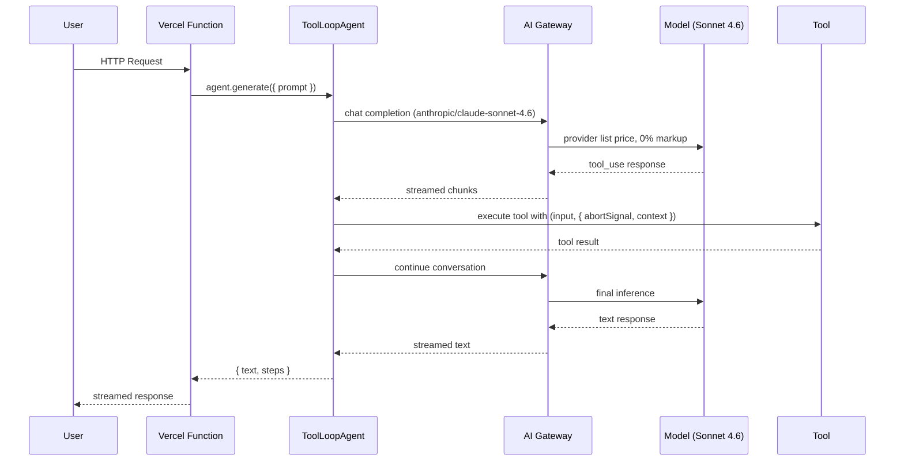
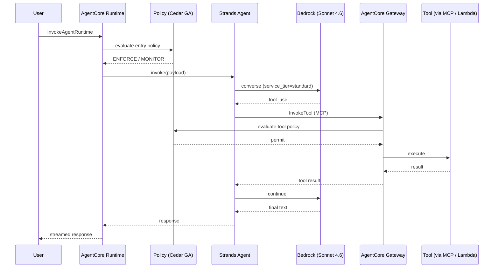
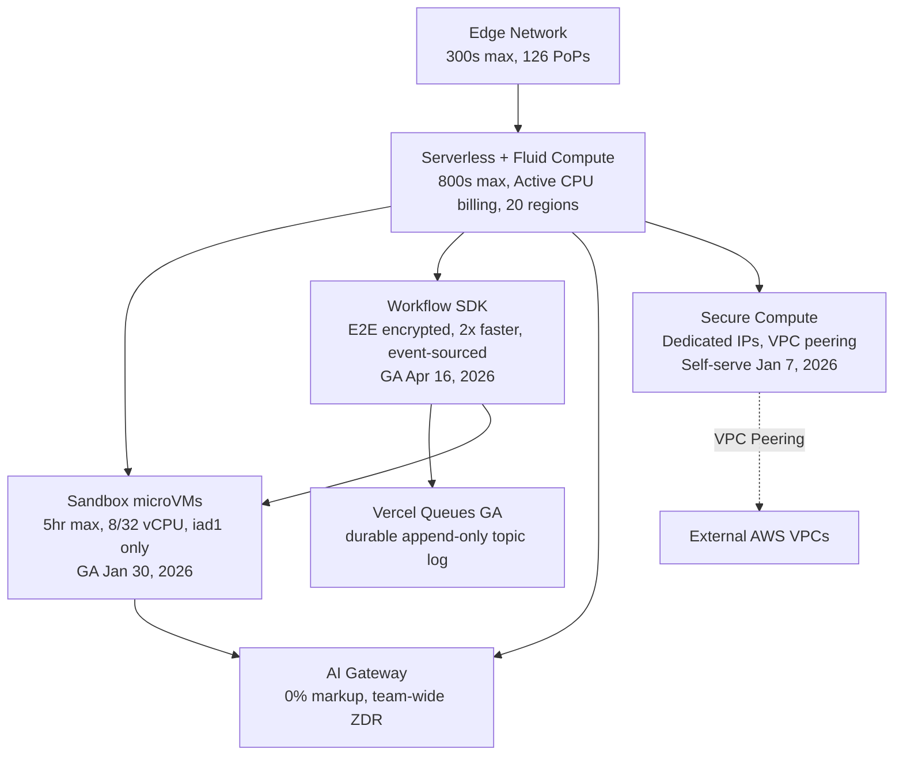
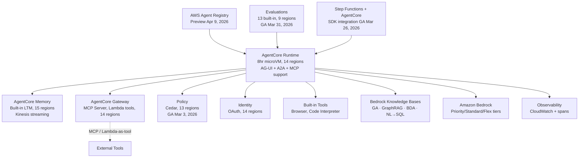
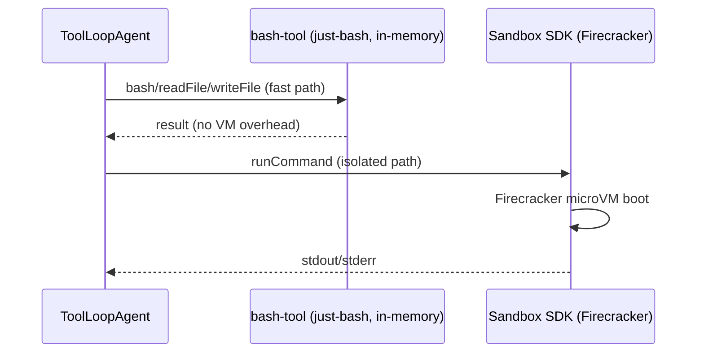
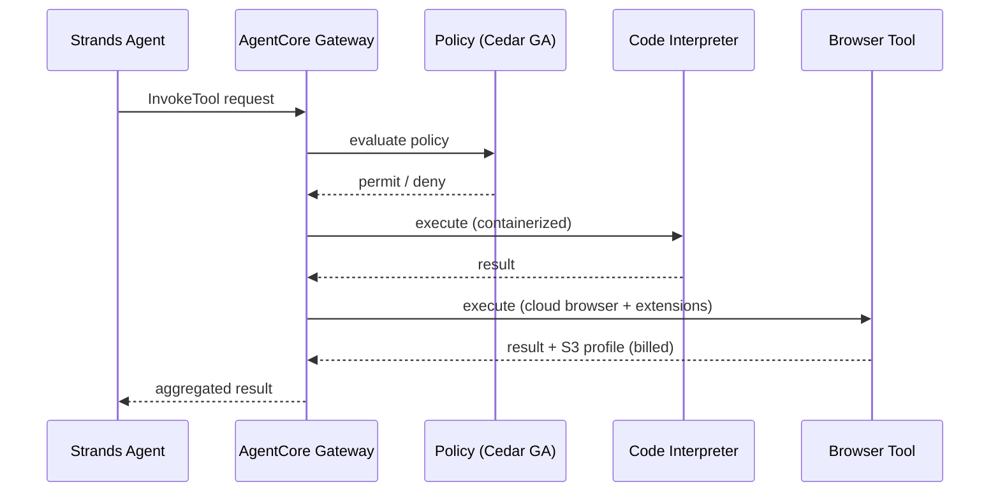

## 9. Architectural Visuals

### 9.1 Vercel Agent Lifecycle (AI SDK 6.x)



### 9.2 AWS Agent Lifecycle (Strands + AgentCore)



### 9.3 Vercel Infrastructure



### 9.4 AWS Infrastructure



### 9.5 Tool Execution Flow (Side-by-Side)

#### Vercel



#### AWS



### 9.6 Combined Stack Comparison

```
Vercel Stack                          ↔    AWS Stack
────────────────────────────────────────────────────────────────────────
AI SDK 6.x (ToolLoopAgent)            ↔    Strands SDK (Agent)
`WorkflowAgent` (v7 beta)             ↔    BedrockAgentCoreApp (@app.entrypoint)
AI Gateway (0% markup)                ↔    Amazon Bedrock (Priority/Standard/Flex)
Fluid Compute                         ↔    AgentCore Runtime
(800s max, 20 regions)                     (8hr max, 14 regions)
Sandbox SDK (GA, iad1 only)           ↔    Code Interpreter (14 regions)
Workflow SDK (GA, state iad1)         ↔    AgentCore Runtime Sessions (14 regions)
Vercel Queues (GA)                    ↔    Step Functions + AgentCore (GA Mar 26)
Computer Use tools + Kernel           ↔    AgentCore Browser Tool
mcp-handler + @ai-sdk/mcp client      ↔    AgentCore Gateway (MCP Server)
DurableAgent + Marketplace storage    ↔    AgentCore Memory (15 regions)
Team Roles + SCIM + Access Groups     ↔    IAM + AgentCore Managed Policies
Marketplace Auth (Clerk/Auth0/WorkOS) ↔    AgentCore Identity ($0.010/1K req)
Marketplace Vector Stores (BYO)       ↔    Amazon Bedrock Knowledge Bases (GA)
Model-native safety (BYO middleware)  ↔    Amazon Bedrock Guardrails (GA)
AI Gateway team-wide ZDR              ↔    VPC + IAM + Cedar
External evaluation (Braintrust)      ↔    AgentCore Evaluations (GA, 9 regions)
N/A                                   ↔    AWS Agent Registry (preview, 5 regions)
MCP only                              ↔    MCP + A2A + AG-UI
Chat SDK (Slack/Discord/Teams)        ↔    Reference architectures (per-platform)
```

---

