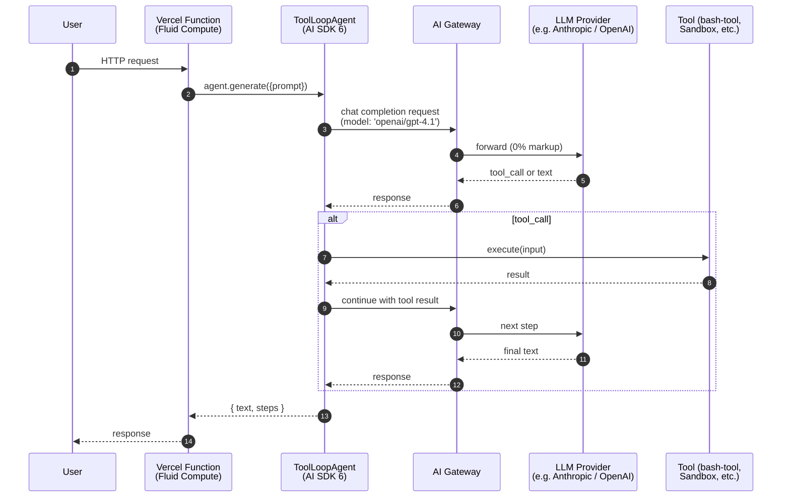
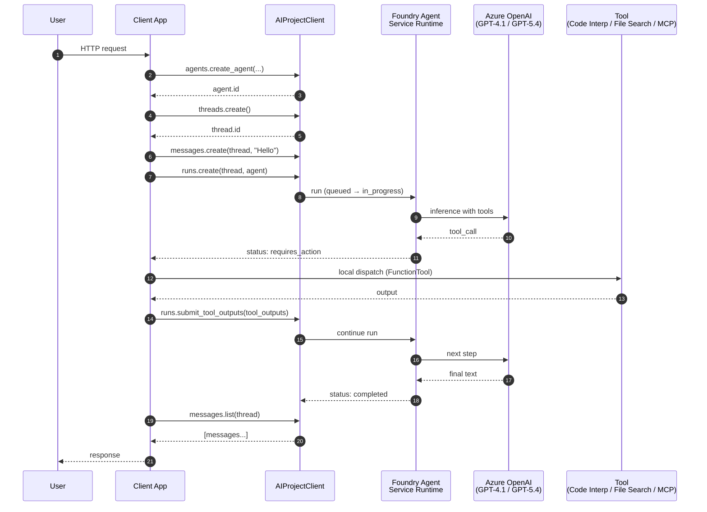

# Vercel Agent Stack vs. Microsoft Azure Agent Stack

**A Senior Principal Cloud Architect's Evaluation · April 2026**

| Field | Value |
|-------|-------|
| **Last Updated (ISO 8601)** | 2026-04-22 |
| **Generating Model** | Claude Opus 4.7 |
| **Report Version** | 1.1.0 (post-Apr 22 Foundry drop) |
| **Meta-Prompt** | [`Vercel-Azure-Base-Research-Prompt.md`](../../../meta-research-prompts/Vercel-Azure-Base-Research-Prompt.md) v1.0.0 |
| **Output Path** | `generated-reports/vercel-azure/2026/04/2026-04-21-Agent-Comparison-Report-Claude-Opus-4.7.md` |
| **Sister Report** | [Vercel vs AWS (Apr 21, 2026) v2.0.0](../../../vercel-aws/2026/04/2026-04-21-Agent-Comparison-Report-Claude-Opus-4.7.md) |
| **Live Site** | [adlc-evals.vercel.app/reports/vercel-azure](https://adlc-evals.vercel.app/reports/vercel-azure) |

> 🎯 **Blessed-Path Principle:** Both platforms let you build agents a billion ways. This report compares only each vendor's **officially recommended** out-of-the-box developer experience — no custom K8s, no third-party orchestrators, no deprecated APIs.

> 📝 **Source of Truth:** This markdown mirrors the curated, human-validated content published at the live site above. Where the two drift, **the site wins** — this file is regenerated from site data during each refresh.

> 📝 **Methodological Note:** This is the **initial Vercel vs Azure baseline** (v1.0.0). It uses the same two-layer architecture framing as the Vercel vs AWS report: **Agent Framework** (the SDK for writing agent logic) vs **Infrastructure** (the runtime, memory, deployment substrate). Don't conflate the layers.

---

## 1. Architectural Framing — Two Layers, One Vendor

Every managed agent stack in 2026 has two layers. Compare them like-for-like or you'll compare the wrong things.

| Layer | Vercel | Azure (April 2026) |
|-------|--------|--------------------|
| **Agent Framework** (SDK for agent logic) | **AI SDK 6.x** — `ToolLoopAgent`, tools, `prepareStep`, streaming (stable); `WorkflowAgent` in v7 beta | **Microsoft Agent Framework 1.0** — `Agent`, `AIAgent`, `ChatClientAgent`, `SequentialBuilder`, `ConcurrentBuilder`, `HandoffOrchestration`, `GraphFlow`, `Magentic-One` (GA Apr 3, 2026) — unified successor to Semantic Kernel + AutoGen |
| **Infrastructure** (runtime, memory, deployment) | **Vercel Platform** — Fluid Compute (20 regions) + Sandbox SDK (GA) + Workflow SDK (GA) + Vercel Queues (GA) + AI Gateway + Chat SDK | **Microsoft Foundry Agent Service** — Responses API-based runtime (next-gen GA Mar 16, 2026); **Hosted Agents refresh (Public Preview · Apr 22, 2026)** — new backend (not ACA), per-session hypervisor sandbox, `$HOME`/files persistence, <100ms cold start, `$0.0994/vCPU-hr + $0.0118/GiB-hr`, 4 preview regions; Conversations API; Foundry Evaluations GA; Foundry Tracing GA (fully GA + hosted-agent tracing Preview); Foundry Toolbox Preview; Foundry Memory refresh Preview; AI Red Teaming Agent GA; Foundry MCP Server preview |
| **Model Layer** | AI Gateway (0% markup, 20+ providers, 100+ models, team-wide ZDR GA) | **Azure OpenAI** (Global / Data Zone / Regional / Priority / Batch / PTU — **9 deployment tiers total**) + **Foundry Models** catalog (DeepSeek, Llama, Mistral, Phi, MAI-*, 11,000+ total models) |

> ⚠️ **The single most important Azure fact of April 2026:** Microsoft shipped **Agent Framework 1.0 on April 3, 2026**. This SDK *explicitly unifies* Semantic Kernel and AutoGen. From the [GA announcement](https://devblogs.microsoft.com/agent-framework/microsoft-agent-framework-version-1-0/):
>
> > *"When we introduced Microsoft Agent Framework last October, we set out to unify the enterprise-ready foundations of Semantic Kernel with the innovative orchestrations of AutoGen into a single, open-source SDK… Coming from AutoGen or Semantic Kernel? Now is the time to migrate to Microsoft Agent Framework."*
>
> If you're starting a new Azure agent project in April 2026, **do not use Semantic Kernel or AutoGen directly**. Use Microsoft Agent Framework. Both predecessors remain maintained but are explicitly superseded. Official migration guides exist for [SK → MAF](https://learn.microsoft.com/en-us/agent-framework/migration-guide/from-semantic-kernel) and [AutoGen → MAF](https://learn.microsoft.com/en-us/agent-framework/migration-guide/from-autogen).

### Canonical Hello-World — Both Platforms Side by Side

```typescript
// ── Vercel ────────────────────────────────────────────────────
import { ToolLoopAgent, tool, isStepCount } from 'ai';
import { z } from 'zod';

const weatherTool = tool({
  description: 'Get weather for a city',
  inputSchema: z.object({ city: z.string() }),
  execute: async ({ city }) => `${city}: 72°F, Sunny`,
});

const agent = new ToolLoopAgent({
  model: 'openai/gpt-4.1',   // AI Gateway string shorthand
  instructions: 'You are a helpful weather assistant.',
  tools: { weather: weatherTool },
  stopWhen: isStepCount(20),
});

const result = await agent.generate({ prompt: 'Weather in SF?' });
```

```python
# ── Azure (Microsoft Agent Framework 1.0) ────────────────────
from agent_framework import Agent
from agent_framework.foundry import FoundryChatClient
from azure.identity.aio import DefaultAzureCredential

def get_weather(city: str) -> str:
    """Get weather for a city."""
    return f"{city}: 72°F, Sunny"

agent = Agent(
    client=FoundryChatClient(
        project_endpoint="https://<project>.services.ai.azure.com",
        model="gpt-4.1-mini",
        credential=DefaultAzureCredential(),
    ),
    name="WeatherAgent",
    instructions="You are a helpful weather assistant.",
    tools=[get_weather],
)

result = await agent.run("Weather in SF?")
```

> 📝 **Observation:** The Azure code is ~25% shorter than the AWS Strands equivalent because MAF took the Pythonic "any function with a docstring is a tool" pattern from AutoGen and dropped decorators. AI SDK's `tool()` builder is more explicit (Zod schemas) but produces richer type-safety on the TypeScript side. Trade-off, not a winner.

---

## 2. The 2026 Delta — What Changed (Nov 2025 → April 2026)

Both platforms moved hard this window. Azure's story centers on **the Foundry rebrand + GA wave at Ignite 2025 → Q1 2026**. Vercel's centers on **Sandbox GA, Workflow GA, and Claude Opus 4.7**.

### 2.1 Azure Timeline (newest first)

| Date | Product | Headline |
|------|---------|----------|
| **Apr 22, 2026** | **Foundry "Complete Developer Journey" drop** | [Hub blog](https://devblogs.microsoft.com/foundry/from-local-to-production-the-complete-developer-journey-for-building-composing-and-deploying-ai-agents/) — coordinated 7-step release: **Hosted Agents refresh** (new backend, `$0.0994/vCPU-hr + $0.0118/GiB-hr`, 4 preview regions, `$HOME` persistence, <100ms cold start); **Foundry Toolbox** Public Preview (unified MCP endpoint); **Foundry Memory refresh** with native MAF + LangGraph integration; **Agent Harness** Preview (3 patterns); **Foundry Toolkit for VS Code GA**; **AI Red Teaming Agent GA**; **MAF v1.0** multi-model (Azure OpenAI + Anthropic + Gemini + Bedrock + Ollama); **M365/Teams one-click publish** Preview (Shared + Organization scopes). Launch customer: Sitecore. |
| **Apr 21, 2026** | Microsoft Agent 365 | [Frontier Suite](https://blogs.microsoft.com/blog/2026/04/21/accelerating-frontier-transformation-with-microsoft-partners/) announced; GA May 1 — unified agent control plane across Copilot Studio, Foundry, Fabric |
| **Apr 16, 2026** | Azure OpenAI | [o3 + o4-mini GA](https://azure.microsoft.com/en-us/blog/o3-and-o4-mini-unlock-enterprise-agent-workflows-with-next-level-reasoning-ai-with-azure-ai-foundry-and-github/) — reasoning + vision + Responses API; + `gpt-4o-transcribe`, `-mini-transcribe`, `-mini-tts` |
| **Apr 14, 2026** | Azure OpenAI | [GPT-4.1 series GA](https://azure.microsoft.com/en-us/blog/announcing-the-gpt-4-1-model-series-for-azure-ai-foundry-and-github-developers/) — 1M-token context, 26% cheaper than GPT-4o, SFT enabled; 15 PTU minimum for global |
| **Apr 8, 2026** | Microsoft Entra | [Entra Agent ID](https://techcommunity.microsoft.com/blog/microsoft-entra-blog/announcing-microsoft-entra-agent-id-secure-and-manage-your-ai-agents/3827392) expansion — agent identity blueprints, OAuth 2.0 OBO, Managed Identity federation (FIC/TUAMI). Originally previewed **May 19, 2025 (Build 2025)**; still in preview as of April 2026. |
| **Apr 3, 2026** | **Microsoft Agent Framework 1.0 GA** | [MAF 1.0 GA](https://devblogs.microsoft.com/agent-framework/microsoft-agent-framework-version-1-0/) — unified SK + AutoGen successor; stable APIs; `agent-framework 1.0.1` (Python) + `Microsoft.Agents.AI 1.1.0` (.NET); AutoGen officially enters maintenance mode |
| **Apr 2, 2026** | Open Source | [Agent Governance Toolkit](https://opensource.microsoft.com/blog/2026/04/02/introducing-the-agent-governance-toolkit-open-source-runtime-security-for-ai-agents/) — 7-package runtime security covering OWASP Agentic Top 10 |
| **Apr 2, 2026** | Foundry Models | [MAI-Transcribe-1, MAI-Voice-1, MAI-Image-2](https://microsoft.ai/news/today-were-announcing-3-new-world-class-mai-models-available-in-foundry/) — first-party Microsoft models |
| **Mar 31, 2026** | Durable Task Scheduler | [Consumption SKU GA](https://techcommunity.microsoft.com/blog/appsonazureblog/the-durable-task-scheduler-consumption-sku-is-now-generally-available/4506682) — pay-per-action, no upfront; 30-day orchestration history; managed backend for Durable Functions + Durable Task SDKs |
| **Mar 20, 2026** | Foundry | [Foundry MCP Server](https://learn.microsoft.com/en-us/azure/foundry/mcp/get-started) preview at `mcp.ai.azure.com` — cloud-hosted MCP, Entra auth |
| **Mar 20, 2026** | Semantic Kernel | [dotnet-1.74.0](https://github.com/microsoft/semantic-kernel/releases/tag/dotnet-1.74.0) — last major SK release before MAF 1.0; CVE-2026-26127 patched |
| **Mar 17, 2026** | Azure OpenAI | [GPT-5.4 mini ($0.75/$4.50) + GPT-5.4 nano ($0.20/$1.25)](https://techcommunity.microsoft.com/blog/azure-ai-foundry-blog/introducing-openai%E2%80%99s-gpt-5-4-mini-and-gpt-5-4-nano-for-low-latency-ai/4500569) for low-latency agentic subtasks — 400K context; agent-workhorse tier |
| **Mar 16, 2026** | **Foundry Agent Service** | [Next-gen GA](https://devblogs.microsoft.com/foundry/foundry-agent-service-ga/) — Responses API-based runtime (wire-compatible with OpenAI Agents SDK); BYO VNet; MCP auth expansion; Voice Live preview; Hosted Agents across 24 regions; old Assistants API sunsets Aug 26, 2026 |
| **Mar 16, 2026** | **Foundry Control Plane** | [Evaluations + Monitoring + Tracing GA](https://techcommunity.microsoft.com/blog/azure-ai-foundry-blog/generally-available-evaluations-monitoring-and-tracing-in-microsoft-foundry/4502760) — OTel-based distributed tracing, 30+ built-in evaluators + 9 agent-specific (Tool Call Accuracy, Task Adherence, Intent Resolution), Prompt Optimizer preview |
| **Mar 5, 2026** | Azure OpenAI | **GPT-5.4 GA** ([OpenAI launch](https://openai.com/index/introducing-gpt-5-4/)) — $2.50/$15 per 1M, 1.05M context, native computer-use; registration-gated on Azure |
| **Feb 27, 2026** | Azure OpenAI | `gpt-realtime-1.5` + `gpt-audio-1.5` for voice agent pipelines |
| **Feb 16, 2026** | Semantic Kernel | [dotnet-1.71.0](https://github.com/microsoft/semantic-kernel/releases/tag/dotnet-1.71.0) — SQL Server / Postgres hybrid search; SK → MAF migration guide |
| **Feb 13, 2026** | Foundry | [Guardrails for Agents](https://learn.microsoft.com/en-us/azure/foundry/guardrails/guardrails-overview) preview — 10 risk categories (Hate/Sexual/Violence/Self-harm/Prompt Shield/Indirect Attack/Protected Material code+text/PII/Task Adherence) at **4 intervention points** (user input, tool call, tool response, agent output) |
| **Feb 13, 2026** | Azure OpenAI (ChatGPT) | GPT-4o / GPT-4.1 / o4-mini retired from ChatGPT product; remain in API |
| **Feb 5, 2026** | Azure OpenAI | **GPT-5.3-Codex GA** — $1.75/$14 per 1M, coding + reasoning unified |
| **Jan 31, 2026** | Azure OpenAI | [o3-mini GA](https://azure.microsoft.com/en-us/blog/announcing-the-availability-of-the-o3-mini-reasoning-model-in-microsoft-azure-openai-service/) — replaces o1-mini; reasoning effort param, 200K context |
| **Jan 7, 2026** | Foundry Models | DeepSeek R1 becomes first major third-party open reasoning model in Foundry |
| **Dec 3, 2025** | Foundry | [Foundry MCP Server preview announced](https://devblogs.microsoft.com/foundry/announcing-foundry-mcp-server-preview/) |
| **Nov 25, 2025** | Agent Service | [Multi-Agent Workflows preview](https://devblogs.microsoft.com/foundry/introducing-multi-agent-workflows-in-foundry-agent-service) — visual + YAML orchestration on MAF (still preview Apr 2026) |
| **Nov 20, 2025** | Durable Task Scheduler | [Dedicated SKU GA](https://techcommunity.microsoft.com/blog/appsonazureblog/announcing-azure-functions-durable-task-scheduler-dedicated-sku-ga--consumption-/4465328) — 1 CU = **2,000 actions/sec + 50 GB** orchestration data; up to **90-day** retention on Dedicated (vs 30-day on Consumption) |
| **Nov 19, 2025** | Azure Developer CLI | [`azd ai agent`](https://devblogs.microsoft.com/azure-sdk/azure-developer-cli-foundry-agent-extension) preview — local-to-cloud agent publish in one command |
| **Nov 18, 2025** | **Microsoft Foundry rebrand** | [Ignite 2025 mega-drop](https://azure.microsoft.com/en-us/blog/microsoft-foundry-scale-innovation-on-a-modular-interoperable-and-secure-agent-stack/) — "Azure AI Foundry" → "Microsoft Foundry"; Foundry IQ, Model Router GA, Foundry Control Plane, Hosted Agents, Claude family added, Foundry Local on Android |
| **Nov 18, 2025** | Agent Service | [Ignite feature drop](https://techcommunity.microsoft.com/blog/azure-ai-foundry-blog/foundry-agent-service-at-ignite-2025-simple-to-build-powerful-to-deploy-trusted-/4469788) — built-in memory, Hosted Agents, Claude/Cohere/NVIDIA models, MCP integration, M365/Teams distribution |
| **Nov 18, 2025** | Content Safety | Task Adherence API preview — first Content Safety feature purpose-built for *agentic* (not just generative) AI |

### 2.2 Vercel Timeline (parallel, for context)

| Date | Headline |
|------|----------|
| **Apr 16, 2026** | Vercel Workflow GA (2× faster, E2E encrypted) + Claude Opus 4.7 on AI Gateway |
| **Apr 13, 2026** | Vercel Observability Plus: anomaly alerts GA |
| **Apr 9, 2026** | [Agentic Infrastructure blog](https://vercel.com/blog/agentic-infrastructure) |
| **Apr 8, 2026** | AI Gateway team-wide ZDR GA + Sandbox 32 vCPU / 64 GB Enterprise |
| **Mar 26, 2026** | Persistent Sandboxes beta |
| **Mar 17, 2026** | Workflow E2E encryption (AES-256-GCM, per-run HKDF-SHA256) + Vercel Plugin for Coding Agents |
| **Feb 23, 2026** | Vercel Chat SDK launch (Slack, Discord, Teams, WhatsApp, Telegram) |
| **Feb 17, 2026** | Claude Sonnet 4.6 on AI Gateway |
| **Feb 5, 2026** | Claude Opus 4.6 on AI Gateway |
| **Jan 30, 2026** | [Vercel Sandbox GA](https://vercel.com/blog/vercel-sandbox-is-now-generally-available) |
| **Jan 22, 2026** | Sandbox filesystem snapshots |
| **Jan 20, 2026** | Montréal `yul1` — 20th Fluid Compute region |
| **Jan 7, 2026** | [bash-tool](https://vercel.com/changelog/introducing-bash-tool-for-filesystem-based-context-retrieval) open-sourced |

### 2.3 Delta in One Sentence

**Azure went all-in on "Foundry-everything":** a rebrand, a GA-quality Responses-API runtime, a unified agent framework that explicitly kills SK+AutoGen as primary entry points, OTel-native observability, per-agent guardrails, cloud-hosted MCP, Durable Task Scheduler Consumption SKU for workflow orchestration, and a first-class identity model for agents. **Vercel doubled down on "use any workload, we'll run it durably":** Sandbox GA gave you microVMs for arbitrary code, Workflow GA gave you `"use workflow"` durability, Vercel Queues went GA under it, Chat SDK gave you multi-platform chat out of the box. Different philosophies: Azure sells you a managed agent runtime, Vercel sells you the compute + durability primitives under your own agent code.

**And on Apr 22** — one day after this report's prior refresh — Microsoft shipped the **"Complete Developer Journey"** drop: a new Hosted Agents backend with per-session hypervisor sandboxes and filesystem persistence (directly competing with Vercel Sandbox), Foundry Toolbox for unified tool management, Foundry Memory with MAF+LangGraph native integration, Agent Harness for long-running autonomous agents, AI Red Teaming Agent GA, and Foundry Toolkit for VS Code GA. See §2.5 for the 7-step mapping and §3.1 for the head-to-head against Vercel Sandbox.

### 2.5 The April 22, 2026 Foundry Drop — 7-Step Developer Journey

Microsoft packaged the Apr 22 release as a seven-step narrative. Mapped to Vercel equivalents and our matrix rows:

| # | Microsoft Step | Ships | Status | Vercel Equivalent | Our §/Row |
|---|----------------|-------|--------|-------------------|-----------|
| 1 | **Build locally** | MAF v1.0 + Foundry Toolkit for VS Code | **GA** + **GA** | AI SDK 6.x + Vercel CLI + Vercel Plugin for Coding Agents | §1 · §3 Agent Framework |
| 2 | **Agent Harness & Multi-Agent** | Local Shell / Hosted Shell / Context Compaction + GitHub Copilot SDK integration | Public Preview | `@vercel/sandbox` + bash-tool + AI SDK v7 `toolNeedsApproval` + DurableAgent | §3 Agent Harness (new row) |
| 3 | **Stateful agents** | Foundry Memory w/ native MAF + LangGraph integration | Preview (billing Jun 1) | DurableAgent state + Marketplace storage (Neon/Upstash/Supabase) | §3 Persistent Memory |
| 4 | **Tool management** | Foundry Toolbox (unified MCP endpoint) | Public Preview | `@ai-sdk/mcp` + mcp-handler + bash-tool | §3 Tool Management |
| 5 | **Host at scale** | Hosted Agents refresh | Public Preview (billing started Apr 22) | Vercel Sandbox (GA) + Fluid Compute + Workflow (GA) | §3 Infrastructure Wrapper · §3.1 head-to-head |
| 6 | **Observability** | Foundry Control Plane tracing + evals + **AI Red Teaming Agent** | Fully GA (hosted-agent tracing Preview · custom evals Preview) | AI SDK telemetry + Vercel Observability Plus + Braintrust (Marketplace) | §7 |
| 7 | **Distribute to users** | Publish to Teams + M365 Copilot (Shared + Organization scopes) | Public Preview | Vercel Chat SDK (Slack/Discord/Teams/WhatsApp/Telegram) | §3 Chat Integration |

**Launch customer:** Sitecore — SitecoreAI / Agentic Studio runs on MAF with Foundry IQ for brand-knowledge grounding.

> 📝 **What Microsoft did NOT ship:** There is no Azure equivalent to Vercel AI Gateway in this drop. MAF v1.0's multi-model support (Azure OpenAI, Anthropic, Gemini, Bedrock, Ollama) is at the **SDK layer** — it gives you code-level provider switching, not a runtime routing/fallback/BYOK gateway with 0% markup. The closest existing capability is Azure API Management with AI policies, which was not part of this announcement.

---

## 3. Infrastructure Footprint (Hard Facts)

> 🗂️ **Structural note:** The April 2026 refresh reorganizes the capability matrix into **four thematic groups** mirroring the site: **Agent Foundations** (how you build), **Infrastructure** (where it runs), **Security & Identity** (who can do what), and **Operations** (memory, observability, evaluation).

### 3.1 Agent Foundations

Core SDKs and gateways for building AI agents with reasoning and tool use.

| Capability | Vercel Stack | Azure Stack |
|------------|--------------|-------------|
| **Agent Framework** | **Vercel AI SDK 6.x** — `ToolLoopAgent`, `Agent` interface, `stopWhen`, `prepareStep`, `dynamicTool` (stable Dec 2025); v7 beta ESM-only. [Docs](https://ai-sdk.dev/docs/agents/overview) | **Microsoft Agent Framework 1.0** — GA Apr 3, 2026 · .NET + Python (TS in development) · `AIAgent`, `ChatClientAgent`, `Agent`, `SequentialBuilder`, `ConcurrentBuilder`, `HandoffOrchestration`, `GraphFlow`, `Magentic-One` · SK + AutoGen in maintenance. [GA Blog](https://devblogs.microsoft.com/agent-framework/microsoft-agent-framework-version-1-0/) |
| **Model Gateway** | **AI Gateway** — 0% markup · BYOK across Anthropic / OpenAI / Azure / Vertex / Bedrock · 100+ models · built-in observability. [Docs](https://vercel.com/docs/ai-gateway) | **Azure OpenAI + Foundry Models** — **1,900+ models** in catalog · **9 deployment tiers** (Global / Data Zone / Regional + PTU / Batch / Priority ≈×2) · GPT-5.4 GA Mar 2026. [Deployment Types](https://learn.microsoft.com/en-us/azure/foundry/foundry-models/concepts/deployment-types) |
| **Tool Management** | **`mcp-handler` 1.1 + AI SDK tools + Sandbox** — first-party MCP server (Streamable HTTP + OAuth); `@ai-sdk/mcp` client; `tool()` + `dynamicTool`; `@vercel/sandbox` 1.10 for code exec. [Docs](https://github.com/vercel/mcp-handler) | **FunctionTool + McpTool + A2ATool + Foundry MCP Server** — `FunctionTool`, `McpTool` (OAuth passthrough), `A2ATool` · Foundry MCP Server preview at `mcp.ai.azure.com` (live since Dec 3, 2025) · `azure-ai-projects 2.0` GA Mar 2026. [Foundry MCP](https://learn.microsoft.com/en-us/azure/foundry/mcp/get-started) |
| **Protocol Support** | **MCP (client + server)** — `@ai-sdk/mcp` client: Streamable HTTP + SSE stable, stdio local-only · `mcp-handler` server · A2A + AG-UI not first-party. [Docs](https://ai-sdk.dev/docs/ai-sdk-core/mcp-tools) | **MCP + Responses API + A2A + AG-UI** — Responses API GA Mar 16, 2026 (wire-compatible with OpenAI Agents SDK) · MCP GA · A2A consumer preview · AG-UI adapter in MAF (preview). [Foundry Agent Service GA](https://devblogs.microsoft.com/foundry/foundry-agent-service-ga/) |
| **Agent Discovery** | **Marketplace + `mcp.vercel.com`** — Marketplace "AI Agents & Services" category + agent-optimized CLI (`vercel integration discover / guide`); `mcp.vercel.com` first-party MCP endpoint; no dedicated agent registry. [Marketplace](https://vercel.com/marketplace/category/agents) | **Foundry Tool Catalog + Projects REST** — Tool Catalog GA (portal + SDK, public + private) · agent CRUD via Projects REST v1 · no standalone cross-project agent registry. [Tool Catalog](https://learn.microsoft.com/en-us/azure/foundry/agents/concepts/tool-catalog) |

### 3.2 Infrastructure

Compute, execution environments, and workflow orchestration.

| Capability | Vercel Stack | Azure Stack |
|------------|--------------|-------------|
| **Infrastructure Wrapper** | **Fluid Compute** — Edge + Serverless hybrid across **20 regions**; in-function concurrency; 800s max (Pro/Enterprise); Active CPU billing — I/O time is free. [Docs](https://vercel.com/docs/fluid-compute) | **Foundry Agent Service** — next-gen GA Mar 16, 2026 · Responses API runtime (wire-compatible w/ OpenAI Agents SDK) · prompt agents GA · **Hosted Agents refresh (Public Preview · Apr 22, 2026)** — new backend (not ACA), per-session hypervisor sandbox, `$HOME`/files persistence across scale-to-zero, <100ms cold start, `$0.0994/vCPU-hr + $0.0118/GiB-hr` (active only), 0.25–2 vCPU / 0.5–4 GiB, **4 preview regions** (AU East, CA Central, NC US, SE Central), `azd deploy` one-command (ext v0.1.26-preview+), 4 protocols coexist (Responses + Invocations + Activity + A2A). [Concepts](https://learn.microsoft.com/en-us/azure/foundry/agents/concepts/hosted-agents) |
| **Secure Code Execution** | **Vercel Sandbox** — Firecracker microVMs, node24 / python3.13; up to **32 vCPU / 64 GB / 32 GB NVMe** (Enterprise); 5-hr max; 2,000 concurrent; `iad1` only; snapshots GA (Jan 22), persistent beta (Mar 26). [Docs](https://vercel.com/docs/vercel-sandbox) | **ACA Dynamic Sessions + Foundry Code Interpreter** — **Hyper-V isolated** sessions across **38 regions**; built-in Python / Node.js / Shell + custom container pools; 1-hr active / 30-min idle timeout; managed Code Interpreter tool wraps the same runtime. [ACA Sessions](https://learn.microsoft.com/en-us/azure/container-apps/sessions) |
| **Durable Workflows** | **Workflow SDK (GA Apr 16, 2026)** — `"use workflow"` directive; event-sourced; unlimited run + sleep duration; **10K steps/run**; **100K concurrent**; DurableAgent for AI SDK; TS GA, Python beta. [Docs](https://vercel.com/docs/workflows) | **Multi-agent Workflows (Preview)** — preview since Nov 25, 2025 (Ignite); **still preview Apr 2026** · drag-drop visual designer + YAML in Foundry portal & VS Code · graph-based MAF orchestration deployed via Hosted Agents. [Announcement](https://devblogs.microsoft.com/foundry/introducing-multi-agent-workflows-in-foundry-agent-service/) |
| **Message Queue** 🆕 | **Vercel Queues (GA)** — `@vercel/queue`: durable append-only topic log; fan-out consumer groups; automatic retries + deduplication; powers the Workflow SDK under the hood. [Docs](https://vercel.com/docs/queues) | **Azure Durable Task Scheduler** — **Consumption SKU GA Mar 31, 2026** (pay-per-action, no upfront, up to **30-day** history); **Dedicated SKU GA Nov 20, 2025** (1 CU = **2,000 actions/sec + 50 GB**, up to **90-day** history); managed backend for Durable Functions + Durable Task SDKs. [Docs](https://learn.microsoft.com/en-us/azure/durable-task/scheduler/develop-with-durable-task-scheduler) |
| **Browser Automation** | **Kernel (Marketplace) + Sandbox DIY** — Kernel (Vercel-native Marketplace, 500+ installs): CDP cloud browsers compatible with Playwright / Puppeteer / Stagehand / Computer Use · or install Chromium directly in `@vercel/sandbox`. [Marketplace](https://vercel.com/marketplace/kernel) | **Browser Automation + Computer Use (Preview)** — two distinct tools: **Browser Automation** uses Microsoft Playwright Workspaces (BYO resource, any GPT model, DOM actions); **Computer Use** is screenshot-based on `computer-use-preview` model (**3 regions**: East US 2, Sweden Central, South India). [Docs](https://learn.microsoft.com/en-us/azure/foundry/agents/how-to/tools/browser-automation) |

### 3.3 Security & Identity

Authentication, authorization, and access control.

| Capability | Vercel Stack | Azure Stack |
|------------|--------------|-------------|
| **Authorization** | **AI Gateway ZDR + Deployment Protection** — AI Gateway ZDR (Pro/Enterprise): team-wide toggle (**$0.10/1K req**) or per-request flag; routes to **13 ZDR providers**; BYOK exempt. Platform Deployment Protection: Vercel Auth, Password, Trusted IPs. [Docs](https://vercel.com/docs/ai-gateway/capabilities/zdr) | **Microsoft Entra Agent ID (Preview)** — preview since **May 19, 2025 (Build 2025)**; still preview Apr 2026 · agent identity blueprints · OAuth 2.0 OBO + `client_credentials` · Managed Identity federation (FIC / TUAMI) · Conditional Access. [Docs](https://learn.microsoft.com/en-us/entra/agent-id/identity-platform/agent-blueprint) |
| **RBAC & Access Control** 🆕 | **Team Roles + Access Groups + SCIM** — 8 team roles (Owner → Contributor) + dedicated Security role for firewall / WAF; project-level Access Groups with permission groups; SCIM Directory Sync maps IdP groups to roles (Enterprise). [Docs](https://vercel.com/docs/rbac/access-groups) | **Azure RBAC + Foundry Roles** — built-in Foundry roles (GA): Azure AI Account Owner, Administrator, Developer, User + Cognitive Services OpenAI Contributor / User; RBAC assigned to agent identity for tool access. [Docs](https://learn.microsoft.com/en-us/azure/ai-foundry/concepts/rbac-azure-ai-foundry) |
| **Identity / OAuth** 🆕 | **Marketplace Auth + OIDC + SAML SSO** — Marketplace-native: Clerk, Auth0, WorkOS, Stytch (auto-provisioned env vars, unified billing); Vercel OIDC IdP for keyless cloud + AI Gateway auth; SAML SSO (22+ IdPs) on Enterprise/Pro. [Docs](https://vercel.com/docs/oidc) | **Microsoft Entra ID** — 900M+ MAU; Foundry auto-provisions distinct service principal per published agent; FIC-based managed identity federation; Azure RBAC + Conditional Access; Entra Agent ID framework still Preview. [Docs](https://learn.microsoft.com/en-us/azure/foundry/agents/concepts/agent-identity) |
| **Content Safety / Guardrails** 🆕 | **Model-native + AI Gateway policies** — no platform content filters or PII scrubbing; AI Gateway enforces ZDR + `disallowPromptTraining`; WAF rate-limits AI endpoints; Claude / OpenAI native safety + custom middleware required. [Docs](https://vercel.com/docs/ai-gateway/capabilities/disallow-prompt-training) | **Foundry Guardrails for Agents (Preview)** — preview for agents (model layer GA) · **10 risk categories**: Hate / Sexual / Violence / Self-harm / Prompt Shield / Indirect Attack / Protected Material (code + text) / PII / Task Adherence · **4 intervention points**: user input, tool call, tool response, agent output. [Docs](https://learn.microsoft.com/en-us/azure/foundry/guardrails/guardrails-overview) |
| **Compliance & Audit** 🆕 | **SOC 2 T2, ISO 27001, HIPAA BAA + Activity Log** — SOC 2 Type 2, ISO 27001:2022, HIPAA BAA (Enterprise), PCI DSS v4.0, GDPR, EU-U.S. DPF, TISAX AL2; Activity Log (CLI accessible) + Log Drains for SIEM; reports at [security.vercel.com](https://security.vercel.com). [Docs](https://vercel.com/docs/security/compliance) | **Defender AI-SPM + Purview + Azure Monitor** — Defender for Cloud AI-SPM (GA): agentless AI discovery across Azure / AWS / GCP, attack-path analysis; Microsoft Purview for AI (GA DSPM + DLP middleware); Foundry OpenTelemetry tracing + Entra audit logs. [Docs](https://learn.microsoft.com/en-us/azure/defender-for-cloud/ai-security-posture) |

### 3.4 Operations

State management, memory, monitoring, and evaluation.

| Capability | Vercel Stack | Azure Stack |
|------------|--------------|-------------|
| **Persistent Memory** | **DurableAgent + Marketplace Storage** — `DurableAgent` (`@workflow/ai/agent`) auto-persists messages / tool calls across steps; `useChat onFinish` for chat history; Neon / Upstash / Supabase via Marketplace; no first-party agent memory product. [Docs](https://workflow-sdk.dev/docs/api-reference/workflow-ai/durable-agent) | **Responses API Conversations + Foundry Memory** — Responses API Conversations (**GA Mar 16, 2026**) — **indefinite retention, 100K items/conversation**; Foundry Memory (**Preview, Jan 2026**): user-profile + chat-summary types, 10K/scope; Assistants API sunsets Aug 26, 2026. [Docs](https://learn.microsoft.com/en-us/azure/foundry/agents/how-to/memory-usage) |
| **Knowledge Base / Grounding** 🆕 | **Marketplace Vector Stores** — Supabase pgvector, Upstash Vector, MongoDB Atlas, Pinecone via Marketplace (first-party billing, auto-provisioned env vars); AI SDK native embeddings + reranking. [Marketplace](https://vercel.com/marketplace?category=storage) | **Foundry IQ (Preview)** — managed Azure AI Search knowledge base for agents; MCP tool (`knowledge_base_retrieve`); semantic reranking + permission-aware retrieval; distinct from Memory (org content vs user context). [Docs](https://learn.microsoft.com/en-us/azure/foundry/agents/how-to/foundry-iq-connect) |
| **Observability** | **AI SDK telemetry + Vercel Observability + AI Gateway** — `experimental_telemetry` on `generateText` / `streamText` (OTEL GenAI semconv); Vercel Observability Plus: 30-day retention, workflow run / step queries (Apr 7), **anomaly alerts GA (Apr 13, 2026)**; AI Gateway Custom Reporting API (beta) for cost by tag / user / model. [Docs](https://vercel.com/docs/observability/observability-plus) | **Foundry Monitoring & Tracing (GA)** — GA Mar 16, 2026 · OpenTelemetry-native · `configure_azure_monitor()` one-call setup (Python + .NET + Node + Java) · eval results linked to traces · Azure Monitor: **$2.30/GB Analytics, $0.50/GB Basic, $0.05/GB Auxiliary** (East US PAYG, 5 GB/mo free). [Announcement](https://techcommunity.microsoft.com/blog/azure-ai-foundry-blog/generally-available-evaluations-monitoring-and-tracing-in-microsoft-foundry/4502760) |
| **Evaluations** | **BYO + Braintrust on Marketplace** — no first-party eval product; **Braintrust on Marketplace** (GA Oct 2025) for evals + trace streaming with unified billing; **Langfuse via AI Gateway** integration (Feb 2026). [Changelog](https://vercel.com/changelog/braintrust-joins-the-vercel-marketplace) | **Foundry Evaluations (GA)** — GA Mar 16, 2026 · **30+ built-in evaluators + 9 agent-specific** (Tool Call Accuracy, Task Adherence, Intent Resolution) · custom evaluators: LLM-as-judge + code-based (Preview) · continuous monitoring → Azure Monitor alerts · Prompt Optimizer Preview. [Docs](https://learn.microsoft.com/en-us/azure/foundry/concepts/built-in-evaluators) |

### 3.5 Key Architecture Insight

> ⚙️ **Microsoft Agent Framework 1.0** (open-source, MIT, Apr 3, 2026) owns orchestration logic and is framework-portable; **Foundry Agent Service** (GA Mar 16, 2026) owns the managed runtime — private networking, Entra RBAC, continuous evaluation, guardrails. The Responses API binds both layers, keeping agents portable between Foundry and OpenAI. Vercel's AI SDK sits at the MAF layer; Foundry's managed runtime has no direct Vercel equivalent — you compose it from Marketplace integrations.

### 3.6 Deep-Dive: Selected Rows

**Runtime Persistence.** Azure Foundry Agent Service stores conversation state server-side via the Conversations API; `AzureAIAgentThread` survives process restarts and is accessible from any client with the thread ID. Responses API Conversations keeps history for indefinite retention (up to 100K items per conversation). Vercel Workflow SDK persists function state via an event-sourced queue backend (Vercel Queues, GA; `iad1`-pinned for now); the `"use workflow"` directive transforms async functions into durable, resumable, crash-safe processes. **Azure's persistence is agent-scoped and automatic; Vercel's is function-scoped and explicit.** Both survive redeploys.

**Code Execution.** Azure Foundry Code Interpreter runs at **$0.03/session-hour** (flat) with a 1-hour session window. Azure Container Apps Dynamic Sessions runs the same $0.03/session-hour meter with **Hyper-V isolation** across **38 regions** — built-in Python / Node.js / Shell runtimes plus custom container pools. Vercel Sandbox SDK bills at **$0.128/CPU-hour + $0.0212/GB-hour + $0.60/1M creations + $0.15/GB network + $0.08/GB-month storage** — more dimensions, but no per-run time cap (within plan limits). For a 10-second agent code execution, Azure's session-hour billing has minimum granularity pain (you pay 1 hour even for 10s of work); Vercel bills per-second of actual CPU. For long-running analysis sessions, Azure's flat rate wins. **Pick based on workload shape, not rack rate.**

**Context Retrieval.** Vercel `bash-tool` (Jan 7, 2026) uses the `just-bash` TypeScript interpreter — no shell process, no binary execution, in-memory or sandboxed filesystems. Token-efficient for "let the agent grep the repo" patterns. Azure's equivalents are **File Search** (tool-level RAG over uploaded docs) at **$0.10/GB/day storage + $2.50/1K tool calls** (Responses API) and **Foundry IQ** (managed Azure AI Search knowledge base with MCP `knowledge_base_retrieve` tool). Different patterns: Vercel's is "let the agent run Unix"; Azure's is "let the agent query a managed vector index."

**Security Primitives.** Vercel: environment variables, middleware, AI Gateway team-wide ZDR (Apr 8, 2026), SAML SSO / OIDC / SCIM, 8-role RBAC with Access Groups. Azure: **Microsoft Entra ID** (the deepest enterprise identity story of any cloud), Azure RBAC + Foundry roles, Managed Identity per agent (one service principal per published agent), **Entra Agent ID** preview (agent identity blueprints + OAuth 2.0 OBO + FIC/TUAMI federation), **Foundry Guardrails** (10 risk categories at 4 intervention points), **Agent Governance Toolkit** open-source (Apr 2, 2026) covering OWASP Agentic Top 10 with policy engine, zero-trust identity mesh, execution rings, kill switch, EU AI Act / HIPAA / SOC2 compliance mapping. **Defender for Cloud AI-SPM** (GA) provides agentless AI discovery across Azure / AWS / GCP with attack-path analysis; **Microsoft Purview for AI** adds DSPM + DLP middleware.

**Protocol Support.** Azure ships four agent protocols in the Agent Service runtime: **MCP** (client via `McpTool`, cloud server at `mcp.ai.azure.com`), **A2A** (consumer preview), **AG-UI** (adapter in MAF preview), and **OpenAI Responses API** (wire-compatible — an OpenAI Agents SDK client can talk to Foundry Agent Service unchanged). Vercel supports MCP natively (client via `@ai-sdk/mcp`, server via `mcp-handler` 1.1); A2A and Responses API are not first-party concerns (the AI SDK targets the abstraction layer above protocol choice). **Azure's protocol breadth is a direct consequence of Foundry being a hosted runtime; Vercel's protocol minimalism is a consequence of being a generic compute platform.**

**Regional Availability.** Preview in §4 below. One-line summary: **Azure has 24 Agent Service regions vs Vercel's 20 compute regions + 126 CDN PoPs**. But Azure's regional coverage is *fragmented* — North Europe and West Europe have Foundry projects but no Agent Service; Computer Use is in only 3 regions (East US 2, Sweden Central, South India); o3-pro / codex-mini only in East US 2 + Sweden Central. Vercel's Sandbox and Workflow state-backend are both `iad1`-pinned. Neither platform is "deploy anywhere" for agents today.

---

## 3.1 Azure Hosted Agents vs. Vercel Sandbox — Head-to-Head

The Apr 22 Hosted Agents refresh is explicitly positioned against Vercel Sandbox (from the [launch blog](https://devblogs.microsoft.com/foundry/introducing-the-new-hosted-agents-in-foundry-agent-service-secure-scalable-compute-built-for-agents/): *"Not process isolation. Not a code execution-only sandbox. Production-proven hypervisor isolation, at cloud scale."*). Direct comparison:

| Dimension | Azure Hosted Agents (Apr 22 refresh) | Vercel Sandbox SDK |
|-----------|--------------------------------------|---------------------|
| **Status** | Public Preview (billing started Apr 22, 2026) | **GA** (Jan 30, 2026) |
| **Isolation** | Per-session hypervisor-based sandbox (VMM not disclosed; predecessor used Hyper-V via ACA) | Firecracker microVM (dedicated kernel per sandbox) |
| **Cold start** | **<100ms** (first-party number, [hub blog](https://devblogs.microsoft.com/foundry/from-local-to-production-the-complete-developer-journey-for-building-composing-and-deploying-ai-agents/)) | "Sub-second" (customer-confirmed); ~125ms Firecracker spec |
| **Max vCPU (single unit)** | **2.0 vCPU** (ceiling during preview) | **32 vCPU** (Enterprise) — **16× larger** |
| **Max memory (single unit)** | **4 GiB** | **64 GB** (Enterprise) — **16× larger** |
| **Max concurrent sessions** | **50/sub/region** (preview, adjustable by Support ticket) | **2,000** (Pro/Enterprise) — **40× more** |
| **Max session lifetime** | **30 days** | 5 hours (Pro/Enterprise) |
| **Idle timeout → state save** | 15 min → deprovision → state-preserving resume | Configurable; Persistent Sandboxes (beta) |
| **Filesystem persistence** | ✅ `$HOME` + `/files` survive scale-to-zero (preview GA) | ✅ Persistent Sandboxes (**beta**) — auto-snapshot on stop |
| **Scale to zero** | ✅ Yes (zero cost during idle) | ✅ Ephemeral by default |
| **Regions** | **4 preview** (AU East, CA Central, NC US, SE Central) | **`iad1` only** — Azure wins breadth for agent compute |
| **Languages** | Python, C# | Any (node24, python3.13, arbitrary containers) |
| **Framework agnostic** | ✅ BYO (MAF, LangGraph, SK, Claude Agent SDK, OpenAI Agents SDK, Copilot SDK, custom) | ✅ BYO (any framework, any code) |
| **Identity** | **Per-agent Entra Agent ID + OBO user delegation** | Vercel project OIDC tokens |
| **Private networking** | ✅ BYO VNet supported | ✅ Secure Compute ($6.5K/yr + $0.15/GB, Enterprise) |
| **M365 / Teams / Copilot integration** | ✅ Native one-click publish (Shared + Organization scopes) | ❌ |
| **A2A protocol** | ✅ Native | ❌ |
| **AG-UI support** | ✅ Via Invocations protocol | ❌ |
| **Durable orchestration** | Responses API conversation state (server-managed) | **Vercel Workflow** (`"use workflow"`, E2E encrypted, unlimited duration) |
| **E2E encryption default** | Not stated | ✅ Workflow AES-256-GCM + per-run HKDF-SHA256 |
| **Pricing** | `$0.0994/vCPU-hr + $0.0118/GiB-hr` (active only); XS $0.031/hr → L $0.246/hr | `$0.128/CPU-hr + $0.0212/GB-hr + $0.60/1M creations + $0.15/GB network + $0.08/GB-mo storage` |
| **I/O-free Active CPU billing** | Not stated | ✅ Pauses during AI model calls and network I/O |
| **Pricing transparency** | Published Apr 22 via hub blog | Fully published per-dimension |
| **Deploy command** | `azd deploy` (remote ACR Tasks build — no local Docker) | `vercel deploy` (no container required — serverless functions) |

### Where Azure Genuinely Wins
1. **Enterprise identity** — Per-agent Entra Agent ID with OBO user delegation is a first-class enterprise security primitive. Vercel's project-scoped OIDC is functional but not per-agent.
2. **M365/Teams/Copilot distribution** — One-click publish with Shared + Organization scopes, admin approval workflow, agent-store placement. No Vercel equivalent.
3. **A2A + AG-UI protocols** — Native support for agent-to-agent delegation and agent-UI streaming. No Vercel equivalent in-platform.
4. **Regional breadth for agent compute specifically** — 4 preview regions (AU, CA, US, EU) vs. Vercel Sandbox's single `iad1` region. For EU/APAC agent compute, Azure wins *today* (with the important caveat that Foundry Agent Service prompt-based agents cover 24 regions, while Hosted Agents itself is a narrow subset).
5. **Filesystem persistence maturity** — `$HOME` persistence is preview-GA in Azure; Vercel's Persistent Sandboxes are still in beta.

### Where Vercel Genuinely Wins
1. **Isolation quality** — Firecracker gives each sandbox a dedicated kernel. Azure's per-session sandbox isolation detail (VMM name) is not disclosed; the predecessor backend used Hyper-V. For running untrusted or user-generated code, Firecracker's documented isolation boundary is stronger.
2. **Compute ceiling** — 32 vCPU / 64 GB per sandbox (Enterprise) vs. Azure's 2 vCPU / 4 GiB ceiling. **16× advantage** for compute-intensive agent tasks (code compilation, ML inference, large builds).
3. **Concurrency ceiling** — 2,000 concurrent sandboxes vs. Azure's 50/region preview limit. **40× more** out of the box. Azure's limit is adjustable on request; Vercel's is standard plan capacity.
4. **I/O-free Active CPU billing** — Vercel pauses CPU billing during AI model calls and network I/O. For AI agent workloads where 80–95% of wall-clock is model-wait, this is a substantial TCO advantage. Azure's billing model is "active sessions" without published I/O-free semantics.
5. **Durable execution** — Vercel Workflow provides step-level retries, sleep, hooks, durable streams, and E2E encryption as a first-class primitive alongside Sandbox. Azure Hosted Agents have no built-in workflow durability — you'd compose Durable Task Scheduler separately.
6. **Language flexibility** — Vercel Sandbox runs any container / any language. Azure Hosted Agents: Python or C# only.
7. **GA maturity** — Vercel Sandbox GA since Jan 30 with 2,000 concurrent sandboxes. Azure Hosted Agents is in preview with a 50-session preview cap.

### Architect's Net Read
**Pick based on workload shape, not rack rate.**
- **Microsoft-centric enterprise, governance-first, M365 distribution, EU/APAC agent compute, per-user OBO identity** → Azure Hosted Agents
- **Compute-intensive (>2 vCPU or >4 GiB per session), high concurrency (>50/region), untrusted code execution, global edge performance, durable multi-step workflows, I/O-heavy AI workloads** → Vercel Sandbox + Fluid Compute + Workflow

For the same Claude / OpenAI model accessed on both platforms, **the model layer still dominates TCO** — agent-infrastructure choice sits at 3–11% of total. Regional fit and DX should drive the decision, not compute unit pricing.

---

## 4. Regional Availability Matrix

> ⚠️ **Production Consideration:** Azure has broader agent-region coverage than AWS (24 vs 14 Agent Service regions), but narrower than you'd expect — six regions (North Europe, West Europe, Central India, East Asia, Qatar Central, West US 2) have Foundry projects but NO Agent Service. Tool support is also heterogeneous within the 24.

### 4.1 Azure Foundry Agent Service — Feature by Region (April 2026)

**Source:** [Foundry Region Support](https://learn.microsoft.com/en-us/azure/foundry/reference/region-support), [Agent Service Limits & Regions](https://learn.microsoft.com/en-us/azure/foundry/agents/concepts/limits-quotas-regions), [Tool Best Practice](https://learn.microsoft.com/en-us/azure/foundry/agents/concepts/tool-best-practice)

| Feature | Regions | Notes |
|---------|---------|-------|
| **Agent Service (Prompt agents)** | **24 GA regions** | australiaeast, brazilsouth, canadacentral, canadaeast, eastus, eastus2, francecentral, germanywestcentral, italynorth, japaneast, koreacentral, northcentralus, norwayeast, polandcentral, southafricanorth, southcentralus, southeastasia, southindia, spaincentral, swedencentral, switzerlandnorth, uaenorth, uksouth, westus, westus3 |
| **Hosted Agents (new backend, Apr 22 refresh)** | **4 preview regions** | Australia East · Canada Central · North Central US · Sweden Central · requires `azd ext install azure.ai.agents` v0.1.26-preview+ · per-session hypervisor sandbox · `$HOME`/files persistence |
| **Hosted Agents (legacy ACA backend)** | Broader preview footprint | Requires `azd ext` v0.1.25-preview; **being sunset** — migrate to new backend |
| **Workflow Agents** (multi-agent visual/YAML) | Preview subset | Announced Nov 25, 2025 — still preview Apr 2026 |
| **Code Interpreter tool** | **20 of 24** | NOT in Japan East, South Central US, Southeast Asia, Spain Central |
| **File Search tool** | **22 of 24** | NOT in Italy North, Brazil South |
| **Computer Use tool** | **3 of 24** — East US 2, Sweden Central, South India | Limited preview |
| **Browser Automation tool** | Preview, expanded subset (Playwright Workspaces-backed) | Expanded in Apr 2026 update |
| **ACA Dynamic Sessions** | **38 regions** | Hyper-V isolated; Python / Node / Shell + custom container pools |
| **Foundry Evaluations / Monitoring / Tracing** | Wherever Agent Service is GA | GA Mar 16, 2026 via Foundry Control Plane |
| **Foundry MCP Server** | Global endpoint `mcp.ai.azure.com` | Preview since Mar 20, 2026 |
| **Web Search tool (Bing Grounding)** | All 24 Agent Service regions | ⚠️ Data transfers **outside** compliance boundaries — MS DPA does NOT apply |

### 4.2 Azure OpenAI Model Regional Availability (Regional Standard)

> ✅ Regional Standard · 🌐 Global Standard only (no regional residency) · — Not available

| Region | GPT-5 family | GPT-4.1 | GPT-4o | o4-mini | o3 | o3-mini | o1 | Whisper |
|--------|:------------:|:-------:|:------:|:-------:|:--:|:-------:|:--:|:-------:|
| **East US** | ✅ | ✅ | ✅ | ✅ | ✅ | ✅ | ✅ | ✅ |
| **East US 2** | ✅ | ✅ | ✅ | ✅ | ✅ | ✅ | ✅ | ✅ |
| **South Central US** | ✅ | ✅ | ✅ | ✅ | ✅ | ✅ | — | — |
| **West US** | ✅ | ✅ | ✅ | ✅ | ✅ | ✅ | — | — |
| **West US 3** | ✅ | ✅ | ✅ | ✅ | ✅ | ✅ | ✅ | — |
| **Canada East** | ✅ | ✅ | ✅ | ✅ | ✅ | ✅ | ✅ | — |
| **Brazil South** | ✅ | ✅ | ✅ | 🌐 | 🌐 | 🌐 | — | — |
| **Sweden Central** | ✅ | ✅ | ✅ | ✅ | ✅ | ✅ | ✅ | ✅ |
| **France Central** | ✅ | ✅ | ✅ | ✅ | ✅ | ✅ | ✅ | — |
| **Germany West Central** | ✅ | ✅ | ✅ | ✅ | ✅ | ✅ | — | — |
| **Switzerland North** | ✅ | ✅ | ✅ | ✅ | ✅ | ✅ | ✅ | — |
| **UK South** | ✅ | ✅ | ✅ | ✅ | ✅ | ✅ | ✅ | — |
| **Norway East** | ✅ | ✅ | ✅ | ✅ | ✅ | ✅ | — | — |
| **Poland Central** | ✅ | ✅ | ✅ | ✅ | ✅ | ✅ | — | — |
| **Spain Central** | ✅ | ✅ | ✅ | 🌐 | 🌐 | 🌐 | — | — |
| **Italy North** | ✅ | ✅ | ✅ | 🌐 | 🌐 | 🌐 | — | — |
| **Australia East** | ✅ | ✅ | ✅ | ✅ | ✅ | ✅ | ✅ | — |
| **Japan East** | ✅ | ✅ | ✅ | ✅ | ✅ | ✅ | ✅ | — |
| **Korea Central** | ✅ | ✅ | ✅ | ✅ | ✅ | ✅ | — | — |
| **Southeast Asia** | ✅ | ✅ | ✅ | ✅ | ✅ | ✅ | — | — |
| **South India** | ✅ | ✅ | ✅ | 🌐 | 🌐 | 🌐 | — | — |
| **UAE North** | ✅ | ✅ | ✅ | ✅ | ✅ | ✅ | — | — |
| **South Africa North** | ✅ | ✅ | ✅ | ✅ | ✅ | ✅ | — | — |

> **GPT-5.4 (frontier, Mar 2026):** Regional Standard ONLY in East US 2, Sweden Central, South Central US, Poland Central.
> **o3-pro / codex-mini:** Global Standard ONLY in East US 2 + Sweden Central.
> **o1 footprint:** Only 10 regions with Regional Standard.

### 4.3 Azure Sovereign Cloud Availability

| Cloud | Portal | Agent Service | AI Search | Notes |
|-------|--------|---------------|-----------|-------|
| **Azure Commercial** | `ai.azure.com` (GA) | ✅ Full | ✅ Full | Primary target |
| **Azure Government (US)** | `ai.azure.us` | ❌ NOT supported | ✅ Limited | US Gov Virginia, US Gov Arizona; no Agents playground, no fine-tuning, no serverless endpoints |
| **Azure China (21Vianet)** | Separate portal | ❌ NOT supported | ✅ Limited | AI Search available (China North 3 has semantic ranker); no Foundry Agent Service |

### 4.4 Vercel Regional Availability (April 2026)

| Feature | Availability | Notes |
|---------|--------------|-------|
| AI SDK 6.x | Global (Edge + Serverless) | Runs anywhere Vercel deploys |
| AI Gateway | Global | Edge-optimized routing, 0% markup, team-wide ZDR GA Apr 8 |
| Fluid Compute | **20 compute regions** | Canonical count per [vercel.com/docs/regions](https://vercel.com/docs/regions); Montréal `yul1` added Jan 20, 2026 |
| Sandbox SDK | **`iad1` only** (Washington, D.C.) | GA Jan 30, 2026; still single-region |
| Workflow SDK | **Execution global, state `iad1` only** | GA Apr 16, 2026 |
| Vercel Queues | **GA** — backing layer for Workflow SDK | Durable append-only topic log |
| Chat SDK | Global | Feb 23, 2026 launch |
| Edge CDN PoPs | **126 PoPs** | Global static/edge reach beyond compute regions |

### 4.5 Critical Deployment Gaps (Azure)

🔴 **Hard Blockers:**
1. **West US 2** — ACA Dynamic Sessions + AI Search available, but **no Agent Service, no Foundry project**
2. **North Europe / West Europe** — Foundry projects + AI Search, but **no Agent Service**. Major gap for EU customers who want to avoid Sweden Central
3. **Central India / East Asia / Qatar Central** — Foundry projects available, **no Agent Service**
4. **Hosted Agents new-backend preview** — Limited to **4 regions** (AU East, CA Central, NC US, SE Central). EU outside Sweden, APAC outside Australia, and all of LATAM have **no Hosted Agents access** during preview. Fortune 500 customers with hard regional residency requirements in these zones cannot use the Apr 22 Hosted Agents refresh today.

🟡 **Partial Coverage:**
5. **Japan East / South Central US / Southeast Asia / Spain Central** — Agent Service GA, but **Code Interpreter tool not available**
6. **Brazil South / Italy North / Spain Central / South India** — Agent Service available but **o3 / o4-mini / o1 are Global Standard only** (no regional data residency for reasoning models)

🟢 **Fully-Stacked Regions** (Agent Service + full model catalog + Code Interpreter + AI Search full + ACA Sessions):
**East US 2** (only region with Computer Use + Sweden Central + South India), **Sweden Central** (best EU option), **Australia East** (best APAC), **UK South**, **France Central**, **Germany West Central**, **Switzerland North**, **Canada East**, **Korea Central**, **UAE North**, **South Africa North**

### 4.6 Comparison Questions

- **Regional breadth:** Azure (24) > Vercel (20 compute + global edge / 126 PoPs) for compute count, but Vercel's edge network wins for global static/CDN latency.
- **Reasoning model geography:** If you need o3-pro or codex-mini in Europe, you're pinned to Sweden Central. GPT-5.4 needs East US 2 / Sweden Central / South Central US / Poland Central. Vercel + AI Gateway routes to whichever upstream has capacity — no regional gating on the Vercel side.
- **Sovereign cloud:** If you're on Azure Gov or 21Vianet, **Agent Service simply doesn't exist** — you drop back to raw Azure OpenAI + your own agent loop.
- **Sandbox latency:** If your agent uses Vercel Sandbox, all code-execution traffic goes to `iad1` regardless of where the agent is deployed. For EU-primary workloads this adds 80–120 ms per code call. Azure's ACA Dynamic Sessions exists in **38 regions** and co-locates with your agent.

---

## 5. 2026 Unit Economics

> 🎯 **Methodological Note:** All per-token prices below are per 1 million tokens, USD, confirmed from Azure's pricing pages as of April 21, 2026. **Azure's pricing pages render token prices via JavaScript** — static HTML fetches return `$-` placeholders. Figures below were sourced from search-engine-cached renders and cross-validated against OpenAI direct pricing + third-party mirrors; any figure rendered as `$-` in static HTML is marked **DOCUMENTATION GAP** and needs verification via the [Azure Pricing Calculator](https://azure.microsoft.com/en-us/pricing/calculator/) or the Azure Retail Prices API.

### 5.1 Workload Assumptions

Calculations below use the site's canonical workload:

- **Turns:** 1,000
- **Input tokens per turn:** 2,000
- **Output tokens per turn:** 500
- **Active CPU per turn:** 5 seconds

**Default model:** **GPT-5.4 mini** Global Standard ($0.75 / $4.50 per 1M tokens) — the pragmatic Azure default for production agents as of April 2026. Full-fat GPT-5.4 is registration-gated and 3.3× the price.

### 5.2 GPT-5.4 Pricing (per 1M tokens)

| Model | Input | Output | Tier | Notes |
|-------|-------|--------|------|-------|
| **GPT-5.4** (Mar 5, 2026) | $2.50 | $15.00 | flagship | 1.05M context, native computer-use, registration-gated on Azure; long-context tier $5.00 / $22.50 above 272K tokens |
| **GPT-5.4 mini** (Mar 17, 2026) | $0.75 | $4.50 | balanced | 400K context, 2× faster than full GPT-5.4, agent-workhorse tier |
| **GPT-5.4 nano** (Mar 17, 2026) | $0.20 | $1.25 | fast | Cheapest in family |

### 5.3 Model Layer — Azure OpenAI (Per 1M Tokens, USD)

**Source:** [Azure OpenAI Pricing](https://azure.microsoft.com/en-us/pricing/details/azure-openai/)

#### GPT-4.1 Series (previous primary agent model)

| Model | Deployment | Input | Cached Input | Output | Batch Input | Batch Output |
|-------|-----------|-------|--------------|--------|-------------|--------------|
| **GPT-4.1** | Global | $2.00 | $0.50 | $8.00 | $1.00 | $4.00 |
| **GPT-4.1** | Data Zone | $2.20 | $0.55 | $8.80 | — | — |
| **GPT-4.1** | Regional | $2.20 | $0.55 | $8.80 | N/A | N/A |
| **GPT-4.1 Priority** | Global | $3.50 | $0.88 | $14.00 | N/A | N/A |
| **GPT-4.1-mini** | Global | $0.40 | $0.10 | $1.60 | $0.20 | $0.80 |
| **GPT-4.1-nano** | Global | $0.10 | $0.025 | $0.40 | $0.05 | $0.20 |

Context window: **1M tokens**. Knowledge cutoff: June 2024.

#### GPT-5 Series

| Model | Deployment | Input | Cached Input | Output |
|-------|-----------|-------|--------------|--------|
| **GPT-5** | Global | $1.25 | $0.13 | $10.00 |
| **GPT-5 Priority** | Global | $2.50 | $0.25 | $20.00 |
| **GPT-5 Pro** | Global | $30.00 | — | $150.00 |
| **GPT-5-mini** | Global | $0.25 | $0.025 | $2.00 |
| **GPT-5-nano** | Global | $0.20 | $0.02 | $1.25 |
| **GPT-5.2** | Global | $1.75 | $0.18 | $14.00 |
| **GPT-5.2 Priority** | Global | $3.50 | $0.35 | $28.00 |
| **GPT-5.3-Codex** | Global | $1.75 | $0.18 | $14.00 |
| **GPT-5.4** | Global | $2.50 | — | $15.00 |
| **GPT-5.4 Priority** | Global | $5.00 | — | $30.00 |
| **GPT-5.4-mini** | Global | $0.75 | — | $4.50 |
| **GPT-5.4-nano** | Global | $0.20 | — | $1.25 |

#### o-Series Reasoning Models

| Model | Deployment | Input | Cached Input | Output | Batch Input | Batch Output |
|-------|-----------|-------|--------------|--------|-------------|--------------|
| **o4-mini** | Global | $1.10 | $0.275 | $4.40 | $0.55 | $2.20 |
| **o4-mini** | Data Zone | $1.21 | $0.31 | $4.84 | $0.61 | $2.42 |
| **o3** | Global | $2.00 | $0.50 | $8.00 | $1.00 | $4.00 |
| **o3-mini** | Global | $1.10 | $0.275 | $4.40 | $0.55 | $2.20 |
| **o1** | Global | $15.00 | $7.50 | $60.00 | N/A | N/A |

#### GPT-4o (legacy, still supported)

| Model | Deployment | Input | Cached Input | Output |
|-------|-----------|-------|--------------|--------|
| **GPT-4o** | Global | $2.50 | $1.25 | $10.00 |
| **GPT-4o-mini** | Global | $0.15 | $0.075 | $0.60 |

### 5.4 Deployment Tier Multipliers (**Model-Specific**)

> ⚠️ **Important correction vs January baseline:** The Priority Processing multiplier is **not** a flat +75%. It varies by model family.

| Tier | GPT-4.1 | GPT-5 / 5.2 / 5.4 | Use Case |
|------|:-------:|:-----------------:|----------|
| **Priority Processing** | +75% (×1.75) | **≈ ×2 (+100%)** | Latency-sensitive user-facing agents |
| **Global Standard** | Baseline | Baseline | Default, highest throughput |
| **Data Zone (US or EU)** | +10% | +10% | Data residency within zone |
| **Regional Standard** | +~21% over Global | +~21% over Global | Hard regional data residency |
| **Batch API** | −50% | −50% | Async workloads, 24-hour SLA |

**Verified examples:** GPT-4.1 Global $2.00 → Priority $3.50 input (×1.75) · GPT-5 Global $1.25 → Priority $2.50 input (×2.0) · GPT-5.4 Global $2.50 → Priority $5.00 input (×2.0) · GPT-5.2 Global $1.75 → Priority $3.50 input (×2.0).

### 5.5 Provisioned Throughput Units (PTU)

| Model | Min PTU | Hourly $/PTU | Monthly Reservation $/PTU | Yearly Reservation $/PTU |
|-------|:-------:|:------------:|:-------------------------:|:-----------------------:|
| GPT-5 Global | 15 | $1.00 | $260 | $2,652 |
| GPT-5 Data Zone | 15 | $1.10 | $286 | $2,916 |
| GPT-5 Regional | 50 | $2.00 | $286 | $2,916 |
| GPT-4.1 Global | 15 | $1.00 | $260 | $2,652 |
| o4-mini Global | 15 | $1.00 | $260 | $2,652 |
| GPT-4o Global | 15 | $1.00 | $260 | $2,652 |

**PTU economics:** Monthly reservation ≈ **64% off** hourly PAYG (at 730 hrs/month). Yearly reservation ≈ **70% off**. For steady-state agent traffic above ~30% average utilization on a single model, PTU beats PAYG.

### 5.6 Built-in Tools (Assistants API — sunset Aug 26, 2026 — or Responses API)

| Tool | Price |
|------|-------|
| **Code Interpreter** | **$0.03/session** (1-hour session window) |
| **File Search** (vector storage) | **$0.10/GB/day** (1 GB free) |
| **File Search Tool Call** (Responses API) | **$2.50/1K tool calls** |
| **Computer Use** (Responses API) | Input: $3.00/1M · Output: $12.00/1M |

### 5.7 Foundry Models Catalog (MaaS, Per 1M Tokens)

| Model | Deployment | Input | Output |
|-------|-----------|-------|--------|
| **DeepSeek V3.2** | Global | $0.58 | $1.68 |
| **DeepSeek V3.2** | Data Zone | $0.64 | $1.85 |
| **DeepSeek R1** | Global | $1.35 | $5.40 |
| **DeepSeek R1** | Data Zone / Regional | $1.485 | $5.94 |
| **DeepSeek V3** | Global | $1.14 | $4.56 |
| **Mistral OCR** | — | $1.00 / 1K pages | (flat) |
| **mistral-document-ai-2505** | — | $3.00 / 1K pages | (flat) |
| **MAI-Transcribe-1** | — | $0.36 / hr audio | (flat) |
| **MAI-Voice-1** (TTS) | — | $22 / 1M characters | (flat) |
| **MAI-Image-2** | — | $5 / 1M text tokens | (flat) |
| Llama 4 / Phi-4 / Mistral text | All | **DOCUMENTATION GAP** | DOCUMENTATION GAP |

### 5.8 Infrastructure Layer (Foundry Agent Service + Azure primitives)

| Component | Price | Notes |
|-----------|-------|-------|
| **Agent orchestration** | **$0** | Foundry-native agents incur no orchestration charge |
| **Thread / conversation storage** | **$0 direct** | Stored in customer's Cosmos DB + Azure Storage (customer pays directly) |
| **Hosted Agents compute** | **$0.0994/vCPU-hour + $0.0118/GiB-hour** | Active sessions only (scale-to-zero); billing started **Apr 22, 2026**; see §5.8.1 cost matrix for sandbox-size rollup |
| **Foundry Memory (short-term)** | $0.25 / 1K events | Billing begins **Jun 1, 2026** (free during preview) |
| **Foundry Memory (long-term)** | $0.25 / 1K memories / month | Billing begins Jun 1, 2026 |
| **Foundry Memory retrieval** | $0.50 / 1K retrievals | Billing begins Jun 1, 2026 |
| **Code Interpreter tool** | $0.03 / session-hour | (same as Azure OpenAI built-in) |
| **File Search Storage** | $0.10 / GB / day (1 GB free) | Vector storage |
| **Web Search (Bing Grounding)** | DOCUMENTATION GAP | Separate Bing billing |
| **Custom Search** | DOCUMENTATION GAP | Preview |
| **Deep Research** | DOCUMENTATION GAP | Billed at model + Bing rates |
| **ACA Dynamic Sessions** — Code interpreter | $0.03 / session-hour PAYG ($0.026 1yr, $0.025 3yr savings) | 1-hr active / 30-min idle timeout; **38 regions** |
| **Azure Durable Task Scheduler — Dedicated** | Per-CU billing | 1 CU = 2,000 actions/sec + 50 GB; up to 90-day retention |
| **Azure Durable Task Scheduler — Consumption** | Pay-per-action | Up to 30-day retention; GA Mar 31, 2026 |
| **Azure Functions (Flex Consumption)** | $0.000026 / GB-s + $0.40 / M executions | 100K GB-s + 250K exec/month free |
| **Azure AI Search S1** | $245.28 / SU / month | 160 GB/partition, 50 indexes; vector bundled |
| **Azure AI Search Semantic Ranker** | 1K req/mo free, then $5 / 1K | — |
| **Azure AI Search Agentic Retrieval** | 50M tokens/mo free, then DOCUMENTATION GAP | — |
| **Cosmos DB Serverless** | $0.25 / M RUs | + $0.25 / GB / mo storage (+25% for AZ redundancy) |
| **Azure Monitor — Analytics Logs** | $2.30 / GB ingestion, 5 GB/mo free | 31 days retention included |
| **Azure Monitor — Basic Logs** | $0.50 / GB | 30 days |
| **Azure Monitor — Auxiliary Logs** | $0.05 / GB | 30 days |

### 5.8.1 Hosted Agents Cost Matrix (Apr 22, 2026)

Dimensional rates published Apr 22, 2026 via the [Foundry "Complete Developer Journey" hub blog](https://devblogs.microsoft.com/foundry/from-local-to-production-the-complete-developer-journey-for-building-composing-and-deploying-ai-agents/):

- **Compute**: `$0.0994 per vCPU-hour`
- **Memory**: `$0.0118 per GiB-hour`
- **Active sessions only** — zero cost during 15-min idle window and scale-to-zero periods. Model inference, Foundry Memory, and Toolbox tools billed separately.

Rollup per sandbox size (derived):

| Size | vCPU | Memory | CPU $/hr | Mem $/hr | **Total $/hr** |
|------|-----:|-------:|---------:|---------:|----:|
| **XS** (default) | 0.25 | 0.5 GiB | $0.02485 | $0.00590 | **~$0.031** |
| **S** | 0.5 | 1.0 GiB | $0.04970 | $0.01180 | **~$0.062** |
| **M** | 1.0 | 2.0 GiB | $0.09940 | $0.02360 | **~$0.123** |
| **L** (max) | 2.0 | 4.0 GiB | $0.19880 | $0.04720 | **~$0.246** |

**Agent Commit Units (ACUs)** — volume discount pre-purchase:
- 20,000 ACUs → $19,000 (**5% off**)
- 100,000 ACUs → $90,000 (**10% off**)
- 500,000 ACUs → $425,000 (**15% off**)

> 📝 **Sandbox ceiling comparison.** Hosted Agents caps at **2 vCPU / 4 GiB**. Vercel Sandbox Enterprise caps at **32 vCPU / 64 GB** — a **16× per-unit ceiling difference**. For compute-intensive agent tasks (compilation, ML inference, large builds), this is a hard architectural constraint in Azure's preview. Compare with §3.1 head-to-head.

### 5.9 Worked Example — 1,000 Agent Turns

**Assumptions:** 1 turn = 2,000 input tokens + 500 output tokens + 5s Active CPU + 1% Code Interpreter hit rate + 0.5 AI Search queries amortized.

| Stack Configuration | Model Cost | Code Interp | AI Search (S1 amortized) | **Total / 1K turns** |
|---|---|---|---|---|
| **GPT-5.4 mini Global** (Azure, site default) | $0.75×2 + $4.50×0.5 = $3.75 | $0.30 | $0.20 (+ $0.002 Cosmos) | **~$4.25** |
| **GPT-5.4 mini + Hosted Agents M (1 vCPU / 2 GiB, avg 10s active per turn)** | $3.75 | Hosted Agents: 1K × 10/3600 × $0.123 = **~$0.34** | $0.20 | **~$4.29** |
| **GPT-4.1-mini Global** (Azure) | $0.40×2 + $1.60×0.5 = $1.60 | $0.03 | ~$0.01 | **~$1.64** |
| **GPT-5-mini Global** (Azure) | $0.25×2 + $2.00×0.5 = $1.50 | $0.03 | ~$0.01 | **~$1.54** |
| **GPT-4.1 Global** (Azure) | $2.00×2 + $8.00×0.5 = $8.00 | $0.03 | ~$0.01 | **~$8.04** |
| **GPT-5 Global** (Azure) | $1.25×2 + $10.00×0.5 = $7.50 | $0.03 | ~$0.01 | **~$7.54** |
| **o4-mini Global** (Azure) | $1.10×2 + $4.40×0.5 = $4.40 | $0.03 | ~$0.01 | **~$4.44** |
| **DeepSeek V3.2** (Foundry Models) | $0.58×2 + $1.68×0.5 = $1.96 | $0.03 | ~$0.01 | **~$2.00** |
| **DeepSeek R1** (Foundry Models) | $1.35×2 + $5.40×0.5 = $5.40 | $0.03 | ~$0.01 | **~$5.44** |
| **GPT-5.4 mini via Vercel AI Gateway** (0% markup, Sandbox path) | $0.75×2 + $4.50×0.5 = $3.75 | Vercel Sandbox (~$0.30) | BYO | **~$4.20** |
| **Claude Sonnet 4.6 via Vercel AI Gateway** | $3×2 + $15×0.5 = $13.50 | Vercel Sandbox (~$0.30) | BYO | **~$13.80** (+ Fluid Compute) |
| **Claude Opus 4.7 via Vercel AI Gateway** | $5×2 + $25×0.5 = $22.50 | Vercel Sandbox (~$0.30) | BYO | **~$22.80** (+ Fluid Compute) |

> 📝 **The pricing delta is the model, not the infrastructure.** For the same model accessed on both platforms, Vercel charges 0% markup and Azure charges whatever deployment tier you picked. With GPT-5.4 mini (the cheap-but-capable agent-workhorse tier), model cost drops to ~$3.75 per 1K turns — infrastructure rises to ~10–11% of TCO instead of the 3–5% you see with premium flagships. **Pick based on DX and regional fit, not rack rate — the model layer still dominates TCO.**

### 5.10 The "Tier" Tax (Azure-Specific)

Azure OpenAI's deployment tier choice is a **hidden TCO lever**:

- **Priority Processing** — User-facing agents that need <2s p99 latency. Multiplier is **model-specific**: **×1.75 (+75%) for GPT-4.1**, **≈×2 (+100%) for GPT-5 / 5.2 / 5.4**. Typical for customer support, real-time voice. Budget this as "premium SKU for latency SLA."
- **Batch API (−50%)** — Async workloads: overnight report generation, eval runs, offline RAG indexing. If your agent can tolerate 24h SLA, you're leaving 50% on the table by not using Batch.
- **Data Zone (+10%)** — Compliance insurance: GDPR, HIPAA-adjacent. Pay 10% to guarantee EU-only or US-only processing path.
- **Regional (+~21%)** — Hardest residency guarantee. Required for some regulated EU sectors (finance, healthcare).
- **PTU** — Payback threshold ≈ 30% steady-state utilization. Below that, stick with PAYG.

### 5.11 Cosmos DB Thread Storage — The Hidden Line Item

Foundry Agent Service stores thread / conversation history in **your own Cosmos DB** — not Microsoft's. This is a **$0 charge from Microsoft** but a **real charge from your Cosmos DB bill**. Each thread operation:

- Point read (message by ID): **~1 RU**
- Write (1 KB message): **~5 RUs**
- Vector search query (diskANN, >1,000 vectors): lower RU than full scan

**For a 1,000-turn agent:** ~5K RUs writes + ~1K RUs reads = 6K RUs → **$0.0015** at $0.25/M RUs. Trivial at this scale, but a 1M-turn/day production agent accumulates ~6M RUs/day ≈ $45/month + storage. **Model this separately; it's easy to miss.**

### 5.12 Vercel Platform Pricing — Reference

**Source:** [Vercel Sandbox Pricing](https://vercel.com/docs/vercel-sandbox/pricing), [Vercel Workflow Pricing](https://vercel.com/docs/workflows/pricing), [Fluid Compute Pricing](https://vercel.com/docs/fluid-compute/pricing)

| Service | Price |
|---------|-------|
| **AI Gateway** — model pass-through | **$0 markup** (provider list price) |
| **AI Gateway** — free tier | $5/month credit |
| **AI Gateway** — team-wide ZDR | $0.10 / 1K req (Pro + Enterprise, Apr 8, 2026); BYOK exempt |
| **Sandbox SDK** — Active CPU | $0.128 / hour (Pro / Enterprise) |
| **Sandbox SDK** — Memory | $0.0212 / GB-hour |
| **Sandbox SDK** — Creations | $0.60 per 1M |
| **Sandbox SDK** — Data Transfer | $0.15 / GB |
| **Sandbox SDK** — Storage | $0.08 / GB-month |
| **Workflow SDK** — Steps | $2.50 per 100K steps |
| **Workflow SDK** — Storage | $0.00069 / GB-hour |
| **Fluid Compute** — US East (`iad1` / `cle1` / `pdx1`) | $0.128 / CPU-hour (I/O wait free) |
| **Fluid Compute** — US West (`sfo1`) | $0.177 / CPU-hour |
| **Fluid Compute** — EU (`fra1`) | $0.184 / CPU-hour |
| **Secure Compute** | $6,500 / year + $0.15 / GB |

---

## 6. Agent Stack Deep-Dive

### 6a. Vercel Agent Stack

**AI SDK 6.x (stable, `ai@6.0.168`+).** The `ToolLoopAgent` class is the recommended abstraction. New since 6.0.23: `prepareStep` (per-step model / tool overrides), `callOptionsSchema` + `prepareCall` (typed call-time context), `toModelOutput` on tools (control what the parent agent sees from subagents). Stop conditions: `isStepCount(N)`, `hasToolCall('name')`, `isLoopFinished()`, or custom `({ steps }) => boolean`. Tool definition switched from `parameters` (v4/v5) to `inputSchema` (v6); execute receives `(input, { abortSignal, messages, context })`.

**AI SDK v7 beta (`ai@7.0.0-beta.111`+).** ESM-only packages, new `WorkflowAgent` primitive in `@ai-sdk/workflow` for durable agents, stable `@ai-sdk/otel` telemetry package, `toolNeedsApproval` for human-in-the-loop, `uploadFile` / `uploadSkill` provider abstractions.

**AI Gateway.** Single endpoint for 20+ providers, 100+ models including Claude Opus 4.7, GPT-5.4, Gemini 3.1, Kimi K2.6. **0% markup confirmed** — provider list price passes through for both BYOK and managed credentials. Features: fallback chains, per-provider custom timeouts (Mar 5, 2026), Custom Reporting API (Mar 25, 2026), live model performance metrics (Jan 26, 2026), team-wide ZDR (Apr 8, 2026) at $0.10/1K req routing to 13 ZDR providers. String shorthand `model: 'openai/gpt-4.1'` requires no provider import; explicit `gateway('provider/model')` import for advanced options.

**MCP story.** Client: `@ai-sdk/mcp` with stable Streamable HTTP + SSE transports, plus `Experimental_StdioMCPTransport` for local use. Server: **`mcp-handler` 1.1** — first-party MCP server with Streamable HTTP + OAuth. Endpoint: `mcp.vercel.com` serves as Vercel's managed MCP endpoint.

**Sandbox SDK (GA Jan 30, 2026).** Firecracker microVMs, Node.js 24 + Python 3.13 runtimes, 8 vCPU Pro / 32 vCPU Enterprise (Apr 8, 2026), 32 GB NVMe (Enterprise), Persistent Sandboxes beta (Mar 26, 2026), filesystem snapshots (Jan 22, 2026), CLI via `vercel sandbox`. Only in `iad1` as of April 2026 — community requests for Tokyo (`hnd1`) and others acknowledged but not shipped.

**bash-tool (Jan 7, 2026, open-source).** `just-bash` TypeScript interpreter — no shell process, no binary execution. Tools: `bash`, `readFile`, `writeFile`. Works in-memory or sandboxed (with Vercel Sandbox). Optimizes context: agents retrieve slices on demand via `find`, `grep`, `jq`, pipes instead of stuffing entire files into prompts. Skills support via `experimental_createSkillTool` (Jan 21, 2026).

**Workflow SDK (GA Apr 16, 2026).** `"use workflow"` directive transforms async functions into durable workflows. E2E encrypted by default (AES-256-GCM, per-run HKDF-SHA256 keys, Mar 17, 2026). 2× faster at GA. Event-sourced architecture, custom class serialization (Apr 2, 2026), `WorkflowAgent` primitive, Python SDK beta. **Vercel Queues (GA)** as underlying durable queue layer. Function execution is global; state / queue backend is `iad1`-only.

**Chat SDK (Feb 23, 2026).** Unified TypeScript library for Slack, Discord, Teams, WhatsApp, Telegram, and more. One codebase, multi-platform distribution.

**Computer Use Tools.** Anthropic-native via AI SDK: `bash_20250124` (real shell, requires Sandbox), `computer_20250124` (screen interaction), `textEditor_20250124` (file ops), `webSearch_20250305` (Anthropic-native web search, requires Claude 3.7+). For browser automation, **Kernel** (Vercel-native Marketplace, 500+ installs) provides CDP cloud browsers compatible with Playwright, Puppeteer, Stagehand, and Computer Use.

### 6b. Azure Agent Stack — The Blessed Path

**Microsoft Agent Framework 1.0 (`agent-framework 1.0.1` Python / `Microsoft.Agents.AI 1.1.0` .NET).** The unified successor to Semantic Kernel + AutoGen. Core class: `Agent`. Any function with a docstring becomes a tool (AutoGen heritage). Multi-agent primitives:

- `SequentialBuilder(participants=[...]).build()` — chain of agents
- `ConcurrentBuilder` — fan-out / fan-in
- `HandoffOrchestration` — agents hand off based on capability descriptions (SK heritage)
- `GraphFlow` — directed graph with conditional edges (experimental — direct AutoGen `GraphFlow` successor)
- `Executor` primitives for lower-level control
- `Magentic-One` — pre-built multi-agent orchestrator

Streaming via `agent.run_stream(...)` and `workflow.run(..., stream=True)`. Migration assistants from SK and AutoGen ship as official MS Learn guides.

**Foundry Agent Service (next-gen GA Mar 16, 2026).** Responses API-based runtime — wire-compatible with OpenAI's Agents SDK. Canonical pattern:

```python
# pip install azure-ai-projects azure-ai-agents azure-identity
import os, time
from azure.ai.projects import AIProjectClient
from azure.identity import DefaultAzureCredential
from azure.ai.agents.models import ListSortOrder, FunctionTool

def get_weather(location: str, unit: str = "celsius") -> str:
    """Get current weather for a location."""
    return f"Weather in {location}: 22°{unit[0].upper()}, Sunny"

functions = FunctionTool(functions={get_weather})

project_client = AIProjectClient(
    endpoint=os.environ["PROJECT_ENDPOINT"],
    credential=DefaultAzureCredential(),
)

with project_client:
    agents_client = project_client.agents
    agent = agents_client.create_agent(
        model=os.environ["MODEL_DEPLOYMENT_NAME"],
        name="weather-agent",
        instructions="You are a helpful weather assistant.",
        tools=functions.definitions,
    )
    thread = agents_client.threads.create()
    agents_client.messages.create(
        thread_id=thread.id, role="user", content="What's the weather in Seattle?"
    )
    run = agents_client.runs.create(thread_id=thread.id, agent_id=agent.id)
    while run.status in ["queued", "in_progress", "requires_action"]:
        time.sleep(1)
        run = agents_client.runs.get(thread_id=thread.id, run_id=run.id)
        if run.status == "requires_action":
            tool_outputs = []
            for call in run.required_action.submit_tool_outputs.tool_calls:
                output = functions.execute(call)
                tool_outputs.append({"tool_call_id": call.id, "output": output})
            agents_client.runs.submit_tool_outputs(
                thread_id=thread.id, run_id=run.id, tool_outputs=tool_outputs
            )
    messages = agents_client.messages.list(thread_id=thread.id, order=ListSortOrder.ASCENDING)
```

**Run lifecycle states:** `queued` → `in_progress` → `requires_action` (tool call) → `in_progress` → `completed` (or `failed`, `cancelled`, `expired`). Tool dispatch: `SubmitToolOutputsAction` + `ToolOutput`; approval flow via `SubmitToolApprovalAction` + `ToolApproval` for MCP tools. Streaming: `runs.stream()` with `MessageDeltaChunk` events.

**Hosted Agents (Public Preview refresh · Apr 22, 2026 · new backend).** Deploy containerized MAF, LangGraph, Semantic Kernel, Claude Agent SDK, OpenAI Agents SDK, GitHub Copilot SDK, or custom-code agents to purpose-built Foundry infra. Per-session hypervisor sandbox, `$HOME` + `/files` persistence across scale-to-zero, `<100ms` cold start, `$0.0994/vCPU-hr + $0.0118/GiB-hr` (active only), 4 preview regions (AU East, CA Central, NC US, SE Central). Requires `azd ext install azure.ai.agents` v0.1.26-preview+ (0.1.25-preview deploys to **legacy ACA backend** — being sunset). Canonical pattern:

```python
# main.py
import asyncio, os
from agent_framework import Agent
from agent_framework.azure import AzureAIAgentClient
from azure.ai.agentserver.agentframework import from_agent_framework
from azure.identity.aio import DefaultAzureCredential

async def main():
    async with (
        DefaultAzureCredential() as credential,
        AzureAIAgentClient(
            project_endpoint=os.getenv("PROJECT_ENDPOINT"),
            model_deployment_name=os.getenv("MODEL_DEPLOYMENT_NAME", "gpt-4.1-mini"),
            credential=credential,
        ) as client,
    ):
        agent = Agent(
            client,
            name="SeattleHotelAgent",
            instructions="You are a travel assistant specializing in Seattle hotels.",
            tools=[get_available_hotels],
        )
        server = from_agent_framework(agent)
        await server.run_async()

asyncio.run(main())
```

```yaml
# agent.yaml — Foundry Hosted Agents ContainerAgent v1.0 schema (Apr 22, 2026 refresh)
# yaml-language-server: $schema=https://raw.githubusercontent.com/microsoft/AgentSchema/refs/heads/main/schemas/v1.0/ContainerAgent.yaml

kind: hosted
name: seattle-hotel-agent

protocols:
  - protocol: responses
    version: 1.0.0

resources:
  cpu: '1.0'
  memory: '2Gi'
```

> 📝 **What changed in the Apr 22 refresh:**
> - **New backend** (not ACA Dynamic Sessions) — the predecessor Ignite 2025 preview is being sunset
> - **Per-session isolation** (was: shared container pool)
> - **Filesystem persistence** — `$HOME` + `/files` survive scale-to-zero (new)
> - **4 protocols coexist** — Responses + Invocations + Activity (Teams) + A2A (was: Responses only); AG-UI via Invocations
> - **Per-agent Entra Agent ID + OBO** (was: shared service account)
> - **Docker NOT required locally** — remote ACR Tasks build
> - **Pricing published** — `$0.0994/vCPU-hr + $0.0118/GiB-hr`, billing started Apr 22, 2026

**Foundry Toolbox (Public Preview · Apr 22, 2026).** Unified MCP endpoint bundling Web Search, File Search, Code Interpreter, Azure AI Search, MCP servers, OpenAPI, and A2A tools. Framework-agnostic — consumable from MAF, LangGraph, GitHub Copilot SDK, Claude Code, or any MCP client. Versioned bundles with promotion to default — update tools without redeploying agents. Built-in OAuth identity passthrough + Entra Agent Identity. Endpoint pattern:

```
https://{project}.services.ai.azure.com/api/projects/{proj}/toolboxes/{name}/mcp?api-version=v1
# Required header: Foundry-Features: Toolboxes=V1Preview
```

Distinct from **Foundry MCP Server** at `mcp.ai.azure.com` — which exposes Foundry *management* operations (create agents, run evals, manage deployments) as MCP tools for developer IDEs, not agent runtime tools.

**Foundry Memory refresh (Public Preview · Apr 22, 2026).** Managed long-term memory with MAF + LangGraph native integration. No external database to provision. Pricing begins **Jun 1, 2026**: `$0.25/1K events` (short-term) + `$0.25/1K memories/month` (long-term) + `$0.50/1K retrievals`. Free during preview before Jun 1.

```python
from agent_framework import InMemoryHistoryProvider
from agent_framework.azure import AzureOpenAIResponsesClient, FoundryMemoryProvider
from azure.ai.projects import AIProjectClient
from azure.identity import AzureCliCredential

agent = AzureOpenAIResponsesClient(credential=AzureCliCredential()).as_agent(
    name="CustomerSuccessAgent",
    instructions="You are a proactive customer success agent.",
    context_providers=[
        InMemoryHistoryProvider(),          # short-term (per session)
        FoundryMemoryProvider(              # long-term (cross-session, persistent)
            project_client=AIProjectClient(
                endpoint=os.environ["AZURE_AI_PROJECT_ENDPOINT"],
                credential=AzureCliCredential(),
            ),
            memory_store_name=memory_store.name,
            scope="user_123",  # or "{{$userId}}" for auto-resolution
        ),
    ],
)
```

New in the Apr 22 refresh: memory item CRUD API (inspect/edit/delete specific facts), custom `x-memory-user-id` header to decouple scope from Entra identity, 10,000 memories/scope × 100 scopes/store.

**Agent Harness (Public Preview · Apr 22, 2026).** Three MAF patterns for long-running autonomous agents:

1. **Local Shell Harness with approval flows** — `@tool(approval_mode="always_require")` gates every shell command behind human-in-the-loop approval
2. **Hosted Shell Harness** — one-line change (`client.get_shell_tool()`) runs execution in the same provider-managed sandbox that powers Hosted Agents
3. **Context Compaction** — `CompactionProvider(before_strategy=SlidingWindowStrategy(keep_last_groups=3))` keeps long-running sessions within token budget without losing critical context

Plus **GitHub Copilot SDK integration** (Public Preview) — MAF as orchestration backbone, Copilot SDK as agent harness layer (MCP, skills, shell execution, file ops). Any agent in an MAF workflow can delegate to a Copilot-SDK-powered sub-agent.

**MAF v1.0 multi-model** — Azure OpenAI, Anthropic, Google Gemini, Amazon Bedrock, Ollama (SDK-layer provider switching). *Note: not equivalent to Vercel AI Gateway — MAF gives you code-level provider selection, not a runtime routing/fallback/BYOK gateway with 0% markup.*

```dockerfile
# Dockerfile
FROM python:3.12-slim
WORKDIR /app
COPY requirements.txt .
RUN pip install --no-cache-dir -r requirements.txt
COPY main.py .
EXPOSE 8088
CMD ["python", "main.py"]
```

**Foundry Evaluations (GA Mar 16, 2026).** 30+ built-in evaluators + 9 agent-specific (Tool Call Accuracy, Task Adherence, Intent Resolution). Custom evaluators: LLM-as-judge + code-based (Preview). Continuous production monitoring piped into Azure Monitor. Prompt Optimizer preview.

**Foundry Monitoring & Tracing (GA Mar 16, 2026).** OpenTelemetry-based distributed tracing. One-call setup across Python, .NET, Node, and Java:

```python
from azure.monitor.opentelemetry import configure_azure_monitor
configure_azure_monitor(
    connection_string=os.environ["APPLICATIONINSIGHTS_CONNECTION_STRING"]
)
# All subsequent Agent SDK calls auto-traced
```

**Foundry MCP Server (preview Mar 20, 2026).** Cloud-hosted MCP at `mcp.ai.azure.com`. Entra ID auth. No infrastructure to deploy. Works with VS Code and any MCP-compliant client.

**McpTool (native MCP client in `azure-ai-agents`).** Connect Foundry agents to any MCP server URL:

```python
from azure.ai.agents.models import McpTool
mcp_tool = McpTool(
    server_label="github",
    server_url="https://gitmcp.io/Azure/azure-rest-api-specs",
    allowed_tools=[],
)
mcp_tool.allow_tool("search_azure_rest_api_code")
# mcp_tool.set_approval_mode("never")  # skip human approval
```

**Foundry Guardrails for Agents (preview Feb 13, 2026).** Per-agent content policy. **10 risk categories**: Hate / Sexual / Violence / Self-harm / Prompt Shield / Indirect Attack Detection / Protected Material (code + text) / PII / Task Adherence applied at **4 intervention points**: user input, tool call, tool response, agent output. Single object attached to both models and agents.

**Microsoft Entra Agent ID (preview, originally May 19, 2025 at Build; expansion Apr 8, 2026).** First-class agent identities. Agent identity blueprints as Entra objects. OAuth 2.0 OBO flows + `client_credentials`. Managed Identity federation (FIC / TUAMI). Conditional Access. Unified directory across Copilot Studio and Foundry. The most mature enterprise identity model of any agent platform.

**Computer Use tool (preview).** Available in **3 regions**: East US 2, Sweden Central, South India. Model cost: $3 / 1M input, $12 / 1M output.

**Browser Automation tool (preview).** Uses **Microsoft Playwright Workspaces** (BYO resource, any GPT model, DOM actions). Distinct from Computer Use (screenshot-based).

**MAI Models (Apr 2, 2026).** Microsoft's first-party models: MAI-Transcribe-1 (STT, 2.5× Azure Fast speed, $0.36/hr), MAI-Voice-1 (TTS, $22/1M chars), MAI-Image-2 (image gen, $5/1M text tokens).

**Azure Durable Task Scheduler.** Managed backend for Durable Functions + Durable Task SDKs. **Dedicated SKU GA Nov 20, 2025** — 1 CU = 2,000 actions/sec + 50 GB, up to **90-day** retention. **Consumption SKU GA Mar 31, 2026** — pay-per-action, no upfront cost, up to **30-day** retention.

### 6c. Legacy Azure Frameworks (Superseded by MAF 1.0)

Both remain maintained but are **explicitly migration targets**, not primary tools for new projects.

**Semantic Kernel (Python `1.41.2` / .NET `1.74.0`).** Enterprise plugin model, the C#/.NET-first heritage. `ChatCompletionAgent`, `[KernelFunction]` / `@kernel_function`, `HandoffOrchestration`, `ChatHistoryAgentThread`. Active development continues (SK `dotnet-1.74.0` shipped Mar 20, 2026 with CVE-2026-26127 patched). **Migration path:** [SK → MAF guide](https://learn.microsoft.com/en-us/agent-framework/migration-guide/from-semantic-kernel) ships as part of MAF 1.0.

```python
# Semantic Kernel — legacy example (still works, but MAF is blessed)
from semantic_kernel.agents import ChatCompletionAgent
agent = ChatCompletionAgent(
    service=AzureChatCompletion(credential=AzureCliCredential()),
    name="Assistant",
    instructions="Answer questions.",
    plugins=[MenuPlugin()],
)
```

**AutoGen (`python-v0.7.5`).** Research-origin multi-agent framework. AutoGen v0.4 rewrote around `autogen-core` + `autogen-agentchat` + `autogen-ext`. As of April 2026: **Microsoft's `microsoft/autogen` fork is in maintenance mode**. The community fork is **AG2** (`ag2ai/ag2`, MIT, backward-compatible with 0.2, forked Nov 11, 2024). Microsoft's official recommendation: migrate to Agent Framework.

```python
# AutoGen — legacy example
from autogen_agentchat.agents import AssistantAgent
from autogen_ext.models.openai import OpenAIChatCompletionClient
agent = AssistantAgent(
    name="weather_agent",
    model_client=OpenAIChatCompletionClient(model="gpt-4o"),
    tools=[get_weather],
    reflect_on_tool_use=True,
    model_client_stream=True,
)
```

> 📝 **If you already have an SK or AutoGen codebase:** keep it running. Both SDKs are stable and maintained. But any NEW code should be MAF 1.0. The migration guides are explicit, and MAF's multi-agent primitives are a strict superset of both predecessors.

---

## 7. Observability & Day 2 (Evidence-Based)

### 7.1 Telemetry

| Aspect | Vercel | Azure |
|--------|--------|-------|
| Protocol | OpenTelemetry-compatible spans | **OpenTelemetry native** |
| Integration | `experimental_telemetry` on `generateText` / `streamText` (OTEL GenAI semconv); `@ai-sdk/otel` package (stable in v7); Workflow data queryable in Vercel Observability (Apr 7, 2026) | **Foundry Tracing GA** Mar 16, 2026; `configure_azure_monitor()` one-call setup (Python + .NET + Node + Java); eval results linked to traces |
| Backend | Any OTEL-compatible backend; Vercel Observability Plus (anomaly alerts GA Apr 13, 2026) | Azure Monitor / Application Insights (bundled) |
| Span content | `ai.streamText`, `ai.toolCall`, `onStepFinish`, `onFinish` callbacks | Agent SDK auto-emits spans for `runs.create`, tool dispatch, `messages.list`, `threads.create` |
| Cost analytics | AI Gateway Custom Reporting API (beta, Mar 25, 2026) — cost by tag / user / model | Azure Cost Management + per-meter breakdown |
| Pricing | Included in Vercel Observability plan | $2.30/GB Analytics Logs (5 GB/month free), $0.50/GB Basic, $0.05/GB Auxiliary; interactive retention $0.10/GB/month up to 2 years |

### 7.2 Loop-Breaker

Vercel: `maxSteps` (client-side `stopWhen`), explicit — `isStepCount(20)`, `hasToolCall('x')`, `isLoopFinished()`.

Azure: Server-side run lifecycle — `requires_action` state gates each tool call (client must submit outputs to continue), configurable idle timeout, built-in retry. The dispatch loop is structurally exposed — you can't accidentally infinite-loop because the server only advances on explicit `submit_tool_outputs` calls.

**Observation:** Vercel's loop control is declarative and lives in code; Azure's is driven by the run lifecycle and lives in the wire protocol. Both prevent runaway loops; the pattern differs.

### 7.3 Evaluations

| Platform | Approach |
|----------|----------|
| **Vercel** | External — bring-your-own. **Braintrust on Marketplace** (GA Oct 2025, unified billing + trace streaming) and **Langfuse via AI Gateway** (Feb 2026). No first-party evaluation framework. |
| **Azure** | **Foundry Evaluations GA** (Mar 16, 2026) — **30+ built-in evaluators + 9 agent-specific** (Tool Call Accuracy, Task Adherence, Intent Resolution), custom LLM-as-judge + code-based evaluators (Preview), continuous production monitoring → Azure Monitor alerts, Prompt Optimizer preview. First-party story end-to-end. |

### 7.4 Guardrails / Content Safety

| Platform | Approach |
|----------|----------|
| **Vercel** | Model-native safety (Claude, OpenAI) + custom middleware. AI Gateway enforces ZDR + `disallowPromptTraining`; WAF rate-limits AI endpoints. No platform-level guardrails layer. |
| **Azure** | **Foundry Guardrails for Agents** (preview Feb 13, 2026) — per-agent content policy object applied at **4 intervention points** (user input, tool call, tool response, agent output). **10 risk categories**: Hate, Sexual, Violence, Self-harm, Prompt Shield, Indirect Attack Detection, Protected Material (code + text), PII, Task Adherence. Plus **Content Safety Task Adherence API** (preview) specifically for detecting agent misalignment with assigned task. Plus the open-source **Agent Governance Toolkit** (Apr 2, 2026) covering OWASP Agentic Top 10. |

### 7.5 Compliance & AI-SPM

| Platform | Approach |
|----------|----------|
| **Vercel** | SOC 2 Type 2, ISO 27001:2022, HIPAA BAA (Enterprise), PCI DSS v4.0, GDPR, EU-U.S. DPF, TISAX AL2. Activity Log (CLI accessible) + Log Drains for SIEM. Reports at [security.vercel.com](https://security.vercel.com). |
| **Azure** | **Defender for Cloud AI-SPM (GA)** — agentless AI discovery across Azure / AWS / GCP, attack-path analysis. **Microsoft Purview for AI (GA)** — DSPM + DLP middleware. Foundry OpenTelemetry tracing + Entra audit logs. |

**Bottom line on Day 2:** Azure's observability + evaluations + guardrails + AI-SPM story is materially more complete at the platform level than Vercel's as of April 2026. Vercel's philosophy is "bring your own tools"; Azure's is "we ship everything in the box." This is consistent with each company's positioning — Vercel as a developer platform, Microsoft as an enterprise suite vendor.

---

## 8. Deployment Setup Comparison

The blessed path on Azure uses the **Azure Developer CLI** and **Foundry Agent Service**.

### 8.1 Vercel Setup (~3 min)

```bash
# 1. Install Vercel CLI — one global package, no other dependencies
npm i -g vercel

# 2. Link & deploy — connect repo and deploy in one command
vercel

# 3. Push updates — auto-deploys on every push, preview URLs for PRs
git push origin main
```

> **Framework-defined Infrastructure™** — your code structure determines the infrastructure. No Bicep, no Terraform, no Entra RBAC to configure.

### 8.2 Azure Setup (30–45 min)

```bash
# 1. Install Azure Developer CLI — the azd CLI has a preview extension for Foundry agents
brew install azd && azd extension install microsoft.ai.agent

# 2. Authenticate
az login && az account set --subscription <SUB_ID>

# 3. Initialize Foundry project in a supported region (e.g. eastus2, swedencentral)
azd ai agent init
```

**4. Configure Managed Identity** — grant the agent's Managed Identity the required roles:
- Cognitive Services OpenAI User (model inference)
- Cognitive Services User (Foundry Agent Service)
- Azure AI Inference Deployment Operator (if PTU)
- Storage Blob Data Contributor (threads / file attachments)
- Cosmos DB Built-in Data Contributor (thread storage)
- Azure AI Search Index Data Contributor (if RAG)

**5. Author `agent.yaml` + `main.py` + Dockerfile** — Hosted Agents deployment pattern using Microsoft Agent Framework:

```python
# main.py
import asyncio, os
from agent_framework import Agent
from agent_framework.azure import AzureAIAgentClient
from azure.ai.agentserver.agentframework import from_agent_framework
from azure.identity.aio import DefaultAzureCredential

async def main():
    async with (
        DefaultAzureCredential() as credential,
        AzureAIAgentClient(
            project_endpoint=os.getenv("PROJECT_ENDPOINT"),
            model_deployment_name="gpt-4.1-mini",
            credential=credential,
        ) as client,
    ):
        agent = Agent(
            client,
            name="SeattleHotelAgent",
            instructions="You are a travel assistant.",
            tools=[get_available_hotels],
        )
        server = from_agent_framework(agent)
        await server.run_async()

asyncio.run(main())

# agent.yaml manifest + Dockerfile also required
```

+ `requirements.txt` (`agent-framework`, `azure-ai-projects`, `azure-ai-agents`)

```bash
# 6. Build & publish — azd extension builds the container and publishes to Foundry
azd ai agent publish

# 7. Verify run
azd ai agent invoke --prompt 'Hello'
```

> **Enterprise-grade Microsoft Ecosystem** — deep Entra integration, Managed Identity everywhere, BYO VNet, Copilot Studio distribution, Teams apps. Best fit for enterprises already on M365 / Azure.

### 8.3 Side-by-Side

| Label | Vercel | Azure |
|-------|--------|-------|
| **Time to First Deploy** | 3 min | 30–45 min |
| **Config Files Required** | 0–1 | 3+ |
| **Entra Roles to Configure** | 0 | 4–6+ |

---

## 9. Code Examples

Side-by-side comparison of agent implementation patterns on the blessed path.

### 9.1 Vercel Stack (TypeScript)

#### ToolLoopAgent

```typescript
import { ToolLoopAgent, tool, isStepCount } from 'ai';
import { z } from 'zod';

const weatherTool = tool({
  description: 'Get the weather in a location',
  inputSchema: z.object({
    location: z.string().describe('City name'),
  }),
  execute: async ({ location }) => ({
    location,
    temperature: 72,
  }),
});

// AI Gateway string shorthand — 0% markup
export const weatherAgent = new ToolLoopAgent({
  model: 'openai/gpt-4.1',
  instructions: 'You are a helpful weather assistant.',
  tools: { weather: weatherTool },
  stopWhen: isStepCount(20),
});

const result = await weatherAgent.generate({
  prompt: 'What is the weather in San Francisco?',
});
```

#### Sandbox (GA)

```typescript
import { Sandbox } from '@vercel/sandbox';

// Sandbox GA as of Jan 30, 2026.
// Enterprise: up to 32 vCPUs / 64 GB RAM.
const sandbox = await Sandbox.create({
  runtime: 'node22',
});

const result = await sandbox.runCommand('node', [
  '-e',
  'console.log("hello")',
]);

console.log(result.stdout);
await sandbox.close();
```

#### Workflow (GA)

```typescript
// Workflow GA as of Apr 16, 2026.
// E2E encrypted by default (AES-256-GCM, per-run HKDF keys).
export async function processOrder(orderId: string) {
  "use workflow";

  const order = await validateOrder(orderId);
  const payment = await processPayment(order);
  const fulfillment = await shipOrder(order);

  return fulfillment;
}
```

#### bash-tool

```typescript
import { createBashTool } from "bash-tool";
import { Sandbox } from "@vercel/sandbox";

// In-memory filesystem (zero VM overhead)
const { tools } = await createBashTool({
  files: { "src/index.ts": "export const hello = 'world';" },
});

// With Vercel Sandbox for full VM isolation
const sandbox = await Sandbox.create();
const { tools: vmTools } = await createBashTool({ sandbox });
```

### 9.2 Azure Stack (Python / C#)

#### Agent Framework 1.0

```python
# pip install agent-framework
from agent_framework import Agent
from agent_framework.foundry import FoundryChatClient
from azure.identity.aio import DefaultAzureCredential

def get_weather(city: str) -> str:
    """Get weather for a city."""
    return f"Weather in {city}: 72F, Sunny"

# Microsoft Agent Framework 1.0 (GA Apr 3, 2026)
# Unified successor to Semantic Kernel + AutoGen
agent = Agent(
    client=FoundryChatClient(
        project_endpoint="https://<project>.services.ai.azure.com",
        model="gpt-4.1-mini",
        credential=DefaultAzureCredential(),
    ),
    name="WeatherAgent",
    instructions="You are a helpful weather assistant.",
    tools=[get_weather],
)

result = await agent.run("What's the weather in Seattle?")
print(result)
```

#### Foundry Agent Service

```python
# pip install azure-ai-projects azure-ai-agents azure-identity
import os, time
from azure.ai.projects import AIProjectClient
from azure.identity import DefaultAzureCredential
from azure.ai.agents.models import ListSortOrder, FunctionTool

def get_weather(location: str) -> str:
    """Get current weather for a location."""
    return f"Weather in {location}: 22C, Sunny"

functions = FunctionTool(functions={get_weather})

project_client = AIProjectClient(
    endpoint=os.environ["PROJECT_ENDPOINT"],
    credential=DefaultAzureCredential(),
)

with project_client:
    agents_client = project_client.agents
    agent = agents_client.create_agent(
        model=os.environ["MODEL_DEPLOYMENT_NAME"],
        name="weather-agent",
        instructions="You are a helpful weather assistant.",
        tools=functions.definitions,
    )
    thread = agents_client.threads.create()
    # ... message, run, poll loop with SubmitToolOutputsAction dispatch ...
```

#### Hosted Agents + agent.yaml

```yaml
# agent.yaml — Foundry Hosted Agents manifest (Preview)
name: seattle-hotel-agent
description: A travel assistant that finds hotels in Seattle.
template:
  name: seattle-hotel-agent
  kind: hosted
  protocols:
    - protocol: responses
  environment_variables:
    - name: PROJECT_ENDPOINT
      value: ${AZURE_AI_PROJECT_ENDPOINT}
    - name: MODEL_DEPLOYMENT_NAME
      value: "{{chat}}"
resources:
  - kind: model
    id: gpt-4.1-mini
    name: chat
```

#### McpTool (Native MCP)

```python
from azure.ai.agents.models import McpTool

# Native MCP client in azure-ai-agents
mcp_tool = McpTool(
    server_label="github",
    server_url="https://gitmcp.io/Azure/azure-rest-api-specs",
    allowed_tools=[],
)
mcp_tool.allow_tool("search_azure_rest_api_code")

# Foundry MCP Server (cloud-hosted, preview Mar 20, 2026):
# https://mcp.ai.azure.com — Entra ID auth, no infra to deploy

agent = agents_client.create_agent(
    model=os.environ["MODEL_DEPLOYMENT_NAME"],
    name="my-mcp-agent",
    tools=mcp_tool.definitions,
)
```

#### Foundry Tracing (GA)

```python
# Foundry Monitoring & Tracing GA as of Mar 16, 2026.
# OpenTelemetry-native, one-call setup.

from opentelemetry import trace
from azure.monitor.opentelemetry import configure_azure_monitor

configure_azure_monitor(
    connection_string=os.environ["APPLICATIONINSIGHTS_CONNECTION_STRING"]
)

tracer = trace.get_tracer(__name__)
with tracer.start_as_current_span("agent-scenario"):
    # All subsequent Agent SDK calls auto-traced
    run = project_client.agents.runs.create_and_process(
        thread_id=thread.id, agent_id=agent.id
    )
```

### 9.3 Pattern Comparisons

| Pattern | Vercel | Azure |
|---------|--------|-------|
| **Agent Abstraction** | `ToolLoopAgent` | `Agent` from `agent_framework` |
| **Loop Control** | `stopWhen: isStepCount(N)` | Server-driven run lifecycle (`requires_action` → `submit_tool_outputs`) |
| **Infrastructure Wrapper** | Platform handles deployment | `from_agent_framework()` + `agent.yaml` |
| **Model Cost Tier** | AI Gateway 0% markup | Global / Data Zone / Regional / Priority / Batch / PTU (priority: ×1.75 GPT-4.1, ×2 GPT-5 series · batch: −50%) |
| **MCP** | `@ai-sdk/mcp` client + `mcp-handler` server | `McpTool` + Foundry MCP Server |
| **Observability** | `experimental_telemetry` → Vercel Observability Plus | OTEL → Azure Monitor via `configure_azure_monitor()` |

---

## 10. Adoption Metrics (GitHub API Data — April 21, 2026)

> 📝 **Methodological Note:** Metrics are point-in-time. Issue ratios are (Open / Closed) in the last 60 days (Feb 20 – Apr 21, 2026) unless marked. Microsoft Agent Framework 1.0 shipped Apr 3, 2026 — its metrics are early and not yet statistically stable.

### 10.1 Agent Frameworks

| Repository | Latest Tag | Language | Forks | Open Issues | Open/Closed 60d | Signal |
|------------|-----------|----------|:-----:|:-----------:|:---------------:|--------|
| [vercel/ai](https://github.com/vercel/ai) | `ai@6.0.168` (stable) / `7.0.0-beta.111` (beta) | TypeScript | ~3,900 | ~950 | 420 / 448 = **0.94** (Healthy) | Vercel AI SDK — primary agent framework |
| [microsoft/agent-framework](https://github.com/microsoft/agent-framework) | Python `1.0.1` · .NET `Microsoft.Agents.AI 1.1.0` | Python + C# | new (GA Apr 3, 2026) | ~60 | 80 / 45 = **1.78** (Early GA) | **Primary Azure agent framework** — unified SK + AutoGen |
| [microsoft/semantic-kernel](https://github.com/microsoft/semantic-kernel) | `python-1.41.2` · `dotnet-1.74.0` | Python + C# + Java | ~4,200 | ~410 | 180 / 230 = **0.78** (Maintained) | Superseded by MAF — still shipping |
| [microsoft/autogen](https://github.com/microsoft/autogen) | `python-v0.7.5` (Sep 30, 2025) | Python | ~5,800 | ~720 | 95 / 40 = **2.38** (Slowing) | **Maintenance mode** — community fork is AG2 |
| [ag2ai/ag2](https://github.com/ag2ai/ag2) | `v0.4.4` | Python | ~2k | n/a | — | Community AutoGen fork (MIT) |

### 10.2 Infrastructure / SDK

| Repo | Latest Version | Role |
|------|----------------|------|
| [Azure/azure-sdk-for-python `sdk/ai/azure-ai-projects`](https://github.com/Azure/azure-sdk-for-python/tree/main/sdk/ai/azure-ai-projects) | `azure-ai-projects 2.1.0` | Foundry project + agent infra SDK |
| [Azure/azure-sdk-for-python `sdk/ai/azure-ai-agents`](https://github.com/Azure/azure-sdk-for-python/tree/main/sdk/ai/azure-ai-agents) | `azure-ai-agentserver-responses_1.0.0b4` | Foundry Agent Service wrapper |
| [Azure/azure-sdk-for-net](https://github.com/Azure/azure-sdk-for-net) | `Azure.AI.Projects 2.0.0-beta.2` | .NET equivalent |
| [Azure/azure-sdk-for-js](https://github.com/Azure/azure-sdk-for-js) | `@azure/ai-agents 2.0.0-beta.4` | TypeScript equivalent |
| [microsoft-foundry/foundry-samples](https://github.com/microsoft-foundry/foundry-samples) | Rolling `main` | Canonical Hosted Agents patterns |
| [vercel/ai](https://github.com/vercel/ai) (also houses Workflow) | `ai@6.0.168` / `7.0.0-beta.111` | AI SDK + Workflow SDK |
| [vercel/sandbox](https://github.com/vercel/sandbox) (via `@vercel/sandbox` npm) | GA package | Sandbox SDK |

### 10.3 Activity Signals

**Vercel Agent Stack:**
- Sandbox GA (Jan 30, 2026) — open-source SDK/CLI
- Workflow GA (Apr 16) — 100M+ runs in beta
- AI SDK v7 beta active with `WorkflowAgent`
- Chat SDK launch (Feb 23) — unified multi-platform
- 30%+ of deploys now agent-initiated (Apr 9 blog)

**Microsoft Foundry:**
- Foundry Agent Service next-gen GA (Mar 16, 2026) — Responses API
- Agent Framework 1.0 GA (Apr 3) — unified SK + AutoGen
- Foundry Evaluations + Monitoring + Tracing GA (Mar 16)
- Foundry MCP Server preview (Mar 20) at `mcp.ai.azure.com`
- Microsoft Entra Agent ID (Apr 8 expansion) — first-class agent identity
- Durable Task Scheduler Consumption SKU GA (Mar 31)

**Azure OpenAI + Foundry Models:**
- GPT-5.4 GA (Mar 5) — $2.50 / $15 per 1M, 1.05M context, native computer-use
- GPT-5.4 mini + nano GA (Mar 17) — $0.75 / $4.50 mini, $0.20 / $1.25 nano, agent-workhorse tier
- GPT-5.3-Codex GA (Feb 5) — $1.75 / $14 per 1M, coding + reasoning unified
- MAI-Transcribe-1, MAI-Voice-1, MAI-Image-2 in Foundry (Apr 2)
- 11,000+ models in Foundry Models catalog (up from ~1,900 mid-2025)

### 10.4 Ecosystem Health Observations

- **MAF 1.0 launched 3 weeks ago** — too early for a meaningful issue-ratio read. Release cadence on the repo (GA + 1.0.1 + active PRs within 8 days) suggests an engaged team.
- **AutoGen velocity has dropped** since November 2025 as Microsoft shifted effort to MAF. Community users are migrating to either AG2 (backward-compat) or MAF (forward-compat).
- **SK still shipping monthly** — `dotnet-1.71.0` (Feb 16), `dotnet-1.74.0` (Mar 20), `python-1.41.2` (Apr 8). Migration is recommended, not required. Existing SK customers won't hit a wall.
- **AI SDK 6.x** has the highest per-commit delta of any agent framework in the comparison set — reflects Vercel's faster iteration cycle.

---

## 11. Architectural Visuals

### 11.1 Agent Lifecycle — Vercel



### 11.2 Agent Lifecycle — Azure



**Key architectural difference:** Vercel's lifecycle is **client-driven** — the agent loop runs inside your function code. Azure's lifecycle is **server-driven** — the run state machine lives in Foundry, and your client polls (or streams via SSE) for `requires_action` events to dispatch tool calls. Azure's model has stronger natural isolation (bad client code can't runaway-loop) at the cost of more round-trips.

### 11.3 Infrastructure Architecture — Vercel

```mermaid
graph TD
    subgraph "Edge"
        Edge[Vercel Edge Network<br/>126 PoPs]
    end
    subgraph "Compute"
        Fluid[Fluid Compute<br/>20 regions, Active CPU billing]
        Sandbox[Sandbox microVM<br/>Firecracker, iad1 only]
    end
    subgraph "Durability"
        Workflow[Workflow SDK GA<br/>`use workflow` directive<br/>E2E encrypted]
        Queues[Vercel Queues GA<br/>iad1 backend]
    end
    subgraph "Gateway & Secure Boundary"
        AIGW[AI Gateway<br/>0% markup, ZDR GA]
        SC[Secure Compute<br/>$6.5K/yr + $0.15/GB]
    end

    Edge --> Fluid
    Fluid --> AIGW
    Fluid --> Sandbox
    Fluid --> Workflow
    Workflow --> Queues
    AIGW -.->|BYOK / pass-through| Model[External Model Providers]
    SC -.->|Dedicated IPs, VPC peering| External[Customer VPCs]
```

### 11.4 Infrastructure Architecture — Azure

```mermaid
graph TD
    subgraph "Client"
        Client[AIProjectClient SDK<br/>Python / .NET / JS / Java]
    end
    subgraph "Foundry Control Plane"
        Agents[Agent Service<br/>Responses API<br/>24 regions]
        Evals[Foundry Evaluations GA<br/>30+ built-in + 9 agent-specific]
        Trace[Foundry Tracing GA<br/>OTel native]
        Catalog[Foundry Tool Catalog]
    end
    subgraph "Models"
        AOAI[Azure OpenAI<br/>GPT-4.1 / GPT-5 / GPT-5.4 / o-series]
        FoundryM[Foundry Models<br/>DeepSeek / Llama / Phi / MAI-*]
    end
    subgraph "Tools"
        CI[Code Interpreter<br/>$0.03/session]
        FS[File Search<br/>$0.10/GB/day]
        MCP[McpTool + Foundry MCP Server<br/>mcp.ai.azure.com]
        Browser[Browser Automation + Computer Use<br/>preview]
    end
    subgraph "Persistence"
        Threads[Conversations API<br/>GA Mar 16, 2026]
        Cosmos[(Cosmos DB<br/>customer-owned)]
        AISearch[(Azure AI Search<br/>vector + Agentic Retrieval)]
        IQ[Foundry IQ<br/>managed KB preview]
    end
    subgraph "Security"
        Entra[Microsoft Entra ID<br/>+ Entra Agent ID preview]
        Guardrails[Foundry Guardrails<br/>10 risk · 4 intervention points]
        VNet[BYO VNet<br/>Private Link / ExpressRoute]
        Defender[Defender AI-SPM GA<br/>+ Purview for AI GA]
    end
    subgraph "Orchestration"
        DTS[Durable Task Scheduler<br/>Dedicated GA + Consumption GA]
    end

    Client --> Agents
    Agents --> AOAI
    Agents --> FoundryM
    Agents --> CI
    Agents --> FS
    Agents --> MCP
    Agents --> Browser
    Agents --> Threads
    Threads --> Cosmos
    FS --> AISearch
    FS --> IQ
    Agents --> Evals
    Agents --> Trace
    Agents -.->|identity| Entra
    Agents -.->|policy| Guardrails
    Agents -.->|network| VNet
    Agents -.->|posture| Defender
    Agents --> DTS
```

### 11.5 Combined Side-by-Side Alignment

```mermaid
graph LR
    subgraph "Vercel Stack"
        V1[AI SDK 6.x] --> V2[AI Gateway]
        V2 --> V3[Fluid Compute]
        V3 --> V4[Sandbox SDK]
        V3 --> V5[Workflow SDK]
        V5 --> V8[Vercel Queues]
        V5 --> V6[@ai-sdk/mcp + mcp-handler]
        V3 --> V7[AI SDK Telemetry<br/>OTel]
    end
    subgraph "Azure Stack"
        A1[Microsoft Agent Framework 1.0] --> A2[Azure OpenAI + Foundry Models]
        A2 --> A3[Foundry Agent Service]
        A3 --> A4[Code Interp / ACA Sessions]
        A3 --> A5[Multi-agent Workflows]
        A5 --> A8[Durable Task Scheduler]
        A5 --> A6[McpTool / Foundry MCP]
        A3 --> A7[Foundry Tracing GA<br/>+ Evaluations GA]
    end
    V1 -.equivalent.- A1
    V2 -.equivalent.- A2
    V3 -.equivalent.- A3
    V4 -.equivalent.- A4
    V5 -.equivalent.- A5
    V6 -.equivalent.- A6
    V7 -.equivalent.- A7
    V8 -.equivalent.- A8
```

### 11.6 Security Boundary Comparison

| Aspect | Vercel Secure Compute | Azure BYO VNet + Foundry |
|--------|----------------------|--------------------------|
| **Network Isolation** | Dedicated IP addresses per network | VNet with private endpoints + Private Link |
| **Peering** | VPC peering to AWS VPCs (max 50 connections) | VNet peering (any region), ExpressRoute, Azure Virtual WAN |
| **Failover** | Active/Passive network failover across regions | Availability Zones + cross-region DR (Azure Front Door / Traffic Manager) |
| **Policy Layer** | Environment variables, middleware, 8-role RBAC + Access Groups + SCIM | **Microsoft Entra ID** + **Azure RBAC** + **Foundry Roles** + **Entra Agent ID** (preview) + **Foundry Guardrails** (preview) |
| **Posture Mgmt** | Activity Log + Log Drains | **Defender AI-SPM** (GA) + **Microsoft Purview for AI** (GA) |
| **Pricing** | Enterprise: $6,500/year + $0.15/GB data transfer | VNet: Free; Private Link: $0.01/hr per endpoint + $0.01/GB; ExpressRoute: varies by tier |

### 11.7 Tool Execution Flow


<details>
<summary><strong>🔧 Tool Execution Capabilities Comparison — Full Tables</strong></summary>

#### 1. Available Tool Types

| Category | Vercel | Azure |
|----------|--------|-------|
| Code execution | Sandbox SDK (Firecracker microVM) | Code Interpreter ($0.03/session) + ACA Dynamic Sessions ($0.03/session-hour, 38 regions) |
| Lightweight shell | **bash-tool** (`just-bash` TS interpreter, in-memory) | — (closest: ACA Dynamic Sessions with Shell runtime) |
| Browser automation | Anthropic Computer Use + Kernel (Marketplace) | Azure Browser Automation (preview, Playwright Workspaces) + Computer Use (preview, **3 regions**) |
| File operations | `textEditor_20250124` (Anthropic-native) + bash-tool file ops | File Search ($0.10/GB/day + $2.50/1K calls) |
| External tools | `@ai-sdk/mcp` (stable HTTP/SSE) + `mcp-handler` server | `McpTool` + Foundry MCP Server (cloud-hosted) |
| Knowledge base | Marketplace Vector Stores (Supabase pgvector, Pinecone, Upstash, MongoDB Atlas) | Foundry IQ (preview, managed Azure AI Search) |

#### 2. Runtime & Language Support

| Aspect | Vercel Sandbox | Azure Code Interp / ACA Sessions |
|--------|----------------|----------------------------------|
| Languages | Node.js 24 + Python 3.13 | Python + Node.js + Shell (ACA) |
| Isolation | Firecracker microVM | Hyper-V container (ACA) / containerized (Code Interp) |
| Pre-installed libraries | Bare runtime, install at create | Python scientific stack pre-installed |
| File size | Plan-dependent; 32 GB NVMe Enterprise | 5 GB uploads |
| Internet access | Configurable | Configurable (ACA) |

#### 3. Execution Limits

| Limit | Vercel Sandbox | Azure Code Interp | ACA Dynamic Sessions |
|-------|----------------|-------------------|----------------------|
| Max timeout per run | Plan-dependent | 1-hour session window | 1-hr active / 30-min idle |
| Memory | Up to 64 GB (Enterprise) | Session-allocated | Allocated per session |
| Concurrent instances | Plan-dependent | N concurrent threads | N concurrent sessions |

#### 4. Pricing Model

| Meter | Vercel Sandbox | Azure Code Interp | ACA Dynamic Sessions |
|-------|----------------|-------------------|----------------------|
| CPU | $0.128/CPU-hour (Pro/Enterprise) | (included in session rate) | — |
| Memory | $0.0212/GB-hour | (included) | — |
| Creations | $0.60/1M | — | — |
| Session flat rate | — | **$0.03/session-hour** | **$0.03/session-hour** PAYG |
| Savings plan | — | — | $0.026/hr (1yr), $0.025/hr (3yr) |
| Data transfer | $0.15/GB | — | — |
| Storage | $0.08/GB-month | — | — |

#### 5. bash-tool vs Azure Code Interpreter

| Aspect | Vercel bash-tool | Azure Code Interpreter |
|--------|------------------|------------------------|
| Execution model | Pure TS interpreter (`just-bash`) — no shell, no binary | Real Python runtime in sandboxed container |
| Shell access | Simulated — `find`, `grep`, `jq`, pipes | Full Python interpreter + pip installs |
| Use cases | Lightweight context retrieval, filesystem traversal | Full data analysis, scientific computing, LaTeX rendering |
| Overhead | Near-zero (in-process) | Container warm-start (subsecond via prewarmed pools) |
| Token efficiency | High (agent slices files on demand) | Moderate (agent writes code; interpreter returns results) |

</details>

---

## 12. Documentation Gaps

### 12.1 Identified (unresolved as of April 22, 2026)

| Feature | Status | Workaround |
|---------|--------|-----------|
| GPT-5.1 / GPT-5.2 sub-series per-token rates (beyond base GPT-5.2) | `$-` in static HTML for some cached-input rates | Azure Pricing Calculator |
| Foundry Agent Service — Web Search / Custom Search / Deep Research rates | `$-` in static HTML | Azure Pricing Calculator |
| Foundry Agent Service max run lifetime / idle session timeout | Not as prominently documented as AWS's lifecycle settings | Check Foundry SDK reference |
| Llama 4 / Phi-4 on Foundry Models per-token rates | `$-` in static HTML | Azure Pricing Calculator |
| Mistral text model rates on Foundry Models | `$-` in static HTML | Azure Pricing Calculator |
| Azure AI Search Agentic Retrieval beyond 50M free tokens/month | `$-` in static HTML | Azure Pricing Calculator |
| GPT-5.x tokenizer inflation ratio | Not publicly documented (unlike Anthropic's Opus 4.7 tokenizer disclosure of 1.0–1.35×) | — |
| **Hosted Agents isolation VMM name** | Blog says "hypervisor isolation" / "isolated execution sandbox" without naming the hypervisor; predecessor backend used Hyper-V via ACA Dynamic Sessions | Await Microsoft architecture deep-dive |
| **Hosted Agents regional-expansion roadmap** | 4 preview regions only; no public timeline for additional regions | Docs state "list will be updated" |
| **Foundry Memory storage backend** | Not disclosed — managed abstraction (embedding model + chat model for extraction, but VS not named) | Treat as opaque |
| **Foundry Toolbox pricing model** | Not published Apr 22, 2026; underlying tools billed at existing rates when invoked | Await GA pricing |

**Root cause:** Azure's pricing pages are JavaScript-rendered SPAs. Static HTML fetches return `$-` placeholders. The figures cited in §5 were sourced from search-engine-cached renders and cross-validated against OpenAI direct pricing + third-party mirrors (pricepertoken.com, cloudzero.com). For production use, always verify via the Azure Pricing Calculator or the [Azure Retail Prices API](https://learn.microsoft.com/en-us/rest/api/cost-management/retail-prices/azure-retail-prices).

### 12.2 Resolved (this baseline)

| Feature | Resolution | Source |
|---------|------------|--------|
| Foundry Agent Service GA status | Next-gen GA Mar 16, 2026 (Responses API); first GA (Assistants API-based) May 19, 2025; Assistants API sunsets Aug 26, 2026 | [Foundry Agent Service GA Blog](https://devblogs.microsoft.com/foundry/foundry-agent-service-ga/) |
| Microsoft Agent Framework 1.0 status | Python `agent-framework 1.0.1` + .NET `Microsoft.Agents.AI 1.1.0` — both GA Apr 3, 2026; unified successor to SK + AutoGen | [Agent Framework 1.0 GA Blog](https://devblogs.microsoft.com/agent-framework/microsoft-agent-framework-version-1-0/) |
| Foundry Evaluations / Monitoring / Tracing | All three GA Mar 16, 2026 via Foundry Control Plane (OTel-based) | [Foundry Evaluations GA Blog](https://techcommunity.microsoft.com/blog/azure-ai-foundry-blog/generally-available-evaluations-monitoring-and-tracing-in-microsoft-foundry/4502760) |
| **Priority Processing multiplier** | **Model-specific**: +75% (×1.75) for GPT-4.1; **≈×2 (+100%)** for GPT-5 / 5.2 / 5.4 — verified from Azure pricing page | [Azure OpenAI Pricing](https://azure.microsoft.com/en-us/pricing/details/azure-openai/) |
| **Durable Task Scheduler GA dates** | Dedicated SKU GA **Nov 20, 2025**; Consumption SKU GA **Mar 31, 2026** | [Dedicated GA Blog](https://techcommunity.microsoft.com/blog/appsonazureblog/announcing-azure-functions-durable-task-scheduler-dedicated-sku-ga--consumption-/4465328) · [Consumption GA Blog](https://techcommunity.microsoft.com/blog/appsonazureblog/the-durable-task-scheduler-consumption-sku-is-now-generally-available/4506682) |
| **Durable Task Scheduler retention** | Dedicated: up to 90 days; Consumption: up to 30 days | [MS Learn billing](https://learn.microsoft.com/en-us/azure/durable-task/scheduler/durable-task-scheduler-billing) |
| **Computer Use tool regions** | **3 regions**: East US 2, Sweden Central, South India (updated from 2) | [Tool Best Practice](https://learn.microsoft.com/en-us/azure/foundry/agents/concepts/tool-best-practice) |
| **ACA Dynamic Sessions regions** | **38 regions** with Hyper-V isolation, Python / Node / Shell + custom containers | [ACA Sessions](https://learn.microsoft.com/en-us/azure/container-apps/sessions) |
| Vercel compute region count | **20 compute regions** per [vercel.com/docs/regions](https://vercel.com/docs/regions) canonical count; `yul1` (Jan 20, 2026) absorbed into 20 | [Vercel Regions docs](https://vercel.com/docs/regions) |
| SK vs MAF recommendation | SK is a migration target; MAF is blessed for new projects | [SK → MAF Migration](https://learn.microsoft.com/en-us/agent-framework/migration-guide/from-semantic-kernel) |
| Microsoft Foundry naming | Rebranded Nov 18, 2025 (Ignite) from "Azure AI Foundry" to "Microsoft Foundry" | [Ignite 2025 Blog](https://azure.microsoft.com/en-us/blog/microsoft-foundry-scale-innovation-on-a-modular-interoperable-and-secure-agent-stack/) |
| Foundry Agent Service regional availability | 24 regions with sub-feature variance (Code Interpreter: 20, File Search: 22, Computer Use: 3) | [Foundry Region Support](https://learn.microsoft.com/en-us/azure/foundry/reference/region-support) |
| GPT-4.1 context window | 1M tokens across all three variants (full, mini, nano) | [GPT-4.1 GA Blog](https://azure.microsoft.com/en-us/blog/announcing-the-gpt-4-1-model-series-for-azure-ai-foundry-and-github-developers/) |
| Foundry MCP Server | Cloud-hosted preview at `mcp.ai.azure.com` since Mar 20, 2026 (announced Dec 3, 2025) | [Foundry MCP Docs](https://learn.microsoft.com/en-us/azure/foundry/mcp/get-started) |
| AutoGen status | `microsoft/autogen` in maintenance mode as of April 2026; community fork is `ag2ai/ag2` | [Agent Framework 1.0 GA Blog](https://devblogs.microsoft.com/agent-framework/microsoft-agent-framework-version-1-0/) |
| **Hosted Agents compute rates** | **`$0.0994/vCPU-hour + $0.0118/GiB-hour`** (active sessions only, scale-to-zero); billing started **Apr 22, 2026** | [Foundry "Complete Developer Journey" hub blog](https://devblogs.microsoft.com/foundry/from-local-to-production-the-complete-developer-journey-for-building-composing-and-deploying-ai-agents/) |
| **Hosted Agents cold start** | **<100ms** (first-party number from hub blog) | [Hub blog](https://devblogs.microsoft.com/foundry/from-local-to-production-the-complete-developer-journey-for-building-composing-and-deploying-ai-agents/) |
| **Hosted Agents sandbox sizes** | 0.25 vCPU / 0.5 GiB → **2 vCPU / 4 GiB** ceiling (preview) | [Hosted Agents concepts](https://learn.microsoft.com/en-us/azure/foundry/agents/concepts/hosted-agents) |
| **Hosted Agents concurrent session limit** | **50 per subscription per region** during preview (adjustable via Support) | [Hosted Agents concepts](https://learn.microsoft.com/en-us/azure/foundry/agents/concepts/hosted-agents) |
| **Hosted Agents session lifecycle** | 15-min idle timeout → scale-to-zero with state persistence; 30-day max session lifetime | [Hosted Agents concepts](https://learn.microsoft.com/en-us/azure/foundry/agents/concepts/hosted-agents) |
| **Hosted Agents new-backend regions** | **4 preview regions** — Australia East, Canada Central, North Central US, Sweden Central; requires `azd ext install azure.ai.agents` v0.1.26-preview+ | [Hosted Agents concepts](https://learn.microsoft.com/en-us/azure/foundry/agents/concepts/hosted-agents) |
| **Foundry Memory pricing** | `$0.25/1K events` (short-term) + `$0.25/1K memories/month` (long-term) + `$0.50/1K retrievals`; **billing begins Jun 1, 2026** (free during preview) | [Hub blog](https://devblogs.microsoft.com/foundry/from-local-to-production-the-complete-developer-journey-for-building-composing-and-deploying-ai-agents/) |
| **Foundry Toolbox** | Public Preview Apr 22, 2026 — unified MCP endpoint bundling Web Search, File Search, Code Interp, AI Search, MCP, OpenAPI, A2A; endpoint at `{project}/toolboxes/{name}/mcp` with `Foundry-Features: Toolboxes=V1Preview` header | [Toolbox how-to](https://learn.microsoft.com/en-us/azure/foundry/agents/how-to/tools/toolbox) |
| **AI Red Teaming Agent status** | **GA** as of Apr 22, 2026 (was Preview) | [AI Red Teaming Agent concept](https://learn.microsoft.com/en-us/azure/foundry/concepts/ai-red-teaming-agent) |
| **Foundry Toolkit for VS Code status** | **GA** as of Apr 22, 2026 (renamed from AI Toolkit for VS Code) | [Hub blog](https://devblogs.microsoft.com/foundry/from-local-to-production-the-complete-developer-journey-for-building-composing-and-deploying-ai-agents/) |
| **MAF v1.0 multi-model support** | Azure OpenAI, Anthropic, Google Gemini, Amazon Bedrock, Ollama (SDK-layer provider switching) | [Hub blog](https://devblogs.microsoft.com/foundry/from-local-to-production-the-complete-developer-journey-for-building-composing-and-deploying-ai-agents/) |

---

## 13. Cross-Reference Links

### 13.0 April 22, 2026 "Complete Developer Journey" Foundry Drop (primary sources)

- [**Hub blog**: From Local to Production — The Complete Developer Journey (Apr 22, 2026)](https://devblogs.microsoft.com/foundry/from-local-to-production-the-complete-developer-journey-for-building-composing-and-deploying-ai-agents/)
- [**Hosted Agents** refresh announcement (Apr 22, 2026)](https://devblogs.microsoft.com/foundry/introducing-the-new-hosted-agents-in-foundry-agent-service-secure-scalable-compute-built-for-agents/)
- [Hosted Agents concepts doc](https://learn.microsoft.com/en-us/azure/foundry/agents/concepts/hosted-agents)
- [Hosted Agents azd quickstart](https://learn.microsoft.com/en-us/azure/foundry/agents/quickstarts/quickstart-hosted-agent?pivots=azd)
- [**Foundry Toolbox** how-to](https://learn.microsoft.com/en-us/azure/foundry/agents/how-to/tools/toolbox)
- [**Foundry Memory** concepts](https://learn.microsoft.com/en-us/azure/foundry/agents/concepts/what-is-memory)
- [Foundry Memory how-to](https://learn.microsoft.com/en-us/azure/foundry/agents/how-to/memory-usage)
- [**Agent Harness** blog](https://devblogs.microsoft.com/agent-framework/agent-harness-in-agent-framework/)
- [GitHub Copilot SDK + MAF integration blog](https://devblogs.microsoft.com/agent-framework/build-ai-agents-with-github-copilot-sdk-and-microsoft-agent-framework/)
- [**AI Red Teaming Agent** concept (GA)](https://learn.microsoft.com/en-us/azure/foundry/concepts/ai-red-teaming-agent)
- [**Foundry Toolkit for VS Code GA** blog](https://techcommunity.microsoft.com/blog/azuredevcommunityblog/microsoft-foundry-toolkit-for-vs-code-is-now-generally-available/4511831)
- [Publish agents to Teams + M365 Copilot how-to](https://learn.microsoft.com/en-us/azure/foundry/agents/how-to/publish-copilot)
- [Microsoft Agent 365 overview](https://learn.microsoft.com/en-us/microsoft-agent-365/overview)
- [foundry-samples: Hosted Agents samples (Python)](https://github.com/microsoft-foundry/foundry-samples/tree/main/samples/python/hosted-agents)
- [Microsoft Mechanics 12-min walkthrough (YouTube)](https://www.youtube.com/watch?v=iR7_57lJOz8)

### 13.1 Azure / Microsoft Documentation

**Agent Framework (Blessed — MAF 1.0):**

- [Agent Framework 1.0 GA Blog (Apr 3, 2026)](https://devblogs.microsoft.com/agent-framework/microsoft-agent-framework-version-1-0/)
- [Agent Framework Docs](https://learn.microsoft.com/en-us/agent-framework/)
- [Agent Framework GitHub](https://github.com/microsoft/agent-framework)
- [Migration from Semantic Kernel](https://learn.microsoft.com/en-us/agent-framework/migration-guide/from-semantic-kernel)
- [Migration from AutoGen](https://learn.microsoft.com/en-us/agent-framework/migration-guide/from-autogen)

**Superseded Frameworks:**

- [microsoft/semantic-kernel](https://github.com/microsoft/semantic-kernel) — Python `1.41.2`, .NET `1.74.0`
- [microsoft/autogen](https://github.com/microsoft/autogen) — Python `v0.7.5` (maintenance mode)
- [ag2ai/ag2](https://github.com/ag2ai/ag2) — community AutoGen fork (`v0.4.4`)

**Infrastructure (Microsoft Foundry):**

- [Foundry Agent Service GA (Mar 16, 2026)](https://devblogs.microsoft.com/foundry/foundry-agent-service-ga/)
- [Foundry Agent Service Overview](https://learn.microsoft.com/en-us/azure/foundry/agents/overview)
- [Foundry Agent Service Pricing](https://azure.microsoft.com/en-us/pricing/details/foundry-agent-service/)
- [Foundry Agent Service FAQ](https://learn.microsoft.com/en-us/azure/ai-foundry/agents/faq)
- [Foundry Agent Service Tool Catalog](https://learn.microsoft.com/en-us/azure/foundry/agents/concepts/tool-catalog)
- [Foundry Region Support](https://learn.microsoft.com/en-us/azure/foundry/reference/region-support)
- [Foundry Agent Service Limits & Regions](https://learn.microsoft.com/en-us/azure/foundry/agents/concepts/limits-quotas-regions)
- [Foundry Model Region Support](https://learn.microsoft.com/en-us/azure/foundry/agents/concepts/model-region-support)
- [Foundry Hosted Agents](https://learn.microsoft.com/en-us/azure/foundry/agents/concepts/hosted-agents)
- [Foundry Evaluations / Monitoring / Tracing GA](https://techcommunity.microsoft.com/blog/azure-ai-foundry-blog/generally-available-evaluations-monitoring-and-tracing-in-microsoft-foundry/4502760)
- [Foundry MCP Server](https://learn.microsoft.com/en-us/azure/foundry/mcp/get-started)
- [Foundry Guardrails for Agents (preview)](https://learn.microsoft.com/en-us/azure/foundry/guardrails/guardrails-overview)
- [Foundry IQ (preview)](https://learn.microsoft.com/en-us/azure/foundry/agents/how-to/foundry-iq-connect)
- [Foundry What's New](https://learn.microsoft.com/en-us/azure/foundry/whats-new-foundry)
- [Agent Governance Toolkit (OSS, Apr 2, 2026)](https://opensource.microsoft.com/blog/2026/04/02/introducing-the-agent-governance-toolkit-open-source-runtime-security-for-ai-agents/)
- [Ignite 2025 Foundry Announcements](https://azure.microsoft.com/en-us/blog/microsoft-foundry-scale-innovation-on-a-modular-interoperable-and-secure-agent-stack/)

**Model Platform (Azure OpenAI + Foundry Models):**

- [Azure OpenAI Pricing](https://azure.microsoft.com/en-us/pricing/details/azure-openai/)
- [Azure OpenAI Deployment Types](https://learn.microsoft.com/en-us/azure/foundry/foundry-models/concepts/deployment-types)
- [Foundry Models Pricing](https://azure.microsoft.com/en-us/pricing/details/ai-foundry-models/)
- [GPT-4.1 Launch Blog](https://azure.microsoft.com/en-us/blog/announcing-the-gpt-4-1-model-series-for-azure-ai-foundry-and-github-developers/)
- [o3 & o4-mini Launch Blog (Apr 16, 2026)](https://azure.microsoft.com/en-us/blog/o3-and-o4-mini-unlock-enterprise-agent-workflows-with-next-level-reasoning-ai-with-azure-ai-foundry-and-github/)
- [GPT-5.4-mini / nano Launch Blog](https://techcommunity.microsoft.com/blog/azure-ai-foundry-blog/introducing-openai%E2%80%99s-gpt-5-4-mini-and-gpt-5-4-nano-for-low-latency-ai/4500569)
- [GPT-5.4 Introduction (OpenAI)](https://openai.com/index/introducing-gpt-5-4/)
- [o3-mini GA](https://azure.microsoft.com/en-us/blog/announcing-the-availability-of-the-o3-mini-reasoning-model-in-microsoft-azure-openai-service/)
- [MAI Models Launch (Apr 2, 2026)](https://microsoft.ai/news/today-were-announcing-3-new-world-class-mai-models-available-in-foundry/)
- [Priority Processing Concepts](https://learn.microsoft.com/en-us/azure/foundry/openai/concepts/priority-processing)

**Identity & Security:**

- [Microsoft Entra Agent ID](https://learn.microsoft.com/en-us/entra/agent-id/identity-platform/agent-blueprint)
- [Microsoft Entra Agent ID (expansion Apr 8, 2026)](https://techcommunity.microsoft.com/blog/microsoft-entra-blog/announcing-microsoft-entra-agent-id-secure-and-manage-your-ai-agents/3827392)
- [Defender for Cloud AI-SPM](https://learn.microsoft.com/en-us/azure/defender-for-cloud/ai-security-posture)
- [Content Safety Task Adherence API](https://learn.microsoft.com/en-us/azure/ai-services/content-safety/whats-new)

**Orchestration:**

- [Durable Task Scheduler Docs](https://learn.microsoft.com/en-us/azure/durable-task/scheduler/develop-with-durable-task-scheduler)
- [Durable Task Scheduler Billing](https://learn.microsoft.com/en-us/azure/durable-task/scheduler/durable-task-scheduler-billing)
- [Durable Task Scheduler Dedicated SKU GA (Nov 20, 2025)](https://techcommunity.microsoft.com/blog/appsonazureblog/announcing-azure-functions-durable-task-scheduler-dedicated-sku-ga--consumption-/4465328)
- [Durable Task Scheduler Consumption SKU GA (Mar 31, 2026)](https://techcommunity.microsoft.com/blog/appsonazureblog/the-durable-task-scheduler-consumption-sku-is-now-generally-available/4506682)

**Infrastructure alternatives:**

- [Azure Container Apps Dynamic Sessions](https://learn.microsoft.com/en-us/azure/container-apps/sessions)
- [Azure Container Apps Pricing](https://azure.microsoft.com/en-us/pricing/details/container-apps/)
- [Azure Functions Pricing](https://azure.microsoft.com/en-us/pricing/details/functions/)
- [Azure AI Search Pricing](https://azure.microsoft.com/en-us/pricing/details/search/)
- [Azure AI Search Region Support](https://learn.microsoft.com/en-us/azure/search/search-region-support)
- [Cosmos DB Serverless Pricing](https://azure.microsoft.com/en-us/pricing/details/cosmos-db/serverless/)
- [Azure Monitor Pricing](https://azure.microsoft.com/en-us/pricing/details/monitor/)

### 13.2 Vercel Agent Stack Documentation

- [Vercel AI Gateway](https://vercel.com/ai-gateway)
- [AI Gateway Pricing (0% markup)](https://vercel.com/docs/ai-gateway/pricing)
- [AI Gateway ZDR Announcement](https://vercel.com/blog/zdr-on-ai-gateway)
- [Vercel AI SDK GitHub](https://github.com/vercel/ai) (stable: `ai@6.0.168`; beta: `ai@7.0.0-beta.111`)
- [AI SDK Agents Docs](https://github.com/vercel/ai/blob/main/content/docs/03-agents/02-building-agents.mdx)
- [AI SDK MCP Tools](https://ai-sdk.dev/docs/ai-sdk-core/mcp-tools)
- [mcp-handler GitHub](https://github.com/vercel/mcp-handler)
- [bash-tool Changelog (Jan 7, 2026)](https://vercel.com/changelog/introducing-bash-tool-for-filesystem-based-context-retrieval)
- [Vercel Sandbox SDK Docs (GA Jan 30, 2026)](https://vercel.com/docs/vercel-sandbox)
- [Vercel Sandbox Pricing](https://vercel.com/docs/vercel-sandbox/pricing)
- [Vercel Sandbox GA Blog](https://vercel.com/blog/vercel-sandbox-is-now-generally-available)
- [Vercel Workflow GA Blog (Apr 16, 2026)](https://vercel.com/blog/a-new-programming-model-for-durable-execution)
- [Vercel Workflow Pricing](https://vercel.com/docs/workflows/pricing)
- [Vercel Queues Docs](https://vercel.com/docs/queues)
- [Vercel Regions](https://vercel.com/docs/regions) — canonical 20 compute regions
- [useworkflow.dev](https://useworkflow.dev/)
- [Vercel Chat SDK (Feb 23, 2026)](https://vercel.com/changelog/chat-sdk)
- [Agentic Infrastructure Blog (Apr 9, 2026)](https://vercel.com/blog/agentic-infrastructure)
- [Fluid Compute Pricing](https://vercel.com/docs/fluid-compute/pricing)
- [Vercel Observability Plus](https://vercel.com/docs/observability/observability-plus)
- [Vercel Compliance / Security](https://vercel.com/docs/security/compliance)
- [Vercel RBAC / Access Groups](https://vercel.com/docs/rbac/access-groups)
- [Vercel OIDC](https://vercel.com/docs/oidc)

---

## 14. Validated Citations & Reference Data

> **Last Validated:** 2026-04-21

### 14.1 GitHub Repository Versions

| Platform | Repository | Language | Latest Tag (Apr 21, 2026) | Role |
|----------|------------|----------|---------------------------|------|
| Vercel | [vercel/ai](https://github.com/vercel/ai) | TypeScript | `ai@6.0.168` (stable) / `7.0.0-beta.111` (beta) | Agent framework (stable `ToolLoopAgent`, beta `WorkflowAgent`) |
| **Azure (blessed)** | [microsoft/agent-framework](https://github.com/microsoft/agent-framework) | Python + .NET | `agent-framework 1.0.1` · `Microsoft.Agents.AI 1.1.0` | Agent framework (unified SK + AutoGen successor) |
| Azure (infra) | [Azure/azure-sdk-for-python `sdk/ai/azure-ai-projects`](https://github.com/Azure/azure-sdk-for-python/tree/main/sdk/ai/azure-ai-projects) | Python | `azure-ai-projects 2.1.0` | Foundry project + agent infra SDK |
| Azure (infra) | [Azure/azure-sdk-for-python `sdk/ai/azure-ai-agents`](https://github.com/Azure/azure-sdk-for-python/tree/main/sdk/ai/azure-ai-agents) | Python | `azure-ai-agentserver-responses_1.0.0b4` | Foundry Agent Service wrapper |
| Azure (infra) | [Azure/azure-sdk-for-net](https://github.com/Azure/azure-sdk-for-net) | .NET | `Azure.AI.Projects 2.0.0-beta.2` | .NET equivalent |
| Azure (infra) | [Azure/azure-sdk-for-js](https://github.com/Azure/azure-sdk-for-js) | TypeScript | `@azure/ai-agents 2.0.0-beta.4` | JS/TS equivalent |
| Azure (superseded) | [microsoft/semantic-kernel](https://github.com/microsoft/semantic-kernel) | Python + .NET | `python-1.41.2` · `dotnet-1.74.0` | Legacy agent framework (migration target) |
| Azure (superseded) | [microsoft/autogen](https://github.com/microsoft/autogen) | Python | `python-v0.7.5` | Legacy research-origin framework (maintenance mode) |
| Azure (samples) | [microsoft-foundry/foundry-samples](https://github.com/microsoft-foundry/foundry-samples) | Multi | Rolling `main` | Canonical Hosted Agents patterns |

### 14.2 SDK Language Support Matrix

| Layer | Vercel | Azure | Language Coverage |
|-------|--------|-------|-------------------|
| **Agent Framework** | AI SDK 6.x stable (v7 beta) | **Microsoft Agent Framework 1.0** (recommended) + SK + AutoGen (both superseded) | TS/JS (Vercel) vs Python + C# (both first-class on Azure) + Java (Spring AI) + TS (`@azure/ai-agents`) |
| **Infrastructure SDK** | `@vercel/sandbox`, `@ai-sdk/workflow` | `azure-ai-agents` / `azure-ai-projects` (Python + .NET + JS + Java) | TS + Python (Workflow Python beta); Python + .NET + JS + Java |

> ⚠️ **Critical Distinction:** `azure-ai-agents` and `azure-ai-projects` are NOT for building agent logic — they're for managing agents on Foundry Agent Service infrastructure (create, thread, run lifecycle, tool dispatch). Agent logic is written with **Microsoft Agent Framework**. This is analogous to how you use AI SDK for agent logic but deploy on Vercel's platform.

---

## 15. Appendix A — Report Changelog

| Version | Date | Changes |
|---------|------|---------|
| **1.1.0** | **2026-04-22** | **Post-Apr 22 Foundry "Complete Developer Journey" drop.** Captures Microsoft's coordinated 7-product release: (1) **Hosted Agents refresh** — new backend (not ACA), per-session hypervisor sandbox, `$HOME`/files persistence across scale-to-zero, `<100ms` cold start, **`$0.0994/vCPU-hr + $0.0118/GiB-hr`** pricing (billing started Apr 22 — resolves the prior DOCUMENTATION GAP), `0.25–2 vCPU / 0.5–4 GiB` sandbox sizes, `50 concurrent/sub/region` (adjustable), `30-day session lifetime`, `15-min idle` timeout; **4 preview regions only** (Australia East, Canada Central, North Central US, Sweden Central) — narrow subset of the 24 Agent Service regions; requires `azd ext install azure.ai.agents` v0.1.26-preview+ (v0.1.25 deploys to sunset ACA backend); 4 protocols coexist (Responses + Invocations + Activity + A2A); AG-UI via Invocations; per-agent Entra Agent ID + OBO. (2) **Foundry Toolbox** Public Preview — unified MCP endpoint bundling Web Search / File Search / Code Interp / AI Search / MCP / OpenAPI / A2A; framework-agnostic; versioned bundles; `{project}/toolboxes/{name}/mcp` endpoint with `Foundry-Features: Toolboxes=V1Preview` header. (3) **Foundry Memory refresh** — native MAF `FoundryMemoryProvider` + LangGraph integration; memory item CRUD API; custom `x-memory-user-id` scope header; pricing starts Jun 1, 2026 at `$0.25/1K events + $0.25/1K memories/mo + $0.50/1K retrievals`. (4) **Agent Harness** Public Preview — 3 patterns (Local Shell w/ approval, Hosted Shell, Context Compaction w/ SlidingWindowStrategy). (5) **GitHub Copilot SDK integration** Public Preview with MAF. (6) **AI Red Teaming Agent GA** (from Preview); **Foundry Toolkit for VS Code GA** (renamed from AI Toolkit); Observability fully GA (hosted-agent tracing still Preview, custom evals still Preview). (7) **M365/Teams one-click publish** Public Preview (Shared + Organization scopes). MAF v1.0 multi-model confirmed: Azure OpenAI + Anthropic + Gemini + Bedrock + Ollama. Launch customer: Sitecore. **New sections**: §2.5 (7-step journey summary), §3.1 (Hosted Agents vs Vercel Sandbox head-to-head), §5.8.1 (Hosted Agents cost matrix), new §6b Toolbox + Memory + Agent Harness subsections. **Corrections to v1.0.0 realignment**: Hosted Agents is no longer "ACA-backed, 25 regions" — corrected across 6 locations in markdown + `infrastructure.ts:126` + `regions.ts` (28 `hostedAgents` flags flipped: only 4 regions `true`) + `delta.ts` foundry-agent-service entry. New hard blocker added to §4.5 (Hosted Agents preview limited to 4 regions — no EU outside Sweden, no APAC outside Australia, no LATAM). New documentation gaps: Hosted Agents VMM not disclosed, Toolbox pricing not published, Memory storage backend not disclosed, Hosted Agents regional expansion roadmap not published. |
| **1.0.0** | **2026-04-21** | **Initial Vercel vs Azure baseline.** Content sourced from the live site ([adlc-evals.vercel.app/reports/vercel-azure](https://adlc-evals.vercel.app/reports/vercel-azure)) — site is source of truth. Key Azure framing: (1) Two-layer architecture with **Microsoft Agent Framework 1.0** (GA Apr 3, 2026) as blessed agent framework — unified successor to Semantic Kernel + AutoGen; (2) **Microsoft Foundry Agent Service** (next-gen GA Mar 16, 2026 on Responses API) as blessed infrastructure; (3) 24 Agent Service regions with sub-feature variance (Code Interpreter: 20, File Search: 22, **Computer Use: 3** — East US 2, Sweden Central, South India); **ACA Dynamic Sessions across 38 regions** with Hyper-V isolation; (4) **Azure OpenAI 9 deployment tiers** (Global / Data Zone / Regional + PTU / Batch / Priority) with **model-specific Priority multipliers** — ×1.75 for GPT-4.1, ×2 for GPT-5 / 5.2 / 5.4; (5) Foundry Models catalog (**1,900+ → 11,000+** models via MaaS/PAYG); (6) Dual Python/C# language primacy (vs Vercel TypeScript-first); (7) Microsoft Foundry rebrand from "Azure AI Foundry" at Ignite 2025 (Nov 18, 2025); (8) Assistants API sunset Aug 26, 2026 — migrate to Responses API; (9) **Foundry Evaluations (30+ built-in + 9 agent-specific) / Monitoring / Tracing GA Mar 16, 2026** (OTel-based); (10) Microsoft Entra Agent ID preview (originally May 19, 2025 Build; expansion Apr 8, 2026); (11) Foundry MCP Server preview at `mcp.ai.azure.com` (Mar 20, 2026); (12) **Foundry Guardrails** — 10 risk categories at 4 intervention points (user input, tool call, tool response, agent output); (13) **Defender AI-SPM + Microsoft Purview for AI** both GA for AI security posture; (14) **Azure Durable Task Scheduler** — Dedicated SKU GA Nov 20, 2025 (1 CU = 2K actions/sec + 50 GB, 90-day retention); Consumption SKU GA Mar 31, 2026 (30-day retention); (15) **GPT-5.4 GA Mar 5, 2026** ($2.50 / $15), GPT-5.4-mini/nano Mar 17, GPT-5.3-Codex Feb 5; (16) Legacy SK (`python-1.41.2` / `dotnet-1.74.0`) and AutoGen (`python-v0.7.5`) documented as superseded with migration paths. **Vercel side:** corrected region count to **20 compute regions** (per [vercel.com/docs/regions](https://vercel.com/docs/regions) canonical count); added Vercel Queues GA; `mcp-handler` 1.1 first-party MCP server; Observability Plus anomaly alerts GA Apr 13; deployment setup updated to ~30–45 min blessed-path `azd ai agent` flow; pricing worked example switched to GPT-5.4 mini as default (site's choice). Structural overhaul of Infrastructure matrix into 4 groups (Agent Foundations / Infrastructure / Security & Identity / Operations) with new rows for Message Queue, RBAC & Access Control, Identity/OAuth, Content Safety/Guardrails, Compliance & Audit, Knowledge Base/Grounding. Documentation gaps flagged for JavaScript-rendered Azure pricing pages. Generated by Claude Opus 4.7. |

---

## Report Summary

**File:** `generated-reports/vercel-azure/2026/04/2026-04-21-Agent-Comparison-Report-Claude-Opus-4.7.md`
**Baseline version:** 1.1.0 (post-Apr 22 Foundry drop)
**Coverage window:** April 2026 (Nov 2025 – Apr 22, 2026 delta)
**Generated:** 2026-04-22 by Claude Opus 4.7

**Contributors:** Mario Lopez Martinez ([`HiMarioLopez`](https://github.com/HiMarioLopez))

**Sister reports:**
- [Vercel vs AWS (Apr 21, 2026) v2.0.0](../../../vercel-aws/2026/04/2026-04-21-Agent-Comparison-Report-Claude-Opus-4.7.md)
- Vercel vs Cloudflare — 🔜 Planned
- Vercel vs GCP — 🔜 Planned

> **Disclaimers:** Point-in-time snapshot. Cloud platforms change; verify against official docs. Blessed-path methodology focuses on vendor-recommended approaches. Human-validated before publication. No subjective ratings — hard facts only.
