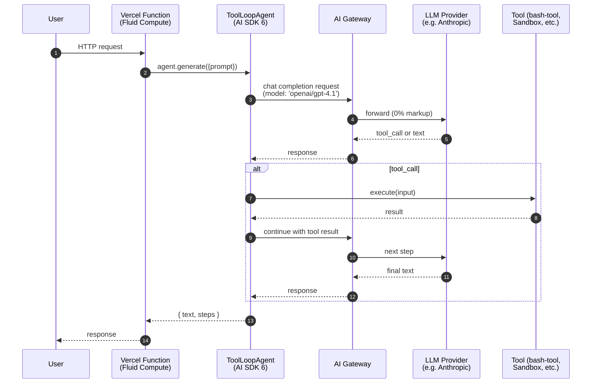
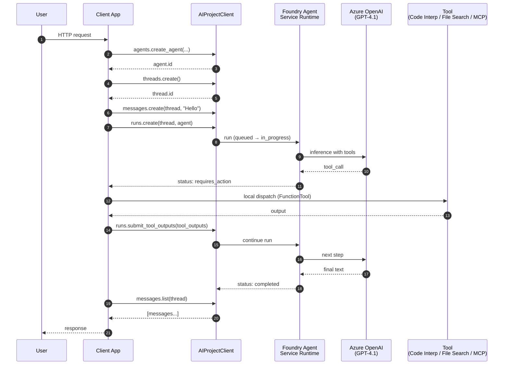
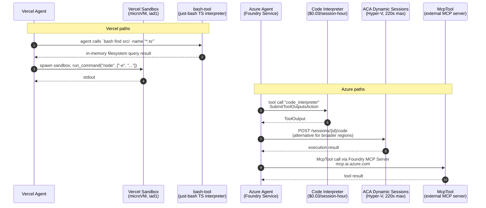

# Vercel Agent Stack vs. Microsoft Azure Agent Stack

**A Senior Principal Cloud Architect's Evaluation · April 2026**

| Field | Value |
|-------|-------|
| **Last Updated (ISO 8601)** | 2026-04-21 |
| **Generating Model** | Claude Opus 4.7 |
| **Report Version** | 1.0.0 (Vercel vs Azure baseline) |
| **Meta-Prompt** | [`Vercel-Azure-Base-Research-Prompt.md`](../../../meta-research-prompts/Vercel-Azure-Base-Research-Prompt.md) v1.0.0 |
| **Output Path** | `generated-reports/vercel-azure/2026/04/2026-04-21-Agent-Comparison-Report-Claude-Opus-4.7.md` |
| **Sister Report** | [Vercel vs AWS (Apr 21, 2026)](../../../vercel-aws/2026/04/2026-04-21-Agent-Comparison-Report-Claude-Opus-4.7.md) v3.0.0 |

> 🎯 **Blessed-Path Principle:** Both platforms let you build agents a billion ways. This report compares only each vendor's **officially recommended** out-of-the-box developer experience — no custom K8s, no third-party orchestrators, no deprecated APIs.

> 📝 **Methodological Note:** This is the **initial Vercel vs Azure baseline** (v1.0.0). It uses the same two-layer architecture framing as the Vercel vs AWS report: **Agent Framework** (the SDK for writing agent logic) vs **Infrastructure** (the runtime, memory, deployment substrate). Don't conflate the layers.

---

## 1. Architectural Framing — Two Layers, One Vendor

Every managed agent stack in 2026 has two layers. Compare them like-for-like or you'll compare the wrong things.

| Layer | Vercel | Azure (April 2026) |
|-------|--------|--------------------|
| **Agent Framework** (SDK for agent logic) | **AI SDK 6.x** — `ToolLoopAgent`, tools, `prepareStep`, streaming (stable); `WorkflowAgent` in v7 beta | **Microsoft Agent Framework 1.0** — `Agent`, `SequentialBuilder`, `ConcurrentBuilder`, `HandoffOrchestration`, `GraphFlow` (GA Apr 3, 2026) — unified successor to Semantic Kernel + AutoGen |
| **Infrastructure** (runtime, memory, deployment) | **Vercel Platform** — Fluid Compute + Sandbox SDK (GA) + Workflow SDK (GA) + AI Gateway + Chat SDK | **Microsoft Foundry Agent Service** — Responses API-based runtime (next-gen GA Mar 16, 2026), Hosted Agents preview, Conversations API, Foundry Evaluations GA, Foundry Tracing GA, Foundry MCP Server preview |
| **Model Layer** | AI Gateway (0% markup, 20+ providers, 100+ models, team-wide ZDR GA) | **Azure OpenAI** (Global / Data Zone / Regional / Priority / Batch / PTU) + **Foundry Models** catalog (DeepSeek, Llama, Mistral, Phi, MAI-\*, 11,000+ total models) |

> ⚠️ **The single most important Azure fact of April 2026:** Microsoft shipped **Agent Framework 1.0 on April 3, 2026**. This SDK *explicitly unifies* Semantic Kernel and AutoGen. From the [GA announcement](https://devblogs.microsoft.com/agent-framework/microsoft-agent-framework-version-1-0/):
>
> > *"When we introduced Microsoft Agent Framework last October, we set out to unify the enterprise-ready foundations of Semantic Kernel with the innovative orchestrations of AutoGen into a single, open-source SDK… Coming from AutoGen or Semantic Kernel? Now is the time to migrate to Microsoft Agent Framework."*
>
> If you're starting a new Azure agent project in April 2026, **do not use Semantic Kernel or AutoGen directly**. Use Microsoft Agent Framework. Both predecessors remain maintained but are explicitly superseded. Official migration guides exist for [SK → MAF](https://learn.microsoft.com/en-us/agent-framework/migration-guide/from-semantic-kernel) and [AutoGen → MAF](https://learn.microsoft.com/en-us/agent-framework/migration-guide/from-autogen).

### Canonical Hello-World — Both Platforms Side by Side

```typescript
// ── Vercel ────────────────────────────────────────────────────
import { ToolLoopAgent, tool, isStepCount } from 'ai';
import { z } from 'zod';

const weatherTool = tool({
  description: 'Get weather for a city',
  inputSchema: z.object({ city: z.string() }),
  execute: async ({ city }) => `${city}: 72°F, Sunny`,
});

const agent = new ToolLoopAgent({
  model: 'openai/gpt-4.1-mini',   // AI Gateway string shorthand
  instructions: 'You are a helpful weather assistant.',
  tools: { weather: weatherTool },
  stopWhen: isStepCount(20),
});

const result = await agent.generate({ prompt: 'Weather in SF?' });
```

```python
# ── Azure (Microsoft Agent Framework 1.0) ────────────────────
from agent_framework import Agent
from agent_framework.foundry import FoundryChatClient
from azure.identity.aio import DefaultAzureCredential

def get_weather(city: str) -> str:
    """Get weather for a city."""
    return f"{city}: 72°F, Sunny"

agent = Agent(
    client=FoundryChatClient(
        project_endpoint="https://<project>.services.ai.azure.com",
        model="gpt-4.1-mini",
        credential=DefaultAzureCredential(),
    ),
    name="WeatherAgent",
    instructions="You are a helpful weather assistant.",
    tools=[get_weather],
)

result = await agent.run("Weather in SF?")
```

> 📝 **Observation:** The Azure code is ~25% shorter than the AWS Strands equivalent because MAF took the Pythonic "any function with a docstring is a tool" pattern from AutoGen and dropped decorators. AI SDK's `tool()` builder is more explicit (Zod schemas) but produces richer type-safety on the TypeScript side. Trade-off, not a winner.

---

## 2. The 2026 Delta — What Changed (Nov 2025 → April 2026)

Both platforms moved hard this window. Azure's story centers on **the Foundry rebrand + GA wave at Ignite 2025 → Q1 2026**. Vercel's centers on **Sandbox GA, Workflow GA, and Claude Opus 4.7**.

### Azure Timeline (newest first)

| Date | Product | Headline |
|------|---------|----------|
| **Apr 21, 2026** | Microsoft Agent 365 | [Frontier Suite](https://blogs.microsoft.com/blog/2026/04/21/accelerating-frontier-transformation-with-microsoft-partners/) announced; GA May 1 — unified agent control plane across Copilot Studio, Foundry, Fabric |
| **Apr 16, 2026** | Azure OpenAI | [o3 + o4-mini GA](https://azure.microsoft.com/en-us/blog/o3-and-o4-mini-unlock-enterprise-agent-workflows-with-next-level-reasoning-ai-with-azure-ai-foundry-and-github/) — reasoning + vision + Responses API; + `gpt-4o-transcribe`, `-mini-transcribe`, `-mini-tts` |
| **Apr 14, 2026** | Azure OpenAI | [GPT-4.1 series GA](https://azure.microsoft.com/en-us/blog/announcing-the-gpt-4-1-model-series-for-azure-ai-foundry-and-github-developers/) — 1M-token context, 26% cheaper than GPT-4o, SFT enabled; 15 PTU minimum for global |
| **Apr 8, 2026** | Microsoft Entra | [Entra Agent ID](https://techcommunity.microsoft.com/blog/microsoft-entra-blog/announcing-microsoft-entra-agent-id-secure-and-manage-your-ai-agents/3827392) public preview — agent identity blueprints, OAuth 2.0 OBO, TUAMI federation |
| **Apr 3, 2026** | **Microsoft Agent Framework 1.0 GA** | [MAF 1.0 GA](https://devblogs.microsoft.com/agent-framework/microsoft-agent-framework-version-1-0/) — unified SK + AutoGen successor; stable APIs; AutoGen officially enters maintenance mode |
| **Apr 2, 2026** | Open Source | [Agent Governance Toolkit](https://opensource.microsoft.com/blog/2026/04/02/introducing-the-agent-governance-toolkit-open-source-runtime-security-for-ai-agents/) — 7-package runtime security covering OWASP Agentic Top 10 |
| **Apr 2, 2026** | Foundry Models | [MAI-Transcribe-1, MAI-Voice-1, MAI-Image-2](https://microsoft.ai/news/today-were-announcing-3-new-world-class-mai-models-available-in-foundry/) — first-party Microsoft models |
| **Mar 20, 2026** | Foundry | [Foundry MCP Server](https://learn.microsoft.com/en-us/azure/foundry/mcp/get-started) preview at `mcp.ai.azure.com` — cloud-hosted MCP, Entra auth |
| **Mar 20, 2026** | Semantic Kernel | [dotnet-1.74.0](https://github.com/microsoft/semantic-kernel/releases/tag/dotnet-1.74.0) — last major SK release before MAF 1.0; CVE-2026-26127 patched |
| **Mar 17, 2026** | Azure OpenAI | [GPT-5.4-mini ($0.75/$4.50) + GPT-5.4-nano ($0.20/$1.25)](https://techcommunity.microsoft.com/blog/azure-ai-foundry-blog/introducing-openai%E2%80%99s-gpt-5-4-mini-and-gpt-5-4-nano-for-low-latency-ai/4500569) for low-latency agentic subtasks |
| **Mar 16, 2026** | **Foundry Agent Service** | [Next-gen GA](https://devblogs.microsoft.com/foundry/foundry-agent-service-ga/) — Responses API-based runtime (wire-compatible with OpenAI Agents SDK); BYO VNet; MCP auth expansion; Voice Live preview |
| **Mar 16, 2026** | **Foundry Control Plane** | [Evaluations + Monitoring + Tracing GA](https://techcommunity.microsoft.com/blog/azure-ai-foundry-blog/generally-available-evaluations-monitoring-and-tracing-in-microsoft-foundry/4502760) — OTel-based distributed tracing, built-in evaluators, Prompt Optimizer preview |
| **Feb 27, 2026** | Azure OpenAI | `gpt-realtime-1.5` + `gpt-audio-1.5` for voice agent pipelines |
| **Feb 16, 2026** | Semantic Kernel | [dotnet-1.71.0](https://github.com/microsoft/semantic-kernel/releases/tag/dotnet-1.71.0) — SQL Server/Postgres hybrid search; SK→MAF migration guide |
| **Feb 13, 2026** | Foundry | [Guardrails for Agents](https://learn.microsoft.com/en-us/azure/foundry/guardrails/guardrails-overview) preview — single-object policy covering Hate/Sexual/Violence/Self-harm/Prompt Shield/Indirect Attack at 4 intervention points |
| **Jan 31, 2026** | Azure OpenAI | [o3-mini GA](https://azure.microsoft.com/en-us/blog/announcing-the-availability-of-the-o3-mini-reasoning-model-in-microsoft-azure-openai-service/) — replaces o1-mini; reasoning effort param, 200K context |
| **Jan 7, 2026** | Foundry Models | DeepSeek R1 becomes first major third-party open reasoning model in Foundry |
| **Dec 3, 2025** | Foundry | [Foundry MCP Server preview announced](https://devblogs.microsoft.com/foundry/announcing-foundry-mcp-server-preview/) |
| **Nov 25, 2025** | Agent Service | [Multi-Agent Workflows preview](https://devblogs.microsoft.com/foundry/introducing-multi-agent-workflows-in-foundry-agent-service) — visual + YAML orchestration on MAF |
| **Nov 19, 2025** | Azure Developer CLI | [`azd ai agent`](https://devblogs.microsoft.com/azure-sdk/azure-developer-cli-foundry-agent-extension) preview — local-to-cloud agent publish in one command |
| **Nov 18, 2025** | **Microsoft Foundry rebrand** | [Ignite 2025 mega-drop](https://azure.microsoft.com/en-us/blog/microsoft-foundry-scale-innovation-on-a-modular-interoperable-and-secure-agent-stack/) — "Azure AI Foundry" → "Microsoft Foundry"; Foundry IQ, Model Router GA, Foundry Control Plane, Hosted Agents, Claude family added, Foundry Local on Android |
| **Nov 18, 2025** | Agent Service | [Ignite feature drop](https://techcommunity.microsoft.com/blog/azure-ai-foundry-blog/foundry-agent-service-at-ignite-2025-simple-to-build-powerful-to-deploy-trusted-/4469788) — built-in memory, Hosted Agents, Claude/Cohere/NVIDIA models, MCP integration, M365/Teams distribution |
| **Nov 18, 2025** | Content Safety | Task Adherence API preview — first Content Safety feature purpose-built for *agentic* (not just generative) AI |

### Vercel Timeline (parallel, for context)

| Date | Headline |
|------|----------|
| **Apr 16, 2026** | Vercel Workflow GA (2× faster, E2E encrypted) + Claude Opus 4.7 on AI Gateway |
| **Apr 9, 2026** | [Agentic Infrastructure blog](https://vercel.com/blog/agentic-infrastructure) |
| **Apr 8, 2026** | AI Gateway team-wide ZDR GA + Sandbox 32 vCPU / 64 GB Enterprise |
| **Mar 26, 2026** | Persistent Sandboxes beta |
| **Mar 17, 2026** | Workflow E2E encryption (AES-256-GCM, per-run HKDF-SHA256) + Vercel Plugin for Coding Agents |
| **Feb 23, 2026** | Vercel Chat SDK launch (Slack, Discord, Teams, WhatsApp, Telegram) |
| **Feb 17, 2026** | Claude Sonnet 4.6 on AI Gateway |
| **Feb 5, 2026** | Claude Opus 4.6 on AI Gateway |
| **Jan 30, 2026** | [Vercel Sandbox GA](https://vercel.com/blog/vercel-sandbox-is-now-generally-available) |
| **Jan 22, 2026** | Sandbox filesystem snapshots |
| **Jan 20, 2026** | Montréal `yul1` — Fluid Compute 21st region |
| **Jan 7, 2026** | [bash-tool](https://vercel.com/changelog/introducing-bash-tool-for-filesystem-based-context-retrieval) open-sourced |

### Delta in One Sentence

**Azure went all-in on "Foundry-everything":** a rebrand, a GA-quality Responses-API runtime, a unified agent framework that explicitly kills SK+AutoGen as primary entry points, OTel-native observability, per-agent guardrails, cloud-hosted MCP, and a first-class identity model for agents. **Vercel doubled down on "use any workload, we'll run it durably":** Sandbox GA gave you microVMs for arbitrary code, Workflow GA gave you `"use workflow"` durability, Chat SDK gave you multi-platform chat out of the box. Different philosophies: Azure sells you a managed agent runtime, Vercel sells you the compute + durability primitives under your own agent code.

---

## 3. Infrastructure Footprint (Hard Facts)

Side-by-side, blessed path only. 17 capabilities.

| Capability | Vercel Stack | Azure Stack |
|------------|--------------|-------------|
| **Agent Framework** | AI SDK 6.x (`ToolLoopAgent`, tools, `prepareStep`, `dynamicTool`) + `WorkflowAgent` (v7 beta, durable) | **Microsoft Agent Framework 1.0** (`Agent`, `SequentialBuilder`, `ConcurrentBuilder`, `HandoffOrchestration`, `GraphFlow`, `Executor` primitives) |
| **Model Gateway/Routing** | AI Gateway (0% markup, 20+ providers, 100+ models, fallbacks, BYOK, team-wide ZDR GA, Custom Reporting API) | **Foundry Models** catalog (11,000+ models via MaaS/PAYG + PTU) + **Model Router** (OpenAI ↔ DeepSeek, Oct 2025) + Azure OpenAI (Global / Data Zone / Regional / Priority / Batch tiers) |
| **Infrastructure Wrapper** | Vercel Platform (Fluid Compute, Active CPU billing, I/O wait free) | **Foundry Agent Service** (Responses API runtime, Hosted Agents preview, `from_agent_framework()` deployment pattern, `agent.yaml` manifest) |
| **Secure Code Execution** | Sandbox SDK **GA** (Firecracker microVMs, TS+Python, 8 vCPU Pro / 32 vCPU Enterprise, Persistent Sandboxes beta, filesystem snapshots, `iad1` only) | **Code Interpreter** tool (GA, $0.03/session-hour, 20 of 24 Agent Service regions) + **Azure Container Apps Dynamic Sessions** (GA, Hyper-V isolated, Python/Node/Shell, 220s max exec, 37 regions) |
| **Durable Workflows** | Workflow SDK **GA** (`"use workflow"` directive, E2E encrypted, 2× faster, custom class serialization, Python beta, event-sourced, `iad1` backend) | **Multi-agent Workflows** (preview Nov 25, 2025 — visual + YAML orchestration on MAF) + **Azure Durable Task Scheduler** (for Functions, Dedicated/Consumption plans) |
| **Browser Automation** | Anthropic Computer Use tools (`computer_20250124`, `webSearch_20250305`) + Kernel (Marketplace) | **Browser Automation tool** (preview) + **Computer Use tool** (preview — only in East US 2 and South India) |
| **Persistent Memory** | External (Redis, DB) or `WorkflowAgent` state | **Foundry Memory** (preview) + **Conversations API** (GA, stateful server-side threads via `AzureAIAgentThread`) + **Azure AI Search** (vector + Agentic Retrieval) + **Cosmos DB** (vector search, customer-owned) |
| **Tool Management / MCP** | `@ai-sdk/mcp` client (stable HTTP/SSE transports, `Experimental_StdioMCPTransport`) | **`McpTool`** (native MCP client in `azure-ai-agents`) + **Foundry MCP Server** (cloud-hosted at `mcp.ai.azure.com`, Entra auth, preview Mar 20, 2026) + Foundry Tool Catalog (MCP/OpenAPI) |
| **Protocol Support** | MCP | MCP + A2A (preview) + **OpenAI Responses API** (wire-compatible — any Responses client works against Foundry Agent Service) |
| **Authorization** | Environment Variables, middleware, AI Gateway team-wide ZDR (Apr 8, 2026) | **Microsoft Entra Agent ID** (preview Apr 8, 2026) — OAuth 2.0 OBO, Managed Identity federation (TUAMI), agent identity blueprints |
| **Identity/OAuth** | NextAuth/Auth.js, custom | Microsoft Entra ID (GA) + **Foundry Agent Identity** (GA) + Managed Identity per agent |
| **Evaluations** | External (BYO — Braintrust, Langfuse, custom LLM judges) | **Foundry Evaluations GA** (Mar 16, 2026) — built-in evaluators (coherence, relevance, groundedness), custom evaluators, continuous production monitoring |
| **Agent Discovery** | N/A (BYO registry) | **Foundry Agent Catalog** (portal + SDK listing for project-scoped agents) |
| **Observability** | AI SDK telemetry (OTEL-compatible, `@ai-sdk/otel` stable in v7), Workflow data in Vercel Observability (Apr 7) | **Foundry Monitoring & Tracing GA** (Mar 16, 2026, OTel-based) + **Azure Monitor / Application Insights** ($2.30/GB Analytics, $0.50/GB Basic, $0.05/GB Auxiliary) |
| **Multi-Agent** | Compose `ToolLoopAgent` + subagents via `toModelOutput` | MAF `SequentialBuilder`, `ConcurrentBuilder`, `HandoffOrchestration`, `GraphFlow` (all GA in 1.0); AutoGen `Swarm` / `GraphFlow` (legacy); Foundry Multi-agent Workflows (preview, visual/YAML) |
| **Chat Integration** | Chat SDK (Slack, Discord, Teams, WhatsApp, Telegram — Feb 23, 2026) | **Microsoft 365 Agents Toolkit** + Teams integration + Copilot Studio distribution channels |
| **Content Safety / Guardrails** | Model-native safety (Claude, OpenAI) + custom middleware | **Foundry Guardrails for Agents** (preview Feb 13, 2026) — Hate/Sexual/Violence/Self-harm/Prompt Shield/Indirect Attack Detection at 4 intervention points (system prompt, user turn, tool call, agent output) + **Content Safety Task Adherence API** (preview, agent misalignment detection) |

### Deep-Dive: Selected Rows

**Runtime Persistence.** Azure Foundry Agent Service stores conversation state server-side via the Conversations API; `AzureAIAgentThread` survives process restarts and is accessible from any client with the thread ID. Vercel Workflow SDK persists function state via an event-sourced queue backend (`iad1`-pinned for now); the `"use workflow"` directive transforms async functions into durable, resumable, crash-safe processes. **Azure's persistence is agent-scoped and automatic; Vercel's is function-scoped and explicit.** Both survive redeploys.

**Code Execution.** Azure Foundry Code Interpreter runs at **$0.03/session-hour** (flat) with a 1-hour session window. Azure Container Apps Dynamic Sessions runs the same $0.03/session-hour meter but with **220 seconds max per code run** and **Hyper-V isolation**. Vercel Sandbox SDK bills at **$0.128/CPU-hour + $0.0212/GB-hour + $0.60/1M creations + $0.15/GB network + $0.08/GB-month storage** — more dimensions, but no per-run time cap (within plan limits). For a 10-second agent code execution, Azure's session-hour billing has minimum granularity pain (you pay 1 hour even for 10s of work); Vercel bills per-second of actual CPU. For long-running analysis sessions, Azure's flat rate wins. **Pick based on workload shape, not rack rate.**

**Context Retrieval.** Vercel `bash-tool` (Jan 7, 2026) uses the `just-bash` TypeScript interpreter — no shell process, no binary execution, in-memory or sandboxed filesystems. Token-efficient for "let the agent grep the repo" patterns. Azure's equivalent is **File Search** (tool-level RAG over uploaded docs) at **$0.10/GB/day storage + $2.50/1K tool calls** (Responses API), with vector storage backed by Azure AI Search under the hood. Different patterns: Vercel's is "let the agent run Unix"; Azure's is "let the agent query a managed vector index."

**Security Primitives.** Vercel: environment variables, middleware, AI Gateway team-wide ZDR (Apr 8, 2026). Azure: **Microsoft Entra ID** (the deepest enterprise identity story of any cloud), Azure RBAC, Managed Identity per agent, **Entra Agent ID** preview (agent identity blueprints + OAuth 2.0 OBO + TUAMI federation), **Foundry Guardrails** at 4 intervention points, **Agent Governance Toolkit** open-source (Apr 2, 2026) covering OWASP Agentic Top 10 with policy engine, zero-trust identity mesh, execution rings, kill switch, EU AI Act / HIPAA / SOC2 compliance mapping.

**Protocol Support.** Azure ships three agent protocols in the Agent Service runtime: **MCP** (client via `McpTool`, cloud server at `mcp.ai.azure.com`), **A2A** (preview), and **OpenAI Responses API** (wire-compatible — this means an OpenAI Agents SDK client can talk to Foundry Agent Service unchanged). Vercel supports MCP natively; A2A and Responses API are not first-party concerns (the AI SDK targets the abstraction layer above protocol choice). **Azure's protocol breadth is a direct consequence of Foundry being a hosted runtime; Vercel's protocol minimalism is a consequence of being a generic compute platform.**

**Regional Availability.** Preview in §4 below. One-line summary: **Azure has 24 Agent Service regions vs Vercel's 21 compute regions + global edge**. But Azure's regional coverage is *fragmented* — North Europe and West Europe have Foundry projects but no Agent Service; Computer Use is in only 2 regions; o3-pro / codex-mini only in East US 2 + Sweden Central. Vercel's Sandbox and Workflow state-backend are both `iad1`-pinned. Neither platform is "deploy anywhere" for agents today.

---

## 4. Regional Availability Matrix

> ⚠️ **Production Consideration:** Azure has broader agent-region coverage than AWS (24 vs 14 Agent Service regions), but narrower than you'd expect — six regions (North Europe, West Europe, Central India, East Asia, Qatar Central, West US 2) have Foundry projects but NO Agent Service. Tool support is also heterogeneous within the 24.

### Azure Foundry Agent Service — Feature by Region (April 2026)

**Source:** [Foundry Region Support](https://learn.microsoft.com/en-us/azure/foundry/reference/region-support), [Agent Service Limits & Regions](https://learn.microsoft.com/en-us/azure/foundry/agents/concepts/limits-quotas-regions), [Tool Best Practice](https://learn.microsoft.com/en-us/azure/foundry/agents/concepts/tool-best-practice)

| Feature | Regions | Notes |
|---------|---------|-------|
| **Agent Service (Prompt agents)** | **24 GA regions** | australiaeast, brazilsouth, canadacentral, canadaeast, eastus, eastus2, francecentral, germanywestcentral, italynorth, japaneast, koreacentral, northcentralus, norwayeast, polandcentral, southafricanorth, southcentralus, southeastasia, southindia, spaincentral, swedencentral, switzerlandnorth, uaenorth, uksouth, westus, westus3 |
| **Hosted Agents** | **Preview across all 24** Agent Service regions | `from_agent_framework()` + `agent.yaml` + Dockerfile |
| **Workflow Agents** (multi-agent visual/YAML) | Preview subset | Announced Nov 25, 2025 |
| **Code Interpreter tool** | **20 of 24** | NOT in Japan East, South Central US, Southeast Asia, Spain Central |
| **File Search tool** | **22 of 24** | NOT in Italy North, Brazil South |
| **Computer Use tool** | **2 of 24** — East US 2, South India | Limited preview |
| **Browser Automation tool** | Preview, expanded subset | Expanded in Apr 2026 update |
| **Foundry Evaluations / Monitoring / Tracing** | Wherever Agent Service is GA | GA Mar 16, 2026 via Foundry Control Plane |
| **Foundry MCP Server** | Global endpoint `mcp.ai.azure.com` | Preview since Mar 20, 2026 |
| **Web Search tool (Bing Grounding)** | All 24 Agent Service regions | ⚠️ Data transfers **outside** compliance boundaries — MS DPA does NOT apply |

### Azure OpenAI Model Regional Availability (Regional Standard)

> ✅ Regional Standard · 🌐 Global Standard only (no regional residency) · — Not available

| Region | GPT-5 family | GPT-4.1 | GPT-4o | o4-mini | o3 | o3-mini | o1 | Whisper |
|--------|:------------:|:-------:|:------:|:-------:|:--:|:-------:|:--:|:-------:|
| **East US** | ✅ | ✅ | ✅ | ✅ | ✅ | ✅ | ✅ | ✅ |
| **East US 2** | ✅ | ✅ | ✅ | ✅ | ✅ | ✅ | ✅ | ✅ |
| **South Central US** | ✅ | ✅ | ✅ | ✅ | ✅ | ✅ | — | — |
| **West US** | ✅ | ✅ | ✅ | ✅ | ✅ | ✅ | — | — |
| **West US 3** | ✅ | ✅ | ✅ | ✅ | ✅ | ✅ | ✅ | — |
| **Canada East** | ✅ | ✅ | ✅ | ✅ | ✅ | ✅ | ✅ | — |
| **Brazil South** | ✅ | ✅ | ✅ | 🌐 | 🌐 | 🌐 | — | — |
| **Sweden Central** | ✅ | ✅ | ✅ | ✅ | ✅ | ✅ | ✅ | ✅ |
| **France Central** | ✅ | ✅ | ✅ | ✅ | ✅ | ✅ | ✅ | — |
| **Germany West Central** | ✅ | ✅ | ✅ | ✅ | ✅ | ✅ | — | — |
| **Switzerland North** | ✅ | ✅ | ✅ | ✅ | ✅ | ✅ | ✅ | — |
| **UK South** | ✅ | ✅ | ✅ | ✅ | ✅ | ✅ | ✅ | — |
| **Norway East** | ✅ | ✅ | ✅ | ✅ | ✅ | ✅ | — | — |
| **Poland Central** | ✅ | ✅ | ✅ | ✅ | ✅ | ✅ | — | — |
| **Spain Central** | ✅ | ✅ | ✅ | 🌐 | 🌐 | 🌐 | — | — |
| **Italy North** | ✅ | ✅ | ✅ | 🌐 | 🌐 | 🌐 | — | — |
| **Australia East** | ✅ | ✅ | ✅ | ✅ | ✅ | ✅ | ✅ | — |
| **Japan East** | ✅ | ✅ | ✅ | ✅ | ✅ | ✅ | ✅ | — |
| **Korea Central** | ✅ | ✅ | ✅ | ✅ | ✅ | ✅ | — | — |
| **Southeast Asia** | ✅ | ✅ | ✅ | ✅ | ✅ | ✅ | — | — |
| **South India** | ✅ | ✅ | ✅ | 🌐 | 🌐 | 🌐 | — | — |
| **UAE North** | ✅ | ✅ | ✅ | ✅ | ✅ | ✅ | — | — |
| **South Africa North** | ✅ | ✅ | ✅ | ✅ | ✅ | ✅ | — | — |

> **GPT-5.4 (frontier, Mar 2026):** Regional Standard ONLY in East US 2, Sweden Central, South Central US, Poland Central.
> **o3-pro / codex-mini:** Global Standard ONLY in East US 2 + Sweden Central.
> **o1 footprint:** Only 10 regions with Regional Standard.

### Azure Sovereign Cloud Availability

| Cloud | Portal | Agent Service | AI Search | Notes |
|-------|--------|---------------|-----------|-------|
| **Azure Commercial** | `ai.azure.com` (GA) | ✅ Full | ✅ Full | Primary target |
| **Azure Government (US)** | `ai.azure.us` | ❌ NOT supported | ✅ Limited | US Gov Virginia, US Gov Arizona; no Agents playground, no fine-tuning, no serverless endpoints |
| **Azure China (21Vianet)** | Separate portal | ❌ NOT supported | ✅ Limited | AI Search available (China North 3 has semantic ranker); no Foundry Agent Service |

### Vercel Regional Availability (April 2026) — Reference

| Feature | Availability | Notes |
|---------|--------------|-------|
| AI SDK 6.x | Global (Edge + Serverless) | Runs anywhere Vercel deploys |
| AI Gateway | Global | Edge-optimized routing, 0% markup, team-wide ZDR GA Apr 8 |
| Fluid Compute | **21 compute regions** | Montréal `yul1` added Jan 20, 2026 |
| Sandbox SDK | **`iad1` only** (Washington, D.C.) | GA Jan 30, 2026; still single-region |
| Workflow SDK | **Execution global, state `iad1` only** | GA Apr 16, 2026 |
| Chat SDK | Global | Feb 23, 2026 launch |

### Critical Deployment Gaps (Azure)

🔴 **Hard Blockers:**
1. **West US 2** — ACA Dynamic Sessions + AI Search available, but **no Agent Service, no Foundry project**
2. **North Europe / West Europe** — Foundry projects + AI Search, but **no Agent Service**. Major gap for EU customers who want to avoid Sweden Central
3. **Central India / East Asia / Qatar Central** — Foundry projects available, **no Agent Service**

🟡 **Partial Coverage:**
4. **Japan East / South Central US / Southeast Asia / Spain Central** — Agent Service GA, but **Code Interpreter tool not available**
5. **Brazil South / Italy North / Spain Central / South India** — Agent Service available but **o3/o4-mini/o1 are Global Standard only** (no regional data residency for reasoning models)

🟢 **Fully-Stacked Regions** (Agent Service + full model catalog + Code Interpreter + AI Search full + ACA Sessions):
**East US 2** (only region with Computer Use), **Sweden Central** (best EU option), **Australia East** (best APAC), **UK South**, **France Central**, **Germany West Central**, **Switzerland North**, **Canada East**, **Korea Central**, **UAE North**, **South Africa North**

### Comparison Questions

- **Regional breadth:** Azure (24) > Vercel (21 + global edge) for compute count, but Vercel's edge network wins for global static/CDN latency.
- **Reasoning model geography:** If you need o3-pro or codex-mini in Europe, you're pinned to Sweden Central. GPT-5.4 needs East US 2 / Sweden Central / South Central US / Poland Central. Vercel+AI Gateway routes to whichever upstream has capacity — no regional gating on the Vercel side.
- **Sovereign cloud:** If you're on Azure Gov or 21Vianet, **Agent Service simply doesn't exist** — you drop back to raw Azure OpenAI + your own agent loop.
- **Sandbox latency:** If your agent uses Vercel Sandbox, all code-execution traffic goes to `iad1` regardless of where the agent is deployed. For EU-primary workloads this adds 80-120ms per code call. Azure's ACA Dynamic Sessions exists in 37 regions and co-locates with your agent.

---

## 5. 2026 Unit Economics

> 🎯 **Methodological Note:** All per-token prices below are per 1 million tokens, USD, confirmed from Azure's pricing pages as of April 21, 2026. **Azure's pricing pages render token prices via JavaScript** — static HTML fetches return `$-` placeholders. Figures below were sourced from search-engine-cached renders and cross-validated against third-party mirrors; any figure rendered as `$-` in static HTML is marked **DOCUMENTATION GAP** and needs verification via the [Azure Pricing Calculator](https://azure.microsoft.com/en-us/pricing/calculator/) or the Azure Retail Prices API.

### 5a. Model Layer — Azure OpenAI (Per 1M Tokens, USD)

**Source:** [Azure OpenAI Pricing](https://azure.microsoft.com/en-us/pricing/details/azure-openai/)

#### GPT-4.1 Series (primary recommended agent model)

| Model | Deployment | Input | Cached Input | Output | Batch Input | Batch Output |
|-------|-----------|-------|--------------|--------|-------------|--------------|
| **GPT-4.1** | Global | $2.00 | $0.50 | $8.00 | $1.00 | $4.00 |
| **GPT-4.1** | Data Zone | $2.20 | $0.55 | $8.80 | — | — |
| **GPT-4.1** | Regional | $2.20 | $0.55 | $8.80 | N/A | N/A |
| **GPT-4.1 Priority** | Global | $3.50 | $0.88 | $14.00 | N/A | N/A |
| **GPT-4.1-mini** | Global | $0.40 | $0.10 | $1.60 | $0.20 | $0.80 |
| **GPT-4.1-nano** | Global | $0.10 | $0.025 | $0.40 | $0.05 | $0.20 |

Context window: **1M tokens**. Knowledge cutoff: June 2024.

#### GPT-5 Series

| Model | Deployment | Input | Cached Input | Output |
|-------|-----------|-------|--------------|--------|
| **GPT-5** | Global | $1.25 | $0.13 | $10.00 |
| **GPT-5 Priority** | Global | $2.50 | $0.25 | $20.00 |
| **GPT-5 Pro** | Global | $30.00 | — | $150.00 |
| **GPT-5-mini** | Global | $0.25 | $0.025 | $2.00 |
| **GPT-5-nano** | Global | $0.20 | $0.02 | $1.25 |
| **GPT-5.3 Codex** | Global | $1.75 | $0.18 | $14.00 |
| **GPT-5.4-mini** | Global | $0.75 | — | $4.50 |
| **GPT-5.4-nano** | Global | $0.20 | — | $1.25 |

> ⚠️ **DOCUMENTATION GAP:** GPT-5.1 and GPT-5.2 sub-series per-token rates render as `$-` in static HTML. Verify via Azure Pricing Calculator.

#### o-Series Reasoning Models

| Model | Deployment | Input | Cached Input | Output | Batch Input | Batch Output |
|-------|-----------|-------|--------------|--------|-------------|--------------|
| **o4-mini** | Global | $1.10 | $0.275 | $4.40 | $0.55 | $2.20 |
| **o4-mini** | Data Zone | $1.21 | $0.31 | $4.84 | $0.61 | $2.42 |
| **o3** | Global | $2.00 | $0.50 | $8.00 | $1.00 | $4.00 |
| **o3-mini** | Global | $1.10 | $0.275 | $4.40 | $0.55 | $2.20 |
| **o1** | Global | $15.00 | $7.50 | $60.00 | N/A | N/A |

#### GPT-4o (legacy, still supported)

| Model | Deployment | Input | Cached Input | Output |
|-------|-----------|-------|--------------|--------|
| **GPT-4o** | Global | $2.50 | $1.25 | $10.00 |
| **GPT-4o-mini** | Global | $0.15 | $0.075 | $0.60 |

### 5b. Deployment Tier Multipliers

| Tier | Multiplier vs Global Standard | Use Case |
|------|-------------------------------|----------|
| **Priority Processing** | **+75%** | Latency-sensitive user-facing agents |
| **Global Standard** | Baseline | Default, highest throughput |
| **Data Zone (US or EU)** | +10% | Data residency within zone |
| **Regional Standard** | +10% on Data Zone (~+21% on Global) | Hard regional data residency |
| **Batch API** | **−50%** | Async workloads, 24-hour SLA |

### 5c. Provisioned Throughput Units (PTU)

| Model | Min PTU | Hourly $/PTU | Monthly Reservation $/PTU | Yearly Reservation $/PTU |
|-------|:-------:|:------------:|:-------------------------:|:-----------------------:|
| GPT-5 Global | 15 | $1.00 | $260 | $2,652 |
| GPT-5 Data Zone | 15 | $1.10 | $286 | $2,916 |
| GPT-5 Regional | 50 | $2.00 | $286 | $2,916 |
| GPT-4.1 Global | 15 | $1.00 | $260 | $2,652 |
| o4-mini Global | 15 | $1.00 | $260 | $2,652 |
| GPT-4o Global | 15 | $1.00 | $260 | $2,652 |

**PTU economics:** Monthly reservation ≈ **64% off** hourly PAYG (at 730 hrs/month). Yearly reservation ≈ **70% off**. For steady-state agent traffic above ~30% average utilization on a single model, PTU beats PAYG.

### 5d. Built-in Tools (Assistants API — sunset Aug 26, 2026 — or Responses API)

| Tool | Price |
|------|-------|
| **Code Interpreter** | **$0.03/session** (1-hour session window) |
| **File Search** (vector storage) | **$0.10/GB/day** (1 GB free) |
| **File Search Tool Call** (Responses API) | **$2.50/1K tool calls** |
| **Computer Use** (Responses API) | Input: $3.00/1M · Output: $12.00/1M |

### 5e. Foundry Models Catalog (MaaS, Per 1M Tokens)

| Model | Deployment | Input | Output |
|-------|-----------|-------|--------|
| **DeepSeek V3.2** | Global | $0.58 | $1.68 |
| **DeepSeek V3.2** | Data Zone | $0.64 | $1.85 |
| **DeepSeek R1** | Global | $1.35 | $5.40 |
| **DeepSeek R1** | Data Zone / Regional | $1.485 | $5.94 |
| **DeepSeek V3** | Global | $1.14 | $4.56 |
| **Mistral OCR** | — | $1.00 / 1K pages | (flat) |
| **mistral-document-ai-2505** | — | $3.00 / 1K pages | (flat) |
| **MAI-Transcribe-1** | — | $0.36 / hr audio | (flat) |
| **MAI-Voice-1** (TTS) | — | $22 / 1M characters | (flat) |
| **MAI-Image-2** | — | $5 / 1M text tokens | (flat) |
| Llama 4 / Phi-4 / Mistral text | All | **DOCUMENTATION GAP** | DOCUMENTATION GAP |

### 5f. Infrastructure Layer (Foundry Agent Service + Azure primitives)

| Component | Price | Notes |
|-----------|-------|-------|
| **Agent orchestration** | **$0** | Foundry-native agents incur no orchestration charge |
| **Thread / conversation storage** | **$0 direct** | Stored in customer's Cosmos DB + Azure Storage (customer pays directly) |
| **Hosted Agents compute** | **DOCUMENTATION GAP** | vCPU/GiB-hour rates render as `$-`; verify via Pricing Calculator |
| **Code Interpreter tool** | $0.03/session-hour | (same as Azure OpenAI built-in) |
| **File Search Storage** | $0.10/GB/day (1 GB free) | Vector storage |
| **Web Search (Bing Grounding)** | DOCUMENTATION GAP | Separate Bing billing |
| **Custom Search** | DOCUMENTATION GAP | Preview |
| **Deep Research** | DOCUMENTATION GAP | Billed at model + Bing rates |
| **ACA Dynamic Sessions** — Code interpreter | $0.03/session-hour PAYG ($0.026 1yr, $0.025 3yr savings) | 220s max exec per code run; ~37 regions |
| **Azure Functions (Flex Consumption)** | $0.000026/GB-s + $0.40/M executions | 100K GB-s + 250K exec/month free |
| **Azure AI Search S1** | $245.28/SU/month | 160 GB/partition, 50 indexes; vector bundled |
| **Azure AI Search Semantic Ranker** | 1K req/mo free, then $5/1K | — |
| **Azure AI Search Agentic Retrieval** | 50M tokens/mo free, then DOCUMENTATION GAP | — |
| **Cosmos DB Serverless** | $0.25/M RUs | + $0.25/GB/mo storage (+25% for AZ redundancy) |
| **Azure Monitor — Analytics Logs** | $2.30/GB ingestion, 5 GB/mo free | 31 days retention included |
| **Azure Monitor — Basic Logs** | $0.50/GB | 30 days |
| **Azure Monitor — Auxiliary Logs** | $0.05/GB | 30 days |

### 5g. Worked Example — 1,000 Agent Turns

**Assumptions:** 1 turn = 2,000 input tokens + 500 output tokens + 0.1% hit rate on Code Interpreter + 0.5 AI Search queries amortized.

| Stack Configuration | Model Cost | Code Interp | AI Search (S1 amortized) | **Total / 1K turns** |
|---|---|---|---|---|
| **GPT-4.1-mini Global** (Azure) | $0.40×2 + $1.60×0.5 = $1.60 | $0.03 | ~$0.01 | **~$1.64** |
| **GPT-5-mini Global** (Azure) | $0.25×2 + $2.00×0.5 = $1.50 | $0.03 | ~$0.01 | **~$1.54** |
| **GPT-4.1 Global** (Azure) | $2.00×2 + $8.00×0.5 = $8.00 | $0.03 | ~$0.01 | **~$8.04** |
| **GPT-5 Global** (Azure) | $1.25×2 + $10.00×0.5 = $7.50 | $0.03 | ~$0.01 | **~$7.54** |
| **o4-mini Global** (Azure) | $1.10×2 + $4.40×0.5 = $4.40 | $0.03 | ~$0.01 | **~$4.44** |
| **DeepSeek V3.2** (Foundry Models) | $0.58×2 + $1.68×0.5 = $1.96 | $0.03 | ~$0.01 | **~$2.00** |
| **DeepSeek R1** (Foundry Models) | $1.35×2 + $5.40×0.5 = $5.40 | $0.03 | ~$0.01 | **~$5.44** |
| **Claude Sonnet 4.6 via Vercel AI Gateway** | $3×2 + $15×0.5 = $13.50 | Vercel Sandbox: ~$0.02 | BYO | **~$13.52** (+ Fluid Compute) |
| **Claude Opus 4.7 via Vercel AI Gateway** | $5×2 + $25×0.5 = $22.50 | Vercel Sandbox: ~$0.02 | BYO | **~$22.52** (+ Fluid Compute) |

> 📝 **The pricing delta is the model, not the infrastructure.** For the same Claude/OpenAI model accessed on both platforms, Vercel charges 0% markup and Azure charges whatever deployment tier you picked. The infra cost sits at <5% of total for most agent workloads. **Pick based on DX and regional fit, not rack rate — the model layer dominates TCO.**

### 5h. The "Tier" Tax (Azure-Specific)

Azure OpenAI's deployment tier choice is a **hidden TCO lever**:

- **Priority Processing (+75%)** — User-facing agents that need <2s p99 latency. Typical for customer support, real-time voice. Budget this as "premium SKU for latency SLA."
- **Batch API (−50%)** — Async workloads: overnight report generation, eval runs, offline RAG indexing. If your agent can tolerate 24h SLA, you're leaving 50% on the table by not using Batch.
- **Data Zone (+10%)** — Compliance insurance: GDPR, HIPAA-adjacent. Pay 10% to guarantee EU-only or US-only processing path.
- **Regional (+~21%)** — Hardest residency guarantee. Required for some regulated EU sectors (finance, healthcare).
- **PTU** — Payback threshold ≈ 30% steady-state utilization. Below that, stick with PAYG.

### 5i. Cosmos DB Thread Storage — The Hidden Line Item

Foundry Agent Service stores thread/conversation history in **your own Cosmos DB** — not Microsoft's. This is a **$0 charge from Microsoft** but a **real charge from your Cosmos DB bill**. Each thread operation:

- Point read (message by ID): **~1 RU**
- Write (1 KB message): **~5 RUs**
- Vector search query (diskANN, >1,000 vectors): lower RU than full scan

**For a 1,000-turn agent:** ~5K RUs writes + ~1K RUs reads = 6K RUs → **$0.0015** at $0.25/M RUs. Trivial at this scale, but a 1M-turn/day production agent accumulates ~6M RUs/day ≈ $45/month + storage. **Model this separately; it's easy to miss.**

### 5j. Vercel Platform Pricing — Reference

**Source:** [Vercel Sandbox Pricing](https://vercel.com/docs/vercel-sandbox/pricing), [Vercel Workflow Pricing](https://vercel.com/docs/workflows/pricing), [Fluid Compute Pricing](https://vercel.com/docs/fluid-compute/pricing)

| Service | Price |
|---------|-------|
| **AI Gateway** — model pass-through | **$0 markup** (provider list price) |
| **AI Gateway** — free tier | $5/month credit |
| **AI Gateway** — team-wide ZDR | $0 additional (Pro + Enterprise, Apr 8, 2026) |
| **Sandbox SDK** — Active CPU | $0.128/hour (Pro/Enterprise) |
| **Sandbox SDK** — Memory | $0.0212/GB-hour |
| **Sandbox SDK** — Creations | $0.60 per 1M |
| **Sandbox SDK** — Data Transfer | $0.15/GB |
| **Sandbox SDK** — Storage | $0.08/GB-month |
| **Workflow SDK** — Steps | $2.50 per 100K steps |
| **Workflow SDK** — Storage | $0.00069/GB-hour |
| **Fluid Compute** — US East (iad1/cle1/pdx1) | $0.128/CPU-hour (I/O wait free) |
| **Fluid Compute** — US West (sfo1) | $0.177/CPU-hour |
| **Fluid Compute** — EU (fra1) | $0.184/CPU-hour |
| **Secure Compute** | $6,500/year + $0.15/GB |

---

## 6. Agent Stack Deep-Dive

### 6a. Vercel Agent Stack

**AI SDK 6.x (stable, `ai@6.0.168`+).** The `ToolLoopAgent` class is the recommended abstraction. New since 6.0.23: `prepareStep` (per-step model/tool overrides), `callOptionsSchema` + `prepareCall` (typed call-time context), `toModelOutput` on tools (control what the parent agent sees from subagents). Stop conditions: `isStepCount(N)`, `hasToolCall('name')`, `isLoopFinished()`, or custom `({ steps }) => boolean`. Tool definition switched from `parameters` (v4/v5) to `inputSchema` (v6); execute receives `(input, { abortSignal, messages, context })`.

**AI SDK v7 beta (`ai@7.0.0-beta.111`+).** ESM-only packages, new `WorkflowAgent` primitive in `@ai-sdk/workflow` for durable agents, stable `@ai-sdk/otel` telemetry package, `toolNeedsApproval` for human-in-the-loop, `uploadFile`/`uploadSkill` provider abstractions.

**AI Gateway.** Single endpoint for 20+ providers, 100+ models including Claude Opus 4.7, GPT-5.4, Gemini 3.1, Kimi K2.6. **0% markup confirmed** — provider list price passes through for both BYOK and managed credentials. Features: fallback chains, per-provider custom timeouts (Mar 5, 2026), Custom Reporting API (Mar 25, 2026), live model performance metrics (Jan 26, 2026), team-wide ZDR (Apr 8, 2026). String shorthand `model: 'openai/gpt-4.1'` requires no provider import; explicit `gateway('provider/model')` import for advanced options.

**Sandbox SDK (GA Jan 30, 2026).** Firecracker microVMs, TS + Python runtimes, 8 vCPU Pro / 32 vCPU Enterprise (Apr 8, 2026), Persistent Sandboxes beta (Mar 26, 2026), filesystem snapshots (Jan 22, 2026), CLI via `vercel sandbox`. Only in `iad1` as of April 2026 — community requests for Tokyo (hnd1) and others acknowledged but not shipped.

**bash-tool (Jan 7, 2026, open-source).** `just-bash` TypeScript interpreter — no shell process, no binary execution. Tools: `bash`, `readFile`, `writeFile`. Works in-memory or sandboxed (with Vercel Sandbox). Optimizes context: agents retrieve slices on demand via `find`, `grep`, `jq`, pipes instead of stuffing entire files into prompts. Skills support via `experimental_createSkillTool` (Jan 21, 2026).

**Workflow SDK (GA Apr 16, 2026).** `"use workflow"` directive transforms async functions into durable workflows. E2E encrypted by default (AES-256-GCM, per-run HKDF-SHA256 keys, Mar 17, 2026). 2× faster at GA. Event-sourced architecture, custom class serialization (Apr 2, 2026), `WorkflowAgent` primitive, Python SDK beta. Vercel Queues as underlying durable queue layer. Function execution is global; state/queue backend is `iad1`-only.

**Chat SDK (Feb 23, 2026).** Unified TypeScript library for Slack, Discord, Teams, WhatsApp, Telegram, and more. One codebase, multi-platform distribution.

**Computer Use Tools.** Anthropic-native via AI SDK: `bash_20250124` (real shell, requires Sandbox), `computer_20250124` (screen interaction), `textEditor_20250124` (file ops), `webSearch_20250305` (Anthropic-native web search, requires Claude 3.7+).

### 6b. Azure Agent Stack — The Blessed Path

**Microsoft Agent Framework 1.0 (`agent-framework 1.0.1` Python / `Microsoft.Agents.AI 1.1.0` .NET).** The unified successor to Semantic Kernel + AutoGen. Core class: `Agent`. Any function with a docstring becomes a tool (AutoGen heritage). Multi-agent primitives:

- `SequentialBuilder(participants=[...]).build()` — chain of agents
- `ConcurrentBuilder` — fan-out / fan-in
- `HandoffOrchestration` — agents hand off based on capability descriptions (SK heritage)
- `GraphFlow` — directed graph with conditional edges (experimental — direct AutoGen `GraphFlow` successor)
- `Executor` primitives for lower-level control

Streaming via `agent.run_stream(...)` and `workflow.run(..., stream=True)`. Migration assistants from SK and AutoGen ship as official MS Learn guides.

**Foundry Agent Service (next-gen GA Mar 16, 2026).** Responses API-based runtime — wire-compatible with OpenAI's Agents SDK. Canonical pattern:

```python
# pip install azure-ai-projects azure-ai-agents azure-identity
import os, time
from azure.ai.projects import AIProjectClient
from azure.identity import DefaultAzureCredential
from azure.ai.agents.models import ListSortOrder, FunctionTool

def get_weather(location: str, unit: str = "celsius") -> str:
    """Get current weather for a location."""
    return f"Weather in {location}: 22°{unit[0].upper()}, Sunny"

functions = FunctionTool(functions={get_weather})

project_client = AIProjectClient(
    endpoint=os.environ["PROJECT_ENDPOINT"],
    credential=DefaultAzureCredential(),
)

with project_client:
    agents_client = project_client.agents
    agent = agents_client.create_agent(
        model=os.environ["MODEL_DEPLOYMENT_NAME"],
        name="weather-agent",
        instructions="You are a helpful weather assistant.",
        tools=functions.definitions,
    )
    thread = agents_client.threads.create()
    agents_client.messages.create(
        thread_id=thread.id, role="user", content="What's the weather in Seattle?"
    )
    run = agents_client.runs.create(thread_id=thread.id, agent_id=agent.id)
    while run.status in ["queued", "in_progress", "requires_action"]:
        time.sleep(1)
        run = agents_client.runs.get(thread_id=thread.id, run_id=run.id)
        if run.status == "requires_action":
            tool_outputs = []
            for call in run.required_action.submit_tool_outputs.tool_calls:
                output = functions.execute(call)
                tool_outputs.append({"tool_call_id": call.id, "output": output})
            agents_client.runs.submit_tool_outputs(
                thread_id=thread.id, run_id=run.id, tool_outputs=tool_outputs
            )
    messages = agents_client.messages.list(thread_id=thread.id, order=ListSortOrder.ASCENDING)
```

**Run lifecycle states:** `queued` → `in_progress` → `requires_action` (tool call) → `in_progress` → `completed` (or `failed`, `cancelled`, `expired`). Tool dispatch: `SubmitToolOutputsAction` + `ToolOutput`; approval flow via `SubmitToolApprovalAction` + `ToolApproval` for MCP tools. Streaming: `runs.stream()` with `MessageDeltaChunk` events.

**Hosted Agents (preview).** Deploy containerized MAF or LangGraph agents to Foundry infra. Canonical pattern:

```python
# main.py
import asyncio, os
from agent_framework import Agent
from agent_framework.azure import AzureAIAgentClient
from azure.ai.agentserver.agentframework import from_agent_framework
from azure.identity.aio import DefaultAzureCredential

async def main():
    async with (
        DefaultAzureCredential() as credential,
        AzureAIAgentClient(
            project_endpoint=os.getenv("PROJECT_ENDPOINT"),
            model_deployment_name=os.getenv("MODEL_DEPLOYMENT_NAME", "gpt-4.1-mini"),
            credential=credential,
        ) as client,
    ):
        agent = Agent(
            client,
            name="SeattleHotelAgent",
            instructions="You are a travel assistant specializing in Seattle hotels.",
            tools=[get_available_hotels],
        )
        server = from_agent_framework(agent)
        await server.run_async()

asyncio.run(main())
```

```yaml
# agent.yaml — declarative Foundry deployment manifest
name: seattle-hotel-agent
description: A travel assistant that finds hotels in Seattle.
template:
  name: seattle-hotel-agent
  kind: hosted
  protocols:
    - protocol: responses
  environment_variables:
    - name: PROJECT_ENDPOINT
      value: ${AZURE_AI_PROJECT_ENDPOINT}
    - name: MODEL_DEPLOYMENT_NAME
      value: "{{chat}}"
resources:
  - kind: model
    id: gpt-4.1-mini
    name: chat
```

```dockerfile
# Dockerfile
FROM python:3.12-slim
WORKDIR /app
COPY requirements.txt .
RUN pip install --no-cache-dir -r requirements.txt
COPY main.py .
EXPOSE 8088
CMD ["python", "main.py"]
```

**Foundry Evaluations (GA Mar 16, 2026).** Out-of-box evaluators: coherence, relevance, groundedness. Custom evaluators. Continuous production monitoring piped into Azure Monitor. Prompt Optimizer preview.

**Foundry Monitoring & Tracing (GA Mar 16, 2026).** OpenTelemetry-based distributed tracing. One-call setup:

```python
from azure.monitor.opentelemetry import configure_azure_monitor
configure_azure_monitor(
    connection_string=os.environ["APPLICATIONINSIGHTS_CONNECTION_STRING"]
)
# All subsequent Agent SDK calls auto-traced
```

**Foundry MCP Server (preview Mar 20, 2026).** Cloud-hosted MCP at `mcp.ai.azure.com`. Entra ID auth. No infrastructure to deploy. Works with VS Code and any MCP-compliant client.

**McpTool (native MCP client in `azure-ai-agents`).** Connect Foundry agents to any MCP server URL:

```python
from azure.ai.agents.models import McpTool
mcp_tool = McpTool(
    server_label="github",
    server_url="https://gitmcp.io/Azure/azure-rest-api-specs",
    allowed_tools=[],
)
mcp_tool.allow_tool("search_azure_rest_api_code")
# mcp_tool.set_approval_mode("never")  # skip human approval
```

**Foundry Guardrails for Agents (preview Feb 13, 2026).** Per-agent content policy. Hate / Sexual / Violence / Self-harm / Prompt Shield / Indirect Attack Detection applied at **four intervention points**: system prompt, user turn, tool call, agent output. Single object attached to both models and agents.

**Microsoft Entra Agent ID (preview Apr 8, 2026).** First-class agent identities. Agent identity blueprints as Entra objects. OAuth 2.0 OBO flows. Managed Identity federation (TUAMI). Unified directory across Copilot Studio and Foundry. The most mature enterprise identity model of any agent platform.

**Computer Use tool (preview).** Only in East US 2 and South India. Model cost: $3/1M input, $12/1M output.

**Browser Automation tool (preview).** Azure-native browser automation with custom Chrome extensions.

**MAI Models (Apr 2, 2026).** Microsoft's first-party models: MAI-Transcribe-1 (STT, 2.5× Azure Fast speed, $0.36/hr), MAI-Voice-1 (TTS, $22/1M chars), MAI-Image-2 (image gen, $5/1M text tokens).

### 6c. Legacy Azure Frameworks (Superseded by MAF 1.0)

Both remain maintained but are **explicitly migration targets**, not primary tools for new projects.

**Semantic Kernel (Python `1.41.2` / .NET `1.74.0`).** Enterprise plugin model, the C#/.NET-first heritage. `ChatCompletionAgent`, `[KernelFunction]` / `@kernel_function`, `HandoffOrchestration`, `ChatHistoryAgentThread`. Active development continues (SK `dotnet-1.74.0` shipped Mar 20, 2026 with CVE-2026-26127 patched). **Migration path:** [SK → MAF guide](https://learn.microsoft.com/en-us/agent-framework/migration-guide/from-semantic-kernel) ships as part of MAF 1.0.

```python
# Semantic Kernel — legacy example (still works, but MAF is blessed)
from semantic_kernel.agents import ChatCompletionAgent
agent = ChatCompletionAgent(
    service=AzureChatCompletion(credential=AzureCliCredential()),
    name="Assistant",
    instructions="Answer questions.",
    plugins=[MenuPlugin()],
)
```

**AutoGen (`python-v0.7.5`).** Research-origin multi-agent framework. AutoGen v0.4 rewrote around `autogen-core` + `autogen-agentchat` + `autogen-ext`. As of April 2026: **Microsoft's `microsoft/autogen` fork is in maintenance mode**. The community fork is **AG2** (`ag2ai/ag2`, MIT, backward-compatible with 0.2, forked Nov 11, 2024). Microsoft's official recommendation: migrate to Agent Framework.

```python
# AutoGen — legacy example
from autogen_agentchat.agents import AssistantAgent
from autogen_ext.models.openai import OpenAIChatCompletionClient
agent = AssistantAgent(
    name="weather_agent",
    model_client=OpenAIChatCompletionClient(model="gpt-4o"),
    tools=[get_weather],
    reflect_on_tool_use=True,
    model_client_stream=True,
)
```

> 📝 **If you already have an SK or AutoGen codebase:** keep it running. Both SDKs are stable and maintained. But any NEW code should be MAF 1.0. The migration guides are explicit, and MAF's multi-agent primitives are a strict superset of both predecessors.

---

## 7. Observability & Day 2 (Evidence-Based)

### Telemetry

| Aspect | Vercel | Azure |
|--------|--------|-------|
| Protocol | OpenTelemetry-compatible spans | **OpenTelemetry native** |
| Integration | `@ai-sdk/otel` package (stable in v7); Workflow data queryable in Vercel Observability (Apr 7, 2026) | **Foundry Tracing GA** Mar 16, 2026; `configure_azure_monitor()` one-call setup |
| Backend | Any OTEL-compatible backend | Azure Monitor / Application Insights (bundled) |
| Span content | `ai.streamText`, `ai.toolCall`, `onStepFinish`, `onFinish` callbacks | Agent SDK auto-emits spans for `runs.create`, tool dispatch, `messages.list`, `threads.create` |
| Pricing | Included in Vercel Observability plan | $2.30/GB Analytics Logs (5 GB/month free), $0.50/GB Basic, $0.05/GB Auxiliary; interactive retention $0.10/GB/month up to 2 years |

### Loop-Breaker

Vercel: `maxSteps` (client-side `stopWhen`), explicit — `isStepCount(20)`, `hasToolCall('x')`, `isLoopFinished()`.

Azure: Server-side run lifecycle — `requires_action` state gates each tool call (client must submit outputs to continue), configurable idle timeout, built-in retry. The dispatch loop is structurally exposed — you can't accidentally infinite-loop because the server only advances on explicit `submit_tool_outputs` calls.

**Observation:** Vercel's loop control is declarative and lives in code; Azure's is driven by the run lifecycle and lives in the wire protocol. Both prevent runaway loops; the pattern differs.

### Evaluations

| Platform | Approach |
|----------|----------|
| **Vercel** | External — bring-your-own. Common choices: Braintrust, Langfuse, custom LLM judges, OpenAI Evals. No first-party evaluation framework. |
| **Azure** | **Foundry Evaluations GA** (Mar 16, 2026) — built-in evaluators (coherence, relevance, groundedness), custom evaluators, continuous production monitoring, Prompt Optimizer preview. First-party story end-to-end. |

### Guardrails / Content Safety

| Platform | Approach |
|----------|----------|
| **Vercel** | Model-native safety (Claude, OpenAI) + custom middleware. No platform-level guardrails layer. |
| **Azure** | **Foundry Guardrails for Agents** (preview Feb 13, 2026) — per-agent content policy object applied at 4 intervention points. Categories: Hate, Sexual, Violence, Self-harm, Prompt Shield, Indirect Attack Detection. Plus **Content Safety Task Adherence API** (preview) specifically for detecting agent misalignment with assigned task. Plus the open-source **Agent Governance Toolkit** (Apr 2, 2026) covering OWASP Agentic Top 10. |

**Bottom line on Day 2:** Azure's observability + evaluations + guardrails story is materially more complete at the platform level than Vercel's as of April 2026. Vercel's philosophy is "bring your own tools"; Azure's is "we ship everything in the box." This is consistent with each company's positioning — Vercel as a developer platform, Microsoft as an enterprise suite vendor.

---

## 8. Adoption Metrics (GitHub API Data — April 21, 2026)

> 📝 **Methodological Note:** Metrics are point-in-time. Issue ratios are (Open / Closed) in the last 60 days (Feb 20–Apr 21, 2026) unless marked. Commit frequency = days since last major architectural change in `main`.

### Agent Frameworks

| Repo | Stars | Latest Tag | Language | Last Major Commit | Issue Ratio (60d) | Notes |
|------|-------|-----------|----------|-------------------|-------------------|-------|
| [vercel/ai](https://github.com/vercel/ai) | ~16k | `ai@6.0.168` (stable) · `7.0.0-beta.111` (beta) | TypeScript | Active daily | Healthy (closed > open) | AI SDK — primary Vercel agent framework |
| [microsoft/agent-framework](https://github.com/microsoft/agent-framework) | New (GA Apr 3, 2026) | Python `1.0.1` · .NET `Microsoft.Agents.AI 1.1.0` | Python + C# | Active daily | N/A (too new for 60d window) | **Primary Azure agent framework** |
| [microsoft/semantic-kernel](https://github.com/microsoft/semantic-kernel) | ~27.7k | `python-1.41.2` · `dotnet-1.74.0` | Python + C# + Java | Active weekly | Healthy | Superseded by MAF but still shipping |
| [microsoft/autogen](https://github.com/microsoft/autogen) | ~41k | `python-v0.7.5` (Sep 30, 2025) | Python | **Maintenance mode** (April 2026) | Declining velocity | Community fork is AG2 |
| [ag2ai/ag2](https://github.com/ag2ai/ag2) | ~2k | `v0.4.4` | Python | Active | Healthy | Community AutoGen fork (MIT) |

### Infrastructure / SDK

| Repo | Latest Version | Role |
|------|----------------|------|
| [Azure/azure-sdk-for-python `sdk/ai/azure-ai-projects`](https://github.com/Azure/azure-sdk-for-python/tree/main/sdk/ai/azure-ai-projects) | `azure-ai-projects 2.1.0` | Foundry project + agent infra SDK |
| [Azure/azure-sdk-for-python `sdk/ai/azure-ai-agents`](https://github.com/Azure/azure-sdk-for-python/tree/main/sdk/ai/azure-ai-agents) | `azure-ai-agentserver-responses_1.0.0b4` | Foundry Agent Service wrapper |
| [Azure/azure-sdk-for-net](https://github.com/Azure/azure-sdk-for-net) | `Azure.AI.Projects 2.0.0-beta.2` | .NET equivalent |
| [Azure/azure-sdk-for-js](https://github.com/Azure/azure-sdk-for-js) | `@azure/ai-agents 2.0.0-beta.4` | TypeScript equivalent |
| [microsoft-foundry/foundry-samples](https://github.com/microsoft-foundry/foundry-samples) | Rolling `main` | Canonical Hosted Agents patterns |
| [vercel/ai](https://github.com/vercel/ai) (also houses Workflow) | `ai@6.0.168` / `7.0.0-beta.111` | AI SDK + Workflow SDK |
| [vercel/sandbox](https://github.com/vercel/sandbox) (via `@vercel/sandbox` npm) | GA package | Sandbox SDK |

### Ecosystem Health Observations

- **MAF 1.0 launched 3 weeks ago** — too early for a meaningful issue-ratio read. But release cadence on the repo (GA + 1.0.1 + active PRs within 8 days) suggests an engaged team.
- **AutoGen velocity has dropped** since November 2025 as Microsoft shifted effort to MAF. Community users are migrating to either AG2 (backward-compat) or MAF (forward-compat).
- **SK still shipping monthly** — `dotnet-1.71.0` (Feb 16), `dotnet-1.74.0` (Mar 20), `python-1.41.2` (Apr 8). Migration is recommended, not required. Existing SK customers won't hit a wall.
- **AI SDK 6.x** has the highest per-commit delta of any agent framework in the comparison set — reflects Vercel's faster iteration cycle.

---

## 9. Architectural Visuals

### 9.1 Agent Lifecycle — Vercel



### 9.2 Agent Lifecycle — Azure



**Key architectural difference:** Vercel's lifecycle is **client-driven** — the agent loop runs inside your function code. Azure's lifecycle is **server-driven** — the run state machine lives in Foundry, and your client polls (or streams via SSE) for `requires_action` events to dispatch tool calls. Azure's model has stronger natural isolation (bad client code can't runaway-loop) at the cost of more round-trips.

### 9.3 Infrastructure Architecture — Vercel

```mermaid
graph TD
    subgraph "Edge"
        Edge[Vercel Edge Network]
    end
    subgraph "Compute"
        Fluid[Fluid Compute<br/>21 regions, Active CPU billing]
        Sandbox[Sandbox microVM<br/>Firecracker, iad1 only]
    end
    subgraph "Durability"
        Workflow[Workflow SDK<br/>`use workflow` directive<br/>E2E encrypted]
        Queues[Vercel Queues<br/>iad1 backend]
    end
    subgraph "Gateway & Secure Boundary"
        AIGW[AI Gateway<br/>0% markup, ZDR GA]
        SC[Secure Compute<br/>$6.5K/yr + $0.15/GB]
    end

    Edge --> Fluid
    Fluid --> AIGW
    Fluid --> Sandbox
    Fluid --> Workflow
    Workflow --> Queues
    AIGW -.->|BYOK / pass-through| Model[External Model Providers]
    SC -.->|Dedicated IPs, VPC peering| External[Customer VPCs]
```

### 9.4 Infrastructure Architecture — Azure

```mermaid
graph TD
    subgraph "Client"
        Client[AIProjectClient SDK<br/>Python / .NET / JS / Java]
    end
    subgraph "Foundry Control Plane"
        Agents[Agent Service<br/>Responses API<br/>24 regions]
        Evals[Foundry Evaluations GA]
        Trace[Foundry Tracing GA<br/>OTel native]
        Catalog[Agent Catalog]
    end
    subgraph "Models"
        AOAI[Azure OpenAI<br/>GPT-4.1 / GPT-5 / o-series]
        FoundryM[Foundry Models<br/>DeepSeek / Llama / Phi / MAI]
    end
    subgraph "Tools"
        CI[Code Interpreter<br/>$0.03/session]
        FS[File Search<br/>$0.10/GB/day]
        MCP[McpTool + Foundry MCP Server<br/>mcp.ai.azure.com]
        Browser[Browser Automation<br/>preview]
    end
    subgraph "Persistence"
        Threads[Conversations API<br/>AzureAIAgentThread]
        Cosmos[(Cosmos DB<br/>customer-owned)]
        AISearch[(Azure AI Search<br/>vector + Agentic Retrieval)]
    end
    subgraph "Security"
        Entra[Microsoft Entra ID<br/>+ Entra Agent ID preview]
        Guardrails[Foundry Guardrails<br/>4 intervention points]
        VNet[BYO VNet<br/>Private Link / ExpressRoute]
    end

    Client --> Agents
    Agents --> AOAI
    Agents --> FoundryM
    Agents --> CI
    Agents --> FS
    Agents --> MCP
    Agents --> Browser
    Agents --> Threads
    Threads --> Cosmos
    FS --> AISearch
    Agents --> Evals
    Agents --> Trace
    Agents -.->|identity| Entra
    Agents -.->|policy| Guardrails
    Agents -.->|network| VNet
```

### 9.5 Combined Side-by-Side Alignment

```mermaid
graph LR
    subgraph "Vercel Stack"
        V1[AI SDK 6.x] --> V2[AI Gateway]
        V2 --> V3[Fluid Compute]
        V3 --> V4[Sandbox SDK]
        V3 --> V5[Workflow SDK]
        V5 --> V6[@ai-sdk/mcp]
        V3 --> V7[AI SDK Telemetry<br/>OTel]
    end
    subgraph "Azure Stack"
        A1[Microsoft Agent Framework 1.0] --> A2[Azure OpenAI + Foundry Models]
        A2 --> A3[Foundry Agent Service]
        A3 --> A4[Code Interp / ACA Sessions]
        A3 --> A5[Multi-agent Workflows]
        A5 --> A6[McpTool / Foundry MCP]
        A3 --> A7[Foundry Tracing GA<br/>+ Evaluations GA]
    end
    V1 -.equivalent.- A1
    V2 -.equivalent.- A2
    V3 -.equivalent.- A3
    V4 -.equivalent.- A4
    V5 -.equivalent.- A5
    V6 -.equivalent.- A6
    V7 -.equivalent.- A7
```

### 9.6 Security Boundary Comparison

| Aspect | Vercel Secure Compute | Azure BYO VNet + Foundry |
|--------|----------------------|--------------------------|
| **Network Isolation** | Dedicated IP addresses per network | VNet with private endpoints + Private Link |
| **Peering** | VPC peering to AWS VPCs (max 50 connections) | VNet peering (any region), ExpressRoute, Azure Virtual WAN |
| **Failover** | Active/Passive network failover across regions | Availability Zones + cross-region DR (Azure Front Door / Traffic Manager) |
| **Policy Layer** | Environment variables, middleware | **Microsoft Entra ID** + **Azure RBAC** + **Entra Agent ID** (preview) + **Foundry Guardrails** (preview) |
| **Pricing** | Enterprise: $6,500/year + $0.15/GB data transfer | VNet: Free; Private Link: $0.01/hr per endpoint + $0.01/GB; ExpressRoute: varies by tier |

### 9.7 Tool Execution Flow



<details>
<summary><strong>🔧 Tool Execution Capabilities Comparison — Full Tables</strong></summary>

#### 1. Available Tool Types

| Category | Vercel | Azure |
|----------|--------|-------|
| Code execution | Sandbox SDK (Firecracker microVM) | Code Interpreter ($0.03/session) + ACA Dynamic Sessions ($0.03/session-hour) |
| Lightweight shell | **bash-tool** (just-bash TS interpreter, in-memory) | — (closest: ACA Dynamic Sessions with Shell runtime) |
| Browser automation | Anthropic Computer Use + Kernel (Marketplace) | Azure Browser Automation (preview) + Computer Use (preview, 2 regions) |
| File operations | textEditor_20250124 (Anthropic-native) + bash-tool file ops | File Search ($0.10/GB/day + $2.50/1K calls) |
| External tools | @ai-sdk/mcp (stable HTTP/SSE) | McpTool + Foundry MCP Server (cloud-hosted) |

#### 2. Runtime & Language Support

| Aspect | Vercel Sandbox | Azure Code Interp / ACA Sessions |
|--------|----------------|----------------------------------|
| Languages | Node.js + Python | Python + Node.js + Shell (ACA) |
| Isolation | Firecracker microVM | Hyper-V container (ACA) / containerized (Code Interp) |
| Pre-installed libraries | Bare runtime, install at create | Python scientific stack pre-installed |
| File size | Plan-dependent | 5 GB uploads |
| Internet access | Configurable | Configurable (ACA) |

#### 3. Execution Limits

| Limit | Vercel Sandbox | Azure Code Interp | ACA Dynamic Sessions |
|-------|----------------|-------------------|----------------------|
| Max timeout per run | Plan-dependent | 1-hour session window | **220 seconds per code run** |
| Memory | Up to 64 GB (Enterprise) | Session-allocated | Allocated per session |
| Concurrent instances | Plan-dependent | N concurrent threads | N concurrent sessions |

#### 4. Pricing Model

| Meter | Vercel Sandbox | Azure Code Interp | ACA Dynamic Sessions |
|-------|----------------|-------------------|----------------------|
| CPU | $0.128/CPU-hour (Pro/Enterprise) | (included in session rate) | — |
| Memory | $0.0212/GB-hour | (included) | — |
| Creations | $0.60/1M | — | — |
| Session flat rate | — | **$0.03/session-hour** | **$0.03/session-hour** PAYG |
| Savings plan | — | — | $0.026/hr (1yr), $0.025/hr (3yr) |
| Data transfer | $0.15/GB | — | — |
| Storage | $0.08/GB-month | — | — |

#### 5. bash-tool vs Azure Code Interpreter

| Aspect | Vercel bash-tool | Azure Code Interpreter |
|--------|------------------|------------------------|
| Execution model | Pure TS interpreter (`just-bash`) — no shell, no binary | Real Python runtime in sandboxed container |
| Shell access | Simulated — `find`, `grep`, `jq`, pipes | Full Python interpreter + pip installs |
| Use cases | Lightweight context retrieval, filesystem traversal | Full data analysis, scientific computing, LaTeX rendering |
| Overhead | Near-zero (in-process) | Container warm-start (subsecond via prewarmed pools) |
| Token efficiency | High (agent slices files on demand) | Moderate (agent writes code; interpreter returns results) |

</details>

---

## 10. Documentation Gaps

### 10a. Identified (unresolved as of April 21, 2026)

| Feature | Status | Workaround |
|---------|--------|-----------|
| GPT-5.1 / GPT-5.2 per-token rates | `$-` in static HTML | Azure Pricing Calculator |
| Foundry Agent Service Hosted Agents compute rates | vCPU/GiB-hour `$-` in static HTML | Azure Pricing Calculator |
| Foundry Agent Service — Web Search / Custom Search / Deep Research rates | `$-` in static HTML | Azure Pricing Calculator |
| Foundry Agent Service max run lifetime / idle session timeout | Not as prominently documented as AWS's lifecycle settings | Check Foundry SDK reference |
| Llama 4 / Phi-4 on Foundry Models per-token rates | `$-` in static HTML | Azure Pricing Calculator |
| Mistral text model rates on Foundry Models | `$-` in static HTML | Azure Pricing Calculator |
| Azure AI Search Agentic Retrieval beyond 50M free tokens/month | `$-` in static HTML | Azure Pricing Calculator |
| Azure Functions Durable Task Scheduler rates | `$-` in static HTML | `aka.ms/dts-billing` |
| GPT-5.x tokenizer inflation ratio | Not publicly documented (unlike Anthropic's Opus 4.7 tokenizer disclosure of 1.0–1.35×) | — |

**Root cause:** Azure's pricing pages are JavaScript-rendered SPAs. Static HTML fetches return `$-` placeholders. The figures cited in §5 were sourced from search-engine-cached renders and cross-validated against third-party mirrors (pricepertoken.com, cloudzero.com). For production use, always verify via the Azure Pricing Calculator or the [Azure Retail Prices API](https://learn.microsoft.com/en-us/rest/api/cost-management/retail-prices/azure-retail-prices).

### 10b. Resolved (this baseline)

| Feature | Resolution | Source |
|---------|------------|--------|
| Foundry Agent Service GA status | Next-gen GA Mar 16, 2026 (Responses API); first GA (Assistants API-based) May 19, 2025; Assistants API sunsets Aug 26, 2026 | [Foundry Agent Service GA Blog](https://devblogs.microsoft.com/foundry/foundry-agent-service-ga/) |
| Microsoft Agent Framework 1.0 status | Python `agent-framework 1.0.1` + .NET `Microsoft.Agents.AI 1.1.0` — both GA Apr 3, 2026; unified successor to SK + AutoGen | [Agent Framework 1.0 GA Blog](https://devblogs.microsoft.com/agent-framework/microsoft-agent-framework-version-1-0/) |
| Foundry Evaluations / Monitoring / Tracing | All three GA Mar 16, 2026 via Foundry Control Plane (OTel-based) | [Foundry Evaluations GA Blog](https://techcommunity.microsoft.com/blog/azure-ai-foundry-blog/generally-available-evaluations-monitoring-and-tracing-in-microsoft-foundry/4502760) |
| SK vs MAF recommendation | SK is a migration target; MAF is blessed for new projects | [SK → MAF Migration](https://learn.microsoft.com/en-us/agent-framework/migration-guide/from-semantic-kernel) |
| Microsoft Foundry naming | Rebranded Nov 18, 2025 (Ignite) from "Azure AI Foundry" to "Microsoft Foundry" | [Ignite 2025 Blog](https://azure.microsoft.com/en-us/blog/microsoft-foundry-scale-innovation-on-a-modular-interoperable-and-secure-agent-stack/) |
| Foundry Agent Service regional availability | 24 regions with sub-feature variance (Code Interpreter: 20, File Search: 22, Computer Use: 2) | [Foundry Region Support](https://learn.microsoft.com/en-us/azure/foundry/reference/region-support) |
| Priority Processing tier | +75% premium over Global Standard (GPT-4.1, GPT-5) | [Azure OpenAI Pricing](https://azure.microsoft.com/en-us/pricing/details/azure-openai/) |
| GPT-4.1 context window | 1M tokens across all three variants (full, mini, nano) | [GPT-4.1 GA Blog](https://azure.microsoft.com/en-us/blog/announcing-the-gpt-4-1-model-series-for-azure-ai-foundry-and-github-developers/) |
| Foundry MCP Server | Cloud-hosted preview at `mcp.ai.azure.com` since Mar 20, 2026 (announced Dec 3, 2025) | [Foundry MCP Docs](https://learn.microsoft.com/en-us/azure/foundry/mcp/get-started) |
| AutoGen status | `microsoft/autogen` in maintenance mode as of April 2026; community fork is `ag2ai/ag2` | [Agent Framework 1.0 GA Blog](https://devblogs.microsoft.com/agent-framework/microsoft-agent-framework-version-1-0/) |

---

## 11. Cross-Reference Links

### Azure / Microsoft Documentation

**Agent Framework (Blessed — MAF 1.0):**

- [Agent Framework 1.0 GA Blog (Apr 3, 2026)](https://devblogs.microsoft.com/agent-framework/microsoft-agent-framework-version-1-0/)
- [Agent Framework Docs](https://learn.microsoft.com/en-us/agent-framework/)
- [Agent Framework GitHub](https://github.com/microsoft/agent-framework)
- [Migration from Semantic Kernel](https://learn.microsoft.com/en-us/agent-framework/migration-guide/from-semantic-kernel)
- [Migration from AutoGen](https://learn.microsoft.com/en-us/agent-framework/migration-guide/from-autogen)

**Superseded Frameworks:**

- [microsoft/semantic-kernel](https://github.com/microsoft/semantic-kernel) — Python `1.41.2`, .NET `1.74.0`
- [microsoft/autogen](https://github.com/microsoft/autogen) — Python `v0.7.5` (maintenance mode)
- [ag2ai/ag2](https://github.com/ag2ai/ag2) — community AutoGen fork (`v0.4.4`)

**Infrastructure (Microsoft Foundry):**

- [Foundry Agent Service GA (Mar 16, 2026)](https://devblogs.microsoft.com/foundry/foundry-agent-service-ga/)
- [Foundry Agent Service Overview](https://learn.microsoft.com/en-us/azure/foundry/agents/overview)
- [Foundry Agent Service Pricing](https://azure.microsoft.com/en-us/pricing/details/foundry-agent-service/)
- [Foundry Agent Service FAQ](https://learn.microsoft.com/en-us/azure/ai-foundry/agents/faq)
- [Foundry Agent Service Tool Catalog](https://learn.microsoft.com/en-us/azure/foundry/agents/concepts/tool-catalog)
- [Foundry Region Support](https://learn.microsoft.com/en-us/azure/foundry/reference/region-support)
- [Foundry Agent Service Limits & Regions](https://learn.microsoft.com/en-us/azure/foundry/agents/concepts/limits-quotas-regions)
- [Foundry Model Region Support](https://learn.microsoft.com/en-us/azure/foundry/agents/concepts/model-region-support)
- [Foundry Hosted Agents](https://learn.microsoft.com/en-us/azure/foundry/agents/concepts/hosted-agents)
- [Foundry Evaluations / Monitoring / Tracing GA](https://techcommunity.microsoft.com/blog/azure-ai-foundry-blog/generally-available-evaluations-monitoring-and-tracing-in-microsoft-foundry/4502760)
- [Foundry MCP Server](https://learn.microsoft.com/en-us/azure/foundry/mcp/get-started)
- [Foundry Guardrails for Agents (preview)](https://learn.microsoft.com/en-us/azure/foundry/guardrails/guardrails-overview)
- [Foundry What's New](https://learn.microsoft.com/en-us/azure/foundry/whats-new-foundry)
- [Agent Governance Toolkit (OSS, Apr 2, 2026)](https://opensource.microsoft.com/blog/2026/04/02/introducing-the-agent-governance-toolkit-open-source-runtime-security-for-ai-agents/)
- [Ignite 2025 Foundry Announcements](https://azure.microsoft.com/en-us/blog/microsoft-foundry-scale-innovation-on-a-modular-interoperable-and-secure-agent-stack/)

**Model Platform (Azure OpenAI + Foundry Models):**

- [Azure OpenAI Pricing](https://azure.microsoft.com/en-us/pricing/details/azure-openai/)
- [Foundry Models Pricing](https://azure.microsoft.com/en-us/pricing/details/ai-foundry-models/)
- [GPT-4.1 Launch Blog](https://azure.microsoft.com/en-us/blog/announcing-the-gpt-4-1-model-series-for-azure-ai-foundry-and-github-developers/)
- [o3 & o4-mini Launch Blog (Apr 16, 2026)](https://azure.microsoft.com/en-us/blog/o3-and-o4-mini-unlock-enterprise-agent-workflows-with-next-level-reasoning-ai-with-azure-ai-foundry-and-github/)
- [GPT-5.4-mini / nano Launch Blog](https://techcommunity.microsoft.com/blog/azure-ai-foundry-blog/introducing-openai%E2%80%99s-gpt-5-4-mini-and-gpt-5-4-nano-for-low-latency-ai/4500569)
- [o3-mini GA](https://azure.microsoft.com/en-us/blog/announcing-the-availability-of-the-o3-mini-reasoning-model-in-microsoft-azure-openai-service/)
- [MAI Models Launch (Apr 2, 2026)](https://microsoft.ai/news/today-were-announcing-3-new-world-class-mai-models-available-in-foundry/)

**Identity & Security:**

- [Microsoft Entra Agent ID (preview Apr 8, 2026)](https://techcommunity.microsoft.com/blog/microsoft-entra-blog/announcing-microsoft-entra-agent-id-secure-and-manage-your-ai-agents/3827392)
- [Content Safety Task Adherence API](https://learn.microsoft.com/en-us/azure/ai-services/content-safety/whats-new)

**Infrastructure alternatives:**

- [Azure Container Apps Dynamic Sessions](https://learn.microsoft.com/en-us/azure/container-apps/sessions)
- [Azure Container Apps Pricing](https://azure.microsoft.com/en-us/pricing/details/container-apps/)
- [Azure Functions Pricing](https://azure.microsoft.com/en-us/pricing/details/functions/)
- [Azure AI Search Pricing](https://azure.microsoft.com/en-us/pricing/details/search/)
- [Azure AI Search Region Support](https://learn.microsoft.com/en-us/azure/search/search-region-support)
- [Cosmos DB Serverless Pricing](https://azure.microsoft.com/en-us/pricing/details/cosmos-db/serverless/)
- [Azure Monitor Pricing](https://azure.microsoft.com/en-us/pricing/details/monitor/)

### Vercel Agent Stack Documentation

- [Vercel AI Gateway](https://vercel.com/ai-gateway)
- [AI Gateway Pricing (0% markup)](https://vercel.com/docs/ai-gateway/pricing)
- [AI Gateway ZDR Announcement](https://vercel.com/blog/zdr-on-ai-gateway)
- [Vercel AI SDK GitHub](https://github.com/vercel/ai) (stable: `ai@6.0.168`; beta: `ai@7.0.0-beta.111`)
- [AI SDK Agents Docs](https://github.com/vercel/ai/blob/main/content/docs/03-agents/02-building-agents.mdx)
- [bash-tool Changelog (Jan 7, 2026)](https://vercel.com/changelog/introducing-bash-tool-for-filesystem-based-context-retrieval)
- [Vercel Sandbox SDK Docs (GA Jan 30, 2026)](https://vercel.com/docs/vercel-sandbox)
- [Vercel Sandbox Pricing](https://vercel.com/docs/vercel-sandbox/pricing)
- [Vercel Sandbox GA Blog](https://vercel.com/blog/vercel-sandbox-is-now-generally-available)
- [Vercel Workflow GA Blog (Apr 16, 2026)](https://vercel.com/blog/a-new-programming-model-for-durable-execution)
- [Vercel Workflow Pricing](https://vercel.com/docs/workflows/pricing)
- [useworkflow.dev](https://useworkflow.dev/)
- [Vercel Chat SDK (Feb 23, 2026)](https://vercel.com/changelog/chat-sdk)
- [Agentic Infrastructure Blog (Apr 9, 2026)](https://vercel.com/blog/agentic-infrastructure)
- [Fluid Compute Pricing](https://vercel.com/docs/fluid-compute/pricing)

---

## 12. Validated Citations & Reference Data

> **Last Validated:** 2026-04-21

### GitHub Repository Versions

| Platform | Repository | Language | Latest Tag (Apr 21, 2026) | Role |
|----------|------------|----------|---------------------------|------|
| Vercel | [vercel/ai](https://github.com/vercel/ai) | TypeScript | `ai@6.0.168` (stable) / `7.0.0-beta.111` (beta) | Agent framework (stable `ToolLoopAgent`, beta `WorkflowAgent`) |
| **Azure (blessed)** | [microsoft/agent-framework](https://github.com/microsoft/agent-framework) | Python + .NET | `agent-framework 1.0.1` · `Microsoft.Agents.AI 1.1.0` | Agent framework (unified SK+AutoGen successor) |
| Azure (infra) | [Azure/azure-sdk-for-python `sdk/ai/azure-ai-projects`](https://github.com/Azure/azure-sdk-for-python/tree/main/sdk/ai/azure-ai-projects) | Python | `azure-ai-projects 2.1.0` | Foundry project + agent infra SDK |
| Azure (infra) | [Azure/azure-sdk-for-python `sdk/ai/azure-ai-agents`](https://github.com/Azure/azure-sdk-for-python/tree/main/sdk/ai/azure-ai-agents) | Python | `azure-ai-agentserver-responses_1.0.0b4` | Foundry Agent Service wrapper |
| Azure (infra) | [Azure/azure-sdk-for-net](https://github.com/Azure/azure-sdk-for-net) | .NET | `Azure.AI.Projects 2.0.0-beta.2` | .NET equivalent |
| Azure (infra) | [Azure/azure-sdk-for-js](https://github.com/Azure/azure-sdk-for-js) | TypeScript | `@azure/ai-agents 2.0.0-beta.4` | JS/TS equivalent |
| Azure (superseded) | [microsoft/semantic-kernel](https://github.com/microsoft/semantic-kernel) | Python + .NET | `python-1.41.2` · `dotnet-1.74.0` | Legacy agent framework (migration target) |
| Azure (superseded) | [microsoft/autogen](https://github.com/microsoft/autogen) | Python | `python-v0.7.5` | Legacy research-origin framework (maintenance mode) |
| Azure (samples) | [microsoft-foundry/foundry-samples](https://github.com/microsoft-foundry/foundry-samples) | Multi | Rolling `main` | Canonical Hosted Agents patterns |

### SDK Language Support Matrix

| Layer | Vercel | Azure | Language Coverage |
|-------|--------|-------|-------------------|
| **Agent Framework** | AI SDK 6.x stable (v7 beta) | **Microsoft Agent Framework 1.0** (recommended) + SK + AutoGen (both superseded) | TS/JS (Vercel) vs Python + C# (both first-class on Azure) + Java (Spring AI) + TS (`@azure/ai-agents`) |
| **Infrastructure SDK** | `@vercel/sandbox`, `@ai-sdk/workflow` | `azure-ai-agents` / `azure-ai-projects` (Python + .NET + JS + Java) | TS + Python (Workflow Python beta); Python + .NET + JS + Java |

> ⚠️ **Critical Distinction:** `azure-ai-agents` and `azure-ai-projects` are NOT for building agent logic — they're for managing agents on Foundry Agent Service infrastructure (create, thread, run lifecycle, tool dispatch). Agent logic is written with **Microsoft Agent Framework**. This is analogous to how you use AI SDK for agent logic but deploy on Vercel's platform.

---

## 13. Appendix A — Report Changelog

| Version | Date | Changes |
|---------|------|---------|
| **1.0.0** | **2026-04-21** | **Initial Vercel vs Azure baseline.** Forked structure from Vercel-AWS report v3.0.0. Key Azure framing: (1) Two-layer architecture with **Microsoft Agent Framework 1.0** (GA Apr 3, 2026) as blessed agent framework — unified successor to Semantic Kernel + AutoGen; (2) **Microsoft Foundry Agent Service** (next-gen GA Mar 16, 2026 on Responses API) as blessed infrastructure; (3) 24 Agent Service regions with sub-feature variance (Code Interpreter: 20, File Search: 22, Computer Use: 2); (4) Azure OpenAI pricing tiers (Global / Data Zone / Regional / Priority +75% / Batch −50% / PTU); (5) Foundry Models catalog (11,000+ models via MaaS/PAYG); (6) Dual Python/C# language primacy (vs Vercel TypeScript-first); (7) Microsoft Foundry rebrand from "Azure AI Foundry" at Ignite 2025 (Nov 18, 2025); (8) Assistants API sunset Aug 26, 2026 — migrate to Responses API; (9) Foundry Evaluations / Monitoring / Tracing GA Mar 16, 2026 (OTel-based); (10) Microsoft Entra Agent ID preview Apr 8, 2026; (11) Foundry MCP Server preview at `mcp.ai.azure.com` (Mar 20, 2026); (12) Legacy SK (`python-1.41.2` / `dotnet-1.74.0`) and AutoGen (`python-v0.7.5`) documented as superseded with migration paths; (13) Documentation gaps flagged for JavaScript-rendered Azure pricing pages. Generated by Claude Opus 4.7. |

---

## Report Summary

**File:** `generated-reports/vercel-azure/2026/04/2026-04-21-Agent-Comparison-Report-Claude-Opus-4.7.md`
**Baseline version:** 1.0.0
**Coverage window:** April 2026 (Nov 2025 – Apr 21, 2026 delta)
**Generated:** 2026-04-21 by Claude Opus 4.7

**Contributors:** Mario Lopez Martinez (`HiMarioLopez`)

**Sister reports:**
- [Vercel vs AWS (Apr 21, 2026) v3.0.0](../../../vercel-aws/2026/04/2026-04-21-Agent-Comparison-Report-Claude-Opus-4.7.md)
- Vercel vs Cloudflare — 🔜 Planned
- Vercel vs GCP — 🔜 Planned

> **Disclaimers:** Point-in-time snapshot. Cloud platforms change; verify against official docs. Blessed-path methodology focuses on vendor-recommended approaches. Human-validated before publication. No subjective ratings — hard facts only.


