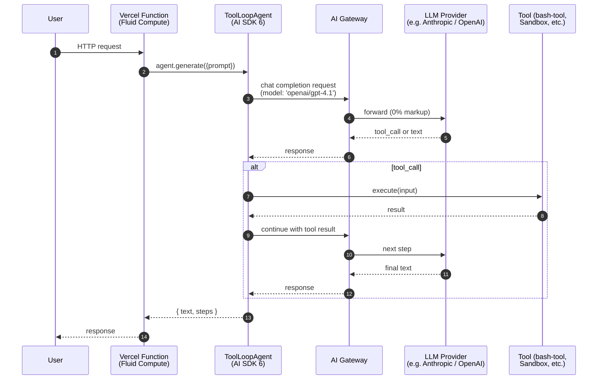
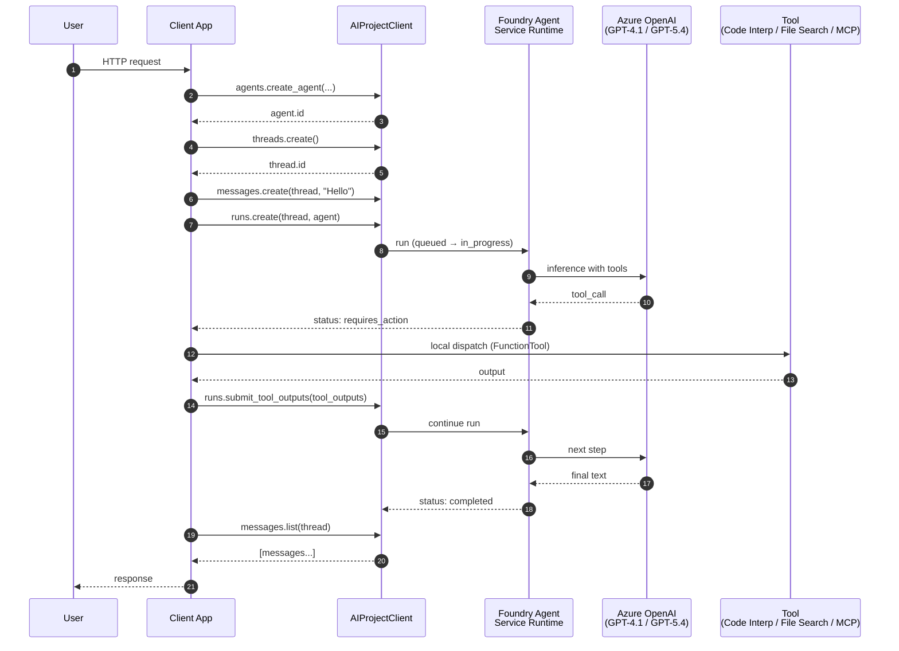
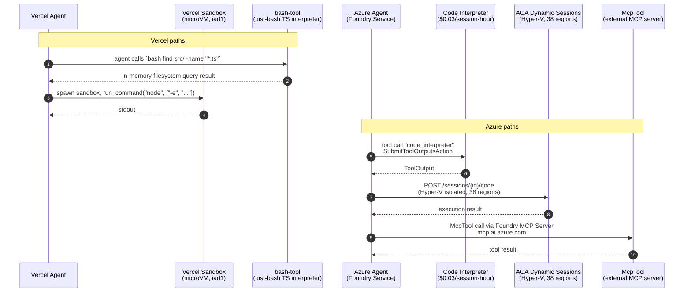

## 11. Architectural Visuals

### 11.1 Agent Lifecycle — Vercel



### 11.2 Agent Lifecycle — Azure



**Key architectural difference:** Vercel's lifecycle is **client-driven** — the agent loop runs inside your function code. Azure's lifecycle is **server-driven** — the run state machine lives in Foundry, and your client polls (or streams via SSE) for `requires_action` events to dispatch tool calls. Azure's model has stronger natural isolation (bad client code can't runaway-loop) at the cost of more round-trips.

### 11.3 Infrastructure Architecture — Vercel

```mermaid
graph TD
    subgraph "Edge"
        Edge[Vercel Edge Network<br/>126 PoPs]
    end
    subgraph "Compute"
        Fluid[Fluid Compute<br/>20 regions, Active CPU billing]
        Sandbox[Sandbox microVM<br/>Firecracker, iad1 only]
    end
    subgraph "Durability"
        Workflow[Workflow SDK GA<br/>`use workflow` directive<br/>E2E encrypted]
        Queues[Vercel Queues GA<br/>iad1 backend]
    end
    subgraph "Gateway & Secure Boundary"
        AIGW[AI Gateway<br/>0% markup, ZDR GA]
        SC[Secure Compute<br/>$6.5K/yr + $0.15/GB]
    end

    Edge --> Fluid
    Fluid --> AIGW
    Fluid --> Sandbox
    Fluid --> Workflow
    Workflow --> Queues
    AIGW -.->|BYOK / pass-through| Model[External Model Providers]
    SC -.->|Dedicated IPs, VPC peering| External[Customer VPCs]
```

### 11.4 Infrastructure Architecture — Azure

```mermaid
graph TD
    subgraph "Client"
        Client[AIProjectClient SDK<br/>Python / .NET / JS / Java]
    end
    subgraph "Foundry Control Plane"
        Agents[Agent Service<br/>Responses API<br/>24 regions]
        Evals[Foundry Evaluations GA<br/>30+ built-in + 9 agent-specific]
        Trace[Foundry Tracing GA<br/>OTel native]
        Catalog[Foundry Tool Catalog]
    end
    subgraph "Models"
        AOAI[Azure OpenAI<br/>GPT-4.1 / GPT-5 / GPT-5.4 / o-series]
        FoundryM[Foundry Models<br/>DeepSeek / Llama / Phi / MAI-*]
    end
    subgraph "Tools"
        CI[Code Interpreter<br/>$0.03/session]
        FS[File Search<br/>$0.10/GB/day]
        MCP[McpTool + Foundry MCP Server<br/>mcp.ai.azure.com]
        Browser[Browser Automation + Computer Use<br/>preview]
    end
    subgraph "Persistence"
        Threads[Conversations API<br/>GA Mar 16, 2026]
        Cosmos[(Cosmos DB<br/>customer-owned)]
        AISearch[(Azure AI Search<br/>vector + Agentic Retrieval)]
        IQ[Foundry IQ<br/>managed KB preview]
    end
    subgraph "Security"
        Entra[Microsoft Entra ID<br/>+ Entra Agent ID preview]
        Guardrails[Foundry Guardrails<br/>10 risk · 4 intervention points]
        VNet[BYO VNet<br/>Private Link / ExpressRoute]
        Defender[Defender AI-SPM GA<br/>+ Purview for AI GA]
    end
    subgraph "Orchestration"
        DTS[Durable Task Scheduler<br/>Dedicated GA + Consumption GA]
    end

    Client --> Agents
    Agents --> AOAI
    Agents --> FoundryM
    Agents --> CI
    Agents --> FS
    Agents --> MCP
    Agents --> Browser
    Agents --> Threads
    Threads --> Cosmos
    FS --> AISearch
    FS --> IQ
    Agents --> Evals
    Agents --> Trace
    Agents -.->|identity| Entra
    Agents -.->|policy| Guardrails
    Agents -.->|network| VNet
    Agents -.->|posture| Defender
    Agents --> DTS
```

### 11.5 Combined Side-by-Side Alignment

```mermaid
graph LR
    subgraph "Vercel Stack"
        V1[AI SDK 6.x] --> V2[AI Gateway]
        V2 --> V3[Fluid Compute]
        V3 --> V4[Sandbox SDK]
        V3 --> V5[Workflow SDK]
        V5 --> V8[Vercel Queues]
        V5 --> V6[@ai-sdk/mcp + mcp-handler]
        V3 --> V7[AI SDK Telemetry<br/>OTel]
    end
    subgraph "Azure Stack"
        A1[Microsoft Agent Framework 1.0] --> A2[Azure OpenAI + Foundry Models]
        A2 --> A3[Foundry Agent Service]
        A3 --> A4[Code Interp / ACA Sessions]
        A3 --> A5[Multi-agent Workflows]
        A5 --> A8[Durable Task Scheduler]
        A5 --> A6[McpTool / Foundry MCP]
        A3 --> A7[Foundry Tracing GA<br/>+ Evaluations GA]
    end
    V1 -.equivalent.- A1
    V2 -.equivalent.- A2
    V3 -.equivalent.- A3
    V4 -.equivalent.- A4
    V5 -.equivalent.- A5
    V6 -.equivalent.- A6
    V7 -.equivalent.- A7
    V8 -.equivalent.- A8
```

### 11.6 Security Boundary Comparison

| Aspect | Vercel Secure Compute | Azure BYO VNet + Foundry |
|--------|----------------------|--------------------------|
| **Network Isolation** | Dedicated IP addresses per network | VNet with private endpoints + Private Link |
| **Peering** | VPC peering to AWS VPCs (max 50 connections) | VNet peering (any region), ExpressRoute, Azure Virtual WAN |
| **Failover** | Active/Passive network failover across regions | Availability Zones + cross-region DR (Azure Front Door / Traffic Manager) |
| **Policy Layer** | Environment variables, middleware, 8-role RBAC + Access Groups + SCIM | **Microsoft Entra ID** + **Azure RBAC** + **Foundry Roles** + **Entra Agent ID** (preview) + **Foundry Guardrails** (preview) |
| **Posture Mgmt** | Activity Log + Log Drains | **Defender AI-SPM** (GA) + **Microsoft Purview for AI** (GA) |
| **Pricing** | Enterprise: $6,500/year + $0.15/GB data transfer | VNet: Free; Private Link: $0.01/hr per endpoint + $0.01/GB; ExpressRoute: varies by tier |

### 11.7 Tool Execution Flow



<details>
<summary><strong>🔧 Tool Execution Capabilities Comparison — Full Tables</strong></summary>

#### 1. Available Tool Types

| Category | Vercel | Azure |
|----------|--------|-------|
| Code execution | Sandbox SDK (Firecracker microVM) | Code Interpreter ($0.03/session) + ACA Dynamic Sessions ($0.03/session-hour, 38 regions) |
| Lightweight shell | **bash-tool** (`just-bash` TS interpreter, in-memory) | — (closest: ACA Dynamic Sessions with Shell runtime) |
| Browser automation | Anthropic Computer Use + Kernel (Marketplace) | Azure Browser Automation (preview, Playwright Workspaces) + Computer Use (preview, **3 regions**) |
| File operations | `textEditor_20250124` (Anthropic-native) + bash-tool file ops | File Search ($0.10/GB/day + $2.50/1K calls) |
| External tools | `@ai-sdk/mcp` (stable HTTP/SSE) + `mcp-handler` server | `McpTool` + Foundry MCP Server (cloud-hosted) |
| Knowledge base | Marketplace Vector Stores (Supabase pgvector, Pinecone, Upstash, MongoDB Atlas) | Foundry IQ (preview, managed Azure AI Search) |

#### 2. Runtime & Language Support

| Aspect | Vercel Sandbox | Azure Code Interp / ACA Sessions |
|--------|----------------|----------------------------------|
| Languages | Node.js 24 + Python 3.13 | Python + Node.js + Shell (ACA) |
| Isolation | Firecracker microVM | Hyper-V container (ACA) / containerized (Code Interp) |
| Pre-installed libraries | Bare runtime, install at create | Python scientific stack pre-installed |
| File size | Plan-dependent; 32 GB NVMe Enterprise | 5 GB uploads |
| Internet access | Configurable | Configurable (ACA) |

#### 3. Execution Limits

| Limit | Vercel Sandbox | Azure Code Interp | ACA Dynamic Sessions |
|-------|----------------|-------------------|----------------------|
| Max timeout per run | Plan-dependent | 1-hour session window | 1-hr active / 30-min idle |
| Memory | Up to 64 GB (Enterprise) | Session-allocated | Allocated per session |
| Concurrent instances | Plan-dependent | N concurrent threads | N concurrent sessions |

#### 4. Pricing Model

| Meter | Vercel Sandbox | Azure Code Interp | ACA Dynamic Sessions |
|-------|----------------|-------------------|----------------------|
| CPU | $0.128/CPU-hour (Pro/Enterprise) | (included in session rate) | — |
| Memory | $0.0212/GB-hour | (included) | — |
| Creations | $0.60/1M | — | — |
| Session flat rate | — | **$0.03/session-hour** | **$0.03/session-hour** PAYG |
| Savings plan | — | — | $0.026/hr (1yr), $0.025/hr (3yr) |
| Data transfer | $0.15/GB | — | — |
| Storage | $0.08/GB-month | — | — |

#### 5. bash-tool vs Azure Code Interpreter

| Aspect | Vercel bash-tool | Azure Code Interpreter |
|--------|------------------|------------------------|
| Execution model | Pure TS interpreter (`just-bash`) — no shell, no binary | Real Python runtime in sandboxed container |
| Shell access | Simulated — `find`, `grep`, `jq`, pipes | Full Python interpreter + pip installs |
| Use cases | Lightweight context retrieval, filesystem traversal | Full data analysis, scientific computing, LaTeX rendering |
| Overhead | Near-zero (in-process) | Container warm-start (subsecond via prewarmed pools) |
| Token efficiency | High (agent slices files on demand) | Moderate (agent writes code; interpreter returns results) |

</details>

---

